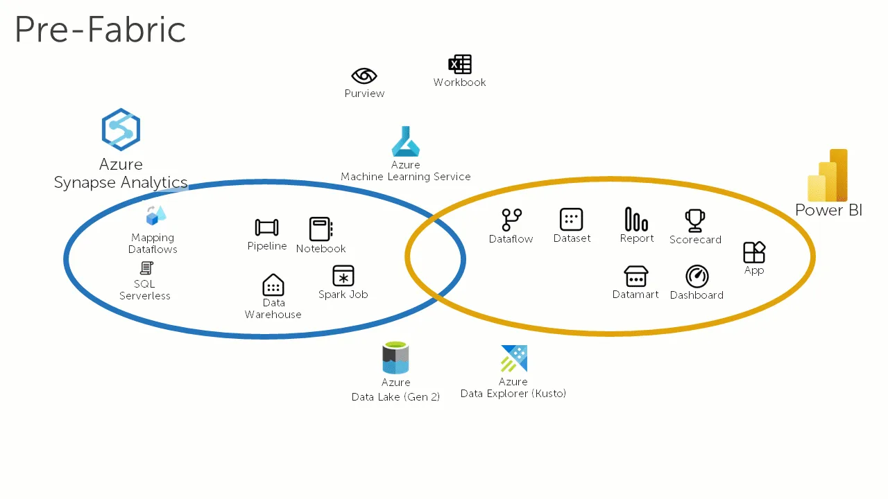

O Azure Synapse é a solução de Data Warehouse da Microsoft na nuvem Azure. No entanto, ele tem enfrentado concorrência interna do
[Databricks](https://www.linkedin.com/company/databricks?trk=article-ssr-frontend-pulse_little-mention)
há algum tempo e, desde o ano passado, também do
[Microsoft Fabric](https://www.linkedin.com/showcase/microsoftfabric/?trk=article-ssr-frontend-pulse_little-mention)
.

O Microsoft Synapse e o Databricks são soluções bem conhecidas para a construção de um Data Warehouse ou Data Lakehouse, ambas oferecidas pela Microsoft em sua nuvem Azure. Desde o ano passado, a Microsoft apresentou o
[Microsoft Fabric](https://www.linkedin.com/showcase/microsoftfabric/?trk=article-ssr-frontend-pulse_little-mention)
, que compete com ambos, mas também é integrado a eles. Embora o Databricks seja uma solução mais autônoma, este artigo foca mais na questão de se o Fabric é efetivamente o sucessor do Synapse.

Usuários e empresas agora podem se perguntar qual serviço escolher. Com a introdução do Fabric, torna-se cada vez mais importante entender a diferença entre ele e o Azure Synapse Analytics. O Synapse é a ferramenta de nuvem da Microsoft para processamento de dados, bem testada ao longo dos anos. Constantes melhorias resultaram em inúmeras funções e correções de bugs, oferecendo diversas opções para preparar dados, sendo amplamente utilizado para construir pipelines ETL.

\_Synapse vs Fabric\_

O Fabric, por outro lado, pretende ser a solução completa para dados. Partes do Synapse são integradas ao Fabric, com funcionalidades do Azure Synapse Analytics sendo gradualmente adotadas. Ambos os produtos coexistem, e o Fabric Synapse inclui a criação de Data Lakehouses e Warehouses. O armazenamento de dados, que não é fornecido no Azure Synapse Analytics, ocorre, por exemplo, em um Azure Datalake. Tecnologicamente, no Fabric, o armazenamento é apenas uma extensão de um Azure Datalake, chamado de OneLake, gerenciado automaticamente pelo Fabric.

Agora, você talvez pergunte por que escolher o Azure Synapse quando o Fabric oferece mais recursos, e empresas que usam o Synapse podem se perguntar se precisam de uma grande migração para o projeto Fabric. Não haverá muitas atualizações e novos recursos para o Azure Synapse, enquanto o Microsoft Fabric, por outro lado, é o produto mais novo e ainda possui alguns recursos em visualização, sendo desenvolvido rapidamente. A Microsoft planeja facilitar a migração do Synapse para o Fabric, tornando a mudança do Azure Synapse Analytics para o Microsoft Fabric mais simples no futuro, o que deve tranquilizar os usuários do Synapse.

Em geral, o Fabric é a ferramenta para o futuro e é a escolha certa, especialmente para planejamento de longo prazo. Ao padronizar várias funções, o Fabric oferece a solução mais abrangente.

### Fontes e leituras adicionais

Microsoft, Azure Synapse Analytics - <https://azure.microsoft.com/en-us/products/synapse-analytics#:~:text=Azure%20Synapse%20Analytics%20is%20an,log%20and%20time%20series%20analytics>.

Microsoft, Apresentando o Microsoft Fabric: Análise de dados para a era da IA - <https://azure.microsoft.com/en-us/blog/introducing-microsoft-fabric-data-analytics-for-the-era-of-ai/>

Microsoft, Microsoft Fabric, explicado para usuários Synapse existentes - <https://blog.fabric.microsoft.com/en-us/blog/microsoft-fabric-explained-for-existing-synapse-users/>
