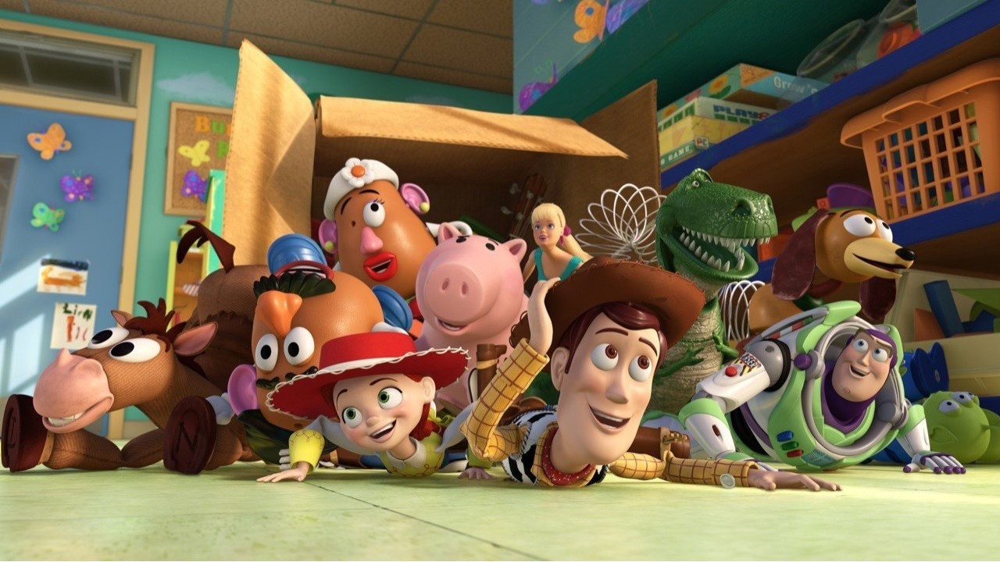

Outro dia, enquanto pensava em um novo artigo para compartilhar aqui no LinkedIn, me peguei refletindo sobre como é difícil explicar o que fazemos com dados e tecnologia para uma criança — ou até mesmo para um parente mais velho. Quem trabalha com TI, especialmente na área de dados, já passou por aquela situação no almoço de família: “Mas o que exatamente você faz mesmo?” Tentamos explicar com termos como “plataforma de dados”, “pipelines”, “inteligência artificial” e vemos os olhos do outro lado da mesa vagando, procurando um assunto mais fácil como a novela ou o futebol.

Foi então que me veio uma ideia: e se eu explicasse tudo isso de forma simples e divertida, usando algo que todo mundo entende? Me veio imediatamente à cabeça o quarto do Andy, do clássico *Toy Story*. E, pensando bem, ele é uma metáfora perfeita para o universo de dados de uma empresa.

---

### Era uma vez... o quarto do Andy (ou um ambiente de dados desorganizado)

Imagine que a sua empresa é como o quarto do Andy. Lá dentro há todo tipo de brinquedo — uns novos, outros velhos, alguns organizados, outros completamente perdidos embaixo da cama. Esses brinquedos são os dados: planilhas antigas, sistemas legados, arquivos gigantes, bases em nuvem e relatórios espalhados por diferentes ferramentas. O time de dados até quer “brincar” com eles, ou melhor, trabalhar, mas a bagunça é tanta que mais tempo é gasto tentando entender onde estão as coisas do que gerando valor de fato.

Nesse cenário caótico, entra o nosso herói: o
[Microsoft Fabric](https://www.linkedin.com/company/microsoft-fabric-world?trk=article-ssr-frontend-pulse_little-mention)
. Ele é como o Woody, o xerife confiável que chega com um plano e uma equipe para ajudar. A missão? Organizar o quarto, integrar os brinquedos e garantir que todo mundo possa brincar junto, sem perder tempo ou pisar em peças de Lego escondidas.

**Quando os dados estão espalhados e desorganizados, até a brincadeira mais divertida vira frustração.**

---

### Vamos organizar essa brincadeira!

O Microsoft Fabric chega com uma proposta clara: transformar aquele amontoado de dados em um ambiente integrado e eficiente, chamado **Data Lakehouse**. Diferente de soluções antigas, onde dados precisavam estar separados entre “organizados” (data warehouse) e “bagunçados” (data lake), o lakehouse permite que tudo conviva junto de forma inteligente.

Mas o melhor de tudo é que o Fabric **não vem sozinho**. Ele traz um verdadeiro esquadrão de brinquedos prontos para a ação — cada um com seu papel na brincadeira:

- **Sr. Cabeça de Batata (Data Factory):** Ele é o responsável por **trazer os dados de fora para dentro do quarto**. Conecta com planilhas, APIs, bancos de dados, sistemas antigos... e entrega tudo organizado no lakehouse, pronto para ser usado.
- **Buzz Lightyear (Spark & Notebooks):** O herói das análises! Ele transforma dados brutos em insights voando alto. Com ele, você pode aplicar lógica, criar transformações e até treinar modelos com performance e escalabilidade.
- **Barbie Analista (Power BI):** Cheia de estilo e muito eficiente, ela **cria dashboards lindos, interativos e acessíveis**. Deixa os relatórios prontos para qualquer pessoa entender até quem não conhece nada de dados.
- **Rex (OneLake):** Pode parecer atrapalhado, mas é ele quem **sabe exatamente onde está cada dado**. Com o OneLake, tudo fica centralizado, sem duplicações, com segurança e governança — pronto para ser compartilhado com toda a empresa.
- **Copilot (IA do Fabric):** O brinquedo mais novo e inteligente do time. Você **fala com ele em linguagem natural**, e ele entrega relatórios, análises e até sugestões prontas. Um verdadeiro assistente pessoal com superpoderes de IA.

\_Personagens Toy Story\_

**Com os brinquedos certos e um bom plano, até o caos mais confuso vira um ambiente pronto para criar grandes aventuras.**

---

### A mágica acontece...

Com tudo isso funcionando em harmonia, o caos do quarto se transforma. Os dados agora estão todos em um único lugar, limpos, organizados, acessíveis e prontos para serem usados. As equipes conseguem montar relatórios em minutos, entender o que está acontecendo na empresa com muito mais clareza e até prever o futuro com base em dados reais. O tempo que antes era gasto procurando informação ou lidando com sistemas desconectados agora é usado para tomar decisões mais inteligentes e rápidas.

Mais do que isso, o **Microsoft Fabric** permite que diferentes áreas da empresa colaborem. O time de marketing consegue cruzar dados com vendas, o financeiro entende melhor os custos, o atendimento visualiza padrões de comportamento. Tudo isso com segurança, governança e rastreabilidade sem abrir mão da agilidade.

**Dados acessíveis e conectados não são só mais rápidos eles tornam a empresa mais inteligente.**

---

### E o que o Microsoft Fabric entrega, de um jeito divertido?

Com o Fabric, o quarto do Andy deixa de ser um campo minado de brinquedos perdidos e se transforma em um verdadeiro parque de diversões dos dados. O ambiente fica organizado, nada mais de pisar em Lego no meio da madrugada, e todos os brinquedos trabalham juntos, sem precisar de caixas separadas. Cabe brinquedo novo sempre que for preciso, e cada um tem seu cantinho seguro. Além disso, com o Copilot, você tem um assistente inteligente que entende o que você quer e entrega tudo prontinho, sem esforço.

É uma nova forma de lidar com dados: mais leve, mais integrada e muito mais eficiente. E o melhor de tudo: tudo isso em um único lugar, sem precisar empilhar ferramentas diferentes ou viver trocando de janela. O Microsoft Fabric transforma o caos em clareza e a bagunça em valor.

**Com o Fabric, dados deixam de ser um peso e viram parte da diversão.**

---

### Moral da história

Se a sua empresa ainda vive aquela bagunça de dados espalhados para todos os lados, como brinquedos largados no chão depois de uma tarde de brincadeiras, talvez esteja na hora de conhecer o Microsoft Fabric. Com ele, você tem tudo em um só lugar, os dados deixam de ser um problema e passam a ser parte da solução.

O Fabric organiza, integra, protege e ainda traz inteligência para transformar informações em decisões. Quando tudo funciona junto, com segurança e agilidade, a brincadeira flui melhor e o resultado aparece para todo mundo.

Porque no fim das contas, quando os dados estão organizados, a empresa trabalha com mais leveza, mais estratégia e mais impacto.

**Ao infinito e além... da confusão dos dados.**

Até o próximo artigo.
