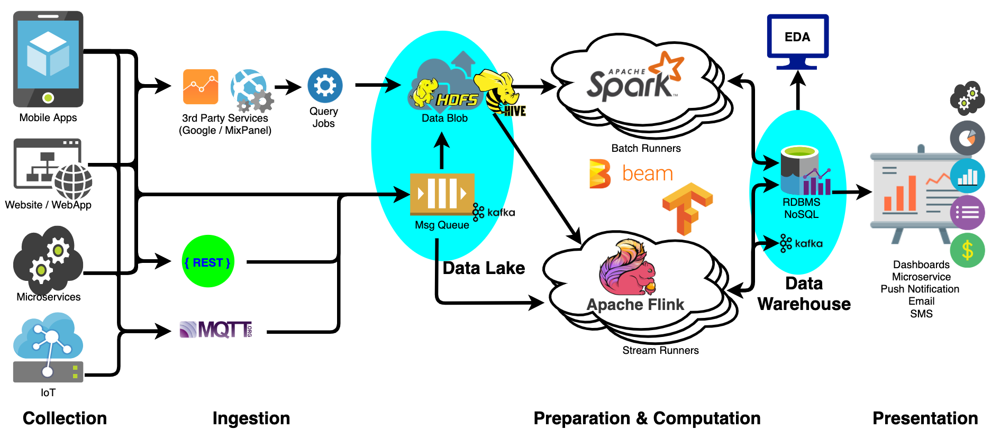
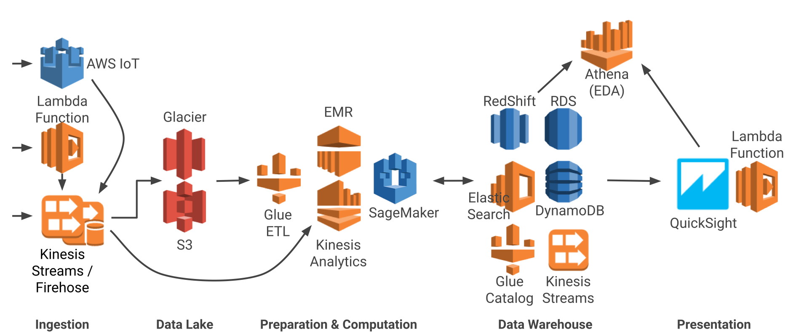
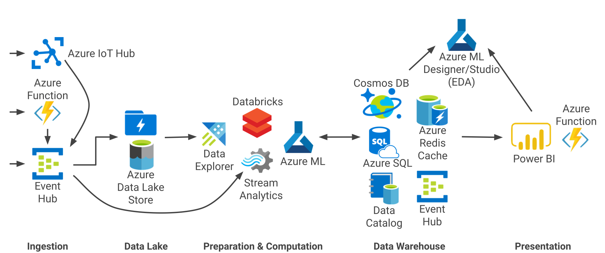
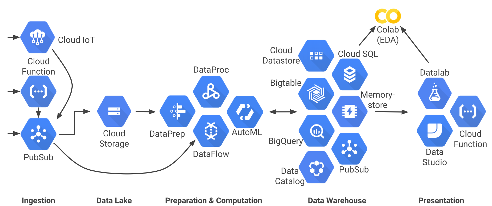

Na semana passada, escrevi um artigo sobre pipeline de dados [(confira aqui)](https://www.linkedin.com/pulse/pipeline-de-dados-o-encanamento-na-sua-empresa-%C3%A9-%C3%A1gua-lopes/ ) onde foram apresentadas as principais características para um desenvolvimento robusto e de forma otimizada, preferencialmente utilizando um ambiente Big Data.

Dando continuidade ao tema, vamos abordar os principais componentes para construção de um ambiente de alta escalabilidade.

A figura a seguir mostra uma arquitetura usando tecnologias de código aberto para materializar todos os estágios do pipeline de big data. Os estágios de preparação e computação são frequentemente mesclados para otimizar os custos de computação.

Os principais componentes da arquitetura e tecnologia de big data são os seguintes:

- **Pontos de extremidade HTTP / MQTT** para ingestão de dados e também para veiculação dos resultados. Existem várias estruturas e tecnologias para isso.
- **Fila de publicação / sub-mensagem** para a ingestão de dados de streaming de alto volume. Kafka é atualmente a escolha mais comum no ambiente On Premise.
- **Armazenamento de dados de alto volume** e baixo custo para data lake (e data warehouse), Hadoop HDFS ou armazenamento de blob em nuvem como o AWS S3 ou Azure Blob.
- **Infraestrutura de consulta e catálogo de dados** para converter um data lake em um data warehouse, o Apache Hive é uma opção popular de linguagem de consulta.
- **Mecanismo de computação em lote** de redução de mapa para processamento de alto rendimento, por exemplo Hadoop MapReduce e Apache Spark.
- **Streaming de dados**, por exemplo Apache Storm, Apache Flink. O Apache Beam também surgiu como a opção para fluxo de dados.
- **Estruturas de aprendizado de máquina** para ciência de dados e ML. O Scikit-Learn, o TensorFlow e o PyTorch são uma opção popular para implementar e treinar modelos.
- As opções de **orquestração** de implantação são Hadoop YARN, Kubernetes / Kubeflow.

### Arquitetura de Big Data em Cloud

Com o advento da computação por serviço, é possível iniciar seu ambiente mais rapidamente e aproveitar melhor seu dinheiro. Vários componentes na arquitetura podem ser substituídos por seus serviços equivalentes do provedor de serviços em nuvem.

Arquiteturas típicas de pipelines de big data no *Amazon Web Services, Microsoft Azure e Google Cloud Platform (GCP)* são mostradas abaixo. Cada um mapeia de perto a arquitetura geral de big data discutida na seção anterior. Você pode usá-los como referência para tecnologias de lista de opções adequadas às suas necessidades.

### Ambiente Big Data AWS

### **Ambiente Big Data Azure**

### Ambiente Big Data Google

### Conclusão

Nesse artigo foram apresentados os principais componentes para implantação de um ambiente Big Data. Basicamente com duas maneiras principais de "infraestrutura", on premise e cloud, inicia-se com a adoção de serviços de armazenamento, processamento e fila.

A escolha que melhor ambiente depende de alguns pilares a ser analisados como custo, complexidade do serviço ou tecnologia e ser implantada e infraestrutura já existente na empresa.

Obrigada e até a próxima.
