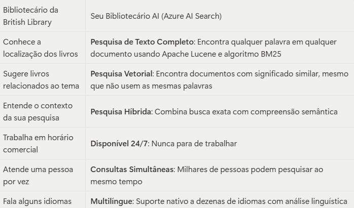
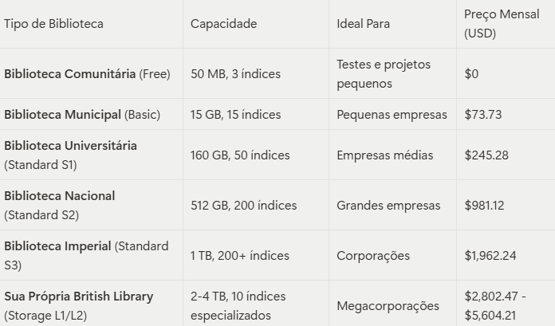

Imagine ter acesso à British Library - a maior biblioteca do mundo com mais de 200 milhões de itens - mas dedicada exclusivamente aos documentos da sua empresa. Agora imagine que essa biblioteca tenha um bibliotecário superinteligente que nunca dorme, entende o contexto das suas perguntas e encontra exatamente o que você precisa em segundos, conectando informações de forma que nem você imaginava ser possível.

Isso é o **Azure AI Search.**

Assim como a British Library recebe 8 mil novos títulos por dia e os organiza de forma que qualquer pessoa possa encontrar qualquer informação, o Azure AI Search transforma o caos de documentos corporativos em um sistema de busca inteligente que revoluciona a forma como sua empresa acessa e utiliza o conhecimento.

### A British Library Digital da Sua Empresa

O [Microsoft Azure](https://www.linkedin.com/company/microsoft-azure/) AI Search, anteriormente conhecido como Azure Cognitive Search, é muito mais que um simples mecanismo de busca. É como construir sua própria versão digital da British Library, mas com superpoderes de inteligência artificial.

### Por que a Comparação com a British Library?

A British Library, localizada em Londres, não é apenas a maior biblioteca do mundo por acaso. Ela representa o que há de mais avançado em organização, catalogação e acesso ao conhecimento humano [1]. Com mais de 200 milhões de itens que incluem livros, manuscritos, mapas, jornais, revistas, gravações sonoras e muito mais, ela demonstra como é possível organizar quantidades massivas de informação de forma que qualquer pessoa possa encontrar exatamente o que procura.

O Azure AI Search faz exatamente isso com os dados da sua empresa, mas com a velocidade e inteligência que apenas a tecnologia moderna pode oferecer.

### O Bibliotecário Tradicional vs. O Bibliotecário AI

Na British Library, você encontraria bibliotecários especializados que conhecem profundamente o acervo e podem ajudá-lo a encontrar informações relevantes. O Azure AI Search é como ter um bibliotecário que combina o conhecimento de todos esses especialistas, mas com capacidades sobre-humanas:

### Os Superpoderes do Seu Bibliotecário AI

Enriquecimento com Inteligência Artificial: Imagine se o bibliotecário da British Library pudesse não apenas encontrar um documento, mas também:

- Ler documentos em qualquer idioma e traduzi-los instantaneamente
- Extrair texto de imagens e documentos escaneados (OCR)
- Criar resumos automáticos de documentos extensos
- Identificar pessoas, lugares e conceitos importantes automaticamente
- Conectar informações relacionadas de diferentes documentos

Isso é exatamente o que o conjunto de habilidades de IA do Azure AI Search faz durante o processo de indexação.

### Os Diferentes "Andares" da Sua Biblioteca

Assim como a British Library tem diferentes seções para diferentes tipos de acervo e usuários, o Azure AI Search oferece diferentes "andares" (tiers) para diferentes necessidades empresariais:

### O Acervo Universal: Formatos Aceitos

Assim como a British Library aceita praticamente qualquer tipo de material escrito ou gravado, o Azure AI Search pode processar uma impressionante variedade de formatos [2]:

**Documentos Clássicos**

- PDF: Como os livros digitalizados da British Library
- Microsoft Office: DOCX, XLSX, PPTX (como os documentos modernos)
- Texto Simples: TXT, RTF (como manuscritos antigos)

**Publicações Periódicas**

- HTML: Como jornais online
- XML: Como catálogos estruturados
- CSV: Como registros tabulares

**Correspondências**

- EML, MSG: Como as cartas históricas preservadas na biblioteca

**Materiais Especiais**

- KML: Como os mapas geográficos históricos
- ZIP: Como coleções arquivadas
- JSON: Como catálogos digitais modernos

Nota Importante: Assim como a British Library converte diferentes formatos para um sistema de catalogação universal, o Azure AI Search converte todos esses formatos para JSON durante a indexação, criando um sistema unificado de busca.

### Como Construir Sua Biblioteca Digital

### Pré-requisitos: Preparando o Terreno

Antes de construir sua British Library digital, você precisará de:

- Conta Azure: Como ter um terreno para construir
- Azure CLI: Como ter as ferramentas de construção
- Permissões Adequadas: Funções Search Service Contributor e Search Index Data Contributor

### O Processo de Construção: Da Fundação ao Funcionamento

### 1. Estabelecendo a Fundação (Criando o Serviço)

Como escolher o local e o tamanho da sua biblioteca, você criará seu serviço Azure AI Search no portal Azure, selecionando o tier apropriado para suas necessidades.

### 2. Instalando o Sistema de Segurança (Configurando Autenticação)

Assim como a British Library tem sistemas de segurança sofisticados, é recomendável usar o Microsoft Entra ID para autenticação sem chave, oferecendo maior segurança que as tradicionais chaves de API.

### 3. Projetando as Estantes (Criando Índices)

Como um arquiteto planejando as seções da biblioteca, você definirá o esquema do seu índice, especificando quais "campos" (tipos de informação) cada documento terá. Para aplicações modernas de IA, considere incluir campos vetoriais para embeddings.

### 4. Configurando o Sistema de Catalogação (Modo de Análise)

Para aplicações RAG (Retrieval-Augmented Generation), o modo de análise Padrão (Default) é recomendado, pois detecta automaticamente o tipo de arquivo e usa o analisador correto - como ter um bibliotecário que reconhece automaticamente se está lidando com um livro, revista ou manuscrito.

### 5. Povoando a Biblioteca (Carregando Documentos)

Como transportar livros para as estantes, você populará seu índice usando indexadores automáticos (que buscam documentos de fontes como Azure Blob Storage) ou APIs para upload manual.

### 6. Abrindo ao Público (Executando Consultas)

Como abrir as portas da biblioteca, você usará as APIs REST ou SDKs disponíveis (.NET, Python, Java, JavaScript) para que aplicações e usuários possam consultar sua biblioteca digital.

### Os Diferentes Tipos de Consulta na Sua Biblioteca

### 1. Consulta de Catálogo (Pesquisa de Texto Completo)

Como procurar um livro específico no catálogo da British Library pelo título ou autor. O Azure AI Search usa Apache Lucene e o algoritmo BM25 para encontrar documentos que contenham exatamente as palavras que você procura.

Exemplo: "Encontre todos os documentos que mencionam 'estratégia de marketing digital'"

### 2. Consulta Temática (Pesquisa Vetorial)

Como pedir ao bibliotecário: "Quero algo parecido com este livro, mas não sei exatamente o que". O Azure AI Search usa embeddings vetoriais para encontrar documentos semanticamente similares.

Exemplo: Você mostra um documento sobre "transformação digital" e o sistema encontra documentos sobre "inovação tecnológica", "modernização de processos" e "digitalização empresarial".

### 3. Consulta de Especialista (Pesquisa Híbrida)

Como combinar a precisão do catálogo com a intuição do bibliotecário especialista. O Azure AI Search combina pesquisa de texto completo com pesquisa vetorial para resultados mais relevantes e abrangentes.

### 4. Consulta para Pesquisa Acadêmica (Pesquisa Multimodal)

Como pesquisar não apenas em livros, mas também em mapas, imagens, gravações e outros tipos de material. O Azure AI Search pode pesquisar em diferentes tipos de conteúdo simultaneamente.

### 5. Consulta de Assessoria (Pesquisa de Agente/RAG)

Como ter um assistente pessoal que não apenas encontra informações, mas as organiza e apresenta de forma contextualizada para responder suas perguntas específicas. Ideal para chatbots e agentes de IA.

### Investimento: Quanto Custa Sua British Library Digital?

### Comparação de Custos

Considere que manter a British Library real custa milhões de libras por ano e serve milhões de pessoas. Sua British Library digital:

- Tier Gratuito: Como uma biblioteca comunitária - perfeita para começar
- Tier Básico ($73.73/mês): Como uma biblioteca municipal bem equipada
- Tiers Standard ($245-$1,962/mês): Como bibliotecas universitárias de prestígio
- Tiers Storage Optimized ($2,802-$5,604/mês): Como ter sua própria British Library

### Conclusão: Sua Revolução do Conhecimento

A British Library transformou o acesso ao conhecimento humano ao longo dos séculos. O Azure AI Search faz o mesmo para o conhecimento da sua empresa, mas em uma escala de tempo muito menor e com capacidades que os fundadores da British Library jamais sonharam.

Com mais de 200 milhões de itens, a British Library prova que é possível organizar quantidades massivas de informação de forma acessível. O Azure AI Search prova que é possível fazer isso com inteligência artificial, velocidade instantânea e compreensão contextual.

Não se trata apenas de tecnologia - trata-se de democratizar o acesso ao conhecimento dentro da sua organização, assim como a British Library democratizou o acesso ao conhecimento mundial.

---

### Referências

[1] [Introdução à IA do Azure Search - Azure AI Search | Microsoft Learn](https://learn.microsoft.com/pt-br/azure/search/search-what-is-azure-search)

[2] [Formatos de documento suportados - Azure AI Search | Microsoft Learn](https://learn.microsoft.com/en-us/azure/search/search-howto-indexing-azure-blob-storage)

[3] [Início Rápido: Pesquisa de Texto Completo - Azure AI Search | Microsoft Learn](https://learn.microsoft.com/en-us/azure/search/search-get-started-text)

[4] [Preços - Azure AI Search | Microsoft Azure](https://azure.microsoft.com/en-us/pricing/details/search/)
