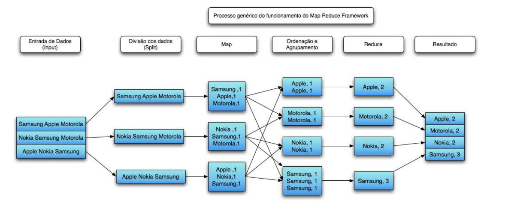
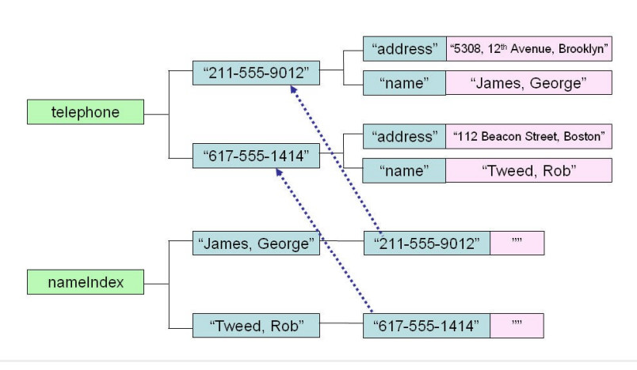
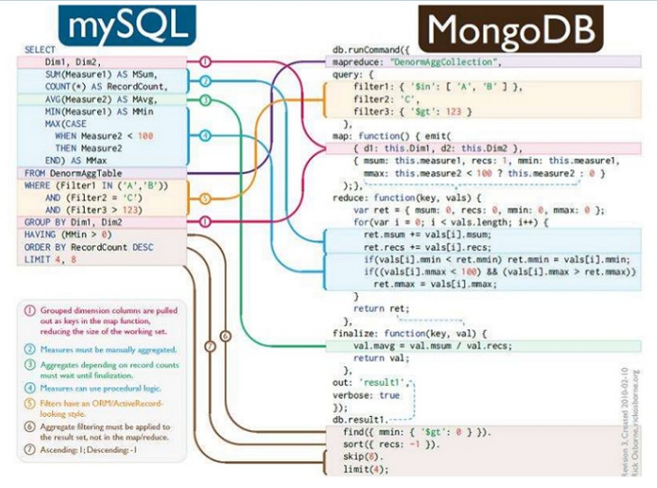
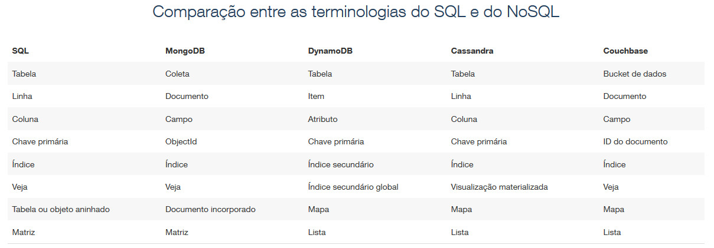
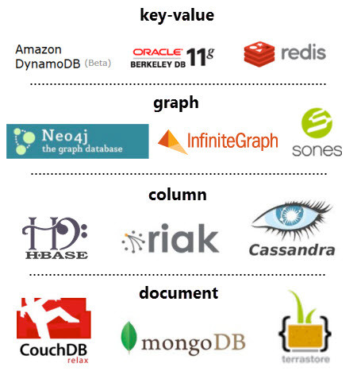

Dando continuidade a série de artigos sobre Big Data, vamos falar um pouco sobre os bancos de dados não relacionais.

Particularmente quando comecei a ouvir o termo "NoSQL" minha cabeça dava um nó. "Bancos **NOSQL**, como assim não tem query?", "Como fazer pra armazenar os dados?", "Como recuperar as informações ?".

Para começar nosso entendimento, vou voltar ao assunto do ***MapReduce*** abordado no artigo anterior. Como comentado, no ***Hadoop*** o método para verificar, por exemplo quantas vezes um determinado termo surgiu nas redes sociais, é utilizando o framework de Redução.

No momento em que um job é iniciado em um nó, os pares ***<key,value>*** são transferidos em partes aos nós de mapeamento. Uma nova instância de mapeamento é gerada para cada registro de entrada. Esses pares são coletados localmente no nó de mapeamento através de uma função em um nó de redução.

Então, como armazenar esses pares de Chave/Valor? Utilizando os Bancos **NoSQL**. Basicamente, a grande vantagem desse tipo de armazenamento é a flexibilidade como os dados estão estruturados. Veja abaixo que não temos mais tabelas, linhas e colunas.

Certo, mas como fazer uma simples consulta nesse banco já que não dá pra ser via SQL ? É justamente nesse ponto que as linguagens de programação entram em cena. ***Python, Java, R*** e tantas outras nos auxiliam na busca e cruzamento desses dados.

Sim eu sei, essa imagem é bem assustadora e faz parecer que "Selects" são brincadeira de criança. Mas calma, já existem IDEs no mercado que ajudam a criar essas consultas.

Mas então como fica as nomenclaturas de Linhas, Tabelas e Colunas ? Veja abaixo.

Lembrando que os Bancos do tipo Chave/Valor são os mais simples da Categoria NoSQL, temos outros tipos baseado em ***Colunas, Documentos e Gráficos***.

***Baseado em Coluna (Column Stores)***: Hbase, Cassandra, Hypertable, Accumulo, Amazon SimpleDB, Cloudata, Cloudera, SciDB, HPCC, Stratosphere;

***Baseado em Documentos (Document Stores):*** MongoDB, CouchDB, BigCouch, RavenDB, Clusterpoint Server, ThruDB, TerraStore, RaptorDB, JasDB, SisoDB, SDB, SchemaFreeDB, djondb;

***Baseado em Grafos (Graph-Based Stores):*** Neo4J, Infinite Graph, Sones, InfoGrid, HyperGraphDB, DEX, Trinity, AllegroGraph, BrightStarDB, BigData, Meronymy, OpenLink Virtuoso, VertexDB, FlockDB;

***Baseado em Chave-Valor (Key-Value Stores):*** Dynamo, Azure Table Storage, Couchbase Server, Riak, Redis, LevelDB, Chordless, GenieDB, Scalaris, Tokyo, Cabinet/Tyrant, GT.M, Scalien, Berkeley DB, Voldemort, Dynomite, KAI, MemcacheDB, Faircom C-Tree, HamsterDB, STSdb, Tarantool/Box, Maxtable, Pincaster, RaptorDB, TIBCO Active Spaces, allegro-C, nessDB, HyperDex, Mnesia, LightCloud, Hibari, BangDB.

Se você não acompanhou o início dessa série de artigos e quer saber mais sobre o tema Big Data leia também [**O que você precisa saber sobre Big Data e não passar vergonha no papo do Café ?**](http://www.linkedin.com/pulse/o-que-voc%C3%AA-precisa-saber-sobre-big-data-e-n%C3%A3o-passar-vergonha-lopes?trk=pulse_spock-articles)

No próximo post vou comentar sobre o ***Apache Spark***.

Obrigada.
