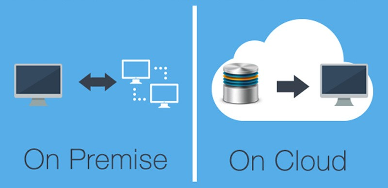

Há alguns anos empresas de todo o mundo já se utilizam do imenso valor que o Big Data pode agregar aos seus negócios. A implementação de ecossistemas Big Data é uma realidade no mercado mundial e brasileiro. Com cada vez mais demanda, tornou-se muito comum encontrar diversas vagas para Engenheiros de dados, Arquitetos e Analistas de Dados na timeline do Linkedin.

Como tantas demandas surgindo, vários profissionais estão buscando conhecimento e atualizações. Com tantos cursos, ferramentas e ecossistemas diferentes por onde começar ?

Há duas maneiras de usar o Big Data: estabelecê-lo nas instalações da sua empresa (On Premise) ou usar um provedor que ofereça uma plataforma de Big Data na nuvem (Cloud). No passado, as empresas só tinham a opção de instalá-lo localmente, mas esse não é mais o caso.

A adoção das plataformas em nuvem caiu no gosto de pequenas e médias empresas principalmente pela facilidade de aquisição de assinaturas e start dos serviços de processamento. Atualmente a Microsoft com o ecossistema Azure tem a maior fatia do mercado brasileiro, em seguida a Amazon. Claro que aqui estou apenas dividindo minha opinião pessoal com base na minha experiência, deixo aqui um fonte para embasamento <https://cio.com.br/azure-passa-aws-como-infraestrutura-de-nuvem-favorita-dos-cios/>

***Mas afinal por onde começo a estudar ? Big Data On Premise ou Cloud ?***

Aqui vai a minha resposta: **Comece a estudar com base no direcionamento que você quer dar na sua carreira ! Já explico...**

Você é um profissional de TI que tem por objetivo trabalhar em uma grande empresa como por exemplo as Telecoms, Bancos do modelo tradicional, Governo e outras, quer atuar em um modelo de contratação fixo como funcionário e já vem de uma carreira de Business Intelligence e Analytics comece por On Premise. Inicie por conceitos de Hadoop e Spark. Tem um material maravilhoso que o [Fábio Jardim](https://www.linkedin.com/in/fjardim/) compilou no GitHub. <https://github.com/fabiogjardim/bigdata_docker>

Agora se seus objetivos são diferentes, que atuar no mercado como consultor independente e quer acompanhar as tendencias dos grandes fornecedores recomendo iniciar criando uma conta na Azure ([portal.azure.com](http://portal.azure.com)) e estudando o conteúdo que a própria Microsoft disponibiliza por meio da plataforma Learn (<https://docs.microsoft.com/pt-br/learn/?WT.mc_id=home_homepage-azureportal-learn>)

Espero ter contribuído ! Estou a disposição para questionamento dos colegas de profissão.

Um Abraço !
