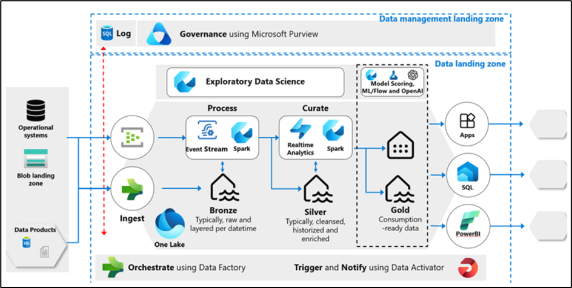
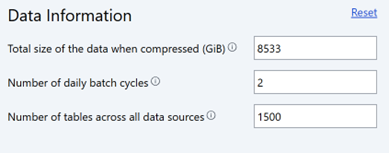
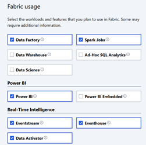
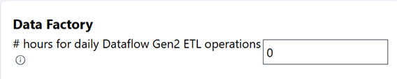
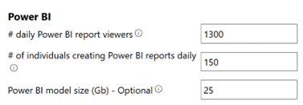
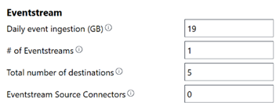
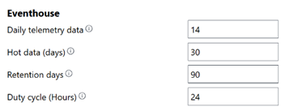
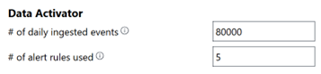
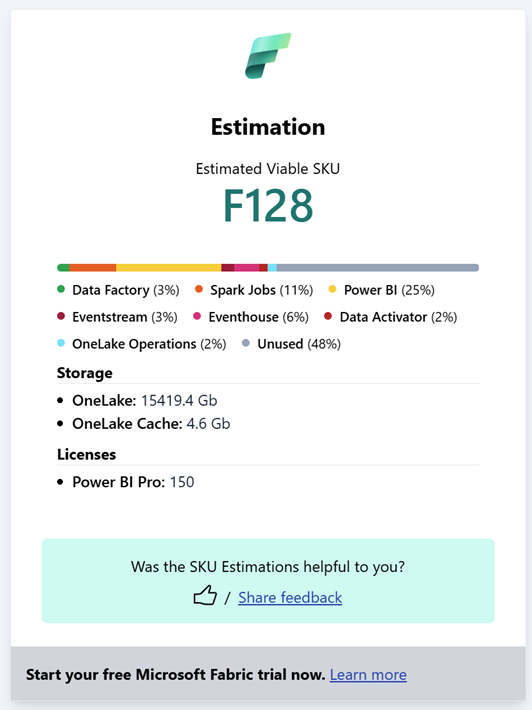

Estava aqui pensando em como explicar o Estimador de SKU do Microsoft Fabric de uma forma simples, e me veio à cabeça a arte milenar do churrasco. Sim, porque quem já organizou um churrasco sabe que existe uma linha muito tênue entre o sucesso absoluto e a catástrofe da picanha faltando.

E, assim como no churrasco, no mundo dos dados também é preciso saber calcular direitinho para que tudo funcione como esperado sem sobrar demais, nem faltar na hora H.

---

### Primeiro, o desafio: quanto comprar?

Organizar um churrasco envolve várias variáveis:

- Quantas pessoas vêm?
- Tem vegetarianos no grupo?
- Quanto tempo vai durar o evento?
- Vai ter acompanhamentos? Cerveja?

Na estimativa de recursos no Microsoft Fabric, acontece a mesma coisa:

- Qual o volume de dados?
- Com que frequência esses dados são acessados?
- Os relatórios precisam ser rápidos ou podem levar alguns minutos?
- Vai ter pico de uso?

O Estimador de SKU do Microsoft Fabric entra aí como aquele **amigo planilheiro do churrasco**, que calcula exatamente quanto de cada coisa você precisa.

---

### O erro do churrasqueiro iniciante: ir no olho

Você já viu gente comprando 2kg de carne por pessoa? Ou pior, comprando só linguiça achando que “dá pra todo mundo”? Pois é.

Sem o estimador, você corre o risco de:

- Escolher um SKU superdimensionado (carne sobrando e geladeira entupida por dias).
- Ou subdimensionar (a galera indo embora com fome, ou no mundo dos dados, o sistema travando com excesso de uso).

O Estimador de SKU te ajuda a simular diferentes cenários com base nas suas "convidadas" (cargas de trabalho), sugerindo o SKU ideal que **equilibra desempenho e custo**.

---

### Usando o estimador: como se fosse uma calculadora de churrasco

O processo é bem parecido com quando você joga no Google: “quantos quilos de carne por pessoa?”. Só que aqui, você vai informar:

- Tipo de uso (ingestão, transformação, visualização, etc.)
- Número de usuários simultâneos
- Frequência e volume das cargas de trabalho

Com isso, ele te diz: **“vai com esse SKU aqui que tá ótimo!”** Nem sobra, nem falta — e o churrasco dos dados acontece lindamente.

---

### Cenário 1 – O churrascão da Contoso: Análise pronta para IA

Pensa num churrasco corporativo de fábrica. A Contoso Manufacturing chamou um integrador de sistemas porque a churrasqueira deles (ou melhor, a arquitetura analítica) já estava defasada.

A solução atual que precisa ser modernizada tem as seguintes métricas de alto nível:

- 50 sistemas de origem processados ​em lote duas vezes por dia
- 1500 entidades e tabelas fazem parte dos pipelines ETL
- Estima-se que 50 TB de dados serão armazenados na plataforma nos próximos cinco anos
- As operações da plataforma contêm 4.000 sensores IoT fornecendo telemetria a cada 10 segundos com um tamanho médio de mensagem de telemetria de 600 bytes
- Existem 10.000 trabalhadores de fábrica com eventos diários de registro de ponto para início/fim de turno e intervalo/fora de intervalo, gerando 8 pontos de dados por trabalhador por dia
- Estima-se que 1.300 usuários de painéis e relatórios do Power BI por dia
- 150 autores de relatórios do Power BI
- Um tamanho máximo estimado do modelo semântico de 25 GB

Após algumas descobertas e workshops de design, o integrador de sistemas criou a seguinte arquitetura de alto nível:

É tipo planejar um evento com 5 buffets, churrasqueiros diferentes e vigilância sanitária digital. O arquiteto usou o Estimador de SKU para calcular tudo isso, selecionando as cargas de trabalho: Spark, Power BI, RealTime Intelligence, Eventstream, Eventhouse e Data Activator.

Para simplificar essa tarefa, vamos utilizar o Estimador de SKU do Microsoft Fabric.

Para começar, primeiro é preciso extrair as entradas de alto nível necessárias e as entradas específicas da carga de trabalho com base nas métricas de alto nível acima.

Calcula-se que o total de dados na arquitetura será de aproximadamente 8533 GB com base em uma taxa de compressão estimada de 6:1. Também deduz-se que a plataforma terá 2 ciclos de lote processando 1.500 tabelas e conjuntos de dados em todos os 50 sistemas de origem. Inserindo essas informações no Estimador de SKU, conforme mostrado abaixo:

Em seguida, vamos selecionar todas as cargas de trabalho que precisam ser incluídas na estimativa. Seis cargas de trabalho são identificadas: Data Factory, Spark, Eventstream, RealTime Intelligence, Power BI e Data Activator.

Agora precisamos concluir as entradas específicas da carga de trabalho. Na seção Data Factory, ele insere 0, pois a solução não inclui o Dataflow Gen2:

Na seção Power BI, insere-se os números de acordo com as métricas de alto nível:

Para o Eventstream, extrapola-se os números de telemetria para um tamanho de ingestão diária. Vamos fazer isso usando o seguinte cálculo: (Sensores \* *eventos por dia)* \* tamanho da mensagem do evento, o que lhe dá um total de ~19 GB.

Em seguida, insere-se o número de fluxos de eventos como 1 e o número total de destinos como 5. Esse número representa o número de tópicos que compõem os dados do sensor. Para conectores de origem do fluxo de eventos, ele insere 0, pois todos os eventos são coletados de um Azure EventHub e não precisam ser contados.

Na seção Eventhouse, estima-se que o número de dados de telemetria diária será de 75% dos dados do fluxo de eventos, então estima-se que em 14 GB, a retenção de dados ativos é definida para 30 dias e a retenção total é definida para 90 dias, já que as plataformas operam 24×7, ele entra em um ciclo de trabalho de 24 horas.

Quando se trata do Data Activator, inserimos os 80.000 eventos estimados e insere 5 para o número de regras de alerta, pois há 5 notificações operacionais que as plataformas precisam notificar sobre o IE: turnos excessivos, baixa capacidade do operador, capacidade excessiva da força de trabalho e outras notificações proativas.

Uma vez concluído, clicar no botão "Calcular" e receba uma estimativa de SKU viável com detalhamento da carga de trabalho. Também recebemos uma estimativa do consumo de armazenamento e da quantidade de licenças do Power BI Pro que podem ser necessárias.

**No fim, o estimador entregou a quantidade ideal de recursos, armazenamento e licenças necessárias. Tudo balanceado. Nem linguiça sobrando, nem churrasqueiro suando em vão.**

---

### Moral da história: antes de comprar carvão, use o Estimador

Assim como planejar o churrasco perfeito evita dor de cabeça, usar o Estimador de SKU evita que você desperdice dinheiro com recurso demais ou que falte capacidade em momentos críticos.

O Estimador de SKU do Microsoft Fabric permite:

- Simular diferentes volumes e tipos de uso;
- Calcular o melhor SKU (o corte ideal para o seu evento);
- Estimar custos e licenças;
- E claro, garantir que sua estrutura aguente o tranco sem desperdiçar recursos.

💡 **Quer testar?** Acesse o [Estimador de SKU do Microsoft Fabric](https://www.microsoft.com/en-us/microsoft-fabric/capacity-estimator) e evite que falte carne (ou performance) no seu churrasco de dados.

Se gostou da analogia, compartilha com aquele amigo que sempre exagera na picanha ou no tamanho do cluster 😄. Até a próxima !
