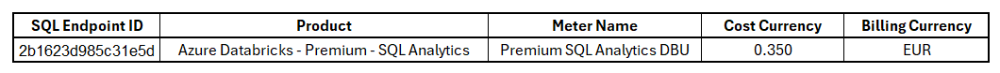

Vamos aprender como calcular o custo das instâncias do SQL Warehouse no [Microsoft Azure](https://www.linkedin.com/company/microsoft-azure/) [Databricks](https://www.linkedin.com/company/databricks/) de uma maneira fácil? Então acompanhe esse artigo.

O SQL Warehouse no [Databricks](https://www.linkedin.com/company/databricks/) é uma ferramenta que nos permite consultar e explorar dados de forma eficiente.

Atualmente, o [Microsoft Azure](https://www.linkedin.com/company/microsoft-azure/) [Databricks](https://www.linkedin.com/company/databricks/) oferece três tipos de SQL Warehouse:

1. **SQL Warehouse Classic**: Este tipo de SQL Warehouse utiliza nossa conta de assinatura do Azure. Ele oferece suporte ao Photon, mas não ao Predictive IO ou ao Intelligent Workload Management.
2. **SQL Warehouse Pro**: Assim como o Classic, ele utiliza nossa conta de assinatura do Azure, mas oferece suporte tanto ao Photon quanto ao Predictive IO. No entanto, não suporta o Intelligent Workload Management.
3. **SQL Warehouse Serverless**: Este tipo usa a arquitetura sem servidor do Azure Databricks e suporta todos os recursos de desempenho do Databricks SQL, incluindo Photon, Predictive IO e Intelligent Workload Management. Ele opera diretamente na nossa conta do Azure Databricks.

A principal diferença entre o SQL Warehouse Classic, o Pro e o Serverless é a localização da camada de computação e os recursos de suporte. Enquanto o Classic e o Pro utilizam nossa conta de assinatura do Azure, o Serverless opera na conta do [Microsoft Azure](https://www.linkedin.com/company/microsoft-azure/) [Databricks](https://www.linkedin.com/company/databricks/) e suporta mais funcionalidades.

### Método DIY

Esta seção é voltada para desenvolvedores ou pessoas técnicas que querem entender a lógica por trás da análise de custos e talvez criar suas próprias ferramentas ou scripts para calcular o custo das instâncias do SQL Warehouse do [Microsoft Azure](https://www.linkedin.com/company/microsoft-azure/) [Databricks](https://www.linkedin.com/company/databricks/) .

### Método DIY — SQL Warehouse Classic

Para calcular o custo de um [Microsoft Azure](https://www.linkedin.com/company/microsoft-azure/) [Databricks](https://www.linkedin.com/company/databricks/) SQL Warehouse Classic ou Pro, precisamos considerar os seguintes componentes:

1. **Horas de computação do SQL**: Tempo em que o SQL Warehouse estava em execução.
2. **Horas da unidade Databricks (DBU)**: Unidades de computação usadas pelo SQL Warehouse, cobradas por hora.
3. **Custos de armazenamento**: Custos associados ao armazenamento de dados, se aplicável.
4. **Custos de largura de banda**: Custos associados à transferência de dados, se aplicável.

### Obtendo a lista de instâncias clássicas do SQL Warehouse da API Databricks

O primeiro passo é recuperar a lista de instâncias do SQL Warehouse usando a API do [Microsoft Azure](https://www.linkedin.com/company/microsoft-azure/) [Databricks](https://www.linkedin.com/company/databricks/): /api/2.0/sql/warehouses.

Após executar a chamada da API, receberemos uma resposta JSON com todos os SQL Warehouses do [Microsoft Azure](https://www.linkedin.com/company/microsoft-azure/) [Databricks](https://www.linkedin.com/company/databricks/).

Aqui está um exemplo do JSON do SQL Warehouse Classic:

```
"warehouses":[
{
  "id":"2b1623d985c31e5d",
  "name":"Classic Warehouse",
  "size":"XXSMALL",
  "cluster_size":"2X-Small",
  "min_num_clusters":1,
  "max_num_clusters":1,
  "auto_stop_mins":45,
  "auto_resume":true,
  "creator_name":"julianamarialopes@hotmail.com",
  "creator_id":1036471208901988,
  "tags":{ },
  "spot_instance_policy":"COST_OPTIMIZED",
  "enable_photon":true,
  "channel":{
    "name":"CHANNEL_NAME_CURRENT"
  },
  "enable_serverless_compute":false,
  "warehouse_type":"CLASSIC",
  "num_clusters":0,
  "num_active_sessions":0,
  "state":"STOPPED",
  "jdbc_url":"jdbc:spark://adb-xxxxxxxx.x.azuredatabricks.net:443/default;transportMode=http;ssl=1;AuthMech=3;httpPath=/sql/1.0/warehouses/2b1623d985c31e5d;",
    "odbc_params":{
      "hostname":"adb-xxxxxxxx.x.azuredatabricks.net",
      "path":"/sql/1.0/warehouses/2b1623d985c31e5d",
      "protocol":"https",
      "port":443
    }
   }
  }
]        
```

### Obtendo o custo dos recursos do SQL Warehouse Classic da API da [Microsoft](https://www.linkedin.com/company/microsoft/)

Para calcular os custos do SQL Warehouse Classic, precisamos combinar os dados de uso com as informações de custo.

Usaremos a [API Microsoft Generate Cost Details Report](https://learn.microsoft.com/en-us/rest/api/cost-management/generate-cost-details-report/create-operation?view=rest-cost-management-2023-11-01&tabs=HTTP) para obter todos os dados da assinatura do [Microsoft Azure](https://www.linkedin.com/company/microsoft-azure/) onde nossos clusters [Microsoft Azure](https://www.linkedin.com/company/microsoft-azure/) [Databricks](https://www.linkedin.com/company/databricks/) estão em execução.

Aqui estão algumas notas importantes ao usar essa API:

1. **Filtragem dos dados**: Devemos filtrar os dados relacionados ao Databricks e remover quaisquer dados relacionados a outros serviços ou dados sem custo associado.
2. **Tipo de assinatura**: Precisamos ajustar os resultados com base no tipo de assinatura do Azure (pré-pago ou empresarial), pois o formato dos dados pode ser diferente.
3. **Limitação de dados**: A API permite extrair dados de um período máximo de um mês e não mais antigos que 13 meses.

Ao extrair os dados da API da [Microsoft Azure](https://www.linkedin.com/company/azurecommunity/) , selecionamos as seguintes colunas do relatório:

- **SqlEndpointId**: ID da instância do SQL Warehouse.
- **ProductName**: Descrição do recurso Azure consumido.
- **MeterName**: Rótulo que identifica o tipo de serviço ou recurso que está sendo cobrado.
- **CostInBillingCurrency**: Custo do recurso do Azure consumido.

Obteremos dados semelhantes a este (formatados para fácil compreensão):



Em instâncias **do SQL Warehouse Classic , o Produto** é igual **a Azure Databricks — Premium — SQL Analytics** e o **MeterName** é igual **a Premium SQL Analytics DBU.**

Em seguida, somamos todos os registros para calcular o custo final da instância do SQL Warehouse.

### Método DIY - SQL Warehouse Pro

Para calcular o custo de um [Microsoft Azure](https://www.linkedin.com/company/microsoft-azure/) [Databricks](https://www.linkedin.com/company/databricks/) **SQL Warehouse Pro** , precisamos levar em conta os seguintes componentes:

1. **Horas de computação SQL:** o tempo durante o qual o SQL Warehouse estava em execução.
2. **Horas da unidade de databricks (DBU):** as unidades de computação usadas pelo SQL Warehouse, que são cobradas por hora.
3. **Custos de Armazenamento:** Custos associados ao armazenamento de dados, se aplicável.
4. **Custos de largura de banda:** Custos associados à transferência de largura de banda, se aplicável.

Após executarmos a chamada da API, receberemos uma resposta JSON com todos os SQL Warehouses do [Microsoft Azure](https://www.linkedin.com/company/microsoft-azure/) [Databricks](https://www.linkedin.com/company/databricks/).

Este é o JSON do **SQL Warehouse Pro** :

```
"warehouses":[
{
  "id":"aedd502a567f273a",
  "name":"Starter Warehouse",
  "size":"XXSMALL",
  "cluster_size":"2X-Small",
  "min_num_clusters":1,
  "max_num_clusters":1,
  "auto_stop_mins":10,
  "auto_resume":true,
  "creator_name":"julianamarialopes@hotmail.com",
  "creator_id":1036471128901988,
  "tags":{ },
  "spot_instance_policy":"COST_OPTIMIZED",
  "enable_photon":true,
  "channel":{ },
  "enable_serverless_compute":false,
  "warehouse_type":"PRO",
  "num_clusters":0,
  "num_active_sessions":0,
  "state":"STOPPED",
  "jdbc_url":"jdbc:spark://adb-xxxxxxxx.x.azuredatabricks.net:443/default;transportMode=http;ssl=1;AuthMech=3;httpPath=/sql/1.0/warehouses/aedd502a567f273a;",
    "odbc_params":{
      "hostname":"adb-xxxxxxxx.x.azuredatabricks.net",
      "path":"/sql/1.0/warehouses/aedd502a567f273a",
      "protocol":"https",
      "port":443
    }
   }
  }
]        
```

Muito similar ao exemplo anterior.

## Obtendo o custo dos recursos do SQL Warehouse PRO da API da Microsoft

Para calcular os custos do SQL Warehouse Pro, precisamos combinar os dados de uso recuperados com as informações de custo para calcular o custo total.

Usaremos a [**API Microsoft Generate Cost Details Report**](https://learn.microsoft.com/en-us/rest/api/cost-management/generate-cost-details-report/create-operation?view=rest-cost-management-2023-11-01&tabs=HTTP) para obter todos os dados da assinatura do Azure onde nossos clusters Databricks estão em execução.

Notas importantes quando usamos a API:

- Quando obtemos os dados de detalhes de custo de uma assinatura do [Microsoft Azure](https://www.linkedin.com/company/microsoft-azure/), devemos filtrar os dados relacionados ao Databricks e remover quaisquer dados relacionados a outros serviços e dados sem qualquer custo associado.
- Precisamos ajustar os resultados com base no tipo de **assinatura do** [Microsoft Azure](https://www.linkedin.com/company/microsoft-azure/) **(pré-pago ou empresarial)** porque o resultado é diferente.
- A API só permite que dados sejam extraídos de **um mês ou menos** e **não mais antigos que 13 meses** .

Ao extrair os dados da API da Microsoft, precisaremos selecionar as seguintes colunas do relatório:

- **SqlEndpointId:** o ID da instância do SQL Warehouse
- **ProductName:** a descrição do recurso Azure consumido
- **MeterName:** o rótulo que identifica o tipo de serviço ou recurso que está sendo cobrado
- **CostInBillingCurrency:** o custo do recurso do Azure consumido
- **BillingCurrency:** o código da moeda de cobrança (USD, EUR, etc.)

## 1.2.3. Calculando o custo das instâncias do SQL Warehouse PRO

Depois de recuperar os dados do [Microsoft Azure](https://www.linkedin.com/company/microsoft-azure/) [Databricks](https://www.linkedin.com/company/databricks/) e das APIs do [Microsoft Azure](https://www.linkedin.com/company/microsoft-azure/), a etapa final é filtrar os dados de custo do Azure usando o ID do ponto de extremidade do SQL e corresponder ao ID do ponto de extremidade do SQL da API do [Microsoft Azure](https://www.linkedin.com/company/microsoft-azure/) [Databricks](https://www.linkedin.com/company/databricks/).

Nas instâncias **do SQL Warehouse Pro , o Produto** é igual ao **Azure Databricks Regional — Premium — SQL Compute Pro** e o **MeterName** é igual **ao Premium SQL Compute Pro DBU.**

Em seguida, somamos todos os registros para calcular o custo final da instância do SQL Warehouse.

## 1.3. Método DIY – SQL Warehouse sem servidor

**As instâncias sem servidor do SQL Warehouse do** [Microsoft Azure](https://www.linkedin.com/company/microsoft-azure/) [Databricks](https://www.linkedin.com/company/databricks/) estão sendo executadas dentro da nossa conta do [Microsoft Azure](https://www.linkedin.com/company/microsoft-azure/) [Databricks](https://www.linkedin.com/company/databricks/), então estamos sendo cobrados apenas em horas de unidade do Databricks (DBU).

Após executarmos a chamada da API, receberemos um JSON com todos os SQL Warehouses do [Microsoft Azure](https://www.linkedin.com/company/microsoft-azure/) [Databricks](https://www.linkedin.com/company/databricks/).

Este é o JSON do **SQL Warehouse Serverless** :

```
"warehouses":[
{
  "id":"e5e7201bde7c3a43",
  "name":"Serveless Warehouse",
  "size":"XXSMALL",
  "cluster_size":"2X-Small",
  "min_num_clusters":1,
  "max_num_clusters":1,
  "auto_stop_mins":10,
  "auto_resume":true,
  "creator_name":"julianamarialopes@hotmail.com",
  "creator_id":1036471128901988,
  "tags":{ },
  "spot_instance_policy":"COST_OPTIMIZED",
  "enable_photon":true,
  "enable_serverless_compute":true,
  "warehouse_type":"PRO",
  "num_clusters":0,
  "num_active_sessions":0,
  "state":"STOPPED",
  "jdbc_url":"jdbc:spark://adb-xxxxxxxx.x.azuredatabricks.net:443/default;transportMode=http;ssl=1;AuthMech=3;httpPath=/sql/1.0/warehouses/e5e7201bde7c3a43;",
    "odbc_params":{
      "hostname":"adb-xxxxxxxx.x.azuredatabricks.net",
      "path":"/sql/1.0/warehouses/e5e7201bde7c3a43",
      "protocol":"https",
      "port":443
    }
   }
  }
]        
```

## 1.3.2. Obtendo o custo dos recursos sem servidor do SQL Warehouse da API da Microsoft

Precisamos combinar os dados de uso recuperados com as informações de custo para calcular os custos do SQL Warehouse Serverless.

Usaremos a [**API Microsoft Generate Cost Details Report**](https://learn.microsoft.com/en-us/rest/api/cost-management/generate-cost-details-report/create-operation?view=rest-cost-management-2023-11-01&tabs=HTTP) para obter todos os dados da assinatura do Azure onde nossos clusters [Microsoft Azure](https://www.linkedin.com/company/microsoft-azure/) [Databricks](https://www.linkedin.com/company/databricks/) estão em execução.

Notas importantes quando usamos a API:

- Quando obtemos os dados de detalhes de custo de uma assinatura do [Microsoft Azure](https://www.linkedin.com/company/microsoft-azure/), devemos filtrar os dados relacionados ao [Microsoft Azure](https://www.linkedin.com/company/microsoft-azure/) [Databricks](https://www.linkedin.com/company/databricks/) e remover quaisquer dados relacionados a outros serviços e dados sem qualquer custo associado.
- Precisamos ajustar os resultados com base no tipo de **assinatura do** [Microsoft Azure](https://www.linkedin.com/company/microsoft-azure/)**(pré-pago ou empresarial)** porque o resultado é diferente.
- A API só permite que dados sejam extraídos de **um mês ou menos** e **não mais antigos que 13 meses** .

Ao extrair os dados da API da [Microsoft](https://www.linkedin.com/company/microsoft/) , precisaremos selecionar as seguintes colunas do relatório:

- **SqlEndpointId:** o ID da instância do SQL Warehouse
- **ProductName:** a descrição do recurso Azure consumido
- **MeterName:** o rótulo que identifica o tipo de serviço ou recurso que está sendo cobrado
- **CostInBillingCurrency:** o custo do recurso do Azure consumido
- **BillingCurrency:** o código da moeda de cobrança (USD, EUR, etc.)

## 1.3.3. Calculando o custo de instâncias sem servidor do SQL Warehouse

Depois de recuperar os dados do [Microsoft Azure](https://www.linkedin.com/company/microsoft-azure/?trk=article-ssr-frontend-pulse_little-text-block) [Databricks](https://www.linkedin.com/company/databricks/?trk=article-ssr-frontend-pulse_little-text-block) e das APIs do
[Microsoft Azure](https://www.linkedin.com/showcase/microsoft-azure/?trk=article-ssr-frontend-pulse_little-mention)
, a etapa final é filtrar os dados de custo usando o ID do ponto de extremidade do SQL e corresponder ao ID do ponto de extremidade do SQL da API do [Microsoft Azure](https://www.linkedin.com/company/microsoft-azure/?trk=article-ssr-frontend-pulse_little-text-block) [Databricks](https://www.linkedin.com/company/databricks/?trk=article-ssr-frontend-pulse_little-text-block).

Nas instâncias **do SQL Warehouse Serverless , o Produto** é igual ao **Azure Databricks Regional — Premium — Serverless SQL** e o **MeterName** é igual ao **Premium Serverless SQL DBU.**

Em seguida, somamos todos os registros para calcular o custo final da instância do SQL Warehouse.

E é isso, pessoal. Se você gostou desse artigo, por favor, mostre seu apoio 👏. Obrigado por ler!
