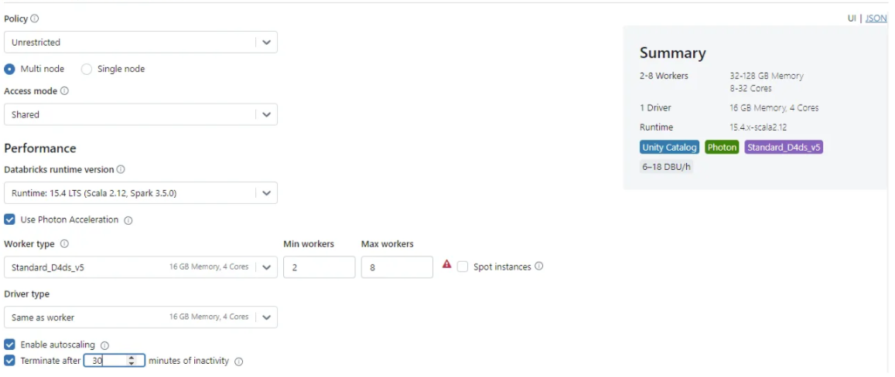
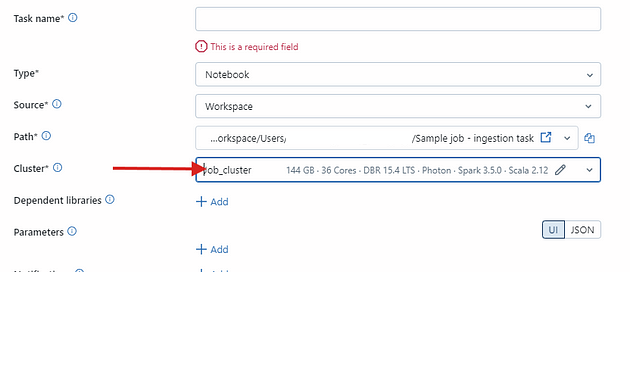
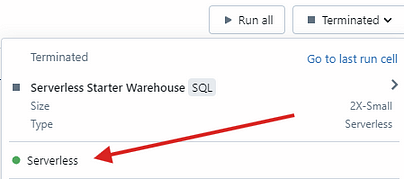
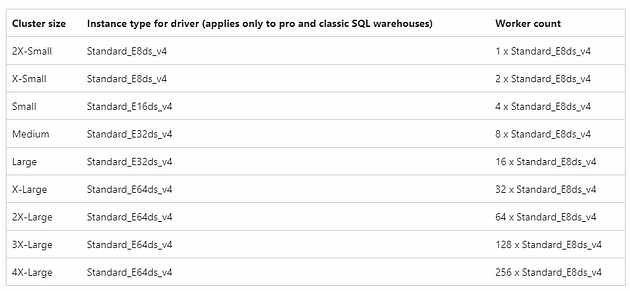

### Introdução - Coperação Inteligente: A Base dos Clusters do Databricks

O Databricks é uma plataforma robusta para processamento e análise de grandes volumes de dados, suportando cargas de trabalho que variam desde a engenharia de dados até a ciência de dados e análise de negócios. Um dos principais componentes do Databricks é o cluster, que é uma coleção de máquinas virtuais configuradas para executar códigos em distribuição paralela usando Apache Spark.

Uma boa forma de entender o funcionamento de um cluster é compará-lo a uma colmeia de abelhas. Assim como uma colmeia é composta por centenas ou milhares de abelhas que trabalham em conjunto para manter a colmeia produtiva e organizada, um cluster é formado por vários nós (máquinas virtuais) que cooperam para processar grandes volumes de dados de forma eficiente.

Tradicionalmente, utilizando o **All-Purpose Compute**, os usuários podiam criar clusters personalizados configurando aspectos como a versão do Spark, os tipos de nós (driver e workers) e o número de nós no cluster. Além disso, era possível instalar bibliotecas adicionais para atender a cargas de trabalho específicas, proporcionando grande flexibilidade. Esse método foi amplamente utilizado como padrão durante um longo período.

Entretanto, o Databricks evoluiu e agora oferce novas possibilidades, incluindo a opção de computação sem servidor (**Serverless Compute**), que traz uma abordagem mais automatizada e escalável para lidar com demandas variadas. Assim como as abelhas operárias podem se adaptar rapidamente às necessidades da colmeia, o Databricks se adapta às cargas de trabalho com diferentes tipos de clusters.

---

### Tipos de Clusters no Databricks

1. **All-Purpose Compute Clusters**
2. **Jobs Clusters**
3. **Serverless Clusters**
4. **High Concurrency Clusters**
5. **Photon Clusters**

---

### Detalhamento dos Tipos de Clusters

### 1. All-Purpose Compute Clusters

Os clusters de uso geral (**All-Purpose**) são projetados para serem altamente configuráveis, permitindo que os usuários definam detalhes como:

- Versão do Apache Spark
- Tipo de instância (nós driver e workers)
- Quantidade de nós no cluster

Nesta configuração, o nó driver atua como a abelha rainha, coordenando toda a atividade da colmeia, enquanto os nós workers representam as abelhas operárias, que realizam as tarefas de processamento de dados. A comunicação eficiente entre eles garante que os dados sejam processados de forma rápida e precisa.



\_All-Purpose Clusters\_

**Vantagens:**

- Flexibilidade total para personalizar o ambiente conforme a necessidade.
- Permite a instalação de bibliotecas adicionais para suportar workloads específicas.

**Casos de uso recomendados:**

- Desenvolvimento e exploração de dados.
- Execução de notebooks interativos.
- Trabalhos que demandam um ambiente altamente customizado.

### 2. Jobs Clusters

Os **Jobs Clusters** são criados automaticamente para executar uma tarefa (“job”) específica e são encerrados assim que a tarefa é concluída.

Da mesma forma que algumas abelhas podem ser destacadas para missões específicas, como coletar néctar de uma fonte distante, os jobs clusters são criados para realizar uma tarefa pontual e depois desativados, economizando recursos.



\_Job Clusters\_

**Vantagens:**

- Redução de custos devido à criação e encerramento automáticos.
- Configuração rápida e simples para execução de workloads programadas.

**Casos de uso recomendados:**

- Execução de pipelines ETL programados.
- Processamento de dados em lotes.
- Execução de tarefas recorrentes.

### 3. Serverless Clusters

Os **Serverless Clusters** eliminam a necessidade de configuração manual, escalando automaticamente de acordo com a carga de trabalho.

Assim como em uma colmeia onde a quantidade de abelhas operárias pode variar dependendo da estação do ano ou das necessidades da colmeia, os serverless clusters se ajustam automaticamente à demanda, garantindo eficiência e evitando desperdício de recursos.



\_Computação sem Servidor\_

**Vantagens:**

- Escalonamento automático e gerenciamento simplificado.
- Redução do tempo de inicialização, melhorando a produtividade.
- Ideal para workloads intermitentes, pois você paga apenas pelo uso real.

Os warehouses utilizados nesses clusters podem ser configurados em diferentes tamanhos, como **Small**, **Medium**, **Large**, e **X-Large**, dependendo da demanda de processamento. Além disso, o dimensionamento automático permite que o sistema ajuste dinamicamente os recursos alocados conforme a carga de trabalho, garantindo desempenho ideal e controle de custos.



\_Tamanhos de cluster para SQL Warehouses\_

**Casos de uso recomendados:**

- Execução de workloads ad hoc.
- Consultas SQL e processamento de dados sem necessidade de configuração complexa.
- Análise de dados em tempo real.

### 4. High Concurrency Clusters

Os **High Concurrency Clusters** são projetados para atender vários usuários simultaneamente, oferecendo suporte à execução paralela de várias tarefas.

Assim como diferentes abelhas trabalham simultaneamente em diversas tarefas dentro da colmeia, os high concurrency clusters permitem que vários usuários executem seus códigos ao mesmo tempo sem comprometer o desempenho.

**Vantagens:**

- Suporte a vários usuários simultâneos sem degradação significativa de desempenho.
- Ideal para ambientes colaborativos.

**Casos de uso recomendados:**

- Análise colaborativa.
- Dashboards interativos com vários acessos simultâneos.
- Plataformas de Business Intelligence integradas ao Databricks.

### 5. Photon Clusters

O **Photon** é um mecanismo de execução de última geração projetado para melhorar significativamente o desempenho de tarefas, especialmente em cargas de trabalho típicas de data warehouse. Ele é totalmente compatível com as APIs de DataFrame e SQL do Apache Spark e foi otimizado para operações como:

- **UPDATE**
- **DELETE**
- **MERGE**
- **INSERT**
- **CREATE TABLE AS**

**Vantagens:**

- Redução significativa no tempo de execução de tarefas.
- Menor custo operacional devido à eficiência aprimorada.
- Ideal para cargas de trabalho que envolvem modificações frequentes em grandes volumes de dados.

**Casos de uso recomendados:**

- Processamento de dados em larga escala.
- Cargas de trabalho de data warehouse que exigem alta performance.
- Pipelines que executam operações complexas de modificação de dados.

---

### Custo de Cada Tipo de Cluster

- **All-Purpose Compute Clusters:** Têm custos elevados devido à necessidade de manter o cluster ativo durante o desenvolvimento. São recomendados apenas para tarefas interativas e desenvolvimento.
- **Jobs Clusters:** Mais econômicos, pois são criados e encerrados automaticamente. O custo é proporcional ao tempo de execução das tarefas.
- **Serverless Clusters:** O custo é baseado no uso real, sendo uma opção altamente eficiente para workloads esporádicos.
- **High Concurrency Clusters:** Apresentam um custo intermediário, adequado para ambientes colaborativos onde há múltiplos acessos simultâneos.
- **Photon Clusters:** Apesar de apresentarem custos semelhantes aos All-Purpose Clusters, a eficiência aprimorada do Photon pode levar a uma redução significativa nos custos gerais, especialmente em cargas de trabalho intensivas.

---

### Monitoramento de Custos

Para controlar os custos no Databricks, especialmente ao utilizar computação sem servidor, é possível monitorar o uso consultando as tabelas do sistema (**system.billing.usage**), que contêm informações detalhadas sobre usuários e cargas de trabalho relacionadas aos custos.

Como alternativa, você pode importar um painel de cobrança diretamente para o console da conta. Usando essas ferramentas, é possível rastrear custos e utilização sem servidor, obtendo relatórios detalhados que oferecem informações sobre:

- Custos de SQL
- Custos de DLT (Delta Live Tables)
- Custos de jobs
- Custos de modelos de machine learning

Esses relatórios permitem uma visão abrangente e detalhada, ajudando a otimizar o uso de recursos e reduzir despesas desnecessárias. Abaixo temos um exemplo de consulta para esse monitoramento:

```
SELECIONE
    t1.workspace_id, 
   SOMA(t1.usage_quantity * list_prices.pricing. default ) como list_cost 
DE system.billing.usage t1 
INNER JOIN system.billing.list_prices em
    t1.cloud = list_prices.cloud e
    t1.sku_name = list_prices.sku_name e
    t1.usage_start_time >= list_prices.price_start_time e
    (t1.usage_end_time <= list_prices.price_end_time ou list_prices.price_end_time é nulo) 
ONDE
    t1.sku_name COMO  '%SERVERLESS%' 
AGRUPAR  POR
    t1.workspace_id        
```

---

### Conclusão - Eficiência Inspirada pela Natureza: Clusters do Databricks em Ação

Assim como em uma colmeia de abelhas, onde cada integrante desempenha um papel fundamental para o bom funcionamento do todo, um cluster no Databricks é formado por vários nós que trabalham em conjunto para processar grandes volumes de dados de maneira eficiente. O Databricks oferece uma variedade de opções de clusters para atender diferentes tipos de workloads, desde desenvolvimento e execução de pipelines até análise colaborativa e processamento ad hoc. Cada tipo de cluster possui suas vantagens e é indicado para cenários específicos, permitindo que as organizações escolham a melhor solução conforme suas necessidades.

Além disso, a possibilidade de monitorar custos e utilização de forma detalhada garante maior controle financeiro e operacional. Com essas funcionalidades, o Databricks se destaca como uma solução escalável e eficiente para projetos de dados em diversos segmentos de mercado.
