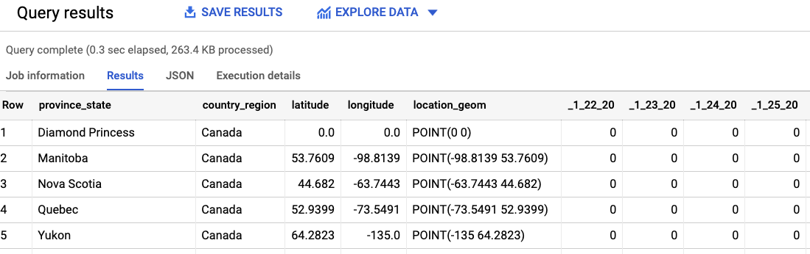
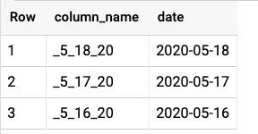
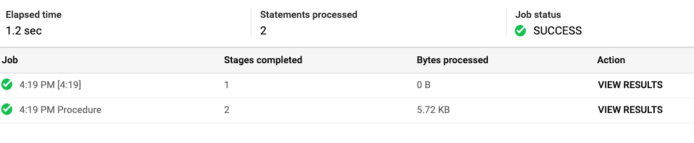
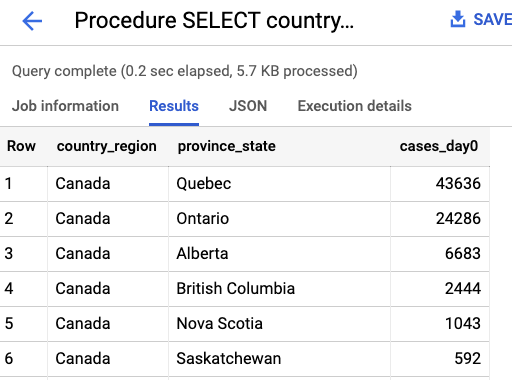
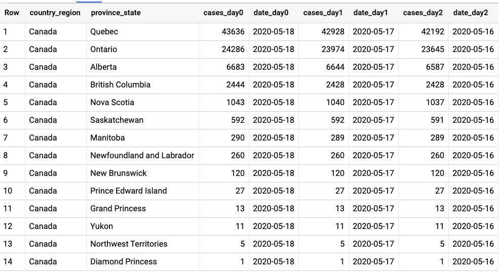

Essa semana (Junho/2020) saiu uma atualização do GCP onde é possível utilizar o comando EXECUTE IMMEDIATE no BigQuery. Para mais informações veja a [documentação](https://cloud.google.com/bigquery/docs/reference/standard-sql/scripting?utm_source=release-notes&utm_medium=email&utm_campaign=2020-june-release-notes-1-en#execute_immediate).

Digamos que queremos encontrar o número de casos confirmados de COVID nos últimos três dias em várias províncias canadenses. Há um conjunto de dados público do *BigQuery* que podemos consultá-lo da seguinte forma:

```
SELECT 
 *   
FROM `bigquery-public-data`.covid19_jhu_csse.confirmed_cases
WHERE country_region LIKE 'Canada'
```

Nós temos:



Há uma coluna para todas as datas. Como encontramos os últimos três dias para os quais existem dados? Perceba o formato "\_1\_22\_20, \_1\_23\_20,...."

### Buscando Colunas

Podemos usar a função *INFORMATION\_SCHEMA* para obter a lista de colunas e localizar os últimos três dias usando:

```
SELECT 
   column_name, 
    parse_date('_%m_%d_%y', column_name) AS date
FROM 
  `bigquery-public-data`.covid19_jhu_csse.INFORMATION_SCHEMA.COLUMNS
WHERE 
    table_name = 'confirmed_cases' AND 
    STARTS_WITH(column_name, '_')
ORDER BY date DESC LIMIT 3
```

Retornando



### Criando uma instrução SQL dinâmica

Você pode executar uma instrução SQL dinâmica usando *EXECUTE IMMEDIATE*. Por exemplo, suponha que tenhamos uma variável com o nome da coluna \_5\_18\_20, é assim que usá-la para executar uma instrução SELECT:

```
DECLARE col_0 STRING;

SET col_0 = '_5_18_20';

EXECUTE IMMEDIATE format("""
  SELECT 
     country_region, province_state, 
     %s AS cases_day0
  FROM `bigquery-public-data`.covid19_jhu_csse.confirmed_cases
  WHERE country_region LIKE 'Canada'
  ORDER BY cases_day0 DESC
""", col_0);
```

Observe a consulta acima. Primeiro de tudo, porque estou declarando uma variável etc., este é um script do BigQuery em que cada instrução termina com um ponto e vírgula.

Estou usando a função de formato de string do *BigQuery* para criar a instrução que quero executar. Como estou passando uma string, especifique% s na string de formato e passo em col\_0.

O resultado consiste em duas etapas:



com o resultado da segunda etapa sendo:



### Script nos últimos 3 dias

Podemos combinar as três ideias acima - INFORMATION\_SCHEMA, script e EXECUTE IMMEDIATE para obter os dados dos últimos três dias.

```
DECLARE columns ARRAY<STRUCT<column_name STRING, date DATE>>;

SET columns = (
  WITH all_date_columns AS (
    SELECT column_name, parse_date('_%m_%d_%y', column_name) AS date
    FROM `bigquery-public-data`.covid19_jhu_csse.INFORMATION_SCHEMA.COLUMNS
    WHERE table_name = 'confirmed_cases' AND STARTS_WITH(column_name, '_')
  )
  SELECT ARRAY_AGG(STRUCT(column_name, date) ORDER BY date DESC LIMIT 3) AS columns
  FROM all_date_columns
);

EXECUTE IMMEDIATE format("""
  SELECT 
     country_region, province_state, 
     %s AS cases_day0, '%t' AS date_day0,
     %s AS cases_day1, '%t' AS date_day1,
     %s AS cases_day2, '%t' AS date_day2
  FROM `bigquery-public-data`.covid19_jhu_csse.confirmed_cases
  WHERE country_region LIKE 'Canada'
  ORDER BY cases_day0 DESC
""", 
columns[OFFSET(0)].column_name, columns[OFFSET(0)].date,
columns[OFFSET(1)].column_name, columns[OFFSET(1)].date,
columns[OFFSET(2)].column_name, columns[OFFSET(2)].date
);
```

Os passos:

- Declarar colunas como uma variável de matriz que armazenará o nome e a data da coluna nos três dias mais recentes
- Defina as colunas como o resultado da consulta para obter 3 dias. Observe que estou fazendo um *ARRAY\_AGG* para obter o conjunto de resultados completo armazenado em uma variável.
- Formate a consulta. Observe que estou usando `% t` para representar um registro de data e hora (consulte a documentação do formato String para obter detalhes) e passando seis parâmetros.

O resultado fica:



### Usando o EXECUTE IMMEDIATE

Em vez de usar o formato String, você pode executar variáveis nomeadas da seguinte maneira:

```
EXECUTE IMMEDIATE """
  SELECT country_region, province_state, _5_18_20 AS cases 
  FROM `bigquery-public-data`.covid19_jhu_csse.confirmed_cases 
  WHERE country_region LIKE @country
  ORDER BY cases DESC LIMIT 3
"""

USING 'Canada' AS country;
```

Você também pode executar variáveis posicionais usando pontos de interrogação:

```
EXECUTE IMMEDIATE """
  SELECT country_region, province_state, _5_18_20 AS cases 
  FROM `bigquery-public-data`.covid19_jhu_csse.confirmed_cases 
  WHERE country_region LIKE ?
  ORDER BY cases DESC LIMIT ?
"""

USING 'Canada', 3;
```

A cláusula USING é complicada em algumas situações. Por exemplo, o seguinte não funciona:

```
EXECUTE IMMEDIATE """
  SELECT country_region, province_state, ? AS cases
  FROM `bigquery-public-data`.covid19_jhu_csse.confirmed_cases 
  WHERE country_region LIKE ?
  ORDER BY cases DESC LIMIT ?
"""

USING '_5_18_20', 'Canada', 3; -- ISSO NÃO FUNCIONA !!!
```

Isso ocorre porque o primeiro parâmetro é interpretado como:

```
'_5_18_20' AS cases
```

Portanto, você não pode passar o nome de uma coluna através de USING. Por isso, recomendo usar a String FORMAT () para criar a consulta a ser executada imediatamente, porque não possui esses problemas.

**Logo mais o recurso PIVOT() está disponível !!!**

Obrigada e até mais !
