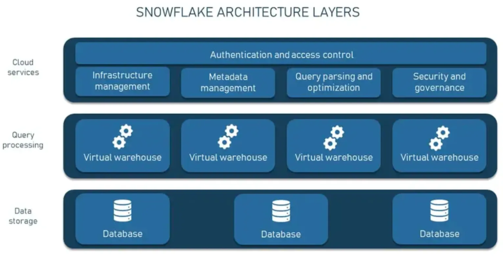
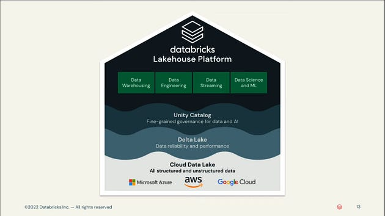
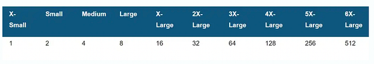
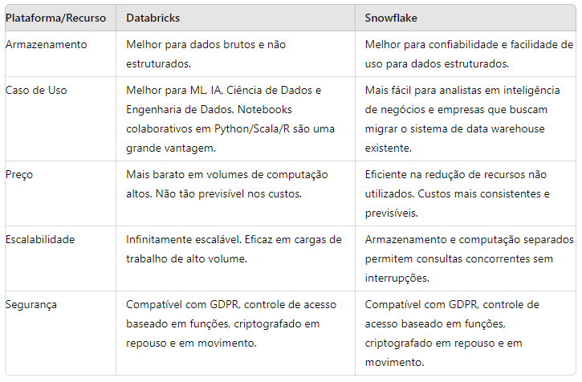

### Uma visão geral e comparação de alto nível entre Databricks e Snowflake sobre seus pontos fortes e fracos.

[Databricks](https://www.linkedin.com/company/databricks/) e [Snowflake](https://www.linkedin.com/company/snowflake-computing/) são dois nomes em soluções de dados em nuvem. Ambas as plataformas têm sido fundamentais para ajudar as empresas a gerar valor a partir de seus ativos de dados internos e externos. Cada plataforma tem vantagens e recursos distintos e eles têm se sobreposto cada vez mais em suas ofertas deixando muitos em dúvidas sobre qual solução é mais adequada para suas necessidades de negócios.

Para começar uma comparação significativa, temos que entender o histórico e a competência principal de cada oferta. Para auxiliar nesse entendimento vamos pontuar as principais diferenças entre Snowflake e Databricks incluindo preço, desempenho, integração, segurança e melhores casos de uso para melhor atender às necessidades individuais de cada usuário.

## Databricks vs. Snowflake: Quais são as principais diferenças?

A primeira coisa a entender sobre as duas plataformas é o que elas são e que solução elas esperam fornecer.

O **Databricks** é uma *plataforma* de análise de dados unificada e baseada em nuvem , para construir, implementar e compartilhar soluções de análise de dados em escala. O Databricks visa fornecer uma interface unificada onde os usuários podem armazenar dados e executar trabalhos em espaços de trabalho interativos e compartilháveis. Esses espaços de trabalho contêm notebooks por meio dos quais todas as funções de computação são construídas para serem computadas por máquinas baseadas em nuvem.

**O Snowflake,** por outro lado, é um data *warehouse* SaaS totalmente gerenciado baseado em nuvem. Enquanto o Databricks foi projetado inicialmente para unificar pipelines de dados, o Snowflake foi projetado para ser a solução de data warehouse mais fácil de gerenciar. Enquanto o mercado-alvo do Databricks são cientistas e engenheiros de dados, o mercado-alvo do Snowflake é tipicamente analistas de dados — que são altamente proficientes em consultas SQL e análise de dados, mas não tão interessados ​​em computações complexas ou fluxos de trabalho de aprendizado de máquina.

Com o tempo, a Databricks e a Snowflake têm competido cada vez mais, pois cada uma espera expandir suas ofertas para ser uma solução de plataforma de dados em nuvem tudo-em-um. Novos produtos como o *Snowpark da Snowflake (que oferece funcionalidade Python) e o DBSQL* da Databricks (seu data warehouse sem servidor) tornaram cada vez mais difícil diferenciar a oferta de cada produto.

***Por enquanto, a maioria concordaria que a Snowflake tende a ser o nome dominante para soluções de data warehouse em nuvem fáceis de usar, e a Databricks é a vencedora para fluxos de trabalho de aprendizado de máquina e ciência de dados baseados em nuvem.***

## Databricks vs Snowflake: Armazenamento de dados

***No momento, a Snowflake tem a vantagem para consultar dados estruturados, e a Databricks tem a vantagem para dados brutos e não estruturados necessários para ML. No futuro em próximo, creio que que a plataforma data lakehouse da Databricks será a solução de mercado dominante e mais abrangente para todo o gerenciamento de dados.***

Uma das maiores diferenças entre Snowflake e Databricks é como eles armazenam e acessam dados. Ambos lideram a indústria em velocidade e escala. A maior diferença entre os dois é a arquitetura de *data warehouse vs data lakehouse* , e o armazenamento de *dados não estruturados vs estruturados.*

### Snowflake

O Snowflake, em sua essência, é um ***data warehouse em nuvem.*** Ele armazena dados estruturados em um formato fechado e proprietário para consulta e transformação de dados rápidas e contínuas. Seu formato proprietário permite alta velocidade e confiabilidade com compensações em flexibilidade. Mais recentemente, o Snowflake está permitindo a ingestão de dados e o armazenamento de dados em formatos adicionais (como Apache Iceberg), mas a grande maioria dos dados de seus clientes ainda fica em seu próprio formato.

O Snowflake utiliza uma *arquitetura de disco compartilhado multicluster* , na qual os recursos de computação compartilham o mesmo dispositivo de armazenamento, mas retêm sua própria CPU e memória. Para conseguir isso, o Snowflake ingere, otimiza e compacta dados em uma camada de armazenamento de objetos em nuvem, como Amazon S3 ou Google Cloud Storage. Os dados aqui são organizados em um formato colunar e segmentados em micropartições, de 50 a 500 MB. Essas micropartições armazenam metadados, o que ajuda muito na velocidade. Curiosamente, o próprio formato de arquivo de armazenamento interno do Snowflake não é de código aberto, mantendo a maioria dos clientes presos.

Para funcionar de forma eficiente, o Snowflake usa várias camadas para fornecer uma experiência empresarial à carga de trabalho de processamento em nuvem. O Snowflake mantém uma camada de serviços em nuvem que lida com a autenticação empresarial e o controle de acesso.

Para execução, o Snowflake usa armazéns virtuais, que são abstrações sobre instâncias de nuvem regulares (como EC2). Esses armazéns consultam dados de uma camada de armazenamento de dados separada, separando efetivamente o armazenamento e a computação. Essa separação de computação e armazenamento torna o Snowflake infinitamente escalável e permite que os usuários executem consultas simultâneas nos mesmos dados, com isolamento razoável.

\_Snowflake Architecture Layers\_

O Snowflake pode executar todos os três principais provedores de serviços de nuvem.

***Conclusão: A arquitetura do Snowflake permite consultas rápidas e confiáveis ​​de dados estruturados, em escala. Ela tem apelo para aqueles que querem métodos simples para gerenciar seus requisitos de recursos de seus trabalhos (por meio de opções de warehouse do tamanho de uma camiseta). Ela é voltada principalmente para aqueles proficientes em SQL, mas não tem a flexibilidade para lidar facilmente com dados brutos e não estruturados.***

### Databricks

Um dos pontos de venda da Databricks é que ela emprega uma camada de armazenamento de código aberto conhecida como Delta Lake — que visa combinar a flexibilidade dos data lakes em nuvem com a confiabilidade e estrutura unificada de um data warehouse — e sem os desafios associados ao bloqueio de fornecedor. A Databricks foi pioneira nessa estrutura híbrida chamada de "data lakehouse" como uma solução econômica para cientistas de dados, engenheiros de dados e analistas trabalharem com os mesmos dados — independentemente da estrutura ou formato.

\_Databricks Lakehouse\_

O data lakehouse da Databricks funciona empregando três camadas para permitir o armazenamento de dados brutos e não estruturados — mas também armazena metadados (como um esquema estruturado) para recursos semelhantes a warehouse em dados estruturados. Notavelmente, este data lakehouse fornece suporte a transações ACID , aplicação automática de esquema — que valida a compatibilidade do DataFrame e da tabela antes das gravações — e streaming de ponta a ponta para ingestão de dados em tempo real — alguns dos avanços mais desejáveis ​​para sistemas de data lake.

***Conclusão: Lakehouses trazem a velocidade, confiabilidade e desempenho de consulta rápida de data warehouses para a flexibilidade de um Data Lake.***

## Escalabilidade Databricks vs Snowflake

Snowflake e Databricks continuam a batalhar pelo domínio das cargas de trabalho empresariais. Embora ambas tenham se mostrado líderes do setor nessa capacidade, a maior diferença prática entre as duas está em suas *capacidades de gerenciamento de recursos.*

### Snowflake

A Snowflake oferece recursos de computação como uma *oferta* sem servidor. Isso significa que os usuários não precisam selecionar, instalar, configurar ou gerenciar nenhum software e hardware. Em vez disso, a Snowflake usa uma série de warehouses virtuais — recursos de computação independentes contendo memória e CPU — para executar consultas. Essa separação de memória e recursos de computação permite que a Snowflake dimensione infinitamente sem desacelerar, e vários usuários podem consultar simultaneamente o mesmo segmento único de dados.

A Snowflake emprega um modelo simples de dimensionamento de “tamanhos” para seus warehouses virtuais, com 10 tamanhos, cada um com o dobro do poder de computação do tamanho anterior. O maior é o 6XL, que tem 512 nós. Como os warehouses não compartilham recursos de computação ou armazenam dados, se um deles cair, ele pode ser substituído em minutos sem afetar nenhum dos outros.

\_Um diagrama dos nós virtuais associados a cada tamanho de warehouse\_

Mais notavelmente, os warehouses multicluster da Snowflake fornecem um recurso de "maximização" e "escala automática", o que lhe dá a capacidade de desligar dinamicamente clusters não utilizados, economizando dinheiro.

### Databricks

A Databricks começou com uma infraestrutura muito mais "aberta" e tradicional, onde basicamente toda a computação é executada dentro da VPC de nuvem de um usuário. Este é o completo oposto do modelo "sem servidor", onde a computação é executada dentro da VPC da Databrick, já que todas as configurações de cluster são expostas aos usuários finais. Isso tem seus prós e contras, a principal vantagem é que os usuários podem hiperotimizar seus clusters para melhorar o desempenho, mas a desvantagem é que pode ser doloroso de usar ou exigir um especialista para manter.

Mais recentemente, a Databricks está evoluindo para o modelo “serverless” com o Databricks SQL Serverless, e provavelmente estendendo esse modelo para outros produtos, como notebooks. Os prós e contras aqui se invertem, pois o pró é que os usuários não precisam se preocupar com configurações de cluster, no entanto, o contra é que os usuários não têm acesso nem visibilidade à infraestrutura subjacente e não conseguem personalizar os clusters para atender às suas necessidades.

Como o Databricks está atualmente em um período de “transição” entre ofertas clássicas e “sem servidor”, sua escalabilidade realmente depende do caso de uso que as pessoas selecionam.

Uma observação importante é que o Databricks tem um conjunto diversificado de casos de uso de computação, de SQL warehouses, Jobs, All Purpose Compute, Delta Live Tables, até streaming — cada um deles tem configurações de computação e casos de uso ligeiramente diferentes. Por exemplo, SQL warehouses podem ser usados ​​como um recurso compartilhado, onde várias consultas podem ser enviadas ao warehouse a qualquer momento por vários usuários. Os jobs são mais singulares, nos quais um notebook é executado em um cluster e é desligado (os jobs também podem ser compartilhados agora, mas isso é menos usado).

***Conclusão: Quando se trata de escalar para grandes fluxos de trabalho, tanto o Snowflake quanto o Databricks podem lidar com a carga de trabalho. No entanto, o Databricks é mais capaz de impulsionar e ajustar o desempenho de grandes volumes de dados, o que, em última análise, economiza custos.***

## Databricks vs Snowflake: Custo

Tanto o Databricks quanto o Snowflake são comercializados como modelos de pagamento conforme o uso. Ou seja, quanto mais computação você reserva/solicita, mais você paga. Tanto no Databricks quanto no Snowflake, os usuários podem e pagarão pelos recursos solicitados, independentemente de esses recursos serem realmente necessários ou ideais para executar o trabalho.

Outra grande diferença entre os dois serviços é que o Snowflake executa e cobra por toda a engine de computação (warehouses e instâncias de nuvem), enquanto o Databricks executa e cobra apenas pelo gerenciamento da computação, exigindo que os usuários ainda tenham que pagar uma conta separada do provedor de nuvem. Vale a pena notar que o novo produto serverless do Databricks imita o modelo operacional do Snowflake. O Databricks trabalha com unidades de computação/tempo chamadas Databricks Units (ou DBUs) por segundo e o Snowflake usa um sistema de crédito Snowflake.

Como fórmula, ele se divide assim:

- **Databricks (computação clássica)** = Armazenamento de dados + Custo do serviço Databricks (DBUs) + Custo da computação em nuvem (instâncias de máquina virtual)
- **Snowflake** = Armazenamento de dados (volume médio diário de bytes armazenados no Snowflake) + Computação (número de armazéns virtuais usados)

Tanto a Databricks quanto a Snowflake oferecem níveis e descontos de preços com base no tamanho da empresa, e ambas permitem que você economize dinheiro comprando unidades ou créditos antecipadamente.

O Databricks tem mais variação de preço, pois tem preços diferentes dependendo do tipo de carga de trabalho, com certos tipos de computação custando 5x mais por hora de computação do que os trabalhos simples.

Uma grande vantagem que o Databricks tem em termos de custos é que ele permite que os usuários utilizem instâncias Spot em seu provedor de nuvem — o que pode se traduzir em economias de custo significativas. O Snowflake ofusca tudo isso, e o usuário final não tem opção de se beneficiar da utilização de instâncias Spot.

***Conclusão: Não há uma resposta concreta sobre qual serviço é "mais barato", pois isso realmente depende de quanto do serviço ou plataforma você está usando e para quais tipos de tarefas. No entanto, os recursos de controle e introspecção que o Databricks fornece são bastante inigualáveis ​​no ecossistema Snowflake. Isso dá ao Databricks uma vantagem significativa ao otimizar para grandes cargas de trabalho de computação.***

## Databricks vs Snowflake: Facilidade de uso

Com o discurso que "todas as coisas são iguais", o Snowflake é amplamente considerado a solução de nuvem “mais fácil” de aprender entre os dois. Ele tem uma interface SQL intuitiva e, como uma experiência sem servidor, não exige que os usuários gerenciem nenhum recurso de hardware virtual ou local. Além disso, como um serviço gerenciado, usar o Snowflake não exige nenhuma instalação, manutenção, atualização ou ajuste fino da plataforma. Tudo é controlado pelo Snowflake.

O Snowflake também tem recursos automatizados como auto-scaling e auto-suspend para ajudar a iniciar e parar clusters sem ajuste fino. Embora o Databricks também tenha autoscaling e autosuspend, ele foi projetado para um usuário mais técnico e há mais envolvido com o ajuste fino de seus clusters.

***Conclusão: Embora a interface do usuário do Databricks tenha uma curva de aprendizado mais íngreme do que a do Snowflake, ela tem controle e personalização mais avançados, o que torna essa uma compensação que depende muito da complexidade que você pretende que suas operações tenham.***

## Databricks vs. Snowflake: Ecossistema e Integração

Databricks e Snowflake estão se tornando as abstrações no topo dos Cloud Vendors para cargas de trabalho de computação de dados. Como tal, ambos se conectam a uma variedade de fornecedores, ferramentas e produtos.

Do espaço do fornecedor, tanto a Databricks quanto a Snowflake fornecem Marketplaces que permitem que outras ferramentas e tecnologias predominantes sejam co-implantadas. Há também recursos criados e contribuídos pela comunidade, como os Databricks Airflow Operators / Snowflake Airflow Operators.

No geral, porém, o ecossistema do Databrick é tipicamente mais “aberto” do que o Snowflake, já que o Databricks ainda roda na VPC de nuvem de um usuário. Isso significa que os usuários ainda podem instalar bibliotecas personalizadas ou até mesmo introspectar dados de cluster de baixo nível. Esse acesso não é possível no Snowflake e, portanto, a integração com suas ferramentas favoritas pode ser mais difícil. O Databricks também tende a ser geralmente mais amigável ao desenvolvedor/integração do que o Snowflake por esse exato motivo.

## Databricks vs Snowflake: Qual é o melhor?

Tanto o Databricks quanto o Snowflake têm uma reputação dentro da comunidade de negócios e dados. Embora ambas sejam plataformas baseadas em nuvem, o Snowflake é mais otimizado para data warehousing, manipulação de dados e consultas, enquanto o Databricks é otimizado para machine learning e heavy data science.

Divididos em componentes, aqui está uma lista de vantagens para cada um:

\_Comparativo Databricks vs Snowflake\_

Com isso, concluimos que se você deseja integrar dados estruturados a um pipeline ETL existente usando dados estruturados e programas como Tableau, Looker e Power BI, o Snowflake pode ser a opção certa para você. Se, em vez disso, você estiver procurando por um espaço de trabalho de análise unificado onde você constrói pipelines de computação, o Databricks pode ser a escolha certa para você.

Obrigada pela leitura ! Até a próxima !

### Links de Referência

<https://docs.databricks.com/en/introduction/index.html#etl-and-data-engineering>

<https://www.snowflake.com/en/data-cloud/snowpark/>

<https://www.informatica.com/resources/articles/what-is-a-cloud-data-warehouse.html>

<https://www.databricks.com/glossary/acid-transactions#:~:text=ACID%20is%20an%20acronym%20that,operations%20are%20called%20transactional%20systems>.

<https://docs.snowflake.com/en/user-guide/warehouses-multicluster>

<https://www.snowflake.com/blog/industry-benchmarks-and-competing-with-integrity/>

<https://www.gartner.com/reviews/market/cloud-database-management-systems/vendor/snowflake/product/snowflake-data-cloud/alternatives>
