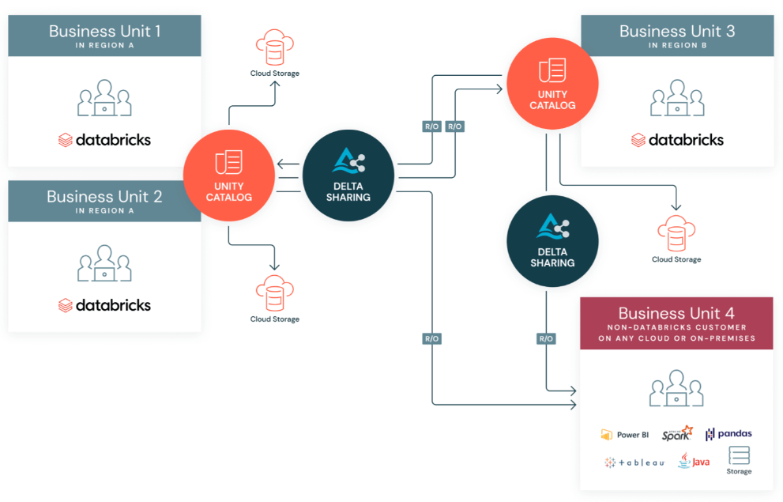
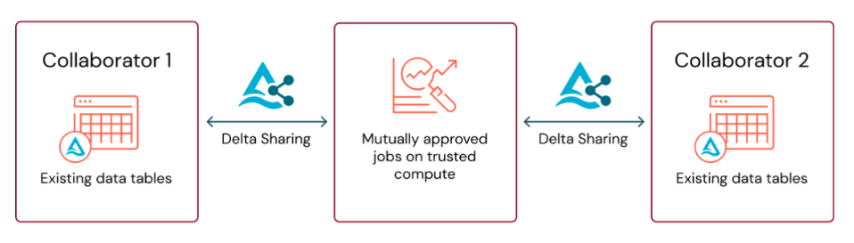

Imagine um mundo onde compartilhar dados entre empresas seja tão simples quanto abrir um aplicativo de delivery e pedir sua refeição favorita. No lugar de processos complicados, transferências demoradas e preocupações com segurança, você tem acesso instantâneo a dados confiáveis e atualizados. Esse é o futuro que o Databricks Delta Sharing oferece: um sistema aberto, seguro e eficiente para compartilhar dados entre organizações e plataformas, sem dores de cabeça.

### O que é o Databricks Delta Sharing?

O Databricks Delta Sharing funciona como um grande restaurante buffet de dados. Em vez de cada usuário precisar cozinhar seus próprios pratos (ou seja, copiar e replicar dados), eles podem simplesmente pegar o que precisam da estação de self-service, sem desperdício e com qualidade garantida. E o melhor: sem filas intermináveis ou pratos misteriosos!

Construído sobre a arquitetura Delta Lake, ele permite que organizações compartilhem dados governados de seus Lakehouses com qualquer consumidor, independentemente de estar ou não na plataforma Databricks. Esse protocolo aberto garante que os destinatários possam acessar os dados compartilhados por meio de ferramentas como Python, R, SQL e plataformas de BI, promovendo interoperabilidade e eficiência.

\_Databricks Delta Sharing\_

E agora que você já entendeu o conceito do Delta Sharing, vamos explorar como ele pode transformar a forma como sua empresa compartilha informações.

### Por que minha empresa deveria adotar o Delta Sharing?

Muitas empresas enfrentam dificuldades para compartilhar dados de forma segura e eficiente. Processos antigos exigem replicação excessiva, altos custos operacionais e riscos de segurança. O Delta Sharing resolve esses problemas, trazendo:

✅ Redução de custos: Sem necessidade de replicação de dados ou transferência manual.

✅ Acesso seguro: Governança centralizada e controle detalhado sobre quem acessa os dados.

✅ Interoperabilidade: Funciona com diversas ferramentas e linguagens, sem amarras a um único fornecedor.

✅ Atualizações em tempo real: Dados sempre atualizados, sem pipelines ETL desnecessários.

✅ Facilidade de integração: Dados acessíveis diretamente por consumidores em seus próprios ambientes de trabalho.

Agora que sabemos os benefícios, vamos entender os diferentes tipos de compartilhamento disponíveis.

### Tipos de Compartilhamento no Delta Sharing

Assim como um restaurante buffet oferece diferentes tipos de pratos para atender a diversos gostos e restrições alimentares, o Delta Sharing proporciona três maneiras distintas de compartilhar dados, dependendo das necessidades da sua empresa:

- **Protocolo Databricks-to-Databricks:** Compartilhe dados e ativos de IA entre workspaces Databricks, com governança integrada no Unity Catalog.
- **Protocolo de Compartilhamento Aberto:** Permite que qualquer consumidor, mesmo sem Databricks, acesse dados compartilhados via APIs abertas.
- **Implementação de Código Aberto:** Compartilhe dados entre qualquer plataforma, sem depender do Databricks.

Independentemente do método escolhido, garantir que os destinatários tenham acesso eficiente e seguro é essencial.

### O que é um Recipient?

No Delta Sharing, o Recipient (destinatário) é como um cliente de um buffet, que pode acessar os pratos disponíveis (dados) conforme sua necessidade, sem precisar cozinhar do zero. O Recipient pode ser um parceiro comercial, um cliente ou uma equipe interna. Os Recipients não precisam estar no Databricks, pois o Delta Sharing suporta acesso a partir de ferramentas populares como Python, SQL, Pandas, Apache Spark, Power BI e muitas outras.

Cada Recipient recebe um token de acesso seguro ou um arquivo de credenciais, garantindo que apenas usuários autorizados consigam acessar os dados.

Agora que você já sabe como os dados são acessados, vamos ver como configurar o Delta Sharing na sua empresa.

### Como Configurar o Delta Sharing na sua Conta

Antes de começar a compartilhar ou consumir dados pelo Delta Sharing, sua empresa precisa configurar o Databricks Unity Catalog, garantindo governança e segurança total sobre os dados. A configuração inclui:

- **Habilitar o Unity Catalog** no seu workspace Databricks.
- **Definir Políticas de Acesso**, configurando regras de segurança para controle granular.
- **Ativar Logs de Auditoria** para rastrear acessos e compartilhamentos de dados.
- **Registrar os Recipients**, garantindo que apenas usuários autorizados recebam permissões de acesso.

Agora que sua conta está configurada, vamos ver como criar e compartilhar dados de maneira prática.

### Clean Rooms: Compartilhamento Seguro e Colaborativo de Dados

Uma abordagem avançada dentro do Delta Sharing é o conceito de Clean Rooms, um ambiente seguro que permite que diferentes empresas colaborem em análises de dados sem compartilhar diretamente suas informações brutas. Isso é especialmente útil para setores como saúde, finanças e varejo, onde a privacidade dos dados é uma prioridade.

Com os Clean Rooms, as empresas podem definir regras que permitem que os parceiros analisem dados agregados e anonimizados, garantindo conformidade com regulamentações como GDPR e LGPD. Essa funcionalidade permite que múltiplos parceiros extraiam insights de um mesmo conjunto de dados sem comprometer a segurança.

### Empresas que já utilizam o Delta Sharing

Diversas empresas globais já adotaram o Delta Sharing para melhorar a eficiência e segurança no compartilhamento de dados:

- **Shell**: Utiliza o Delta Sharing para compartilhar insights operacionais com parceiros do setor de energia, garantindo colaboração eficiente.
- **HSBC**: Implementou o Delta Sharing para otimizar processos de compliance e análise de risco financeiro.
- **Adobe**: Aproveita a plataforma para compartilhar dados de marketing e engajamento de clientes com parceiros estratégicos.
- **Nasdaq**: Utiliza o Delta Sharing para fornecer acesso seguro a dados de mercado e relatórios analíticos para investidores e reguladores.

### Custos do Delta Sharing

Embora o Delta Sharing elimine a necessidade de replicação de dados, ele pode gerar custos relacionados à transferência de dados entre diferentes regiões e plataformas. Os custos podem incluir:

- **Saída de dados (egress fees):** Quando dados são compartilhados entre regiões na nuvem, pode haver cobrança pela transferência.
- **Processamento de consultas:** Dependendo da infraestrutura utilizada, há custos associados à execução de consultas nos dados compartilhados.
- **Gerenciamento de permissões e logs:** O Unity Catalog permite rastrear acessos e gerenciar permissões, o que pode impactar os custos de uso.

### Exemplo de Cálculo de Custos

Vamos considerar um exemplo prático para estimar os custos do Delta Sharing:

Volume de dados compartilhados: **10 TB por mês**

Custo de saída de dados (egress fees): **$0.09 por GB**

Custo de processamento de consultas: **$0.02 por consulta** (considerando 100.000 consultas)

Custo de gerenciamento de logs: **$0.005 por operação de log** (considerando 500.000 operações)

Cálculo total:

- Custo de saída de dados: **$921.60**
- Custo de processamento: **$2,000.00**
- Custo de gerenciamento de logs: **$2,500.00**
- Custo total mensal estimado: **$5,421.60**

Empresas que compartilham grandes volumes de dados devem considerar estratégias para otimizar esses custos, como armazenamento em regiões próximas aos consumidores ou utilização de compressão de dados.

### Conclusão: O Delta Sharing é o Futuro do Compartilhamento de Dados

Com o Databricks Delta Sharing, sua empresa pode finalmente deixar para trás os processos manuais, demorados e inseguros de compartilhamento de dados. Essa mudança não só aumenta a eficiência operacional, mas também possibilita uma cultura de colaboração mais fluida e confiável, permitindo que diferentes equipes e parceiros acessem informações cruciais de maneira instantânea e segura.

Além disso, a adoção do Delta Sharing proporciona uma base sólida para futuras inovações. Com dados acessíveis em tempo real e governança robusta, as organizações podem acelerar suas iniciativas de inteligência artificial e analytics, gerando insights mais precisos e estratégicos. Isso permite que as empresas tomem decisões informadas com rapidez, respondendo de forma ágil às mudanças do mercado.

💡 Se sua empresa deseja colaborar de forma eficiente, reduzir custos e impulsionar a inovação, está na hora de adotar o Delta Sharing! 🚀 Em vez de depender de transferências, cópias e replicações, os dados ficam acessíveis onde e quando forem necessários, com total controle e segurança.
