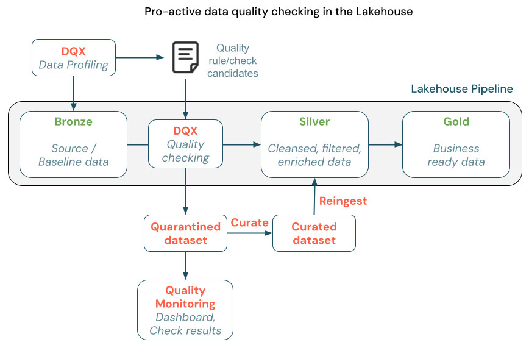
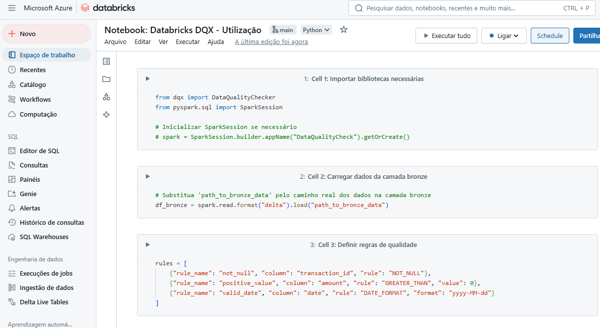

Nos dias de hoje, a tomada de decisão baseada em dados é o coração das empresas. Entretanto, a eficácia dessas decisões depende diretamente da qualidade dos dados utilizados. Dados inconsistentes, incompletos ou incorretos podem comprometer análises, gerar insights equivocados e, no pior dos cenários, levar a decisões desastrosas.

Aqui é onde entra o **Databricks DQX**: uma biblioteca desenvolvida para garantir a qualidade dos dados em pipelines criados no
[Databricks](https://www.linkedin.com/company/databricks?trk=article-ssr-frontend-pulse_little-mention)
, usando regras personalizadas e automáticas para validar, monitorar e corrigir problemas de qualidade antes que eles contaminem camadas mais sensíveis. Se imaginarmos o pipeline de dados como um multiverso de dimensões paralelas que precisa ser protegido contra anomalias, o **DQX é como o Doutor Estranho**, usando suas habilidades para manter a ordem e garantir que apenas dados de qualidade avancem pelas dimensões corretas.

### O que é o Databricks DQX?

O Databricks DQX é uma ferramenta de gerenciamento de qualidade de dados projetada para ser utilizada em pipelines do Databricks que fazem uso do Apache Spark. Ele permite definir regras de validação para DataFrames e streams, proporcionando uma abordagem programática para verificar a integridade, completude e consistência dos dados.

O DQX suporta diferentes tipos de regras, como validação de formato de campos, valores nulos, valores duplicados e muito mais. Essas regras podem ser configuradas para gerar alertas ou bloquear completamente a propagação de dados inválidos. Além disso, ele oferece relatórios detalhados e logs que ajudam as equipes a entenderem e corrigirem problemas rapidamente.

---

### Por que a Qualidade de Dados é Crítica em Projetos Analytics?

Em um projeto de dados, as camadas de um Data Lake são divididas geralmente em **bronze**, **silver** e **gold**:

- **Camada Bronze**: Onde os dados crus são armazenados sem qualquer processamento ou validação.
- **Camada Silver**: Onde os dados passam por um processo de limpeza e padronização.
- **Camada Gold**: Onde os dados já estruturados e de alta qualidade são consumidos por ferramentas de BI e modelos analíticos.

Se dados inválidos passam da camada **bronze** para a **silver**, eles podem contaminar toda a cadeia de valor, prejudicando a eficiência das análises subsequentes e comprometendo o desempenho de modelos de machine learning. Dados de baixa qualidade podem introduzir viés, gerar predições imprecisas e levar a decisões equivocadas. Isso torna essencial a adoção de boas práticas de validação e limpeza logo nas etapas iniciais do pipeline., eles podem contaminar toda a cadeia, gerando problemas sérios mais adiante. Portanto, aplicar regras rigorosas de qualidade entre essas camadas é fundamental. Quanto mais cedo os problemas de qualidade forem identificados e corrigidos, menor será o custo de retrabalho, evitando que erros se propaguem para as camadas mais valiosas, como a camada gold. Isso também melhora a eficiência dos processos analíticos, garantindo que as decisões sejam sempre baseadas em dados consistentes e confiáveis.

---

### Como Utilizar o DQX entre as Camadas Bronze e Silver

A imagem abaixo ilustra como o DQX se encaixa no pipeline de dados em um Data Lakehouse. O processo começa com a camada **bronze**, onde os dados crus são armazenados. O DQX realiza um processo de *data profiling*, analisando os dados e gerando candidatos a regras de qualidade. Em seguida, as regras de qualidade são aplicadas, separando os dados válidos dos inválidos. Dados que falham na validação são enviados para um *dataset* de quarentena, onde podem ser monitorados e revisados. Dados corrigidos ou enriquecidos podem ser reintegrados ao pipeline após a curadoria, garantindo que apenas informações consistentes avancem para a camada **silver**. Na camada **gold**, os dados já estão prontos para consumo por ferramentas de BI e modelos analíticos.



\_DQX Quality Checking\_

Vamos imaginar que estamos lidando com dados financeiros. Na camada **bronze**, temos registros de transações bancárias, e precisamos garantir que apenas transações válidas avancem para a camada **silver**.

Vamos imaginar que estamos lidando com dados financeiros. Na camada **bronze**, temos registros de transações bancárias, e precisamos garantir que apenas transações válidas avancem para a camada **silver**.

O primeiro passo é definir as **regras de qualidade** que queremos aplicar. Algumas regras comuns podem incluir:

- Campos obrigatórios não podem estar nulos.
- O valor da transação deve ser positivo.
- O formato da data deve ser consistente.

Com o DQX, você pode criar regras como esta:



\_Exemplo de notebook utilizando DQX\_

Esse processo garante que apenas os registros que atendem a todas as regras serão promovidos para a camada **silver**. Os dados inválidos podem ser armazenados separadamente para auditoria e correção.

[Confira o notebook completo aqui!](https://github.com/julianamarialop/databricks-solutions/blob/main/Notebook%3A%20Databricks%20DQX%20-%20Utiliza%C3%A7%C3%A3o.py)

---

### Como Instalar e Configurar o Databricks DQX

A instalação do DQX é simples e pode ser feita diretamente com o pip:

```
pip install databricks-labs-dqx        
```

Depois de instalado, você pode importar a biblioteca e começar a definir suas regras de qualidade, como mostrado no exemplo anterior.

Para mais detalhes, você pode consultar a [documentação oficial no GitHub](https://github.com/databrickslabs/dqx).

---

### Conclusão

O **Databricks DQX** é muito mais do que uma simples ferramenta de validação de dados – ele é o verdadeiro **mestre da qualidade**, garantindo que apenas dados consistentes avancem pelas camadas do Data Lake. Assim como o Doutor Estranho protege o multiverso de ameaças interdimensionais, o DQX protege o pipeline de dados, impedindo que informações incorretas contaminem suas análises.

Se você deseja construir pipelines robustos e garantir que suas decisões sejam sempre baseadas em dados de alta qualidade, o DQX é a solução ideal. Afinal, como diria o Doutor Estranho: **“Esta linha de dados está protegida” – apenas dados de qualidade podem atravessar.**

###
