Dando continuidade ao artigo anterior, ["Databricks Lakehouse Federation: Uma Alternativa ao ETL Zero?"](https://www.linkedin.com/pulse/databricks-lakehouse-federation-uma-alternativa-ao-etl-lopes-wp5nf/?trackingId=Gr1S%2BWkrQb27H8jgUmKo8Q%3D%3D), vamos explorar alguns exemplos práticos para a combinação de dados em diferentes origens.

Antes de iniciarmos a criação do ambiente, vamos identificar e citar 2 componentes principais:

- **Connection** (Conexão): Uma conexão com o banco de dados, utilizando um usuário e senha ou service account
- **Foreign Catalog** (Catalogo Estrangeiro): Um catálogo no Unity Catalog que aponta para o banco de dados de origem, ele conterá todos os schemas e tabelas da sua origem

O nosso ambiente será composto por 4 conexões diferentes, na mesma query **SQL** cruzaremos informações de diversas fontes de dados em tempo real.

Para criar as conexões, vá à aba de "gestão de conexões" no seu ambiente.

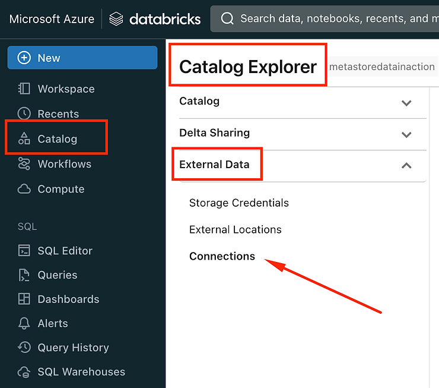

Para exemplificar esse artigo, as conexões já estão criadas, porém para criar uma nova, basta clicar em **Create Connection**:

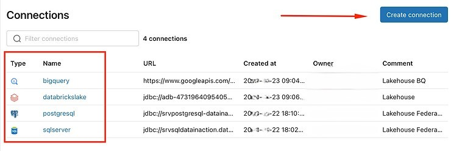

De um nome para sua conexão e escolha entre as fontes de dados disponíveis:

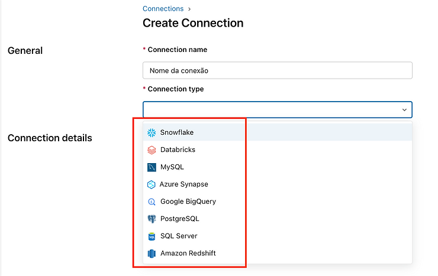

Cada tipo de conexão tem suas particularidades, então se atente as configurações de cada ambiente.

Após criado a conexão, criaremos o **foreign catalog**, basta ir na tela inicial de catálogos e clicar em **Create catalog**.

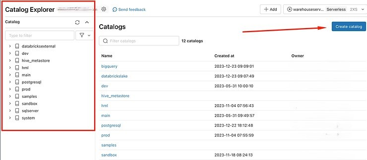

Na criação selecione o tipo Foreign, irá aparecer uma lista com as suas conexões já criadas, importante o campo **Database** precisa ser o mesmo nome do seu Database na origem.

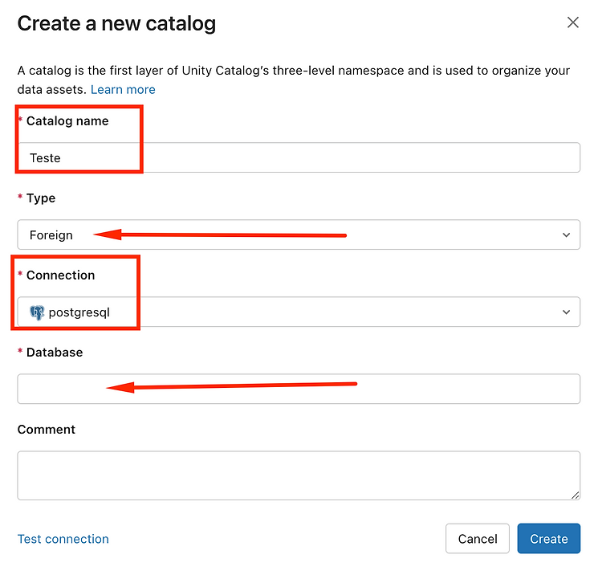

Após a criação, você pode explorar o seu catálogo e visualizar as tabelas na origem como se estivessem dentro do ambiente do Databricks. No entanto, é importante lembrar que qualquer consulta realizada contra essas tabelas será enviada para as origens em tempo real. Portanto, é crucial tomar cuidado para não sobrecarregar as suas fontes de dados.

É importante observar que durante a navegação no catálogo, cada tipo de origem possui uma estrutura de navegação específica. No caso do PostgreSQL, por exemplo, temos a navegação por esquemas (schemas). Após selecionar os esquemas desejados, é possível visualizar as tabelas disponíveis.

A seguir, apresentamos as tabelas do nosso exemplo.

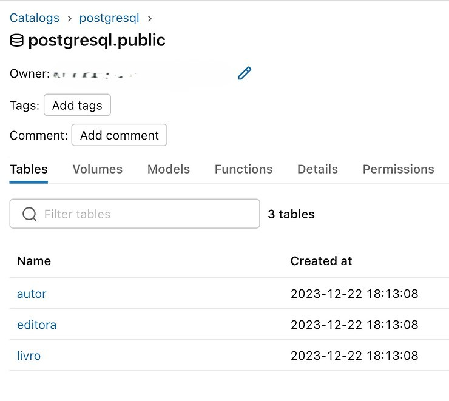

Vejamos o mesmo no SQL Server, Bigquery e Databricks.

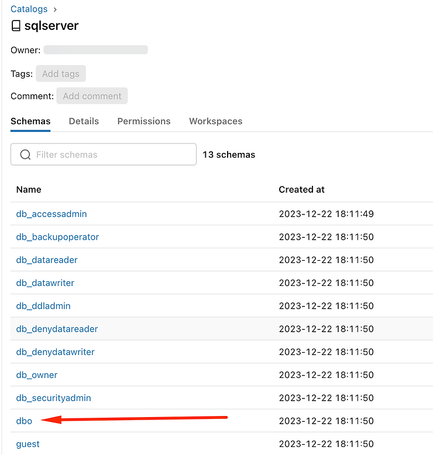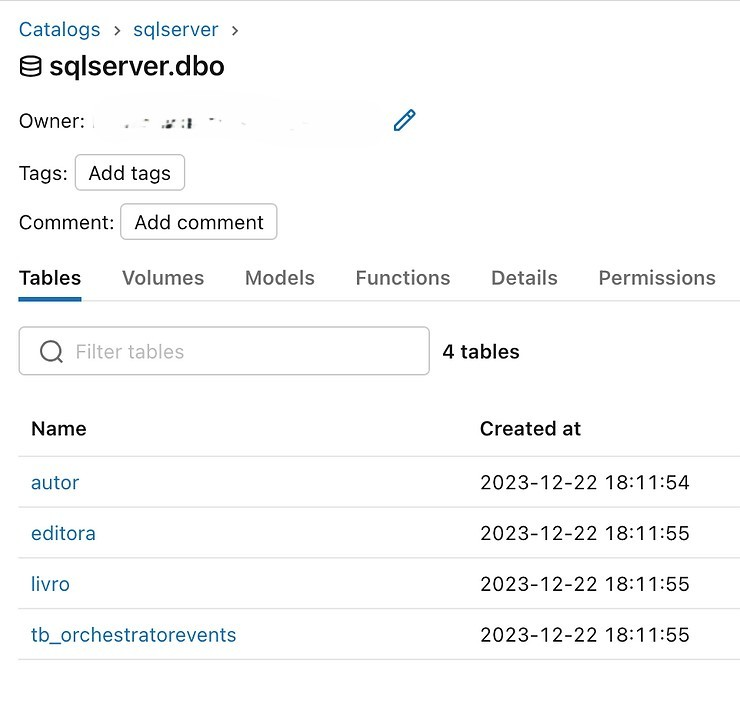

Bigquery: Lista de Datasets

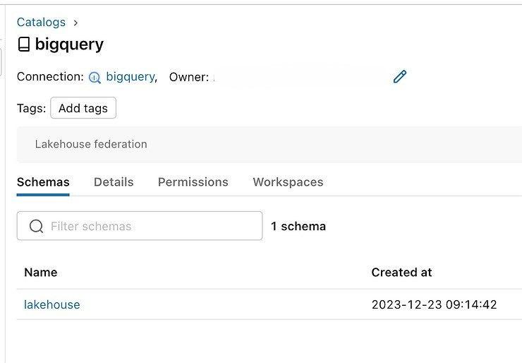

Bigquery tabelas:

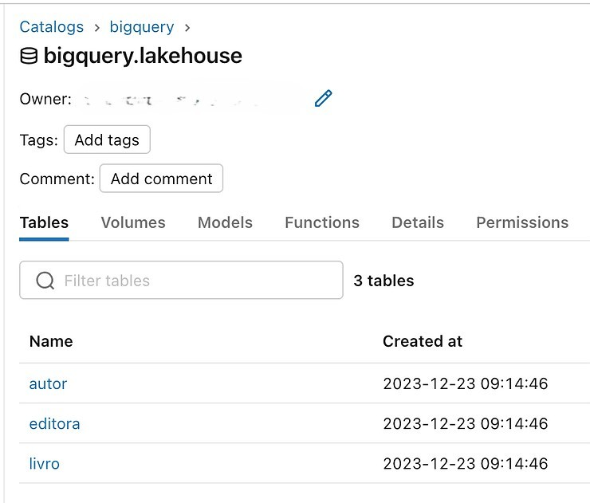

Databricks: Apontando para workspaces externos (isso é diferente de Delta Sharing)

Note que aqui vejo todos os **schemas** dentro desse catalogo referenciado na conexão.

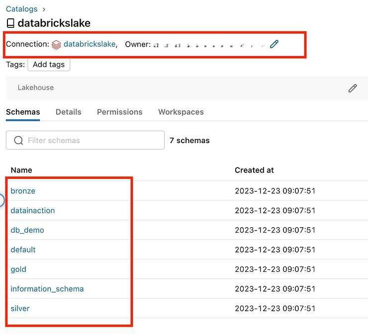

Databricks tabelas:

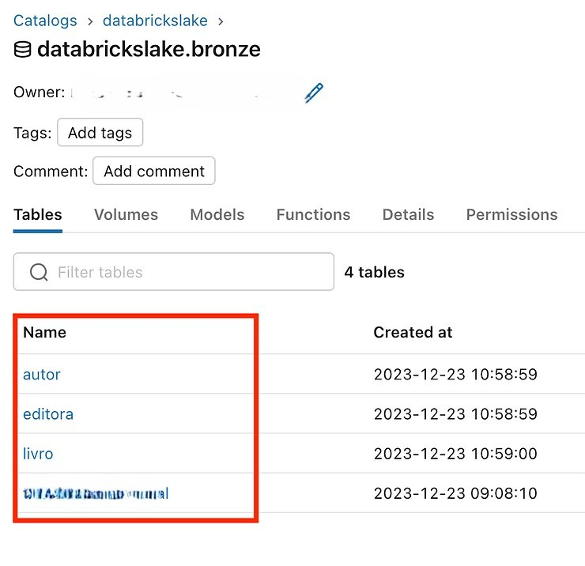

Exploramos até o momento quatro fontes de dados distintas, todas contendo três tabelas em comum: Autor, Editora e Livro. Agora, iremos realizar algumas consultas que cruzam informações dessas fontes.

Em um exemplo simples, consultei a tabela "Livro" em todas as quatro origens sem a necessidade de replicar dados entre elas. Não foi preciso aplicar regras de transformação ou implementar CDC para refletir alterações originadas nas fontes de dados.

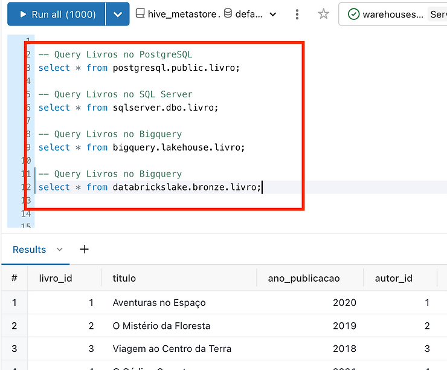

**Agora cruzaremos as 4 fontes na mesma query:**

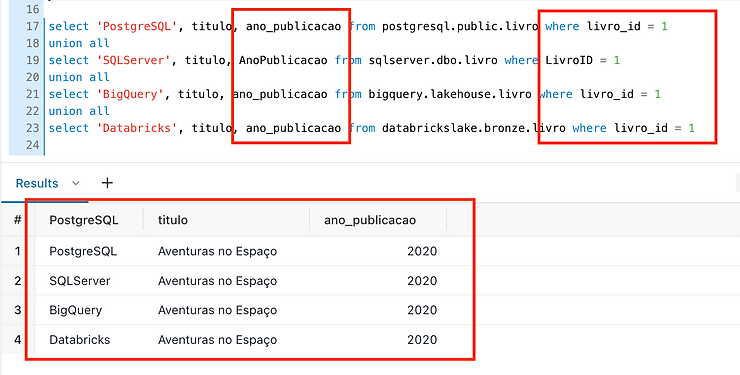

Na mesma consulta, estamos consultando diferentes origens, cada uma com seus próprios esquemas, sem a necessidade de replicar qualquer dado para o nosso repositório central (Lake), evitando assim todas as complexidades associadas ao ETL, CDC, SCD, entre outros processos.

E quanto aos JOINs, funcionam? Imaginemos, por exemplo, a comparação de todos os livros para verificar se os títulos estão consistentes em todas as origens.

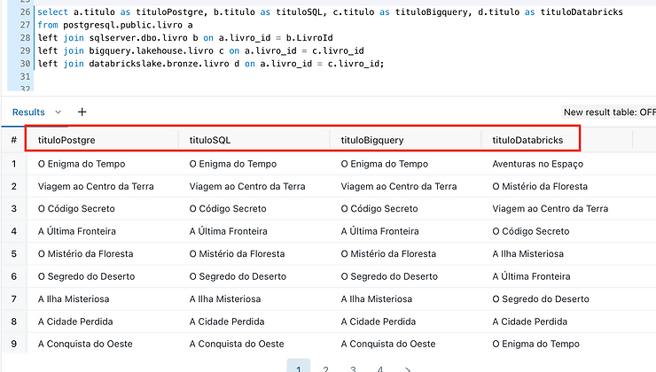

É claro que cada caso é único, e generalizações não são recomendadas. É fundamental estudar suas necessidades específicas e analisar se o conceito de Zero ETL é adequado para o seu cenário. Sempre leve em consideração as particularidades das suas fontes de dados, como consultar uma réplica para não sobrecarregar o ambiente produtivo, entre outros pontos importantes.

É importante notar que o uso excessivo de JOINs pode impactar negativamente o desempenho e prejudicar a capacidade de realizar Pushdowns. Portanto, recomenda-se utilizar JOINs com moderação e considerar alternativas quando possível.

**Resumo**

O recurso de federação Lakehouse do Databricks apresenta aplicabilidade em casos de uso como os seguintes:

1. Quando não se deseja realizar a ingestão de dados no ambiente do Databricks.
2. Quando se pretende que as consultas tirem proveito do processamento de computação realizado no sistema de banco de dados externo.
3. Quando se busca utilizar os benefícios de governança de dados oferecidos pelo Unity Catalog, tais como controle de acesso granular, linhagem de dados e capacidade de pesquisa, centralizando essas funcionalidades em um único local, ao mesmo tempo em que se economiza em armazenamento e processamento.

Conforme destacado anteriormente nas análises de pontos fortes e fracos, embora haja economia de armazenamento (evitando duplicação de dados entre a origem e o Lakehouse) e de processamento de clusters (delegando o processamento pesado para a origem), é imprescindível examinar cada caso de uso individualmente. É fundamental considerar a possibilidade de não sobrecarregar as fontes de dados com consultas frequentes e intensivas, que podem não ser otimizadas devido às limitações de pushdown.

Estou atualmente testando a federação Lakehouse em um cenário de validação de indicadores. Por exemplo, todo o processo de ETL/ELT é realizado para o Lakehouse, com suas respectivas modelagens e transformações. Para verificar a integridade dos dados em comparação com a origem, estou utilizando a federação Lakehouse para consultar a origem de forma pontual e validar a concordância dos dados.

Essa abordagem tem se mostrado bastante útil e eficiente para esses cenários, inclusive para a exploração de dados antes de iniciar os processos de ELT para o Lakehouse.

Para saber mais, recomenda-se a leitura detalhada de toda a documentação disponível e realizar testes extensivos. É fundamental compreender o caso de uso específico e avaliar se a federação Lakehouse é adequada para o seu cenário particular.

Referências

<https://learn.microsoft.com/en-us/azure/databricks/query-federation/>
