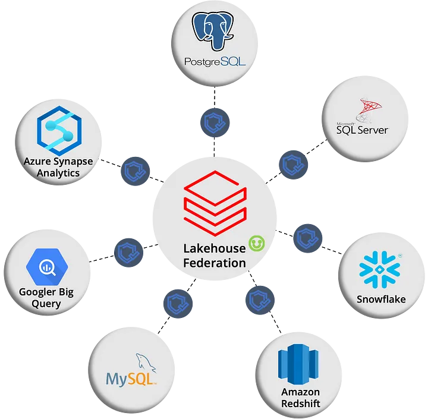

Lançada em Dezembro de 2023, a funcionalidade de Federação Lakehouse está atualmente em Prévia Pública, mas possui um enorme potencial. No artigo de hoje, explorarei algumas visões interessantes, como a capacidade de cruzar informações entre Databricks, BigQuery, SQL Server e PostgreSQL em uma única consulta SQL.

### O que é um lakehouse federation?

Databricks **lakehouse federation** é uma feature de federação de consultas que permite aos usuários e sistemas executar consultas contra várias fontes de dados sem a necessidade de migrar todos os dados para um sistema unificado.

Aqui você elimina a necessidade de criar ETLs complexos, aplicar CDC, SCD, entre outras técnicas, e ainda correr o risco dos dados ficarem diferentes da origem, isso pode ser muito útil para vários cenários.

Podemos traduzir **federation** ou federação na tradução literal como uma forma de democratizar o acesso dos dados de diversas fontes utilizando uma única plataforma, delegando o trabalho de processamento para as origens, nesse contexto a federação de proporciona a possibilidade de agilizar a exploração de dados, evitar duplicação de storage entre outros benefícios.

\_Federação de Dados\_

### Como funciona?

A Federação de Lakehouse do Databricks utiliza o Unity Catalog para gerenciar consultas distribuídas. Para utilizar a Federação de Lakehouse do Databricks, é necessário configurar conexões de leitura utilizando os drivers incluídos nativamente nos Clusters, tais como Pro SQL Warehouses, Serverless SQL Warehouses e Databricks Runtime >=13.1. As fontes de dados atualmente suportadas incluem:

- MySQL
- PostgreSQL
- Amazon RedShift
- Snowflake
- SQL Server
- Azure Synapse
- Google BigQuery
- Databricks (com outros workspaces)

Em essência, o Databricks envia consultas para execução nos bancos de dados de origem utilizando drivers nativos como o JDBC e retorna os dados resultantes para o Databricks em tempo real.

### Vantagens e Desvantagens

**Agilidade:** Permite a execução de consultas em dados provenientes de diversas fontes (citadas acima) sem a necessidade de migrá-los, o que pode economizar tempo e recursos.

**Escalabilidade:** Pode ser utilizado para conectar-se a fontes de dados de qualquer tamanho, permitindo que o processamento seja delegado à origem.

**Governança:** Utiliza o Unity Catalog para gerenciar a governança de dados, garantindo a segurança e a confiabilidade dos seus dados.

**Desempenho potencialmente inferior aos métodos tradicionais de ETL**, devido à ausência de movimentação dos dados para um sistema unificado. Isso pode resultar em latência de rede e possíveis problemas de desempenho, já que nem todos os filtros e funções podem ser enviados para a origem, conhecido como "pushdowns".

Ao direcionar consultas para ambientes OLTP de produção, **há o risco de sobrecarregar o desempenho das origens**, ao contrário de ETLs mais pontuais ou o uso de CDC para a coleta de dados.

### Limitações

É importante estar ciente das limitações ao utilizar a Federação Lakehouse:

- Conexões somente de leitura: As conexões estabelecidas são estritamente para leitura de dados.
- Pushdowns: Nem todos os tipos de pushdowns são suportados, e essa compatibilidade varia de acordo com a fonte de dados.
- Tipos de dados: É necessário prestar atenção às tabelas de mapeamento entre a origem e o Databricks para garantir a consistência dos tipos de dados.
- Sensibilidade a maiúsculas e minúsculas: O sistema não suporta nomes de objetos com diferenciação entre maiúsculas e minúsculas, resultando na uniformização dos nomes em minúsculas. Isso pode ocasionar problemas dependendo da origem dos dados.
- Limitações específicas de cada origem: Cada fonte de dados pode apresentar limitações distintas que precisam ser consideradas durante a implementação e o uso da Federação Lakehouse.

Nos próximos artigos, iremos abordar o Lakehouse Federation de forma prática!

Referências

<https://learn.microsoft.com/pt-br/azure/databricks/query-federation/>

<https://www.databricks.com/resources/webinar/query-federation-lakehouse>
