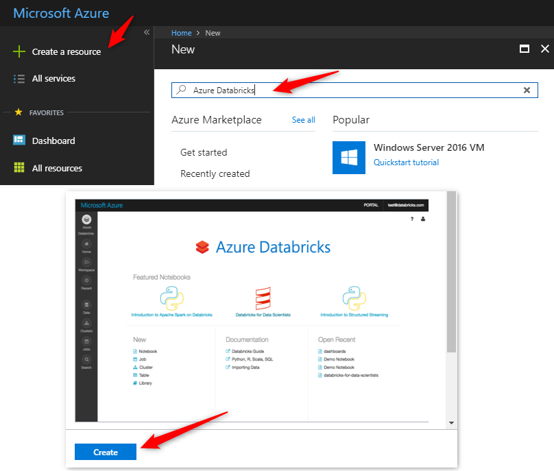
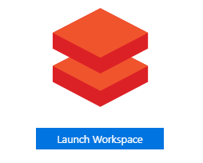
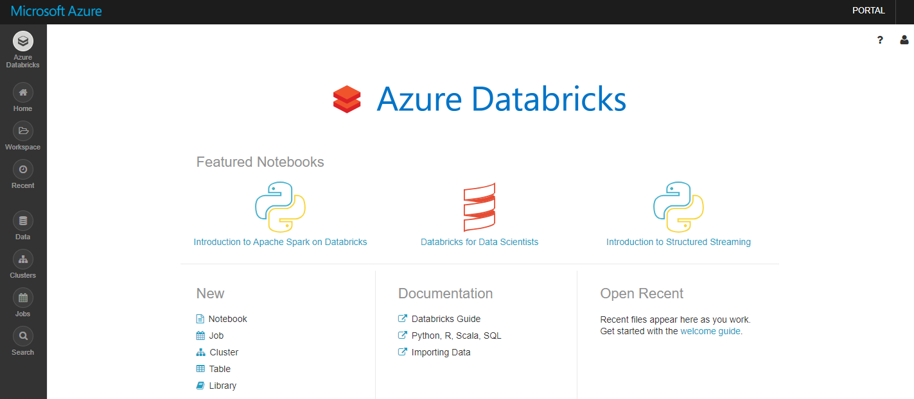
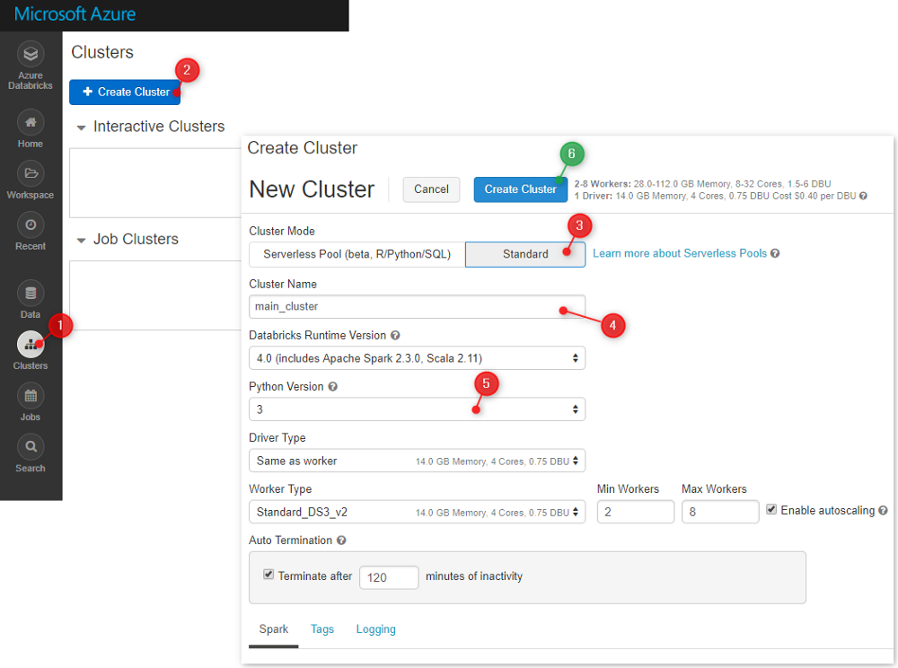
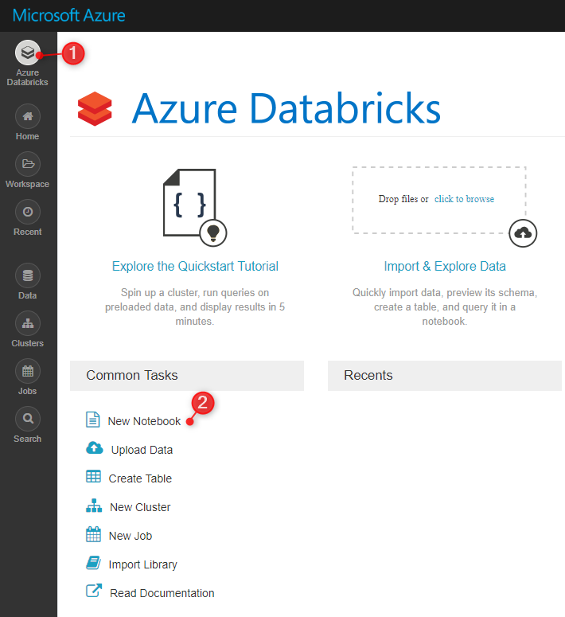
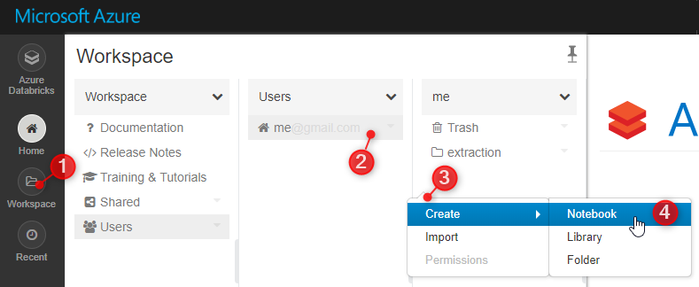
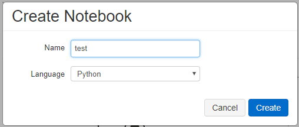
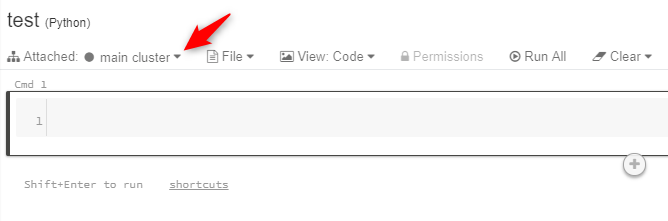
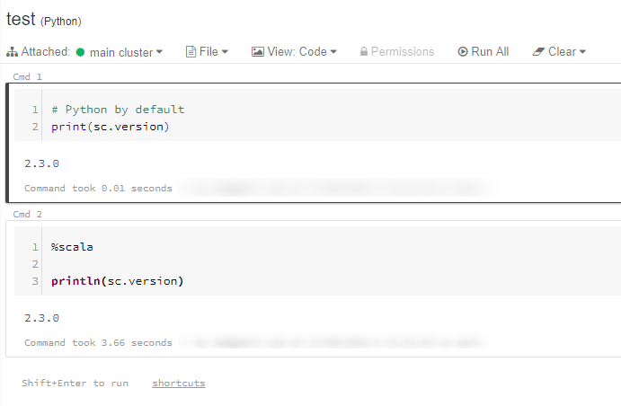
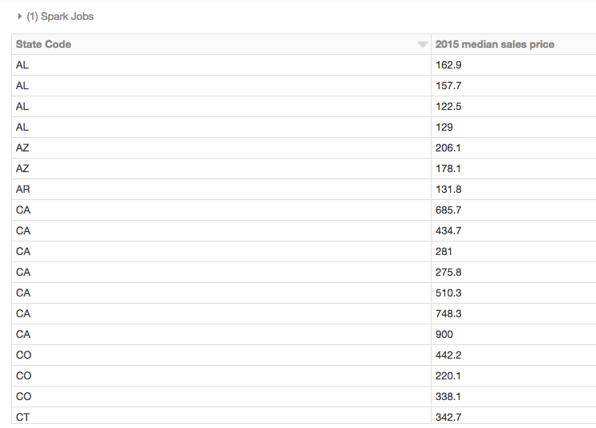

Imagine uma equipe formada por um desenvolvedor SQL, um profissional de Pyhton e um colaborador de Scala. Todos eles trabalham juntos em prol de realizar ingestões de dados no seu Datalake, Datawarehouse um simplesmente em um banco de Dados Relacional fazendo uso de clusters Spark. Não seria ótimo de todos trabalharem em uma plataforma unificada que entenda todas as linguagens de programação no mesmo script ou bloco ? Essa plataforma existe !

O Databricks é uma plataforma de análise baseada no Apache Spark. Projetado com os fundadores do Apache Spark, com o Databricks temos fluxos de trabalho simplificados e um workspace interativo que permite a colaboração entre os cientistas de dados, os engenheiros de dados e os analistas de negócios.

Com suporte para **Python, Scala, R e SQL**, além de bibliotecas e estruturas de aprendizado profundo como TensorFlow, Pytorch e Scikit-learn ao utilizarmos o Databricks eliminamos toda a dureza e complexidade para obter um cluster do Spark. Seus notebooks fornecem uma experiência ininterrupta e sem falhas de gerenciamento graças à integração com o principal provedor de nuvem, incluindo o Amazon AWS e o Microsoft Azure.

Neste tutorial explicaremos as principais etapas para iniciar o Databricks no ambiente Azure. A primeira parte será relativa à configuração e inicialização do ambiente. A segunda parte serão as etapas colocaremos um notebook em funcionamento. A última parte lhe dará algumas consultas básicas para verificar se tudo está funcionando corretamente.

### Como criar seu primeiro cluster

Crie uma assinatura no portal.azure.com. Em "Create a resource" busque pelo termo "Databricks"



Em seguida, execute a "Workspace" criada.



Agora você está no Espaço de Trabalho do Databricks



O próximo passo é criar um cluster que irá executar o código fonte presente em seus notebooks.



Você pode ajustar o tamanho do cluster de acordo com o preço que deseja pagar. Observe que o cluster será desligado automaticamente após um período de inatividade.

A criação do cluster pode levar vários minutos. Enquanto isso, podemos criar nosso primeiro notebook e anexá-lo a esse cluster.

### E agora? Python, Scala ou SQL ? Qual usar no meu notebook..

Esta é a principal questão que todo novo desenvolvedor questiona. Se você estiver familiarizado com o Python (Python é a linguagem preferida dos engenheiros de dados), pode se ater ao Python, já que pode fazer quase tudo como ele.

No entanto, o Scala é o idioma nativo do Spark. Como o próprio Spark é escrito no Scala, você encontrará 80% dos exemplos, bibliotecas e discussões no StackOverflow em Scala.

A boa notícia é que você não precisa escolher no bloco de notas do Databricks, pois é possível misturar os dois idiomas para simplificar o desenvolvimento com o Python.

A biblioteca Python para lidar com o Spark é denominada PySpark.

### Criando seu primeiro notebook..

Na página inicial da workspace, clique em "New Notebook"



Você também pode criar seu notebook em uma pasta específica



Selecione a linguagem padrão para o seu notebook. No caso aqui do exemplo irei utilizar o Python



Após o notebook criado, vamos anexar o cluster para executar o código.



Digite algum código Python ou Scala. Para o Scala, você precisa adicionar o "%scala" na primeira linha, já que o idioma padrão que escolhemos é o Python:



- Para executar o código, você pode usar o atalho CTRL + ENTER ou SHIFT + ENTER. Se o cluster não estiver em execução, um prompt solicitará que você confirme sua inicialização.

Agora estamos prontos para a próxima etapa: **a ingestão de dados**. No exemplo abaixo realizamos a busca do arquivo CSV e posteriormente a leitura com "spark.read.csv"

```
%python
# Use the Spark CSV datasource with options specifying:
# - First line of file is a header
# - Automatically infer the schema of the data
data = spark.read.csv("/databricks-datasets/samples/population-vs-price/data_geo.csv", header="true", inferSchema="true")
data.cache() # Cache data for faster reuse
data ​= data.dropna() # drop rows with missing values
```

**Tá bom, entendi.. Mas eu sou Desenvolvedor SQL e não sei Python..** Não tem problema, podemos realizar a mesma tarefa com comandos SQL.. Vamos criar a tabela "data\_geo"..

```
%python
# Register table so it is accessible via SQL Context
```
```
data.createOrReplaceTempView("data_geo")
```

E agora vamos a query

```
%sql
select `State Code`, `2015 median sales price` from data_geo
```



Como podemos verificar, há diversas formas de desenvolvimento no Databricks e que torna uma plataforma muito interessante. Outra vantagem é com relação ao preço que é muito mais barato que as ferramentas tradicionais como o Integration Services na Nuvem por exemplo..

No próximo artigo, irei focar nas funções **SQL do Databricks e no Databricks Delta.**

Espero ter contribuído com essa pequena explicação.. Obrigada !
