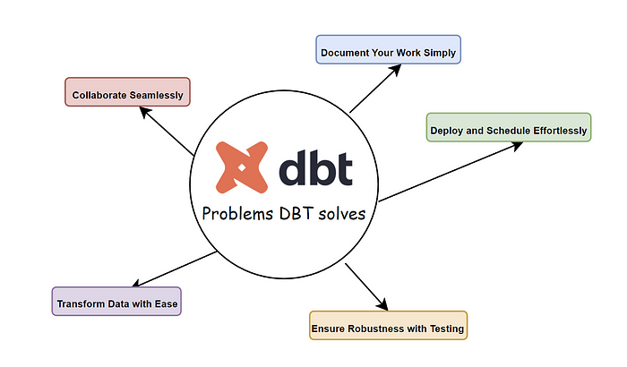

Imagine que seus dados são como alguém sedentário que decidiu entrar em forma. O DBT (Data Build Tool) é o personal trainer que pega esses dados, cria um plano de treino adequado (transformações SQL) e os leva a um novo nível de performance. Em vez de simplesmente carregar pesos aleatórios (ETL tradicional), o DBT adota um método mais eficiente: ele faz os exercícios certos na ordem correta (ELT), garantindo que os dados fiquem enxutos e bem definidos dentro do data warehouse.

Com o DBT, analistas e engenheiros de dados podem escrever consultas SQL para modelar e transformar dados sem precisar se preocupar com a infraestrutura subjacente. Além disso, ele oferece funcionalidades como versionamento de código, documentação automatizada e testes de qualidade de dados—afinal, um bom treino precisa de acompanhamento!

### Por que usar o DBT?

O DBT tem ganhado popularidade por diversos motivos:

- **Facilidade de Uso**: Permite que analistas e engenheiros de dados escrevam transformações SQL sem precisar lidar com infraestrutura complexa.
- **Modularidade**: Facilita a criação de pipelines reutilizáveis e bem organizados, como um bom treino dividido em grupos musculares.
- **Versionamento e Controle**: Como o DBT utiliza repositórios Git, é fácil acompanhar mudanças e reverter versões anteriores, assim como um personal trainer ajusta um plano de treino com base no progresso.
- **Testes de Qualidade de Dados**: Inclui funcionalidades para garantir que os dados transformados sejam consistentes e confiáveis—ninguém quer um treino desajustado que cause lesões (erros de dados!).
- **Documentação Automática**: Gera documentação detalhada sobre os modelos criados, como um diário de treino que registra cada evolução.
- **Compatibilidade com Data Warehouses Modernos**: Funciona com BigQuery, Snowflake, Redshift, Databricks, entre outros.

### Como instalar o DBT?

Se preparar para usar o DBT é como se inscrever na academia: um processo simples, mas que exige comprometimento.

### Passo 1: Instalar o DBT

Execute o seguinte comando no terminal:

```
pip install dbt-core
        
```

Caso esteja utilizando um data warehouse específico, instale também o adaptador correspondente. Por exemplo, para Snowflake:

```
pip install dbt-snowflake
        
```

### Passo 2: Configurar o DBT

Após a instalação, inicialize um novo projeto DBT:

```
dbt init meu_projeto
        
```

Isso criará a estrutura básica de diretórios e arquivos necessários para começar a usar o DBT.

### Passo 3: Testar a Conexão

Antes de executar modelos, é importante testar a conexão com o data warehouse configurado:

```
dbt debug
        
```

Se tudo estiver correto, o DBT estará pronto para rodar transformações e otimizar seu ambiente de dados!

### Como funciona o DBT?

O DBT funciona como um programa de treino bem estruturado: ele pega os dados brutos (o aluno sedentário), aplica transformações SQL (os exercícios certos) e entrega resultados otimizados (dados prontos para análise).

Os principais componentes do DBT são:

- **Models**: Transformações SQL aplicadas aos dados, como treinos específicos para diferentes grupos musculares.
- **Seeds**: Conjuntos de dados estáticos, como a dieta ajustada pelo personal trainer para apoiar os treinos.
- **Snapshots**: Registros das mudanças ao longo do tempo, como fotos de progresso antes e depois.
- **Tests**: Verificações automáticas para garantir qualidade, como exames de saúde periódicos para garantir que o plano está funcionando.
- **Documentation**: Geração automática de documentação baseada no código dos modelos, como um caderno de treinos que registra cada sessão.

Além disso para transformar workflows de dados, utiliza scripts SQL (.sql) e YAML (.yml).

- **Scripts SQL**: Auxiliam na transformação dos dados de maneira modularizada, utilizando CTEs (Common Table Expressions) para criar processos reutilizáveis e organizados.
- **Scripts YAML**: Permitem definir esquemas, descrições e regras de teste para as colunas, como not\_null, unique, entre outras validações, garantindo a integridade e a qualidade dos dados.

O DBT executa essas transformações de forma eficiente, criando uma estrutura clara e modular dentro do data warehouse.



\_Quais são os problemas que o DBT resolve ?\_

### Como utilizar o DBT? Exemplo prático com um modelo multidimensional e camadas de medalhão

Vamos considerar um exemplo de uma empresa de e-commerce que deseja construir um modelo multidimensional para análise de vendas, seguindo a abordagem de camadas de medalhão (Bronze, Prata e Ouro).

### Passo 1: Criando a Camada Bronze (Dados Brutos)

A camada Bronze recebe os dados diretamente do S3, onde são armazenados em seu formato bruto. Para acessar esses dados no DBT, utilizamos a funcionalidade source, que aponta para o bucket correspondente:

```
version: 2
sources:
  - name: ecommerce
    schema: raw
    tables:
      - name: vendas_raw
        external:
          location: 's3://meu-bucket/raw/vendas/'
          format: 'parquet'
        
```

Com essa configuração, podemos referenciar os dados diretamente no DBT:

```
SELECT * 
FROM {{ source('ecommerce', 'vendas_raw') }};
        
```

A camada Bronze armazena os dados exatamente como foram recebidos, sem transformação:

```
SELECT * 
FROM {{ source('ecommerce', 'vendas_raw') }};
        
```

### Passo 2: Criando a Camada Prata (Transformação e Limpeza)

Aqui aplicamos regras de limpeza, deduplicação e formatação:

```
WITH vendas_limpa AS (
    SELECT 
        pedido_id,
        cliente_id,
        produto_id,
        data_venda,
        quantidade,
        preco_unitario,
        quantidade * preco_unitario AS valor_total
    FROM {{ ref('bronze_vendas') }}
    WHERE data_venda IS NOT NULL
)
SELECT * FROM vendas_limpa;
        
```

### Passo 3: Criando a Camada Ouro (Modelo Final para Análise)

Nesta camada, criamos um modelo otimizado para análise multidimensional:

```
WITH vendas_agrupadas AS (
    SELECT 
        data_venda,
        produto_id,
        SUM(quantidade) AS total_quantidade,
        SUM(valor_total) AS total_vendas
    FROM {{ ref('prata_vendas') }}
    GROUP BY data_venda, produto_id
)
SELECT * FROM vendas_agrupadas;
        
```

### Passo 4: Criando dimensões

Criamos também dimensões auxiliares, como dim\_cliente.sql:

```
SELECT 
    cliente_id,
    nome,
    email,
    cidade,
    estado
FROM {{ ref('prata_clientes') }};
        
```

E dim\_produto.sql:

```
SELECT 
    produto_id,
    nome_produto,
    categoria
FROM {{ ref('prata_produtos') }};
        
```

Essas tabelas funcionam como exercícios específicos para diferentes grupos musculares, ajudando a fortalecer e organizar melhor os dados.

### Passo 5: Criando relacionamentos e análises

Com as tabelas criadas, podemos executar queries no data warehouse relacionando os dados e criando dashboards de análise, como se estivéssemos ajustando o treino para obter o máximo de desempenho nos resultados.

### Como consumir os dados via DBT

Após processar e transformar os dados com o DBT, o próximo passo é consumi-los em ferramentas de visualização e análise, como o Power BI. O Power BI pode se conectar diretamente ao data warehouse onde os modelos do DBT foram criados, permitindo a criação de relatórios interativos e dashboards eficientes.

### Conectando o Power BI ao Data Warehouse

Se o seu DBT estiver configurado em um data warehouse como Snowflake, BigQuery ou Redshift, siga os passos abaixo para consumir os dados no Power BI:

1. **Abrir o Power BI** e selecionar "Obter Dados".
2. Escolher a fonte de dados correspondente ao seu data warehouse (por exemplo, "Amazon Redshift", "Google BigQuery" ou "Snowflake").
3. Inserir as credenciais de acesso ao banco de dados.
4. Selecionar a tabela correspondente ao modelo de dados transformado pelo DBT.
5. Criar medidas e cálculos no Power BI para análises adicionais.
6. Construir gráficos, tabelas e dashboards interativos.

### Exemplo de Consulta no Power BI

Caso seu data warehouse seja o Snowflake, uma consulta SQL simples para carregar dados de vendas no Power BI pode ser:

```
SELECT 
    data_venda, 
    produto_id, 
    total_quantidade, 
    total_vendas 
FROM ouro_vendas;
        
```

Após carregar os dados, você pode usar os recursos do Power BI para criar gráficos de tendências, KPIs de vendas e dashboards dinâmicos que auxiliam na tomada de decisão.

### Como utilizar uma esteira CI/CD para scripts de carga e orquestração com Airflow

Para garantir que as transformações realizadas com DBT sejam executadas de forma confiável e automatizada, podemos utilizar uma esteira CI/CD combinada com o Apache Airflow para orquestrar os pipelines de dados.

### Implementando CI/CD para DBT

O processo de CI/CD (Continuous Integration/Continuous Deployment) para DBT envolve versionamento, testes automatizados e implantação contínua de mudanças nos modelos de dados. Aqui está um fluxo básico:

1. **Versionamento do Código:** O código SQL dos modelos DBT é gerenciado via Git.
2. **Testes Automatizados:** Testes de integridade dos dados são executados automaticamente em cada alteração.
3. **Deploy Automatizado:** Com ferramentas como GitHub Actions, GitLab CI/CD ou Jenkins, o código atualizado é automaticamente implantado no ambiente de produção.
4. **Agendamento e Execução:** O Airflow orquestra a execução dos pipelines de transformação de dados.

### Orquestrando com Airflow

O Apache Airflow é uma ferramenta poderosa para gerenciar e agendar pipelines de dados. Podemos utilizá-lo para orquestrar as camadas de dados (Bronze, Prata e Ouro) de forma eficiente.

Exemplo de um DAG no Airflow para orquestrar as camadas do modelo de medalhão:

```
from airflow import DAG
from airflow.operators.bash import BashOperator
from datetime import datetime

default_args = {
    'owner': 'airflow',
    'depends_on_past': False,
    'start_date': datetime(2024, 1, 1),
    'retries': 1,
}

dag = DAG(
    'dbt_medalhao_pipeline',
    default_args=default_args,
    schedule_interval='@daily',
    catchup=False
)

bronze = BashOperator(
    task_id='bronze_layer',
    bash_command='dbt run --models bronze',
    dag=dag
)

prata = BashOperator(
    task_id='prata_layer',
    bash_command='dbt run --models prata',
    dag=dag
)

ouro = BashOperator(
    task_id='ouro_layer',
    bash_command='dbt run --models ouro',
    dag=dag
)

bronze >> prata >> ouro
        
```

Neste exemplo:

- A camada **Bronze** é carregada primeiro.
- Em seguida, os dados são limpos e transformados na camada **Prata**.
- Por fim, os dados são agregados e modelados para análise na camada **Ouro**.

Essa abordagem garante que os dados sejam processados corretamente e dentro de uma estrutura bem organizada, proporcionando melhor governança e confiabilidade.

### Preço do DBT

O DBT oferece uma versão open-source gratuita, além de uma versão SaaS chamada **DBT Cloud**, que inclui funcionalidades adicionais como interface web, agendamento de jobs e maior suporte empresarial. O custo do DBT Cloud varia conforme o volume de dados e número de usuários, mas geralmente parte de planos gratuitos até valores personalizados para grandes empresas.

### Aplicações práticas do DBT

O DBT é amplamente utilizado por empresas que desejam melhorar seus processos de transformação de dados. Algumas aplicações comuns incluem:

- **Criação de Data Marts**: Construção de modelos de dados otimizados para BI e análise de negócios.
- **Monitoramento de Qualidade de Dados**: Aplicação de testes para garantir a integridade das informações.
- **Auditoria e Rastreabilidade**: Permite versionamento e rastreamento das transformações aplicadas.
- **Automação de Pipelines de Dados**: Facilita a execução de processos repetitivos e escaláveis.

### Como aprender DBT

Se você deseja se aprofundar no DBT e se tornar um especialista, existem várias formas de aprendizado disponíveis.

### Cursos no DBT Learn

A plataforma oficial de aprendizado do DBT, [DBT Learn](https://learn.getdbt.com/catalog), oferece cursos gratuitos e pagos para iniciantes e avançados. Lá, você pode encontrar tutoriais interativos, exercícios práticos e treinamentos guiados para aprender a usar o DBT de maneira eficiente.

### Certificações DBT

Para aqueles que querem comprovar seu conhecimento, o DBT oferece certificações oficiais. Essas certificações validam suas habilidades na construção de modelos de dados, versionamento, testes e automação com DBT. Além de melhorar suas habilidades, a certificação pode ser um diferencial no mercado de trabalho.

Outros recursos incluem a documentação oficial, vídeos no YouTube e blogs técnicos que abordam práticas recomendadas e casos de uso reais.

### Conclusão

O DBT é como um personal trainer para os seus dados: ele garante que cada transformação seja feita corretamente, fortalecendo seu pipeline de dados e entregando insights de qualidade. Se sua empresa busca otimizar a modelagem e análise de dados, o DBT pode ser a escolha ideal para sair do sedentarismo digital!

Além disso, à medida que mais empresas adotam o DBT, a comunidade em torno da ferramenta continua crescendo. Isso significa mais suporte, mais tutoriais e melhores práticas disponíveis para novos usuários, facilitando a adoção e aprimoramento da solução.

Se você ainda não experimentou o DBT, talvez seja a hora de colocá-lo no seu plano de treino de dados. Afinal, ninguém quer um banco de dados fora de forma, cheio de consultas lentas e redundâncias. Chegou a hora de transformar seus dados em verdadeiros atletas da informação! O DBT é como um personal trainer para os seus dados: ele garante que cada transformação seja feita corretamente, fortalecendo seu pipeline de dados e entregando insights de qualidade. Se sua empresa busca otimizar a modelagem e análise de dados, o DBT pode ser a escolha ideal para sair do sedentarismo digital!
