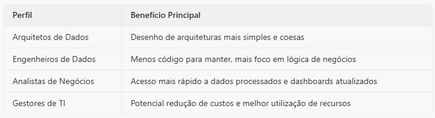
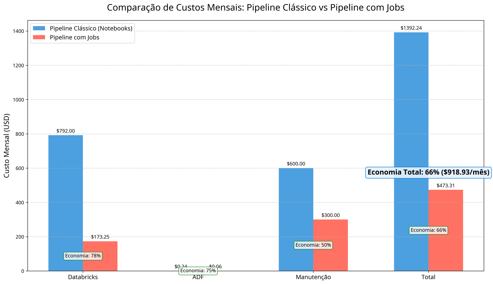
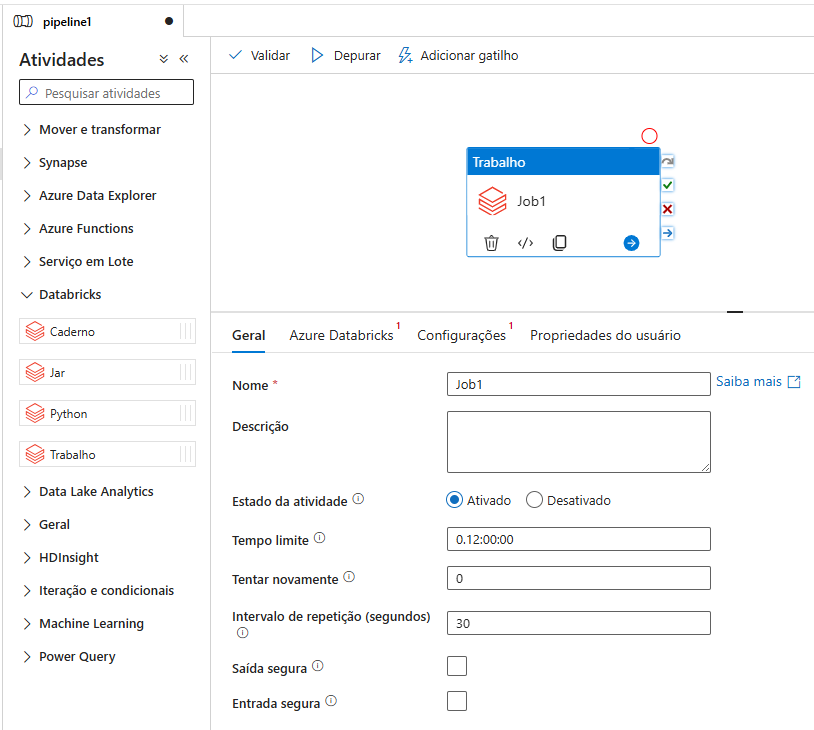

Por anos, engenheiros de dados têm construído pipelines que conectam o **Azure Data Factory (ADF) ao Databricks**, uma combinação poderosa, mas que frequentemente exigia ajustes manuais e configurações complexas. Era como ter um DeLorean que precisava de constantes calibragens no fluxo capacitor antes de cada viagem no tempo – funcional, mas longe do ideal.

A [Microsoft](https://www.linkedin.com/company/microsoft/) acaba de anunciar uma atualização que promete revolucionar essa integração: a nova atividade de [Databricks](https://www.linkedin.com/company/databricks/) Job no ADF. Esta funcionalidade permite orquestrar diretamente qualquer tipo de job do Databricks a partir do Data Factory, eliminando a necessidade de soluções alternativas e simplificando drasticamente a arquitetura de dados. É como se o Doc Brown finalmente tivesse aperfeiçoado o DeLorean, permitindo viagens diretas para qualquer ponto no tempo com apenas um clique.

Para profissionais de dados, esta atualização representa muito mais que uma simples conveniência técnica. Ela traz potencial para redução significativa de custos, simplificação de arquiteturas, e uma experiência de desenvolvimento mais fluida. Os "viajantes do tempo" modernos agora podem focar mais na qualidade dos dados e menos nas complexidades de integração entre plataformas.

### O Que Mudou? O Novo DeLorean - A Evolução da Integração ADF-Databricks

Antes desta atualização, a integração entre ADF e Databricks era possível, mas limitada. As opções disponíveis incluíam:

1. **Atividade de Notebook**: Executar notebooks individuais, mas sem acesso a todas as funcionalidades do Databricks
2. **Chamadas REST API**: Implementar código personalizado para acionar jobs, exigindo manutenção constante
3. **Soluções híbridas**: Combinar diferentes abordagens, aumentando a complexidade

Era como dirigir um DeLorean com peças improvisadas – funcionava, mas exigia constante atenção e ajustes.

A nova atividade de Databricks Job transforma completamente essa realidade. Agora, você pode:

- Orquestrar qualquer tipo de job do Databricks diretamente do ADF
- Executar workflows completos com múltiplas tarefas em sequência
- Aproveitar computação serverless para otimização de custos
- Parametrizar jobs para máxima flexibilidade
- Monitorar execuções diretamente na interface do ADF

### O Que Você Pode Executar?

O Doc Brown ficaria impressionado com a versatilidade deste novo DeLorean. A atividade de Databricks Job suporta praticamente qualquer operação disponível no Databricks:

- **Notebooks**: Execução de código Python, Scala, R ou SQL
- **SQL Tasks**: Consultas e transformações SQL diretas
- **Delta Live Tables**: Pipelines declarativos para processamento de dados
- **Model Serving**: Inferência em lote usando endpoints de modelos
- **Power BI**: Publicação e atualização automática de modelos semânticos

Isso significa que você pode construir pipelines end-to-end que abrangem desde a ingestão de dados brutos até a atualização de dashboards de BI, tudo orquestrado a partir de uma única plataforma.

### Por Que Isso Importa? Viagens no Tempo Sem Paradoxos - Eliminando Paradoxos Temporais

Na trilogia "De Volta para o Futuro", os paradoxos temporais eram um risco constante que complicava as viagens. Da mesma forma, a integração tradicional entre ADF e Databricks criava seus próprios "paradoxos":

1. **Paradoxo da Inicialização**: Clusters que demoravam para iniciar entre atividades
2. **Paradoxo da Visibilidade**: Monitoramento fragmentado entre plataformas
3. **Paradoxo da Manutenção**: Código personalizado que exigia constante atualização

A nova atividade de Job resolve esses paradoxos, criando uma linha temporal mais limpa e eficiente para seus dados.

### Impacto Estratégico

Esta atualização não é apenas uma melhoria técnica, mas uma mudança estratégica que afeta diferentes aspectos da engenharia de dados:

- **Unificação do Ecossistema Azure**: Fortalece a coesão entre serviços Microsoft
- **Simplificação Arquitetural**: Reduz a complexidade e a necessidade de conhecimento especializado
- **Democratização de Recursos Avançados**: Torna funcionalidades avançadas acessíveis via interface visual

Para diferentes perfis profissionais, os benefícios são claros:

\_Benefícios por Perfil\_

### Economia de "Plutônio" - O Combustível dos Pipelines

No universo de "De Volta para o Futuro", o plutônio era o combustível caro e difícil de obter que alimentava o DeLorean original. Na versão moderna, o Doc Brown conseguiu substituí-lo por um reator de fusão alimentado por lixo comum – uma solução muito mais eficiente e econômica.

De forma similar, a nova atividade de Databricks Job permite substituir o "combustível caro" (clusters dedicados e código personalizado) por uma alternativa mais eficiente (computação serverless e orquestração nativa).

**Cenário Comparativo**

Para demonstrar o impacto financeiro desta mudança, simulamos um cenário comum em empresas de médio porte:

- Processamento diário de 50GB de dados
- Pipeline com 4 etapas: ingestão, transformação, agregação e carregamento
- Execução diária com janela de processamento de 4 horas
- Ambiente Azure com região East US

A simulação revela uma economia surpreendente:

- **Pipeline Clássico**: $1,392.24 por mês
- **Pipeline com Jobs**: $473.31 por mês
- **Economia Absoluta**: $918.93 por mês
- **Economia Percentual**: 66%

Fatores que Contribuem para a Economia

1. **Computação Serverless**: Pagamento apenas pelo tempo de processamento efetivo
2. **Inicialização Otimizada**: Menor overhead entre tarefas no mesmo job
3. **Manutenção Reduzida**: Interface simplificada e menos código para manter
4. **Orquestração Simplificada**: Menos atividades no ADF

É como se o DeLorean tivesse passado de um motor a plutônio para células solares – mais eficiente, mais barato e melhor para o ambiente (ou neste caso, para o orçamento de TI).

### Construindo sua Primeira Máquina do Tempo - Guia Prático

**Configurando a Integração**

Vamos ao manual simplificado do Doc Brown para construir seu próprio DeLorean de dados. A configuração da nova atividade de Databricks Job é surpreendentemente simples:

1. **No Azure Data Factory Studio**:

- Crie um novo pipeline ou edite um existente
- Na paleta de atividades, localize a seção Databricks
- Arraste a atividade "Job" para o canvas

\_Nova atividade Databricks Job no ADF\_

2. **Configuração Básica**:

- Selecione ou crie um serviço vinculado ao Databricks
- Escolha o workspace e o job que deseja executar
- Configure parâmetros, se necessário

3. **Parâmetros e Monitoramento**:

- Defina parâmetros dinâmicos para passar ao job
- Configure opções de monitoramento e retry
- Conecte a atividade a outras etapas do pipeline, se necessário

### Dicas para Maximizar os Benefícios

Para tirar o máximo proveito desta nova funcionalidade, considere estas dicas:

1. **Migre Gradualmente**: Comece convertendo pipelines simples antes de abordar os mais complexos
2. **Consolide Tarefas**: Agrupe tarefas relacionadas em um único job para reduzir overhead
3. **Aproveite o Serverless**: Configure seus jobs para usar computação serverless quando possível
4. **Parametrize Tudo**: Use parâmetros para criar pipelines flexíveis e reutilizáveis
5. **Monitore o Desempenho**: Compare métricas antes e depois da migração para quantificar os ganhos

### Considerações Importantes

Como qualquer tecnologia, existem algumas limitações a considerar:

- A funcionalidade está em Preview, podendo sofrer alterações
- Alguns recursos avançados de monitoramento ainda estão em desenvolvimento
- A economia real depende do perfil específico de carga de trabalho
- Pipelines existentes precisarão ser redesenhados para aproveitar ao máximo os benefícios

### Conclusão

A nova atividade de Databricks Job no Azure Data Factory representa um salto significativo na evolução da integração entre estas plataformas. Assim como o DeLorean aperfeiçoado no final da trilogia "De Volta para o Futuro", esta atualização elimina complexidades desnecessárias e abre novas possibilidades para engenheiros de dados.

Os benefícios são claros: arquiteturas mais simples, desenvolvimento mais ágil, monitoramento unificado e, talvez o mais impressionante, potencial para economia significativa de custos. Nossa simulação demonstrou que é possível reduzir gastos em até 66% ao migrar de pipelines clássicos para a nova abordagem.

À medida que a Microsoft continua investindo no ecossistema Azure, podemos esperar ainda mais integrações e otimizações entre o Data Factory e o Databricks. O futuro dos pipelines de dados está ao alcance de um simples clique no ADF – não são necessários 1.21 gigawatts ou plutônio raro.

Experimente a nova funcionalidade hoje mesmo e descubra como ela pode transformar sua jornada de engenharia de dados. Afinal, como diria o Doc Brown: "Estradas? Para onde vamos, não precisamos de estradas." E com a nova atividade de Databricks Job, você também não precisará de código personalizado ou integrações complexas.

Até mais !
