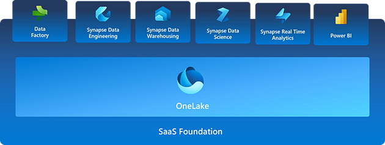
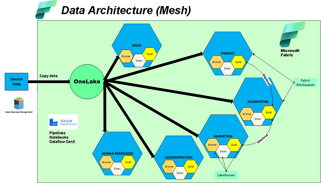

O Microsoft Fabric é a solução completa para todas as necessidades analíticas da sua empresa, unificando todo o processo em uma única plataforma. Desde a ingestão de dados no data lake até a entrega de informações para os usuários de negócios, tudo pode ser feito no Microsoft Fabric. Com a capacidade de integrar dados de diversas fontes, como Amazon AWS e Azure, ele reúne todas as informações em um só lugar.

Como um SaaS (Software como Serviço), o Microsoft Fabric combina o poder do Power BI com muitas funcionalidades do Synapse e outras áreas do Azure, sem a necessidade de instalar ou configurar software.

Uma das principais características do Microsoft Fabric é a separação entre armazenamento e computação, permitindo a execução de diferentes cargas de trabalho computacionais nos mesmos conjuntos de dados. O OneLake é a camada de armazenamento construída sobre o ADLS (Azure Data Lake Storage) Gen2, fornecendo um local único para que uma organização armazene todos os dados, tanto estruturados quanto não estruturados. Isso elimina silos de dados, simplifica a segurança, a governança e a descoberta de dados, permitindo que todos os usuários e aplicativos acessem os dados necessários.

O Data Mesh é uma descentralização orientada por domínios para o acesso a dados. A arquitetura de Data Mesh transfere a responsabilidade do acesso aos dados das equipes de tecnologia para as equipes de negócios.

Os quatro princípios do Data Mesh são:

1. **Propriedade do domínio:** As equipes de domínio assumem a responsabilidade por seus dados, possuindo tanto dados analíticos quanto operacionais.
2. **Dados como produto:** Cada equipe define não apenas os dados que possuem, mas também os dados que produzem e consomem de outras equipes. As equipes de domínio são responsáveis por fornecer dados de alta qualidade para satisfazer as necessidades de outros domínios.
3. **Infraestrutura de dados self-service:** Uma equipe dedicada fornece funcionalidades, ferramentas e sistemas agnósticos ao domínio, permitindo que as equipes de domínio consumam e criem produtos de dados de forma integrada.
4. **Governança federada de dados:** Promove a padronização e a interoperabilidade de todos os produtos de dados em todo o Data Mesh, criando um ecossistema de dados que segue as regras organizacionais e regulamentos da indústria.

Adotar o padrão Data Mesh permite que os grupos de negócios trabalhem de forma independente com vários lakes de dados orientados por domínios de negócios.

Os dados são organizados por domínios e o controle é direto sobre os dados, proporcionando acesso fácil e governança completa no nível dos dados, e não no nível das aplicações.

### Habilitando Data Mesh com OneLake no Microsoft Fabric

OneLake oferece um verdadeiro data mesh como serviço.

Uma organização pode ter muitos domínios de dados (VENDAS, FINANÇAS, MARKETING, RECURSOS HUMANOS, etc.). Um único conjunto de dados pode ser utilizado entre diferentes domínios, nuvens e motores. Um único produto de dados pode abranger múltiplos domínios. Os "atalhos" fornecem as conexões entre os domínios, permitindo que os dados sejam virtualizados em um único produto de dados.

Todos os motores podem acessar os mesmos dados sem a necessidade de importá-los ou exportá-los. Você pode escolher o motor certo para a tarefa certa. Os motores trabalham com os dados otimizados em Delta Parquet como formato nativo.

Por hoje é só pessoal ! Obrigada pela leitura !
