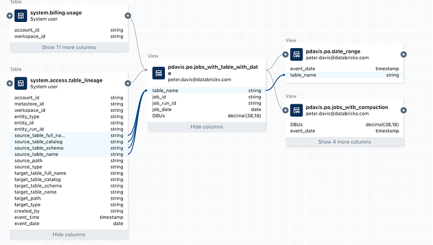
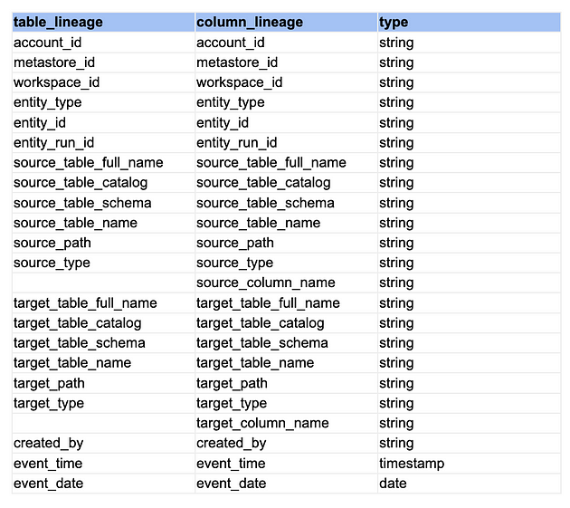
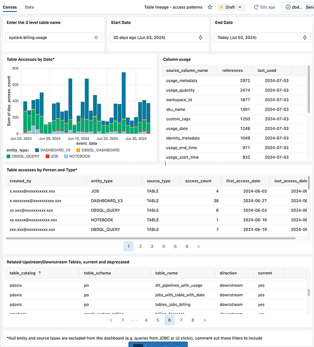
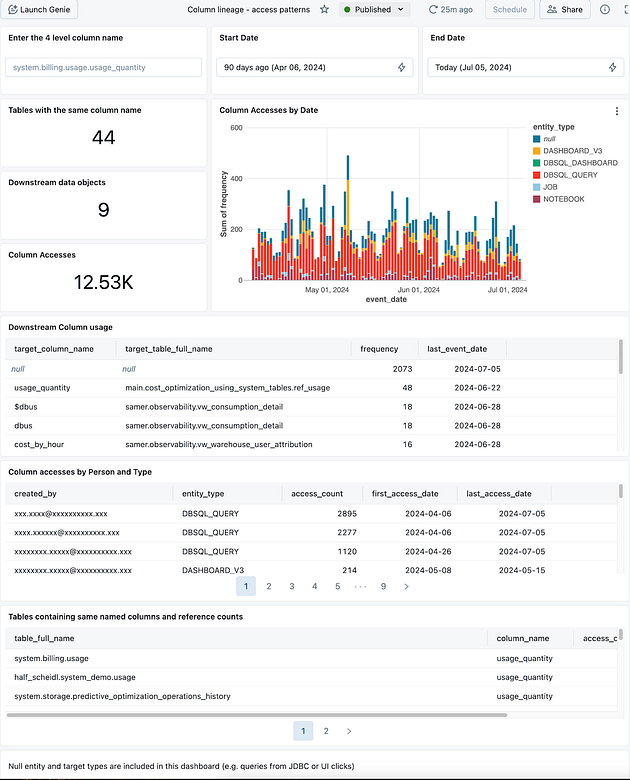
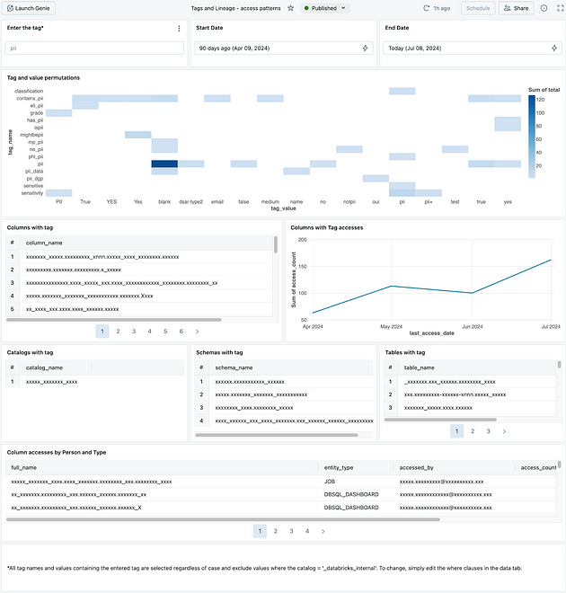

### Introdução

O Databricks Unity Catalog facilita a compreensão dos dados pela sua equipe. Ele gera automaticamente informações sobre como os dados são usados, baseando-se nos registros de consumo dos clusters. Isso reflete o uso dos clientes da Plataforma de Inteligência de Dados, oferecendo excelente capacidade de descoberta e contexto para otimizações.

Nesse artigo quero te ensina a usar os dados de linhagem para auditar o uso dos dados através das Tabelas de Sistema do Unity Catalog. Começarei com uma visão geral das tabelas de linhagem e depois mostrarei como analisar o uso de dados para entender quem está acessando quais dados, de onde e quando.

### Visão Geral

Com o Databricks Unity Catalog, obtemos informações de linhagem conforme nossos usuários trabalham. As relações de dependência são rastreadas enquanto os usuários preparam e organizam os dados. Metadados são gerados automaticamente, fornecendo contexto imediato e significado aos seus dados.

Esse contexto acelera o trabalho de usuários chave:

- **Analistas de dados e cientistas de dados**: Eles podem entender a origem dos dados diretamente, reduzindo a confusão sobre qual tabela ou métrica usar para um modelo ou relatório. Isso acelera a entrega e aumenta a confiança nos dados.
- **Governança de dados**: Proprietários, administradores, responsáveis pela segurança e privacidade podem usar informações de acesso e uso das tabelas para entender a frequência de uso dos dados e rastrear padrões de acesso.

A linhagem está disponível na interface do Catalog, onde é expressa como gráficos visuais que mostram as relações de dependência. A imagem abaixo mostra a linhagem para três visualizações geradas a partir das tabelas do sistema. A linhagem de tabelas e colunas também está disponível:



\_Linhagem do Unity Catalog\_

Também podemos consultar diretamente a linhagem nas tabelas do sistema via Notebooks ou no Editor de SQL. Podemos consultar a linhagem das tabelas para ver as tabelas upstream/downstream e analisar o uso de dados, como quem, quando e como os usuários acessam os dados. O exemplo abaixo mostrará todos os acessos à tabela de uso de cobrança nos últimos sete dias:

```
SELECT
 *
FROM
 system.access.table_lineage
WHERE
 source_table_full_name = 'system.billing.usage'
AND datediff(now(), event_date) < 7        
```

Se você deseja uma visão rápida da atividade de uma tabela nos últimos 30 dias, pode acessar insights da tabela diretamente na interface do usuário. A aba UC Insights fornece informações sobre a atividade recente, usuários, consultas e mais.

### Visão geral das tabelas de linhagem

As tabelas de sistema de linhagem no Databricks permitem consultar dados de linhagem no nível de tabelas e colunas nas tabelas **system.lineage.table\_lineage e system.lineage.column\_lineage**.

Ambas as tabelas de sistema de linhagem seguem o mesmo esquema, com duas adições para linhagem no nível de colunas, conforme mostrado abaixo:



\_Tabela de Nomes e Colunas\_

Para determinar se o evento foi uma leitura ou uma gravação, você pode verificar os campos source\_type e target\_type.

- **Somente leitura:** O tipo de fonte não é nulo, mas o tipo de destino é nulo.
- **Somente gravação:** O tipo de destino não é nulo, mas o tipo de fonte é nulo.
- **Leitura e gravação:** Os tipos de fonte e destino não são nulos.

No restante do artigo, explorarei alguns casos de uso destacando a auditoria de acesso a dados e a popularidade de objetos de dados, demonstrarei técnicas para analisar seus dados de linhagem e geraremos um painel que você pode personalizar para obter insights.

Nesse artigo temos quatro conjuntos de códigos: um notebook para exploração de dados da tabela de linhagem e três dashboards que mostram alguns dos resultados do notebook. Ambos podem ser usados imediatamente em qualquer workspace onde o Unity Catalog e as tabelas do sistema estejam habilitados.

### Exploração de Dados — Configuração da Análise

No início do notebook, configuramos variáveis para a execução das consultas subsequentes. Por favor, ajuste os valores de acordo com o seu ambiente.

```
DECLARE OR REPLACE VARIABLE catalog_val STRING;
DECLARE OR REPLACE VARIABLE target_catalog_val STRING;
DECLARE OR REPLACE VARIABLE schema_val STRING;
DECLARE OR REPLACE VARIABLE table_val STRING;
DECLARE OR REPLACE VARIABLE column_val STRING;
DECLARE OR REPLACE VARIABLE email_val STRING;
DECLARE OR REPLACE VARIABLE table_full_name_val STRING;

SET VARIABLE catalog_val = 'system';
SET VARIABLE target_catalog_val = 'pdavis';
SET VARIABLE schema_val = 'billing';
SET VARIABLE table_val = 'usage';
SET VARIABLE column_val = 'usage_quantity';
SET VARIABLE table_full_name_val = concat(catalog_val, '.', schema_val, '.', table_val)
SET VARIABLE email_val = 'demo@databricks.com';        
```

### Acessos às Tabelas por Usuários:

Veja quais usuários acessaram uma tabela e qual interface do Databricks usaram nos últimos 7 dias:

- **Usuários**: Identifique os usuários que acessaram a tabela.
- **Interfaces**: Verifique se usaram notebooks, jobs, ou outras interfaces do Databricks para acessar a tabela.

Isso ajudará a entender o comportamento de acesso e uso das tabelas por diferentes usuários dentro do período de uma semana.

```
SELECT
 mask(created_by) as created_by, -- Masking function - nice feature
 entity_type,
 source_type,
 COUNT(distinct event_time) as access_count,
 MIN(event_date) as first_access_date,
 MAX(event_date) as last_access_date
FROM
 system.access.table_lineage
WHERE
 source_table_catalog = catalog_val
 AND source_table_schema = schema_val
 AND source_table_name = table_val
 AND datediff(now(), event_date) < 7
 AND entity_type IS NOT NULL
 AND source_type IS NOT NULL
GROUP BY
 ALL -- Nice feature
ORDER BY
 ALL -- Nice feature        
```

Aqui, obtemos um resultado com os endereços de e-mail (created\_by), interfaces (entity\_type), datas do primeiro e último acesso, e a contagem de acessos à tabela.

Limitei o período total para uma semana para minimizar o uso de recursos durante a exploração, e uso uma função de mascaramento para ocultar os endereços de e-mail no campo created\_by para este artigo.

Acessos às tabelas em um catálogo e esquema específicos:

```
SELECT
 source_table_name,
 entity_type,
 created_by,
 source_type,
 COUNT(distinct event_time) as access_count,
 MIN(event_date) as first_access_date,
 MAX(event_date) as last_access_date
FROM
 system.access.table_lineage
WHERE
 source_table_catalog = catalog_val
 AND source_table_schema = schema_val
 AND datediff(now(), event_date) < 30
GROUP BY
 ALL
ORDER BY
 ALL        
```

Aqui, vemos todas as tabelas acessadas dentro de um catálogo e esquema específicos nos últimos 30 dias, quem as acessou e as datas do primeiro e último acesso.

### Acessos às Tabelas por Usuários Específicos

Quais tabelas um usuário específico acessou no catálogo do sistema nos últimos 90 dias:

```
SELECT
 source_table_catalog,
 source_table_schema,
 source_table_name,
 entity_type,
 source_type,
 mask(created_by) as created_by,
 COUNT(distinct event_time) as access_count,
 MIN(event_date) as first_access_date,
 MAX(event_date) as last_access_date
FROM
 system.access.table_lineage
WHERE
 created_by = email_val
 AND datediff(now(), event_date) < 90
 and entity_type is not NULL
 and source_table_catalog = 'system'
GROUP BY
 ALL
ORDER BY
 ALL        
```

### Linhagem de Objetos

Para um único objeto, quais são os objetos imediatamente upstream (anteriores) e downstream (posteriores)?

```
with downstream AS (
select
  distinct target_table_catalog as table_catalog,
  target_table_schema as table_schema,
  target_table_name as table_name,
  'downstream' as direction,
  CASE WHEN tbl.table_catalog is null then 'no' else 'yes' end as current
from
  system.access.table_lineage tl
  left join system.information_schema.tables tbl
  on tl.target_table_full_name = concat(tbl.table_catalog, '.', tbl.table_schema, '.', tbl.table_name)
where
  source_table_full_name = table_full_name_val
  AND target_table_full_name is not null
 order by current desc, table_catalog, table_schema, table_name
)
,
upstream AS (
select
  distinct source_table_catalog as table_catalog,
  source_table_schema as table_schema,
  source_table_name as table_name,
  'upstream' as direction,
  CASE WHEN tbl.table_catalog is null then 'no' else 'yes' end as current
from
  system.access.table_lineage tl
  left join system.information_schema.tables tbl
  on tl.source_table_full_name = concat(tbl.table_catalog, '.', tbl.table_schema, '.', tbl.table_name)
where
  target_table_full_name = table_full_name_val
  AND source_table_full_name is not null
 order by current desc, table_catalog, table_schema, table_name
)
select * from upstream
UNION ALL
select * from downstream        
```

### Vamos juntar tudo ? — Dashboards

Os dashboards a seguir ajudarão você a começar a analisar as tabelas de linhagem do Unity Catalog. Os usuários são incentivados a experimentar os dashboards e, em seguida, personalizá-los conforme o que for mais útil em seu ambiente.

Temos três dashboards com os seguintes recursos:

- Linhagem de tabelas
- Linhagem de colunas
- Tags e linhagem de colunas

### Linhagem de tabelas

Juntando tudo, criei um dashboard para mostrar:

- Acessos às tabelas por data
- Colunas em uso na tabela
- Quem acessou a tabela e por quais interfaces
- Tabelas upstream/downstream relacionadas (incluindo dependências depreciadas)

Importando o dashboard e inserindo qualquer nome de tabela com 3 níveis, você pode revisar as mesmas informações sobre as tabelas (desde que tenha permissão para ver os metadados da tabela).



\_Dahsboard Linhagem de Tabelas\_

### Linhagem de colunas

Adicionei um dashboard para revisar as informações de linhagem das colunas. Este dashboard mostra:

- A contagem de tabelas com o mesmo nome de coluna
- Quantos objetos dependem dessa coluna
- Total de acessos à coluna durante o período especificado
- Um gráfico de acessos ao longo do tempo
- Uma tabela mostrando a frequência de uso downstream da coluna
- Uma tabela mostrando quem acessou a coluna, a partir de qual interface, quantos acessos foram feitos, e as datas do primeiro e último acesso dentro do período

Também mostra tabelas que possuem o mesmo nome de coluna e as contagens de frequência de uso.



\_Dashboard Linhagem de Colunas\_

### Dashboard de Tags e Linhagem

Finalmente, criei um dashboard para revisar tags no sistema:

- **Mapa de calor de nome e valor das tags**: Ajuda a entender como as pessoas usam as tags e a reduzir o ruído potencial das tags na empresa.
- **Lista de nomes de colunas com tags**: Mostra as colunas que foram marcadas com determinado nome ou valor (mascarado neste exemplo).
- **Total de acessos às colunas com tags**: Mostra quantas vezes as colunas marcadas foram acessadas durante o período especificado.
- **Listas de Catálogos, Esquemas e Tabelas com tags**: Exibe os objetos que foram marcados (mascarados para o exemplo).
- **Lista de colunas com tags acessadas**: Mostra quem e como acessaram essas colunas (novamente, mascarado para o exemplo).



\_Dashboard de Tags e Linhagem\_

### Limitações Atuais

As Tabelas de Sistema de Linhagem estão atualmente em Public Preview. À medida que as tabelas avançam para GA, colunas, esquemas e dados retidos podem mudar.

Nem todos os tipos de entidades são rastreáveis no momento; o tipo de entidade será NULL para tipos não rastreados.

### Conclusão

Neste artigo, exploramos como o Databricks Unity Catalog simplifica a auditoria e o entendimento do uso dos dados. Usando as Tabelas de Sistema do Unity Catalog, podemos rastrear e analisar a linhagem dos dados. Isso nos ajuda a ver claramente quem está acessando quais dados, de onde e quando, o que melhora a governança dos dados e a eficiência do trabalho dos analistas e cientistas de dados.

Mostramos como consultar a linhagem diretamente nas tabelas do sistema, seja por meio de Notebooks ou do Editor de SQL. Isso permite uma análise detalhada dos acessos e usos dos dados. Também apresentamos exemplos práticos de consultas para monitorar acessos às tabelas, a popularidade dos objetos de dados e os padrões de acesso.

Os dashboards que mostramos são ferramentas valiosas para visualização e análise, oferecendo insights sobre acessos às tabelas, uso de colunas específicas e a utilização de tags no sistema. Mesmo estando em Public Preview, as Tabelas de Sistema de Linhagem já oferecem um suporte significativo para a governança de dados e a otimização de processos na plataforma Databricks .

Com essas capacidades, as equipes podem tomar decisões mais informadas, aumentar a confiança nos dados e fazer um melhor uso dos recursos disponíveis. O Unity Catalog, com suas capacidades de linhagem, é essencial para qualquer estratégia moderna de gerenciamento de dados.

Espero que esse artigo ajude na implementação de sua governança !

Obrigada pela leitura !
