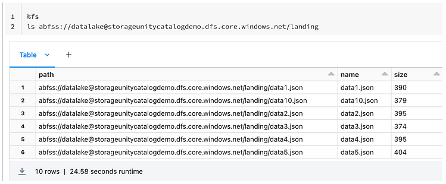
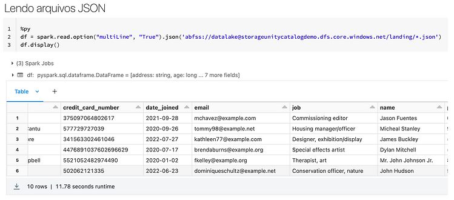
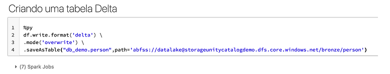
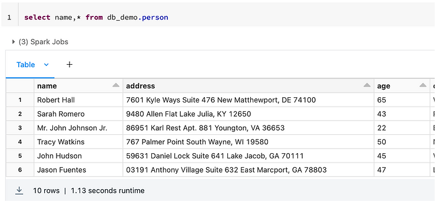
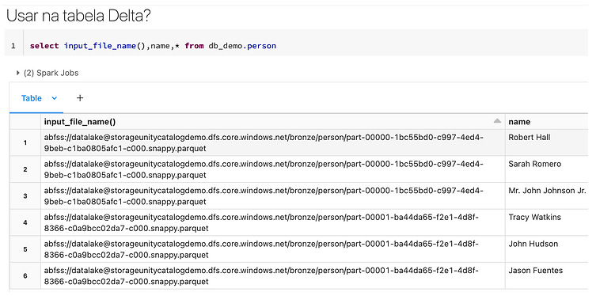
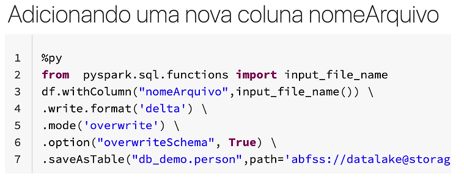
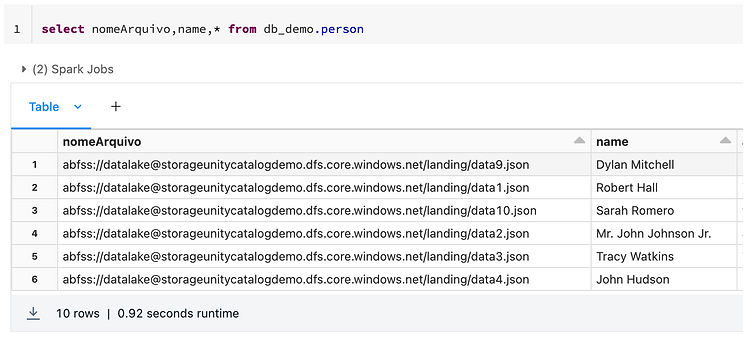

**Não seria um sonho tem uma coluna na sua tabela Bronze (ou Landing como quiser chamar) que informe de qual arquivo o dado foi originado ?**

**Confira a seguir como fazer isso:**

Abaixo temos um conjunto de arquivos JSON para carga.

Vamos realizar a leitura dos arquivos para um dataframe

Agora, salvando o dataframe em Tabela Delta

**Agora vem minha pergunta, como saber de qual arquivo cada pessoa veio?**

O segredo está na função **input\_file\_name()**, essa função pode ser utilizada tanto com SQL ou com Python, ela retorna o nome do arquivo **lido**, no exemplo abaixo estou usando a função no **select** da minha tabela Bronze no formato Delta.

Porém, se utilizarmos essa função após a criação da tabela o que será exibido são os arquivos parquet e não os arquivos de origem em si.

Para resolver esse problema, vamos adicionar a coluna "nomeArquivo" na criação da Tabela Delta.

Agora sim !!

Por hoje é isso pessoal, espero que tenha agregado.

Até a próxima.
