No mundo dos dados, a criação de uma camada bronze, que organiza dados brutos em uma estrutura acessível para transformações subsequentes, tradicionalmente envolve bastante codificação. Porém, recentemente, explorei uma nova abordagem utilizando o Databricks **Assistant AI** que me permitiu criar uma camada bronze sem escrever uma única linha de código.

O **Databricks Assistant AI** é uma ferramenta de inteligência artificial incorporada ao ambiente Databricks, projetada para simplificar o desenvolvimento e automação de pipelines de dados. Ele funciona interpretando comandos em linguagem natural, permitindo que os usuários configurem tarefas complexas como ingestão de dados, transformações e validações sem a necessidade de escrever código manualmente. É uma solução ideal para profissionais que desejam ganhar agilidade e eficiência em seus projetos de dados, reduzindo o tempo dedicado à codificação e minimizando erros comuns no desenvolvimento.

Aqui está o passo a passo de como consegui automatizar esse processo com o uso de notebooks e inteligência artificial.

### Criação do Notebook

Para iniciar, criei um notebook chamado **01\_Tabelas\_Bronze\_GenAI** com o comentário: "Notebook de criação da camada bronze." Esse notebook foi a base para a criação automatizada da camada bronze sem codificação manual. Cada etapa foi configurada de forma simples, utilizando o **Databricks Assistant AI** para gerenciar a lógica por trás das ações.

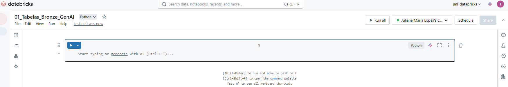

Há 2 formas de acessar o Assistant, por meio da célula do notebook ou no canto superior direito logo após o nome do seu serviço Databricks (no meu caso "jml-databricks"). Optei por utilizar por célular para explicar melhor a criação da camada Bronze passo-a-passo.

Uma vez criado, vamos nos divertir !

### Passo 1: Criação de Parâmetros

Primeiro, foram definidos parâmetros essenciais para a execução do processo. Esses parâmetros controlam os caminhos dos arquivos e o formato de origem dos dados.

- **Nome:** par\_path **Tipo:** Texto **Comentário:** Caminho da pasta de origem dos dados
- **Nome:** file\_format **Tipo:** Texto **Comentário:** Formato do arquivo de origem (CSV, JSON, etc.)
- **Nome:** file\_name **Tipo:** Texto **Comentário:** Nome do arquivo de origem

Com esses parâmetros, é possível garantir que o pipeline possa ser adaptável a diferentes fontes de dados.

```
Crie um notebook
Nome: 01_Tabelas_Bronze_GenAI
Comentário: Notebook de criação da camada bronze.

Ação: Cada passo abaixo é uma célula no notebook.
--------------------------------------------------------------------------------------------
Passo 1 - Criação de Paramêtros

Nome: par_path
Tipo: Texto
Comentário: Caminho da pasta

Nome: file_format
Tipo: Texto
Comentário: Nome do Arquivo de Origem

Nome: file_name
Tipo: Texto
Comentário: Formato do Arquivo de Origem
--------------------------------------------------------------------------------------------        
```

Para gerar o código, clique em "Toggle Assistant", cole o prompt acima e clique em Generate.

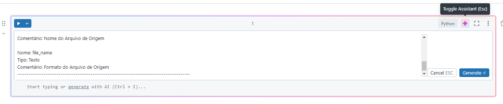

\_Carregando informações no prompt\_

Veja que o Databricks irá criar seu código python, se tudo estiver certo dê "Accept".

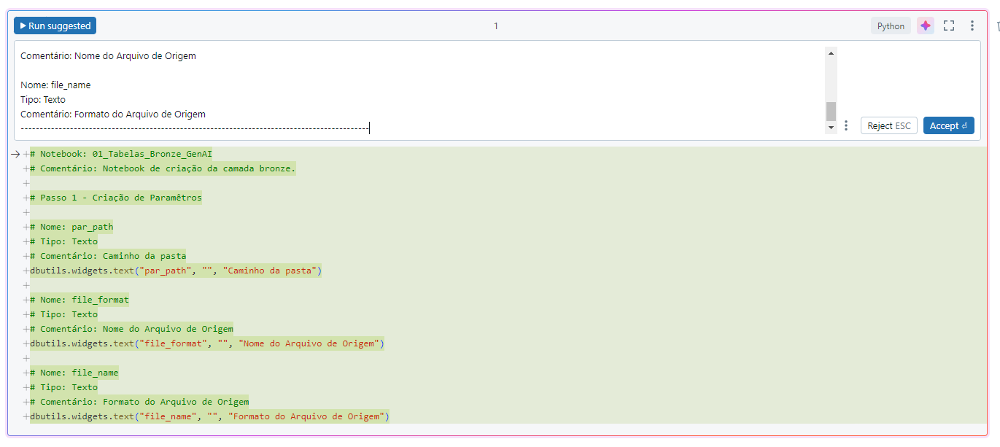

\_Aceitando a sugestão de códigos\_

Agora é só executar !

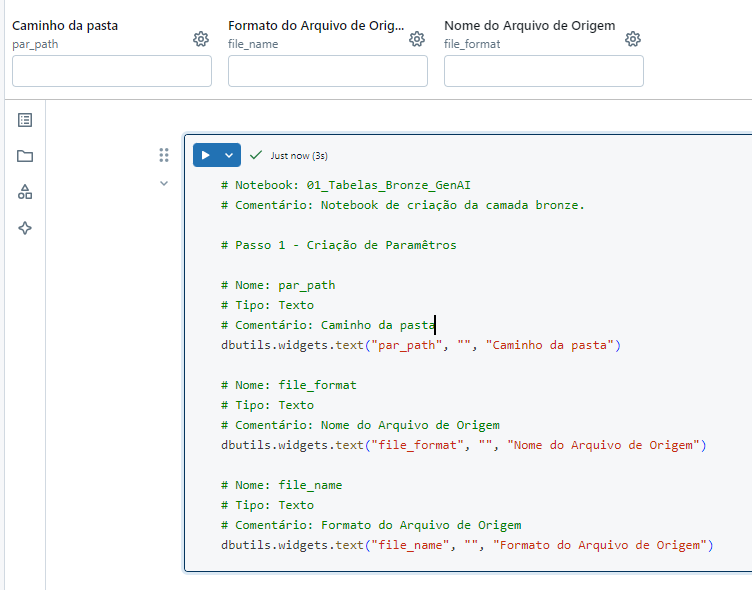

\_Código executado\_

Essa execução gerou 3 widgets.

---

### Passo 2: Validação Automática de Parâmetros

Com os parâmetros configurados, a próxima etapa foi garantir que eles fossem lidos e validados corretamente. O Databricks Assistant AI automaticamente configura o código para:

- Obter todos os parâmetros dos widgets.
- Imprimir os valores para fins de depuração.
- Verificar se os parâmetros estão definidos e, caso contrário, exibir uma mensagem informando que eles são obrigatórios, encerrando a execução do notebook.

Essa etapa de validação é crucial para evitar problemas com dados incorretos ou incompletos.

```
Passo 2 - Paramêtros de execução automático

Obter os parâmetros de todos os widgets.

Imprima os valores desses parâmetros para fins de depuração.

Verifique se todos os parâmetros estão definidos. Se não estiver, mostre uma mensagem informando que ele é obrigatório e encerre a execução do notebook com um código de saída 1."        
```
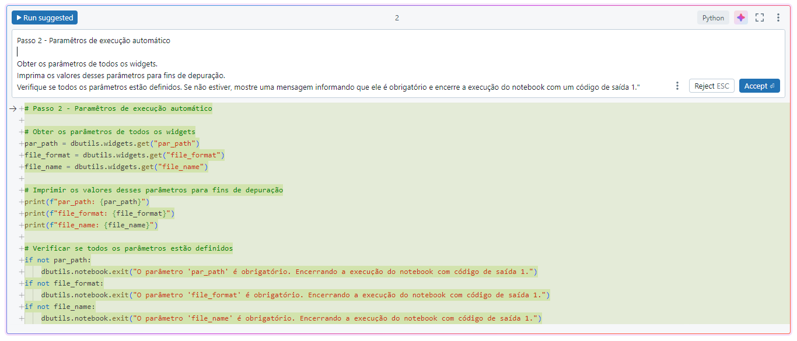

\_Prompt do Passo 2\_

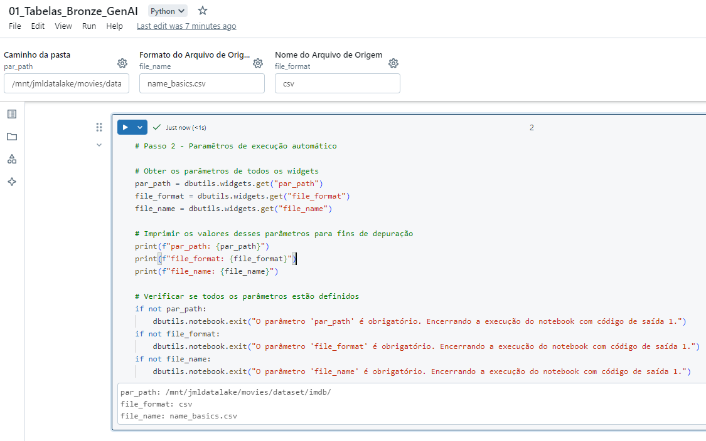

\_Código do passo 2 executado\_

Para executar esse código adicionei os parâmetros:

- par\_path: /mnt/jmldatalake/movies/dataset/imdb/
- file\_format: csv
- file\_name: name\_basics.csv

---

### Passo 3: Criação do Banco de Dados

Com os parâmetros validados, a próxima ação foi criar a base de dados onde a camada bronze seria armazenada. Através do Databricks Assistant AI, configurei o seguinte comando:

- **Nome do Banco:** movies\_bronze
- **Caminho de Armazenamento:** /mnt/jmldatalake/movies\_bronze/database
- **Comentário:** Banco de dados da camada Bronze

Se o banco de dados já existisse, o notebook não recriaria a base, garantindo eficiência no processo.

```
Passo 3 - Criar Banco de Dados

Ação: Crie uma base de dados (se não existir)

Nome: movies_bronze 
Caminho do Armazenamento: /mnt/jmldatalake/movies_bronze/database
Comentário: Banco de Dados da camada Bronze        
```
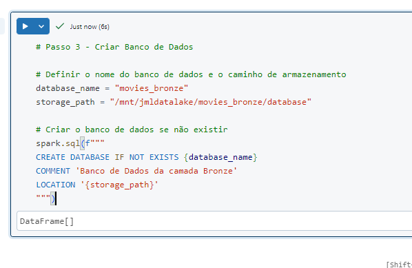

\_Código do passo 3 gerado\_

Banco de dados da camada Bronze criada !

---

### Passo 4: Definição do Nome da Tabela

Para nomear a tabela da camada bronze, o nome do arquivo de origem foi utilizado como base, com as seguintes transformações aplicadas automaticamente:

1. Remoção da extensão do arquivo.
2. Substituição de caracteres "-" por "\_".
3. Adição do prefixo tb\_raw\_ ao nome do arquivo.

Por exemplo, se o arquivo original fosse movies-2024.csv, o nome da tabela seria transformado em tb\_raw\_movies\_2024.

```
Passo 4 - Definição do nome da tabela

Condição: Utilize a variável que contenha Nome do Arquivo de Origem

Ação: 
1. Retire a extensão do Nome do Arquivo de Origem
2. Substitua "-" por "_"
3. Adicione o prefixo "tb_raw_" ao Nome do Arquivo de Origem        
```
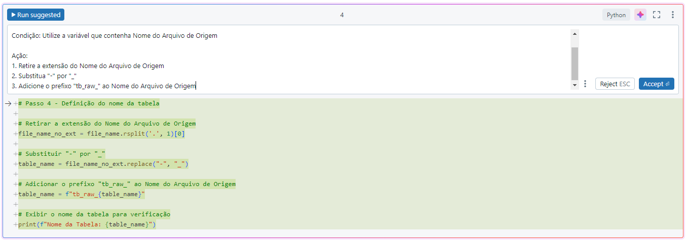

\_Prompt do Passo 4\_

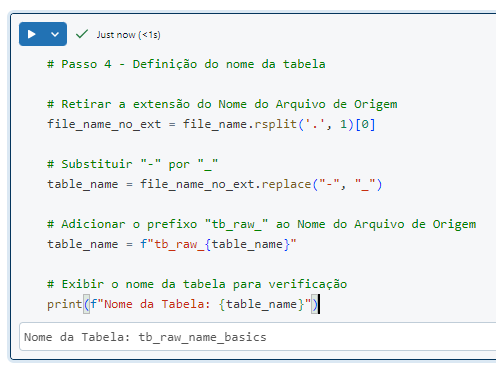

\_Código Executado\_

---

### Passo 5: Leitura de Arquivos

O próximo passo foi a leitura dos arquivos de dados brutos. Utilizando o caminho de origem e o nome do arquivo, o Databricks Assistant AI automatizou a leitura dos dados com as seguintes configurações:

- **Cabeçalho:** Verdadeiro
- **InferSchema:** Falso
- **Delimitador:** Tabulação (\t)

Após a leitura, o número de registros ingeridos foi impresso automaticamente para verificação.

```
Passo 5 - Leitura de Arquivos

Crie uma variável que una o caminho de origem do arquivo e o nome do arquivo de origem, retire os 5 últimos caracteres e adicione * 

Ação: Leia o Arquivo de acordo com a variável criada acima com os parâmetros abaixo:

Cabeçalho: Verdadeiro
InferSchema: Falso
Delimitado: \t

Após isso, imprima na tela a quantidade de registros ingeridos na tabela.        
```
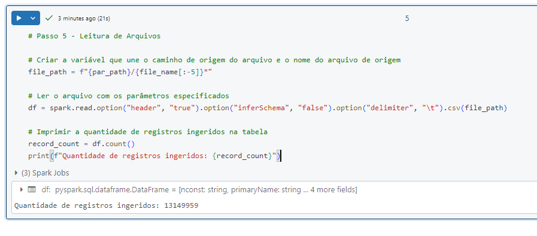

\_Código executado no passo 5\_

---

### Passo 6: Gravação de Dados no Formato Delta

Por fim, os dados foram salvos no formato **Delta**, que oferece alta performance e capacidade de versionamento. A gravação foi configurada com as seguintes opções:

- **Modo Overwrite:** Verdadeiro
- **Substituir Schema:** Verdadeiro
- **Multi Linhas:** Falso

Assim, os dados foram sobrescritos, garantindo a consistência da camada bronze. Após a gravação, o número de registros no destino também foi impresso, confirmando o sucesso da operação.

```
Passo 6 - Gravação de Arquivos

Salve o dataframe criado no passo anterior em formato Delta utilizando os parâmetros abaixo:

Modo Overwrite: Verdadeiro 
Substituir Schema: Verdadeiro
Multi Linhas: False

Após isso, imprima na tela a quantidade de registros ingeridos na tabela destino.        
```
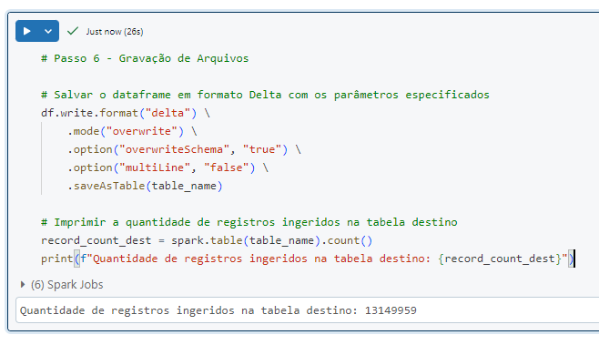

\_Código executado para o passo 6\_

### Conclusão

Com a ajuda do **Databricks Assistant AI**, consegui automatizar a criação de uma camada bronze de forma rápida e eficiente, sem escrever uma única linha de código. O que antes era uma tarefa manual e suscetível a erros tornou-se um processo simples, controlado e auditável.

Essa abordagem não só economizou tempo, mas também trouxe mais segurança e escalabilidade para o pipeline de dados. Estou empolgado para ver como a inteligência artificial continuará transformando o desenvolvimento de soluções de dados e simplificando processos que, até pouco tempo atrás, exigiam conhecimento técnico profundo.

Eu espero ter te influenciado para utilizar o Assistant pois vale muito a pena !!

No próximo artigo vamos tratar de Camada Silver !

Até lá !
