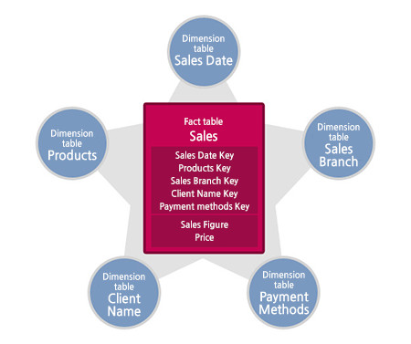
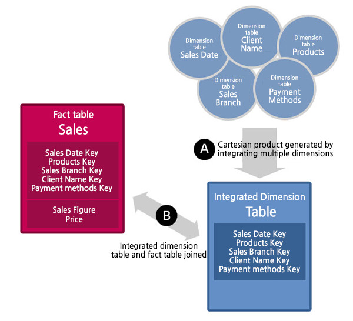
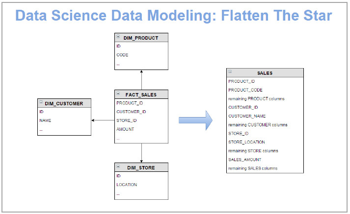
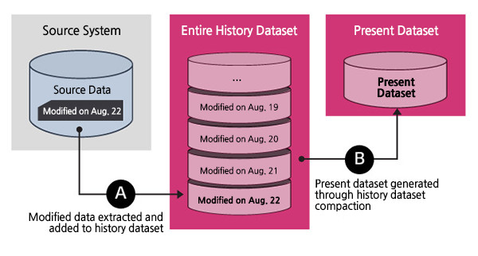
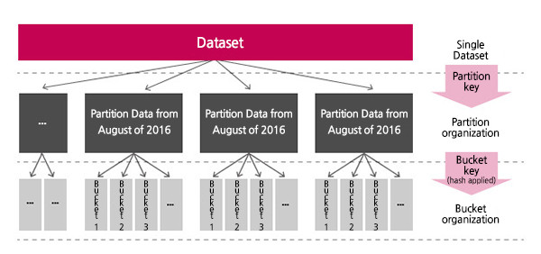
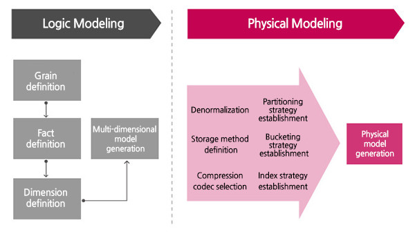

Ao longo dos anos, os data warehouses têm sido a principal ferramenta para a tomada de decisão e análise da empresas. Estes incluem ferramentas *OLAP e ETL* convencionais fornecidas por inúmeros fornecedores de hardware e software, aparelhos *DW* criados pela combinação de bases de dados e servidores, bancos de dados em memória e ferramentas de virtualização.

Mas como adequar e processar uma quantidade de dados cada vez maior em um velocidade aceitável para análise e busca de informações cruciais ao negócio ?

No Brasil, ainda estamos em uma fase muito embrionária com relação ao Big Data. Acredito que dentro em breve as empresas começaram seus projetos para "migração" das bases convencionais do *DW* para o *HDFS*.

> Na minha opinião, o profissional de BI de hoje que investir em aprendizado referente ao
> *Hadoop, Spark* e
> *métodos de carga de Dados Rápidos* estará um passo a frente no mercado de trabalho.

O ecossistema *Hadoop*, que está se desenvolvendo junto com grandes ambientes de dados, também tem um conjunto de várias tecnologias para a construção de data warehouse. Por exemplo, o Apache *Hive* é uma opção de data warehouse com o ecossistema *Hadoop* que pode processar grandes conjuntos de dados salvos em ambientes de armazenamento distribuídos usando o SQL.

**Mas, então, tem alguma receita de bolo ou fórmula mágica para Migrar os dados ? Infelizmente não, mas podemos seguir algumas diretrizes.**

### **1 - Desnormalizar**

A desnormalização é comumente usada para melhorar o desempenho ao implementar um modelo de Star Schema baseado em um sistema de arquivos distribuídos Hadoop (HDFS). Ao contrário do *RDBMS*, o *Hadoop* permite a sobreposição de dados causada pela desnormalização graças a equipamentos e softwares relativamente baratos.

Portanto, a decisão de aplicar a desnormalização em conjuntos de dados que mudam frequentemente deve ser feita cuidadosamente, considerando a compensação entre o desempenho da pesquisa e a implantação. O seguinte é um exemplo do método de desnormalização que pode ser usado para construção de data warehouse baseado em *Hadoop*.

### 1.1 - Integrar Dimensões

Várias dimensões com um pequeno número de linhas são empacotadas e transformadas em um conjunto de dados de dimensão única para que o número de conjuntos de dados de fato e junções possa ser reduzido. É difícil otimizar o sistema com um grande número de associações entre conjuntos de dados de dimensão e conjuntos de dados de fato ao usar o *Hadoop*.

> Uma pequena quantidade de arquivos grandes é melhor do que um grande número de arquivos pequenos para um desempenho ótimo com o
> *Hadoop*, uma grande dimensão é processada mais rapidamente do que várias dimensões pequenas.

### 1.2 - Integrar Fatos com Dimensões

Conjuntos de dados de dimensões e fato usados juntos para consultas são organizados em um conjunto único aplicando uma associação ao processo de implantação em vez de uma consulta no usuário.

> Os conjuntos de dados são unidos no ponto de carregamento de dados para reduzir o número de joins. É semelhante ao processo de integração de dimensão, exceto que a integração é de fato-dimensão.

### 1.3 - Gerar Conjuntos de Dados Histórico e Atual juntos para Carga

Como geralmente é mais rápido regenerar todo o conjunto de dados do que atualizar um único evento, considerando como o *HDFS* funciona, os conjuntos de dados necessários para o processo de carregamento são adicionados de acordo com as características temporários e de negócio.

> É melhor recarregar todo o conteúdo atual junto com o histórico ao invés de realizar várias atualizações.

### 2 - Organizar as tabelas Fato de maneira "Colunar"

Pode parecer estranho, mas é muito melhor ter centenas de colunas à milhões de linhas. Especialmente quando os usuários organizam um data warehouse que extrai e utiliza uma parte de uma coluna de um dataset, um formato colunar que permite extrair dados de coluna parcial ajuda a melhorar o desempenho de pesquisa muito.

Como exemplo, podemos ter uma fato de Vendas organizada por "Mês/Ano" que expande suas colunas a cada novo período.

### 3 - Comprimir os Dados

Compressão ajuda a melhorar o desempenho do processamento, reduzindo não apenas o tamanho dos dados armazenados, mas também a quantidade de E/S do disco. É melhor usar um codec de compactação que permita o processamento divisível para que os nós possam ser processados em paralelo em um ambiente distribuído.

Se a compactação for inviável, métodos adicionais de armazenamento de arquivos divisíveis, como *Avro*, são necessários. Como o armazenamento de arquivos, diferentes métodos de compressão podem ser usados para cada partição dentro de um conjunto de dados único.

### 4 - Particionar os Dados

Os conjuntos de dados são particionados de acordo com padrões de pesquisa de dados, de modo que os resultados podem ser encontrados sem pesquisar o conjunto de dados inteiro. Particionar ajuda a melhorar o desempenho, uma vez que reduz os objetos para verificação de consultas e reduz a E/S.

Uma vez que um conjunto de dados é dividido em partições de acordo com algum critério, tais como datas que refletem os padrões de pesquisa do usuário, apenas uma partição diária precisa ser digitalizada ao extrair dados de uma determinada data, tornando-a muito mais eficiente comparada a uma verificação completa em todo o conjunto de dados .

> O método de particionamento é semelhante ao da construção de um data warehouse baseado em
> *RDBMS*. Uma diferença é que, ao contrário do
> *RDBMS* que define como particionar um conjunto de dados, o Hadoop cria várias estratégias de particionamento de acordo com os padrões de pesquisa de um usuário.

O Hadoop copia o dataset original e cria vários conjuntos de dados, e cada conjunto de dados é estrategicamente particionado. Em outras palavras, o Hadoop usa muito mais espaço em disco para copiar e multiplicar um conjunto de dados para melhorar o desempenho.

### 5 - Bucketing

*Bucketing* é um processo pelo qual um dataset é dividido em *buckets*, grupos de dados agrupados, usando valores de uma determinada coluna. Cada bloco pode ter vários valores de coluna como critérios, mas um valor aleatório entre os valores da coluna de critérios está incluído em apenas um único bloco.

Outro benefício do *bucketing* é que ele torna os conjuntos de dados pequenos o suficiente para usar uma junção do lado do mapa, que faz o upload desse bloco para a memória para processamento rápido.

### 6 - Indexar os Dados

No Apache *Hive*, os índices que desempenham funções semelhantes aos índices *RDBMS* podem ser gerados. *Hive* suporta um índice compacto, bitmap índice, e assim por diante. É importante primeiro analisar os padrões de consulta do usuário para gerar índices que reflitam esses padrões (como na estratégia de indexação do *RDBMS*).

> Ao usar um índice, os dados estatísticos devem ser coletados regularmente para ajudar o otimizador a encontrar a melhor rota.

### Conclusão

O valor fundamental de um data warehouse é o mesmo, mesmo que seja construído como uma aplicação dentro de um ecossistema Hadoop. Felizmente, a metodologia para construções de data warehouse pode ser usada sem muita alteração na construção de bases baseadas em *Hadoop*.

Enquanto as características dos ecossistemas *Hadoop* forem refletidas em seu processo de modelagem física, o data warehouse será preparado para a era dos grandes dados, onde serão integrados os dados estruturados e não estruturados.

*Referências*

- *Ralph Kimball and Matt Brandwein – Hadoop 101 for EDW Professionals*
- *Hadoop 101 for EDW Professionals – Dr. Ralph Kimball Answers Your Questions*
- *Ralph Kimball and Eli Collins – EDW 101 for Hadoop Professionals*
- *Ralph Kimball – Newly Emerging Best Practices for Big Data*
- *Ralph Kimball – The Evolving Role of the Enterprise Data Warehouse in the Era of Big Data Analytics*
- *Josh Wills - What Comes After The Star Schema?*

Veja também:

[Bancos NoSQL, como assim não tem Query ?](https://www.linkedin.com/pulse/bancos-nosql-como-assim-n%C3%A3o-tem-query-juliana-maria-lopes)

[O que você precisa saber sobre Big Data e não passar vergonha no papo do Café ?](https://www.linkedin.com/pulse/o-que-voc%C3%AA-precisa-saber-sobre-big-data-e-n%C3%A3o-passar-vergonha-lopes)
