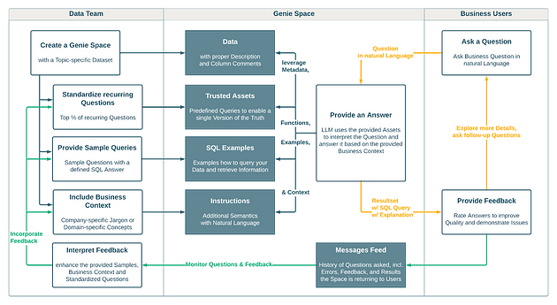
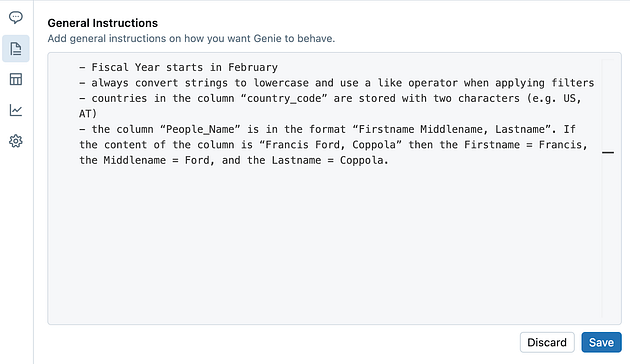
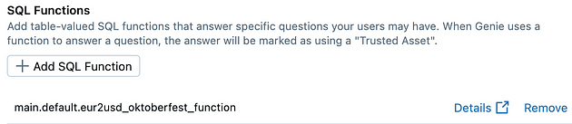
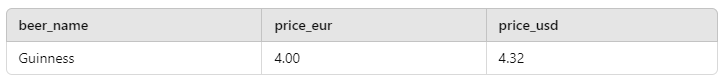

## Introdução

Imagine poder conversar com seus dados como se estivesse falando com um colega de trabalho ou, melhor ainda, como se estivesse interagindo com um gênio da lâmpada mágica. É exatamente isso que o AI/BI Genie permite! Assim como o lendário gênio que realiza desejos, o Genie facilita a vida dos usuários de negócios, permitindo que eles “esfreguem a lâmpada” de seus dados para obter respostas e insights por meio de linguagem natural, da mesma forma que falamos no dia a dia.

O Genie é uma solução inovadora desenvolvida pela Databricks para simplificar o acesso e a análise de dados de maneira mágica, através de interações em linguagem natural. Lançado em 2024, o AI/BI Genie faz parte dos avanços da Databricks em inteligência artificial generativa (GenAI) aplicada à análise de dados. Assim como o gênio de Aladdin, ele está aqui para democratizar o uso de dados, permitindo que qualquer pessoa na organização possa fazer perguntas complexas sem precisar escrever uma única linha de código.

O segredo por trás do Genie está no Unity Catalog, que funciona como o “mapa” mágico para entender a estrutura dos seus dados. Isso inclui desde a origem dos dados (linhagem), passando pela documentação, até o histórico de consultas já realizadas. Com essas informações, o Genie é capaz de responder uma grande variedade de perguntas de negócios, de forma rápida e confiável.

Assim como na história clássica, o Genie do Databricks não tem limites de desejos. Ele combina a simplicidade da linguagem natural com a confiabilidade da inteligência artificial generativa (GenAI), tornando o acesso a dados e à inteligência artificial mais democrático do que nunca, tudo sob a governança unificada da plataforma Databricks Data Intelligence.

## Configuração e utilização do AI/BI Genie

Os espaços do Genie são preparados por analistas de dados para garantir uma experiência mais fluida e precisa. O processo começa com a seleção de tabelas específicas do Unity Catalog, focando em um conjunto de dados que tenha sentido para a organização. Em seguida, os analistas expõem os metadados dessas tabelas e inserem instruções que trazem informações específicas do negócio, como regras de negócio e conceitos importantes para o contexto do usuário. Para facilitar ainda mais, os analistas também adicionam exemplos de perguntas e respostas, ajudando os usuários de negócios a dar os primeiros passos de maneira orientada e segura.



\_Fluxo de criação e utilização dos espaços do Genie\_

Na imagem acima, você pode ver o fluxo de criação e utilização dos espaços do Genie, dividido em três partes principais: a equipe de dados, o espaço do Genie e os usuários de negócios. Ela ilustra todo o ciclo, desde a configuração do espaço pelo time de dados até a interação dos usuários finais, com destaque para a troca de feedbacks e o uso de linguagem natural para perguntas e respostas. Esse fluxo mostra como o Genie é alimentado por dados confiáveis e exemplos práticos, tudo projetado para oferecer insights de maneira simples e acessível.

Dando sequencia a explicação, abaixo temos as melhores práticas para a criação e utilização dos espaços do Genie listadas e explicadas para guiar a configuração ideal desse ambiente de análise.

## Escolhendo os conjuntos de dados

Para começar a usar o Genie de forma eficiente, é ideal trabalhar com um pequeno conjunto de tabelas (entre 5 e 10), com um número limitado de colunas (menos de 50), focando em um único tema. Mas por que começar assim? Porque quanto mais coerente e semanticamente conectado for o seu conjunto de dados, melhor será o desempenho do Genie.

O que significa um conjunto de dados coerente e semanticamente conectado? Isso quer dizer que o relacionamento entre as tabelas deve refletir conexões reais ou associações lógicas. Por exemplo, as tabelas devem estar relacionadas de maneira clara, como acontece em um banco de dados do mundo real, e ter restrições de chave primária e chave estrangeira, para que o Genie entenda como as tabelas estão conectadas e possa realizar junções de forma correta.

Todas as tabelas e colunas devem contribuir para o tema geral do conjunto de dados. Se houver colunas que não estejam alinhadas com o propósito do conjunto, é importante criar views para limpar e tornar os dados mais coerentes e organizados.

Em geral, os dados utilizados nos espaços do Genie **vêm de tabelas de nível de negócios da camada gold**, similares aos dados que seriam usados em uma ferramenta de BI para construir dashboards. Isso é feito frequentemente usando um esquema estrela no estilo Kimball, um modelo multidimensional que facilita o entendimento e a análise dos dados.

Por fim, garanta que todos os usuários que interagirem com o espaço do Genie tenham, no mínimo, **privilégios de SELECT nos dados utilizados**. Como o acesso aos dados é governado pelo Unity Catalog, a falta de privilégios resultará em mensagens de erro para os usuários.

## Documentação Clara, Respostas Precisas: Preparando o AI/BI Genie para o Sucesso

Para o Genie funcionar de forma eficaz, é essencial que seus dados estejam bem documentados e anotados. A documentação é fundamental porque ela traz o contexto de negócios para os dados, facilitando o entendimento e evitando interpretações incorretas — tanto por parte dos usuários quanto do próprio Genie. **Simplificando: quanto mais claras e detalhadas forem suas anotações, melhores serão as respostas que o Genie poderá oferecer**.

Você pode usar ferramentas de inteligência artificial para gerar parte dessa documentação automaticamente, economizando tempo e reduzindo o trabalho manual. Mesmo assim, é importante revisar e ajustar as descrições para que estejam de acordo com o caso de uso específico e o conhecimento do seu domínio. Uma documentação bem feita não apenas facilita o uso, mas também garante que as respostas do Genie sejam mais precisas e relevantes para os objetivos do seu negócio.

## Do Natural ao SQL: Como Preparar o Genie para Consultas Eficientes

Durante a preparação do espaço do Genie, é essencial testá-lo para verificar a qualidade das respostas e garantir que ele está entregando os resultados esperados. Isso inclui reformular as perguntas de exemplo e ajustar as instruções até que o Genie forneça as respostas corretas e desejadas.

O Genie converte as perguntas em linguagem natural para SQL, o que significa que ele precisa de um SQL warehouse para executar as consultas. Para melhores resultados, recomendamos o uso de um SQL warehouse serverless, pois ele oferece um tempo de inicialização mais rápido e uma gestão inteligente das cargas de trabalho, o que permite processar as consultas de forma ágil e econômica.

Lembre-se de que os usuários que interagem com o espaço precisam ter acesso "CAN USE" ao SQL warehouse designado, garantindo assim que possam executar as consultas sem problemas.

## Melhorando a qualidade das respostas

Para melhorar a qualidade das respostas do Genie, é essencial transferir todo o contexto de negócios que você possui sobre os dados para informações que o Genie possa utilizar de forma eficaz. Atualmente, existem três maneiras de fazer isso:

1. **Instruções**: Adicione semântica extra utilizando linguagem natural para que o Genie compreenda melhor os conceitos e relacionamentos específicos do seu negócio.
2. **Exemplos de SQL**: Forneça exemplos de consultas SQL que orientem o Genie sobre como consultar seus dados e obter as informações corretas. Isso ajuda a alinhar as respostas com o que você espera em termos de lógica de negócio.
3. **Assets Confiáveis**: Crie consultas pré-definidas que estabeleçam uma “versão única da verdade”, garantindo que os resultados sejam consistentes e confiáveis em todas as interações.

Essas práticas não apenas aumentam a precisão das respostas, mas também garantem que o Genie esteja alinhado com os objetivos do negócio, proporcionando resultados mais relevantes para os usuários.

### Exemplo: transfira a linguagem do seu negócio para o Genie

As instruções permitem que você forneça informações adicionais para ajudar o Genie a entender a linguagem específica do seu negócio. Elas orientam o modelo de linguagem a captar jargões da empresa ou conceitos específicos de um determinado domínio.

Por exemplo, na Databricks, o nosso ano fiscal começa em fevereiro, diferentemente da maioria das empresas, que inicia em janeiro. Portanto, é necessário adicionar esse detalhe como uma instrução para o Genie, garantindo que ele agregue os números corretamente:

- O ano fiscal começa em fevereiro.

Outra possibilidade é instruir o Genie sobre como aplicar lógica de filtro ou buscar valores nas colunas, especialmente quando algumas são sensíveis a maiúsculas e minúsculas:

- Sempre converter strings para minúsculas e usar o operador "like" ao aplicar filtros.
- Os países na coluna “country\_code” estão armazenados com dois caracteres (ex.: US, AT).

Você também pode utilizar técnicas de "aprendizado em um exemplo" para ensinar o Genie sobre como tratar colunas específicas e extrair informações delas:

- A coluna “People\_Name” está no formato “Nome PrimeiroMeio, Sobrenome”. Se o conteúdo da coluna for “Francis Ford, Coppola”, então o Nome = Francis, o PrimeiroMeio = Ford, e o Sobrenome = Coppola.

Certifique-se de que suas instruções sejam claras e objetivas. O mesmo se aplica aos dados: quanto mais coerentes e simples forem as instruções, melhores serão os resultados fornecidos pelo Genie.



## Assets Confiáveis: consultas pré-definidas para perguntas específicas

Para entender melhor a diferença entre Assets Confiáveis e Exemplos de SQL, vamos usar uma analogia simples: imagine que você está ensinando um aluno a resolver problemas de multiplicação.

Primeiro, você ensina multiplicações básicas, como 2 \* 3, que ele geralmente memoriza. Mais tarde, você ensina ferramentas para resolver multiplicações mais complexas, como 123\*64. O aluno tende a memorizar multiplicações recorrentes, como 8 \* 8 = 64, mas também aprende as ferramentas para calcular multiplicações mais complexas de forma independente.

Os **Assets Confiáveis** são consultas definidas pelo usuário que são executadas para perguntas específicas. O Genie executa a consulta pré-definida e fornece o resultado com uma etiqueta de “asset confiável”. A associação entre os Assets Confiáveis e perguntas específicas é feita por meio de comentários de função. Na nossa analogia, isso seria semelhante a memorizar o resultado de 8 \* 8 sem precisar refazer o cálculo.

### 1. Crie um Asset confiável

Vamos a outro exemplo, vamos supor que você precise converter preços de cerveja de euros (EUR) para dólares americanos (USD). Você pode criar uma consulta pré-definida que realize essa conversão e associá-la a uma pergunta específica, garantindo que o Genie forneça sempre a resposta correta com o selo de "asset confiável", sem recalcular todas as vezes.

```
SELECT
 o.year,
 o.beer_price,
 (o.beer_price * e.EUR2USD) AS beer_price_usd
FROM
 main.default.oktoberfest_gold o
 JOIN main.default.eur_usd_conversion e ON o.year = e.Year
WHERE
 o.year = 2005        
```

Esses Assets Confiáveis garantem consistência e precisão nas respostas para perguntas recorrentes, economizando tempo e oferecendo maior confiabilidade para o usuário.

### 2. Registre a consulta generalizada (adicionando o filtro como parâmetro) como uma Função

Para tornar a consulta mais flexível e adaptável a diferentes cenários, você pode registrá-la como uma função SQL, permitindo que os filtros sejam passados como parâmetros. Isso facilita a reutilização da consulta em várias situações, mantendo o resultado sempre consistente e confiável.

Vamos usar o exemplo da conversão de preços de cerveja de euros para dólares, mas agora com um filtro como parâmetro. Assim, o usuário pode escolher filtrar por um tipo específico de cerveja, por exemplo:

```
CREATE OR REPLACE FUNCTION convert_beer_price_to_usd(beer_filter STRING) RETURNS TABLE<beer_name STRING, price_eur DECIMAL(10,2), price_usd DECIMAL(10,2)> AS SELECT beer_name, price_eur, (price_eur * exchange_rate_usd) AS price_usd FROM beer_prices WHERE beer_name LIKE CONCAT('%', beer_filter, '%');        
```

Neste exemplo, a função convert\_beer\_price\_to\_usd aceita um parâmetro chamado beer\_filter, que pode ser usado para buscar cervejas específicas na coluna beer\_name. Assim, o Genie pode executar a consulta ajustada de acordo com o filtro fornecido pelo usuário, tornando o processo mais dinâmico e eficiente.

Os Assets Confiáveis associados a essa função permitirão que o Genie forneça respostas mais precisas e ágeis para perguntas específicas sobre preços de cerveja, mantendo a consistência das respostas.

### 3. Adicione a função registrada como um Asset Confiável

Para tornar a função de conversão de preços de cerveja um Asset Confiável no Genie, você precisa registrá-la como tal. Isso garante que o Genie possa utilizar a função para responder perguntas específicas de maneira rápida e consistente, sinalizando o resultado com o selo de "Asset Confiável".



### 4. Recuperar resultados confiáveis para perguntas

Depois de adicionar a função de conversão de preços de cerveja como um Asset Confiável, você pode utilizar o Genie para recuperar os resultados confiáveis quando uma pergunta específica for feita. Isso garante que o Genie usará a consulta pré-definida, retornando resultados precisos e marcados como “confiáveis”.

Por exemplo, ao fazer uma pergunta como:

> "Qual é o preço da cerveja Guinness convertido para USD?"

O Genie irá automaticamente acionar o Asset Confiável associado à pergunta, executando a função convert\_beer\_price\_to\_usd com o parâmetro adequado:

```
SELECT * FROM convert_beer_price_to_usd('Guinness');        
```

O resultado será uma tabela que inclui o nome da cerveja, o preço original em euros e o preço convertido para dólares americanos:



O Genie indicará que este é um resultado de um Asset Confiável, exibindo a etiqueta correspondente para o usuário. Isso não apenas fornece a resposta correta, mas também reforça a confiabilidade da informação, garantindo que ela seja baseada em uma consulta previamente validada.

Essa abordagem permite aos usuários obter respostas mais rápidas e precisas, já que o Genie não precisa construir uma nova consulta do zero a cada vez, aproveitando a lógica já estabelecida na função registrada como Asset Confiável.

## Conclusão

O Genie se destaca por sua capacidade de substituir consultas complexas e específicas de dashboards, oferecendo uma solução mais interativa e flexível para os usuários de negócios. Enquanto os dashboards tradicionais são úteis para acompanhar os principais KPIs e responder a perguntas padrão, eles podem se tornar limitados quando se trata de explorar questões mais profundas e detalhadas. Para atender a essa necessidade, o Genie proporciona uma abordagem mais ágil e eficaz, permitindo que os usuários façam perguntas mais complexas, tudo com base nos mesmos dados semânticos, enriquecidos por Assets Confiáveis e instruções adequadas.

Adotar essa estratégia não apenas libera o tempo da equipe de dados, como também capacita os usuários de negócios a obterem insights mais completos, aumentando a autonomia e o poder de análise dentro da organização. Em resumo, os dashboards são mais adequados para as 10% de perguntas recorrentes do dia a dia, enquanto o Genie é ideal para escavar questões mais complexas que não podem ser atendidas pelos dashboards.

Para garantir o sucesso de um espaço do AI/BI Genie, é fundamental seguir alguns componentes-chave:

- **Dados**: utilize um conjunto de dados limpo, coerente e bem documentado, específico para o tema, garantindo a precisão e clareza das informações.
- **Instruções**: transmita as informações específicas do seu negócio de maneira clara, utilizando linguagem natural para orientar o Genie.
- **Consultas Pré-definidas**: aproveite os Assets Confiáveis para estabelecer uma fonte única da verdade e use exemplos de SQL para guiar as respostas do Genie, melhorando a precisão das respostas para perguntas comuns.
- **Feedback**: monitore as perguntas e suas avaliações, ajustando o espaço do Genie com base nos comentários dos usuários e nos exemplos fornecidos.

Seguindo esses componentes, você conseguirá otimizar o uso do Genie, potencializando insights e facilitando a análise de dados de maneira mais completa e eficaz.

## Referências

<https://docs.databricks.com/en/genie/index.html>

<https://docs.databricks.com/en/sql/language-manual/sql-ref-syntax-ddl-alter-table-add-constraint.html>

<https://www.databricks.com/glossary/medallion-architecture>

<https://www.databricks.com/glossary/star-schema>

<https://www.databricks.com/blog/onboarding-your-new-aibi-genie>
