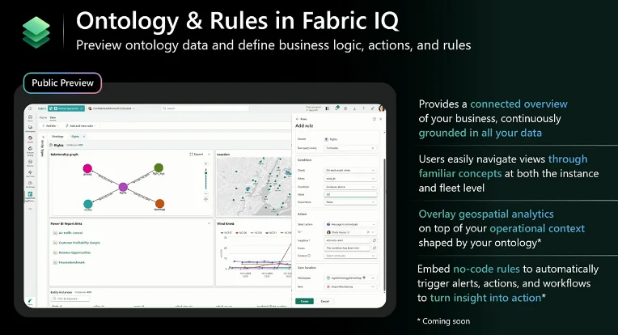

Por anos, o mundo dos dados perseguiu o sonho de uma "única fonte da verdade". No entanto, na prática, o que muitas empresas construíram foi uma verdadeira Torre de Babel. Cada departamento, cada equipe, cada analista criou seu próprio dialeto, suas próprias definições para métricas essenciais. O resultado? Relatórios conflitantes, decisões baseadas em números divergentes e uma desconfiança generalizada nos dados. Dez relatórios de vendas mostravam dez números diferentes para "receita líquida", e ninguém sabia qual era o correto.

O [Microsoft Fabric](https://www.linkedin.com/company/microsoft-fabric-world/) IQ, uma das novidades mais impactantes do Ignite 2025, não é apenas mais uma ferramenta nesse cenário; ele é a solução arquitetural para demolir essa Torre de Babel. Ele foi projetado para resolver a causa raiz do problema: a ausência de um dicionário central e governado para a linguagem do negócio. O Fabric IQ propõe uma mudança de paradigma: em vez de replicar a lógica de negócio em cada relatório e modelo, vamos defini-la uma única vez, em um único lugar, e fazer com que todo o ecossistema de relatórios de BI a agentes de IA beba dessa mesma fonte.

Neste artigo, vamos mergulhar fundo no que é o Fabric IQ, desmembrando seus componentes, explicando como ele funciona tecnicamente e, o mais importante, qual o impacto transformador que ele traz para a arquitetura de dados e para a forma como as empresas tomarão decisões no futuro. É o fim da era da ambiguidade e o começo da era da clareza semântica.

### O que é, de Fato, o Fabric IQ?

Se a Torre de Babel corporativa foi construída sobre a falta de uma linguagem comum, o Fabric IQ chega para ser o **dicionário universal e o tradutor oficial** dessa nova era. Imagine que cada departamento (Vendas, Marketing, Finanças) falava um dialeto diferente, tornando a comunicação impossível. O Fabric IQ não apenas cria um idioma único e oficial para toda a empresa, mas também garante que todos o falem fluentemente, eliminando a confusão e a ambiguidade de uma vez por todas.

Tecnicamente, o Fabric IQ é a camada de inteligência semântica do Microsoft Fabric. Ele centraliza a lógica de negócio em um novo item de primeira classe no Fabric chamado Ontology. Uma ontologia é, essencialmente, um modelo formal do seu negócio. É onde você define o que são as "coisas" importantes (entidades como Cliente, Produto, Venda), como elas se relacionam entre si (um Cliente faz uma Venda, uma Venda contém um Produto) e quais são as regras e hierarquias que as governam.

O poder do Fabric IQ vem de seus cinco componentes integrados, que trabalham em conjunto para dar vida a essa ontologia:

1. **Ontology:** O "plano mestre" ou o "DNA" do negócio. Define as entidades, relacionamentos e regras.
2. **Semantic Model:** A camada de análise sobre o plano mestre. Adiciona as métricas, KPIs e cálculos (DAX) que serão usados em relatórios.
3. **Graph:** O sistema de conexões. Permite consultas complexas que atravessam os relacionamentos definidos na ontologia.
4. **Data Agent:** O "tradutor" inteligente. Usa a ontologia para entender perguntas em linguagem natural e encontrar respostas nos dados.
5. **Operations Agent:** O "guardião" autônomo. Monitora os dados em tempo real e toma ações com base nas regras definidas na ontologia.

## A Anatomia do Fabric IQ: Mergulhando nos 5 Componentes

Para entender o impacto do Fabric IQ, é preciso entender como cada uma de suas partes funciona.

### 1. Ontology: A Fundação de Tudo

A Ontology é o coração do Fabric IQ. É aqui que a mágica começa. Em vez de modelar dados em tabelas e colunas, você passa a modelar o negócio em entidades e relacionamentos. A grande vantagem é que isso pode ser feito de forma low-code, permitindo que usuários de negócio colaborem com a equipe técnica para criar um modelo que realmente reflita a realidade da empresa. Uma capacidade chave é a **geração automática de ontologias** a partir de modelos semânticos do Power BI já existentes, o que significa que você pode reutilizar o trabalho já feito e acelerar a adoção.

\_Fabric IQ Ontology\_

### 2. Semantic Model: A Lente do BI sobre o Negócio

Se a Ontology é o mapa do tesouro, o Semantic Model são as ferramentas que você usa para interpretá-lo. É aqui que a lógica de BI tradicional, como métricas complexas em DAX, KPIs e perspectivas de análise, é adicionada sobre a ontologia. A diferença crucial é que essa lógica é construída sobre um modelo de negócio consistente e governado, e não sobre tabelas soltas. Isso garante que, quando você cria um KPI de "Crescimento de Vendas", a definição de "Venda" é a mesma para todos.

### 3. Graph: O Poder das Conexões

O Fabric IQ não armazena apenas as entidades; ele entende profundamente como elas se conectam. O componente Graph é um motor de grafo nativo que permite fazer perguntas que seriam extremamente complexas em um modelo relacional tradicional. Por exemplo, você pode facilmente atravessar múltiplos relacionamentos para responder a uma pergunta como: "Mostre-me todos os clientes que compraram o produto X, que tiveram um problema de entrega reportado pelo sensor Y na cadeia de frio, e que abriram um ticket de suporte nas últimas 24 horas". O grafo torna o raciocínio entre domínios uma capacidade nativa.

### 4. Data Agent: O Analista Virtual

Os Data Agents são o rosto do Fabric IQ para o usuário final. São agentes de IA que você pode consultar em linguagem natural. Como eles são "criados" sobre a Ontology, eles já nascem com um profundo conhecimento do seu negócio. Quando um usuário pergunta "Quais foram meus clientes mais rentáveis no Brasil no último trimestre?", o agente sabe o que é um "cliente", o que significa "rentável", como filtrar por "Brasil" e como interpretar "último trimestre", porque todas essas definições e hierarquias estão na ontologia. É a democratização do acesso a insights, sem a necessidade de saber SQL ou DAX.

### 5. Operations Agent: A Inteligência em Ação

Enquanto os Data Agents respondem a perguntas, os Operations Agents agem. Eles são agentes autônomos que monitoram os dados em tempo real e executam ações com base nas regras definidas na ontologia. Por exemplo, uma regra na ontologia pode dizer: "Se a temperatura de um contêiner de vacinas (entidade) exceder 5°C (regra), acione um alerta (ação) para o gerente de logística responsável (relacionamento)". Os Operations Agents transformam o conhecimento de negócio em automação inteligente, 24 horas por dia, 7 dias por semana.

## O Impacto Arquitetural: Por que o Fabric IQ Muda o Jogo

Para quem projeta e constrói sistemas de dados, o Fabric IQ representa uma mudança fundamental. O principal impacto é a **consolidação definitiva da camada semântica**. Isso resolve uma série de problemas arquiteturais crônicos:

- **Fim da Redundância:** A lógica de negócio é definida uma única vez. Você não precisa mais copiar e colar a mesma fórmula DAX em 20 modelos diferentes do Power BI. A manutenção se torna trivial: atualize a regra na ontologia, e todos os relatórios e agentes que a consomem são atualizados automaticamente.
- **Governança Centralizada:** A Ontology se torna o ponto central de governança. É ali que a linhagem de dados (data lineage) converge com a semântica, permitindo rastrear não apenas de onde o dado veio, mas o que ele significa em cada etapa. A segurança e as políticas de acesso são aplicadas na própria ontologia, garantindo consistência.
- **Reutilização e Agilidade:** Uma vez que a ontologia do negócio está construída, ela se torna um ativo reutilizável para qualquer novo projeto. Uma nova equipe de produto não precisa "redescobrir" o que é um cliente; ela simplesmente consome a entidade "Cliente" da ontologia. Isso acelera drasticamente o tempo de desenvolvimento de novas soluções de dados e IA.
- **Unificação de BI e IA:** O Fabric IQ derruba a parede que tradicionalmente existia entre o mundo do Business Intelligence e o da Inteligência Artificial. A mesma camada semântica que alimenta um dashboard no Power BI é usada para "ensinar" um agente de IA sobre o negócio. Isso garante que os insights do BI e as respostas da IA sejam sempre consistentes.

## Como Implementar o Fabric IQ na Prática: Um Guia Inicial

Saber o que o Fabric IQ faz é uma coisa; implementá-lo é outra. A abordagem não deve ser um "big bang", mas sim um processo iterativo e estratégico. Aqui está um guia passo a passo para começar:

1. **Comece Pequeno, Pense Grande:** Não tente modelar toda a empresa de uma vez. Escolha um domínio de negócio crítico e bem compreendido, como "Vendas" ou "Clientes". O objetivo é criar valor rapidamente e usar esse primeiro projeto como um caso de sucesso para expandir.
2. **Reutilize o que Já Existe:** A capacidade de gerar uma ontologia a partir de modelos semânticos existentes do Power BI é seu melhor ponto de partida. Identifique o modelo de Power BI mais completo e confiável do domínio escolhido e use-o para criar a primeira versão da sua ontologia. Isso economiza tempo e aproveita o conhecimento já embutido nos seus relatórios.
3. **Envolva o Negócio (de Verdade):** A ontologia é um modelo de negócio, não apenas um artefato técnico. Use a interface low-code para sentar com os especialistas do domínio (analistas de negócio, gerentes de produto) e refinar as entidades, relacionamentos e regras. Faça perguntas como: "O que define um 'cliente ativo' para você?" ou "Quais são os estágios de vida de um 'pedido'?". Essa colaboração é crucial para o sucesso.
4. **Conecte os Dados:** Uma vez que a ontologia esteja definida, o próximo passo é vincular os dados reais do OneLake a ela. Mapeie as tabelas e colunas do seu lakehouse às entidades e propriedades da ontologia. É aqui que os dados brutos ganham significado de negócio.
5. **Construa em Cima:** Com a ontologia populada, comece a construir. Crie um novo Semantic Model sobre ela para seus relatórios de BI. Configure um Data Agent para permitir que os usuários façam perguntas em linguagem natural. Crie um Operations Agent para automatizar um processo simples. O importante é demonstrar o valor da camada semântica unificada em diferentes experiências.

## Estratégias para Migrar seus Modelos Semânticos

A migração de dezenas ou centenas de modelos do Power BI para uma ontologia centralizada pode parecer assustadora, mas com a estratégia certa, ela se torna um processo de agregação de valor, e não de refatoração custosa.

### Abordagem 1: A Estratégia do "Golden Model"

Nesta abordagem, você identifica o modelo semântico mais abrangente e confiável da organização o "Golden Model". Este modelo se torna a base para a sua ontologia principal. A migração ocorre em fases:

1. **Extração:** Use o "Golden Model" para gerar a ontologia inicial no Fabric IQ.
2. **Consolidação:** Analise outros modelos semânticos que são subconjuntos ou variações do "Golden Model". Em vez de migrá-los, aposente-os e passe a usar o novo Semantic Model centralizado, criado sobre a ontologia. Use as perspectivas do Power BI para fornecer visões personalizadas para diferentes grupos de usuários, se necessário.
3. **Expansão:** Para modelos que contêm lógicas de negócio que não estavam no "Golden Model", enriqueça a ontologia central com essas novas entidades, relacionamentos ou regras. O objetivo é fazer a ontologia crescer organicamente.

### Abordagem 2: A Estratégia Federada por Domínio

Para organizações muito grandes e descentralizadas, uma única ontologia pode ser impraticável no início. A estratégia federada propõe a criação de múltiplas ontologias, uma para cada grande domínio de negócio (Finanças, RH, Marketing, etc.).

1. **Mapeamento de Domínios:** Identifique os principais domínios de dados da empresa e os modelos semânticos associados a cada um.
2. **Ontologia por Domínio:** Crie uma ontologia separada para cada domínio, seguindo a abordagem do "Golden Model" dentro de cada um. Isso permite que as equipes de domínio trabalhem de forma autônoma.
3. **Conexão entre Domínios:** O passo crucial é criar relacionamentos entre as ontologias de domínio. Por exemplo, a entidade "Cliente" na ontologia de Marketing pode ser vinculada à entidade "Cliente" na ontologia de Finanças. O Fabric IQ foi projetado para suportar esse tipo de federação, permitindo que você tenha governança local com conectividade global.

Independentemente da abordagem, o princípio é o mesmo: **pare de replicar, comece a reutilizar.** A migração para o Fabric IQ não é sobre mover arquivos PBIX de um lugar para outro; é sobre extrair a lógica de negócio valiosa que vive dentro deles e elevá-la a uma camada de inteligência compartilhada, governada e reutilizável para toda a organização.

### Conclusão: De Dados a Inteligência Real

O Fabric IQ é muito mais do que uma nova feature; é a peça que faltava no quebra-cabeça da empresa orientada a dados. Ele ataca a raiz do problema da inconsistência semântica, fornecendo uma fundação sólida sobre a qual podemos construir análises, agentes de IA e processos automatizados com confiança.

Ao criar um "dicionário" central e vivo para o negócio, o Fabric IQ transforma o OneLake de um simples repositório de dados em um verdadeiro cérebro digital para a organização. É a tecnologia que finalmente nos permite parar de discutir sobre o que os dados significam e começar a agir com base no conhecimento unificado que eles fornecem.

### Referências

- [Fabric IQ: The Semantic Foundation for Enterprise AI](https://blog.fabric.microsoft.com/en-us/blog/introducing-fabric-iq-the-semantic-foundation-for-enterprise-ai/)
- [From Data Platform to Intelligence Platform: Introducing Microsoft Fabric IQ](https://blog.fabric.microsoft.com/en-us/blog/from-data-platform-to-intelligence-platform-introducing-microsoft-fabric-iq?ft=All)
