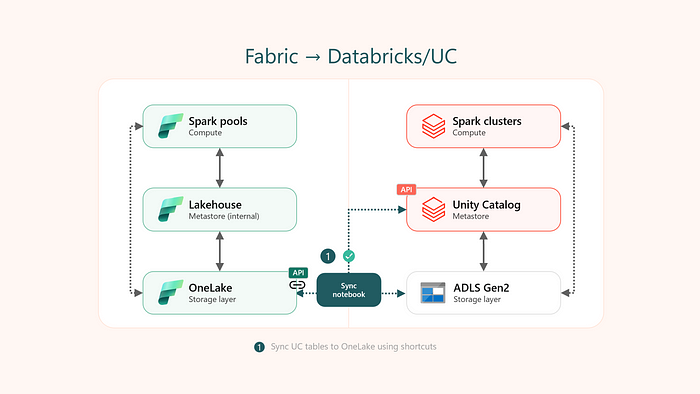
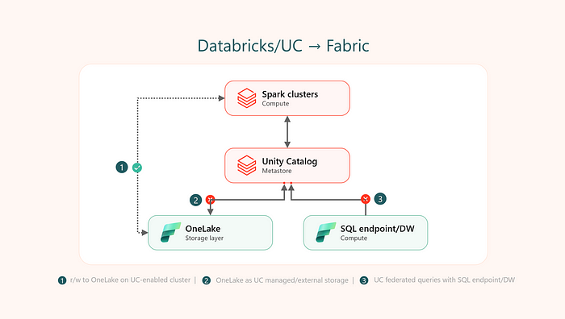

*Este artigo reflete minhas experiências e pontos de vista pessoais, e não a posição oficial da Microsoft ou da Databricks. Além disso, embora esta postagem descreva cenários potenciais, ela não reflete necessariamente o roadmap ou as intenções do Fabric. Nem todas as opções mencionadas podem se tornar operacionais no futuro.*

No cenário dinâmico e em constante evolução da tecnologia, a integração de diferentes ferramentas e plataformas se torna essencial para maximizar a eficiência e a inovação. No artigo "Futuro Conectado: Unity Catalog e Microsoft Fabric Trabalhando Juntos", vamos explorar como a combinação do Unity Catalog, uma solução robusta para gestão de dados da Databricks, e o Microsoft Fabric, uma plataforma poderosa para aplicações de nuvem e dados da Microsoft, está transformando a forma como as organizações gerenciam, analisam e utilizam seus dados. Essa colaboração promete não apenas otimizar o armazenamento e a governança dos dados, mas também acelerar o desenvolvimento de insights e a tomada de decisões estratégicas, criando um futuro mais conectado e inteligente para empresas de todos os setores.

Os cenários de integração podem ser essencialmente visualizados com base no ponto de entrada, Unity Catalog e Fabric:

**Acessando o Unity Catalog a partir do Fabric (Fabric → Unity Catalog):** Essa funcionalidade pode permitir que os usuários acessem perfeitamente o catálogo, os esquemas e as tabelas do Unity Catalog de dentro do Fabric.

**Utilizando o Fabric a partir do Unity Catalog (DBX/Unity Catalog → Fabric):** Esse recurso pode oferecer aos usuários a capacidade de acessar e usar o OneLake diretamente do Unity Catalog e executar consultas federadas sobre um endpoint SQL ou o Fabric Data Warehouse.

Vamos explorar esses cenários mais detalhadamente.

### Fabric → Unity Catalog

**Usando o Unity Catalog a partir do Fabric**

Se você está no Fabric, aqui estão algumas opções para acessar as tabelas do Unity Catalog a partir do Fabric. Você também pode ler/gravar diretamente do Spark do Fabric para o ADLS Gen2.



**Opções atuais**

Atualmente, os usuários têm duas opções para criar atalhos para tabelas do Unity Catalog: manual ou semiautomática, sendo esta última realizável por meio de um notebook. Com o método semiautomático, os usuários podem integrar tabelas externas UC Delta ao OneLake criando atalhos. Eles especificam os nomes do catálogo e do esquema para sincronização, o que gera atalhos para tabelas nesses esquemas dentro do lakehouse do Fabric.

Veja instruções adicionais sobre a execução do notebook utilitário.

```
# configuration
dbx_workspace = "<databricks_workspace_url>"
dbx_token = "<pat_token>"
dbx_uc_catalog = "catalog_example"
dbx_uc_schemas = '["schema1", "schema2"]'

fab_workspace_id = "<workspace_id>"
fab_lakehouse_id = "<lakehouse_id>"
fab_shortcut_connection_id = "<connection_id>"
fab_consider_dbx_uc_table_changes = True

# sync UC tables to lakehouse
sc.addPyFile('https://raw.githubusercontent.com/microsoft/fabric-samples/main/docs-samples/onelake/unity-catalog/util.py')
from util import *
databricks_config = {
    'dbx_workspace': dbx_workspace,
    'dbx_token': dbx_token,
    'dbx_uc_catalog': dbx_uc_catalog,
    'dbx_uc_schemas': json.loads(dbx_uc_schemas)
}
fabric_config = {
    'workspace_id': fab_workspace_id,
    'lakehouse_id': fab_lakehouse_id,
    'shortcut_connection_id': fab_shortcut_connection_id,
    "consider_dbx_uc_table_changes": fab_consider_dbx_uc_table_changes
}
sync_dbx_uc_tables_to_onelake(databricks_config, fabric_config)        
```

**Opções futuras potenciais**

**Item nativo do Unity Catalog no Fabric:** semelhante à migração de metadados do Hive Metastore para o lakehouse do Fabric, os metadados do Unity Catalog podem ser sincronizados com o lakehouse do Fabric, permitindo o acesso às tabelas do Unity Catalog. Uma prévia desse cenário foi demonstrada na FabCon, mostrando como os usuários poderiam acessar e consultar diretamente as tabelas do Unity Catalog usando a interface do Fabric.

**Atalho do Unity Catalog no Fabric:** semelhante aos atalhos do Dataverse, a experiência de usuário de atalhos do OneLake poderia, potencialmente, suportar a criação de atalhos para tabelas do Unity Catalog.

### Databricks Unity Catalog → Fabric

Utilizando o Fabric e o OneLake a partir do Databricks Unity Catalog

O Unity Catalog oferece diferentes maneiras de conectar e aproveitar as conexões de armazenamento de objetos na nuvem (por exemplo, ADLS Gen2), bem como se conectar a sistemas de dados externos para executar consultas federadas (por exemplo, Azure Synapse).



**Opções atuais**

Atualmente, os usuários podem usar o OneLake a partir de clusters habilitados para Unity Catalog da seguinte forma: (i) leitura/escrita para o OneLake usando autenticação baseada em Service Principal (SPN), e (ii) leitura/escrita para o OneLake usando pontos de montagem com autenticação SPN.

```
# r/w using spn
workspace_name = "<workspace_name>"
lakehouse_name = "<lakehouse_name>"
tenant_id = "<tenant_id>"
service_principal_id = "<service_principal_id>"
service_principal_password = "<service_principal_password>"

spark.conf.set("fs.azure.account.auth.type", "OAuth")
spark.conf.set("fs.azure.account.oauth.provider.type", "org.apache.hadoop.fs.azurebfs.oauth2.ClientCredsTokenProvider")
spark.conf.set("fs.azure.account.oauth2.client.id", service_principal_id)
spark.conf.set("fs.azure.account.oauth2.client.secret", service_principal_password)
spark.conf.set("fs.azure.account.oauth2.client.endpoint", f"https://login.microsoftonline.com/{tenant_id}/oauth2/token")

# read
df = spark.read.format("parquet").load(f"abfss://{workspace_name}@onelake.dfs.fabric.microsoft.com/{lakehouse_name}.Lakehouse/Files/data")
df.show(10)

# write
df.write.format("delta").mode("overwrite").save(f"abfss://{workspace_name}@onelake.dfs.fabric.microsoft.com/{lakehouse_name}.Lakehouse/Tables/dbx_delta_spn")        
```
```
# mount with spn
workspace_id = "<workspace_id>"
lakehouse_id = "<lakehouse_id>"
tenant_id = "<tenant_id>"
service_principal_id = "<service_principal_id>"
service_principal_password = "<service_principal_password>"

configs = {
    "fs.azure.account.auth.type": "OAuth",
    "fs.azure.account.oauth.provider.type": "org.apache.hadoop.fs.azurebfs.oauth2.ClientCredsTokenProvider",
    "fs.azure.account.oauth2.client.id": service_principal_id,
    "fs.azure.account.oauth2.client.secret": service_principal_password,
    "fs.azure.account.oauth2.client.endpoint": f"https://login.microsoftonline.com/{tenant_id}/oauth2/token"
}

mount_point = "/mnt/onelake-fabric"
dbutils.fs.mount(
    source = f"abfss://{workspace_id}@onelake.dfs.fabric.microsoft.com",
    mount_point = mount_point,
    extra_configs = configs
)

# read
df = spark.read.format("parquet").load(f"/mnt/onelake-fabric/{lakehouse_id}/Files/data")
df.show(10)

# write
df.write.format("delta").mode("overwrite").save(f"/mnt/onelake-fabric/{lakehouse_id}/Tables/dbx_delta_mount_spn")        
```

Nota: Criar uma tabela externa usando o caminho OneLake abfss ou o caminho de montagem agora resultará em uma exceção no Unity Catalog. Atualmente, você não pode registrar uma tabela externa no Unity Catalog com o OneLake como armazenamento subjacente. Isso pode levar a cenários potenciais futuros.

> INVALID\_PARAMETER\_VALUE: Missing cloud file system scheme

> Failed to acquire a SAS token for list. Invalid Azure Path

**Opções futuras potenciais**

Semelhante ao ADLS Gen2 e ao Azure Synapse, diferentes opções poderiam existir no futuro:

**OneLake como armazenamento gerenciado padrão**: O Databricks começou a implementar a habilitação automática do Unity Catalog, ou seja, um metastore do Unity Catalog provisionado automaticamente com armazenamento gerenciado pelo Databricks (por exemplo, ADLS Gen2). No entanto, o usuário também pode criar armazenamento gerenciado pelo usuário no nível do metastore ao criar o metastore do Unity Catalog apontando para o OneLake neste caso. Isso ainda não é possível.

**OneLake como localização externa**: Localizações externas são usadas para definir locais de armazenamento gerenciado para catálogos e esquemas, e para definir locais para tabelas externas e volumes externos. Por exemplo, se os usuários estiverem usando tabelas externas no Spark, o OneLake poderia ser aproveitado como uma localização externa.

**OneLake para Volumes**: Volumes representam um volume lógico de armazenamento em uma localização de armazenamento de objetos na nuvem, adicionando governança sobre conjuntos de dados não tabulares. Volumes externos e gerenciados poderiam existir usando o OneLake, por exemplo, como para o ADLS Gen2.

**Federated Lakehouse**: Acesso somente leitura a dados em endpoint SQL ou Fabric Data Warehouse usando catálogos estrangeiros do Unity Catalog pode ser uma opção futura. A autenticação atual do Azure Synapse e do SQL é baseada em nome de usuário/senha e o SPN ainda não é suportado, então essa opção ainda não é possível. Catálogos estrangeiros não suportam armazenamento de objetos agora, então ainda não está claro se o catálogo estrangeiro para OneLake/Lakehouse será possível.
