As soluções tradicionais de análise de dados em grande escala contam com data warehouses e consultas SQL para armazenar e recuperar dados. No entanto, a ascensão do big data, caracterizada por grandes [#volumes](https://www.linkedin.com/feed/hashtag/volumes) , [#variedade](https://www.linkedin.com/feed/hashtag/variety) e [#velocidade](https://www.linkedin.com/feed/hashtag/speed) de novos dados, juntamente com armazenamento acessível e computação distribuída baseada em nuvem, introduziu uma nova abordagem: o datalake. Ao contrário dos data warehouses, os datalakes armazenam informações como arquivos sem um esquema fixo.

Para preencher a lacuna entre data warehouses e datalakes, engenheiros e analistas de dados estão cada vez mais recorrendo a uma solução híbrida chamada data lakehouse. O Microsoft Fabric oferece uma solução lakehouse poderosa que combina a escalabilidade do armazenamento de arquivos em um armazenamento OneLake (criado no Azure Data Lake Store Gen2) com uma camada de metadados relacionais baseada no formato de tabela Delta Lake de código aberto. Isso permite armazenar dados em arquivos dentro do seu datalake e aplicar um esquema relacional para habilitar consultas SQL.

Com o Microsoft Fabric, você pode aproveitar as vantagens dos data warehouses e dos datalakes, permitindo definir tabelas e exibições usando os recursos de esquema do Delta Lake e consultá-los usando a semântica SQL familiar.

### Configurando seu espaço de trabalho no Microsoft Fabric

Configurar um espaço de trabalho no Microsoft Fabric é o primeiro passo para desbloquear seus recursos de dados. Seguindo estas instruções simples, você estará pronto para trabalhar com dados perfeitamente:

1. Acesse o Microsoft Fabric visitando <https://app.fabric.microsoft.com> e faça login.

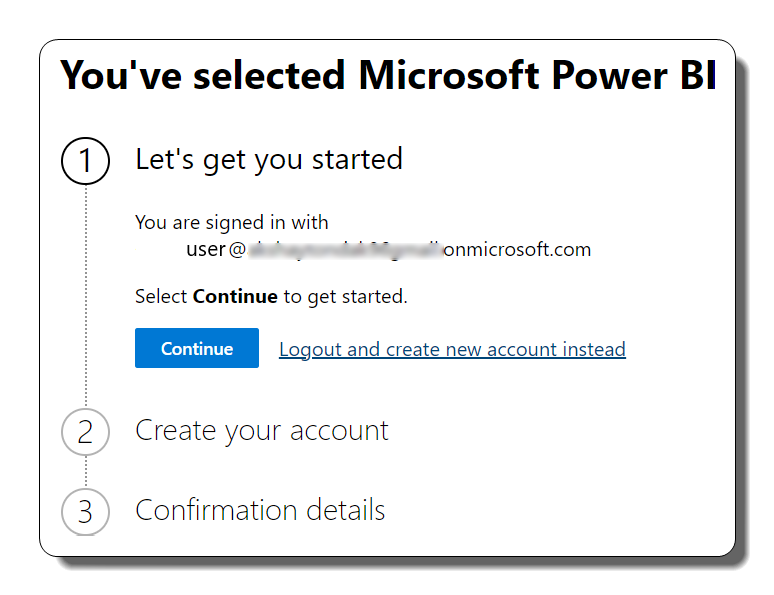

2. Navegue até a barra de menu do lado esquerdo e clique na opção Workspaces (você a reconhecerá pelo ícone semelhante a 🗇).

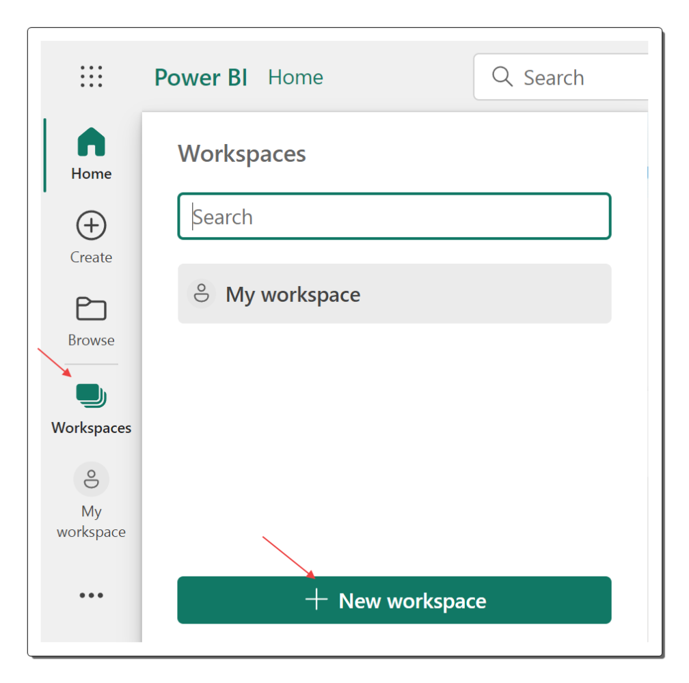

3. Crie um novo espaço de trabalho escolhendo um nome que atenda às suas necessidades. Certifique-se de selecionar um modo de licenciamento que inclua capacidade do Fabric, como Avaliação, Premium ou Fabric.

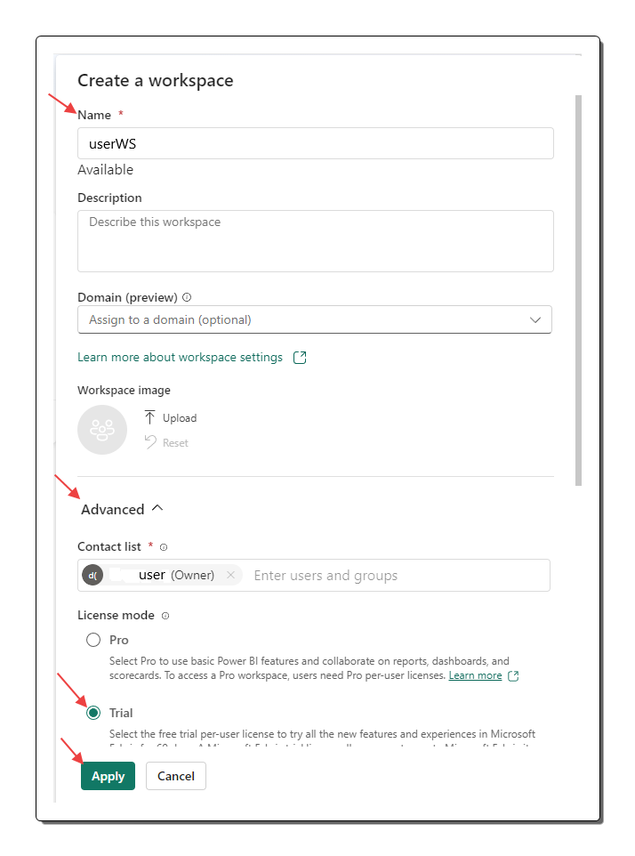

4. Assim que seu novo espaço de trabalho for criado, ele se abrirá, parecendo vazio e pronto para você começar a aproveitar seu potencial.

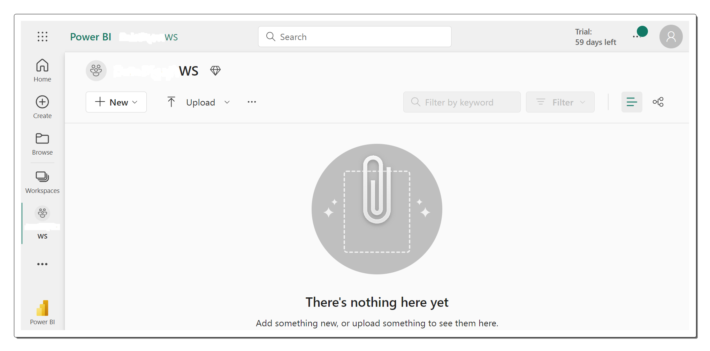

### Criando um Data Lakehouse no Microsoft Fabric

Agora que você estabeleceu seu espaço de trabalho, é hora de mergulhar na experiência de Engenharia de Dados no portal e construir um data lakehouse para abrigar seus valiosos arquivos de dados. Siga estas etapas para começar:

1. No portal do Power BI, localize o canto inferior esquerdo e mude para a experiência Data Engineering.

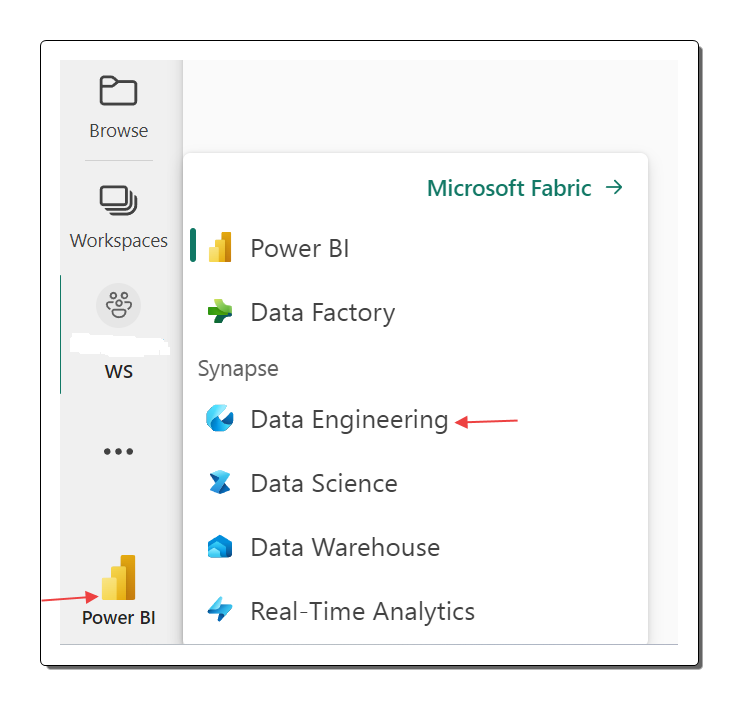

2. A página inicial da Engenharia de Dados apresenta uma variedade de blocos que permitem criar facilmente ativos de engenharia de dados comumente usados.

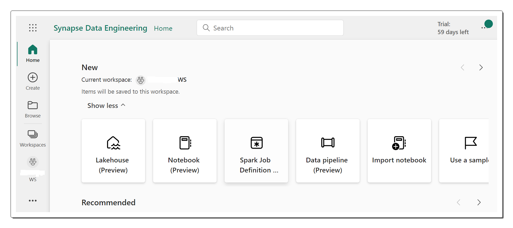

3. Na página inicial do Data Engineering, inicie a criação de um novo Lakehouse fornecendo-lhe um nome adequado ao seu propósito.

4. Após uma breve espera, um novo datalake será gerada, abrindo possibilidades emocionantes de exploração.

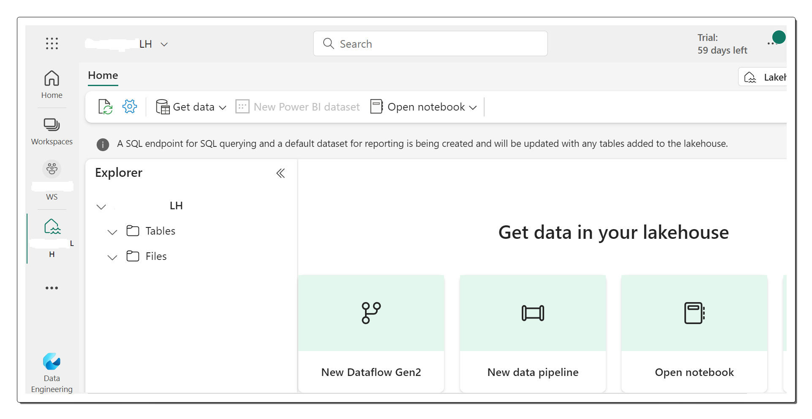

5. Observe o painel do explorador Lakehouse no lado esquerdo, que lhe dá acesso para navegar pelas tabelas e arquivos que residem em sua lakehouse.

- A pasta **Tabelas** hospeda tabelas que podem ser consultadas usando a semântica SQL. Essas tabelas no lakehouse do Microsoft Fabric aderem ao formato de arquivo Delta Lake de código aberto, amplamente empregado no Apache Spark.

- A pasta **Arquivos** contém os arquivos de dados armazenados no armazenamento OneLake, designado especificamente para seu datalake. Esta pasta também permite criar atalhos para fazer referência a dados armazenados externamente.

Atualmente, seu lakehouse não contém nenhuma tabela ou arquivo, fornecendo a você uma base limpa para iniciar sua jornada de exploração de dados.

### Ingestão de dados em seu Microsoft Fabric Lakehouse

Para enriquecer seu lakehouse com dados valiosos, o Microsoft Fabric oferece vários métodos de ingestão de dados. Embora pipelines e fluxos de dados forneçam opções avançadas para copiar dados de fontes externas, uma das abordagens mais simples é fazer upload de arquivos ou pastas diretamente do seu computador local. Siga estas etapas para fazer upload de dados perfeitamente para seu lakehouse:

1. Baixe o arquivo sales.csv da seguinte fonte: [URL do arquivo sales.csv do Kaggle](<https://www.kaggle.com/datasets/kyanyoga/sample-sales-data?resource=download>). Salve o arquivo como sales.csv em seu computador local.

2. Retorne à guia do navegador onde seu datalake está aberta. No painel do Lakehouse Explorer, acesse a pasta Arquivos e clique no menu de reticências (...). No menu suspenso, selecione “Nova subpasta” para criar uma subpasta chamada “dados”.

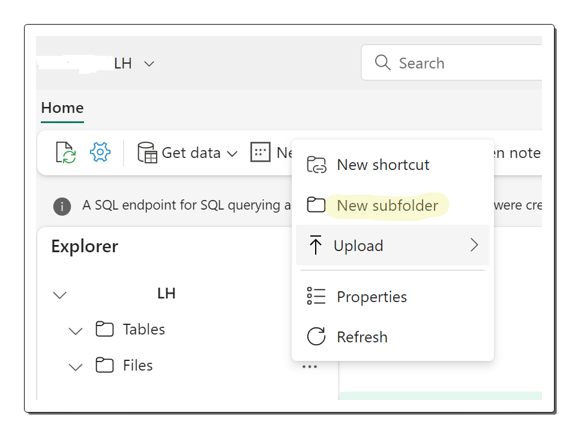

3. No menu de reticências da pasta de dados recém-criada, escolha "Upload" e selecione "Upload file". Continue carregando o arquivo sales.csv do seu computador local.

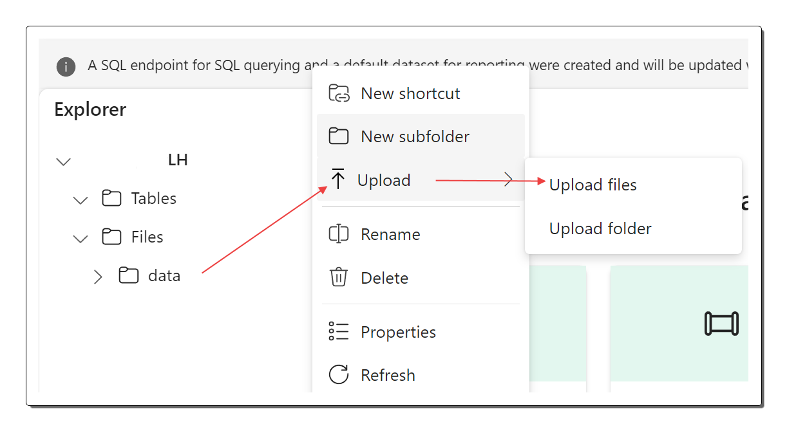

4. Assim que o upload for concluído, navegue até a pasta Arquivos/dados e verifique se o arquivo sales.csv foi carregado com sucesso. Deve estar visível no conteúdo da pasta.

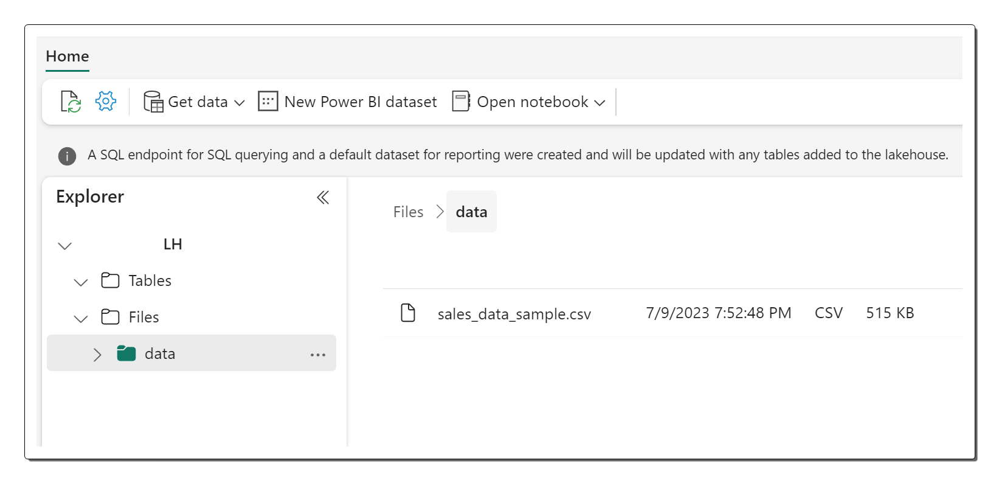

5. Para visualizar o conteúdo do arquivo enviado, basta selecionar o arquivo sales.csv.

Seguindo essas etapas, você pode facilmente trazer dados para seu Microsoft Fabric lakehouse, permitindo explorar e analisar o arquivo sales.csv carregado e desbloquear seus insights.

### Transformando dados de arquivos em tabelas consultáveis

Para aprimorar a usabilidade dos dados de vendas carregados, o Microsoft Fabric oferece a capacidade de carregar os dados de um arquivo em uma tabela. Isso permite que analistas e engenheiros de dados aproveitem consultas SQL para uma exploração eficiente de dados. Siga estas etapas para carregar perfeitamente os dados do arquivo em uma tabela:

1. Comece navegando até a página inicial e selecionando a pasta Arquivos/Dados. Aqui você encontrará o arquivo sales.csv que foi carregado anteriormente.

2. Acesse o menu de reticências (...) do arquivo sales.csv e escolha "Carregar em tabelas" nas opções fornecidas.

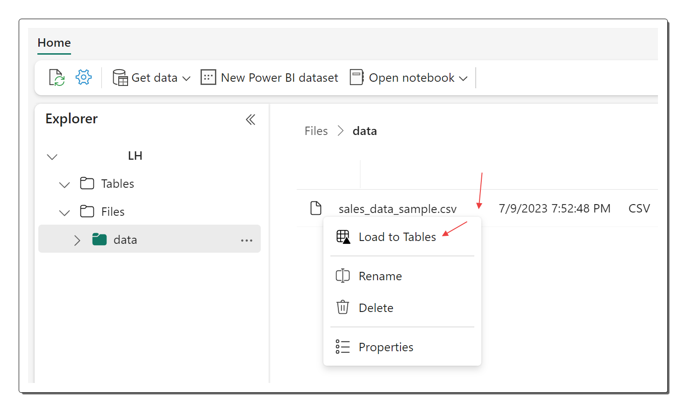

3. Na caixa de diálogo Carregar na tabela, atribua um nome adequado à tabela, como "vendas", e confirme a operação de carregamento. Agora, espere pacientemente que o processo de criação da tabela e carregamento de dados seja concluído.

4. No painel do explorador Lakehouse, localize a tabela de “vendas” recém-criada para obter visibilidade de seus dados.

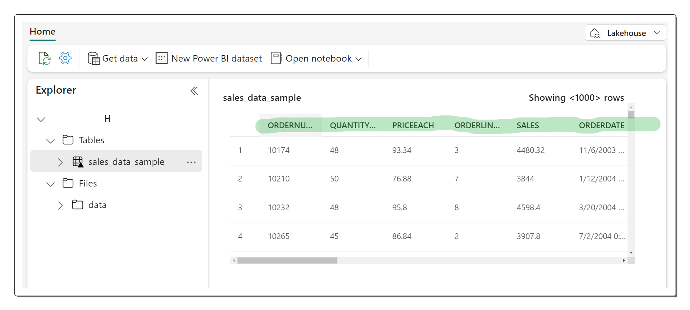

5. Para explorar os arquivos subjacentes associados à tabela de vendas, acesse o menu de reticências (...) da tabela e selecione "Exibir arquivos".

Vale ressaltar que os arquivos de uma tabela Delta são armazenados no formato Parquet, incluindo uma subpasta chamada “\_delta\_log” que mantém os detalhes transacionais aplicados à tabela.

Seguindo essas etapas, você pode transformar os dados de vendas carregados em uma tabela consultável, abrindo um mundo de possibilidades para análise de dados e extração de insights valiosos no Microsoft Fabric.

### Desbloqueando a exploração de dados com SQL

Depois de criar um lakehouse e definir tabelas dentro dele, um poderoso endpoint SQL é gerado automaticamente. Este endpoint permite que você consulte suas tabelas sem esforço usando instruções SQL SELECT, permitindo uma exploração de dados contínua. Siga estas etapas para aproveitar o endpoint SQL em seu Microsoft Fabric lakehouse:

1. No canto superior direito da página Lakehouse, localize a opção que alterna entre Lakehouse e SQL endpoint. Clique nele para mudar para o modo de endpoint SQL.

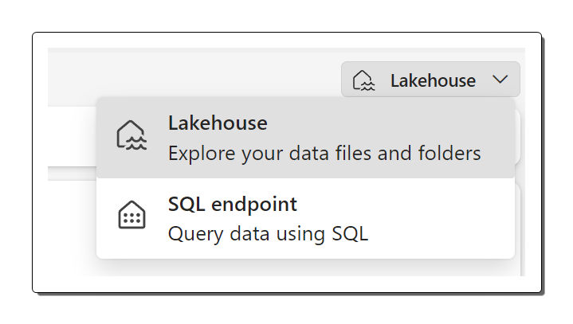

2. Aguarde um breve momento para que o terminal de consulta SQL seja inicializado. Em breve, você verá uma interface visual que permitirá consultar tabelas em seu lakehouse. A interface abrirá possibilidades interessantes para exploração de dados, conforme ilustrado aqui.

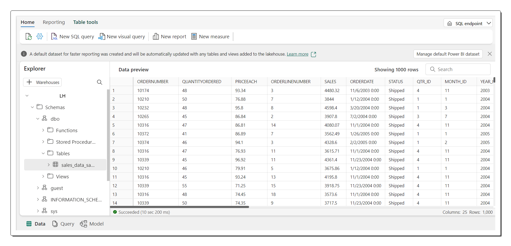

3. Para iniciar a consulta, utilize o botão "Nova consulta SQL", que abrirá um editor de consultas.

```
SELECIONE CÓDIGO DO PRODUTO, AVG(QUANTITYORDERED) AS AvgQuantityOrdered, AVG(PRICEEACH) AS AvgPrice
DE sales_data_sample
AGRUPAMENTO POR CÓDIGO DE PRODUTO;        
```

4. No editor de consultas, insira a consulta SQL desejada. Por exemplo, calcule a quantidade média encomendada e o preço médio para cada código de produto.

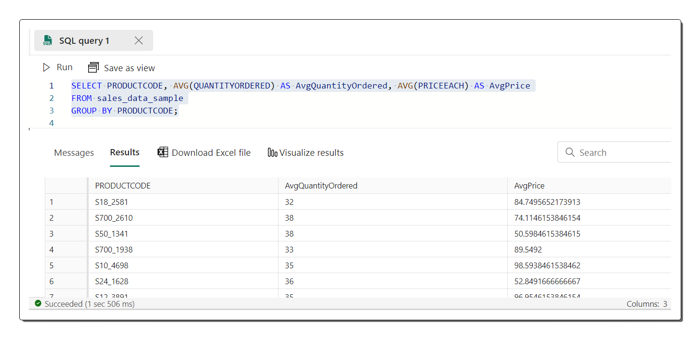

5. Para executar a consulta e visualizar os resultados, basta clicar no botão “▷ Executar”.

Seguindo essas etapas, você pode aproveitar o potencial do endpoint SQL em seu Microsoft Fabric lakehouse, permitindo executar consultas SQL sem esforço e obter insights valiosos de seus dados.

### Criação de relatórios poderosos com Power BI

Dentro do Microsoft Fabric lakehouse, as tabelas que você define tornam-se automaticamente parte de um conjunto de dados padrão, formando a base para relatórios e análises com o Power BI. Siga estas etapas para aproveitar o potencial dos conjuntos de dados padrão e criar relatórios esclarecedores:

1. Na parte inferior da página SQL Endpoint, localize e selecione a guia "Modelo". Esta guia revela o esquema do modelo de dados associado ao conjunto de dados.

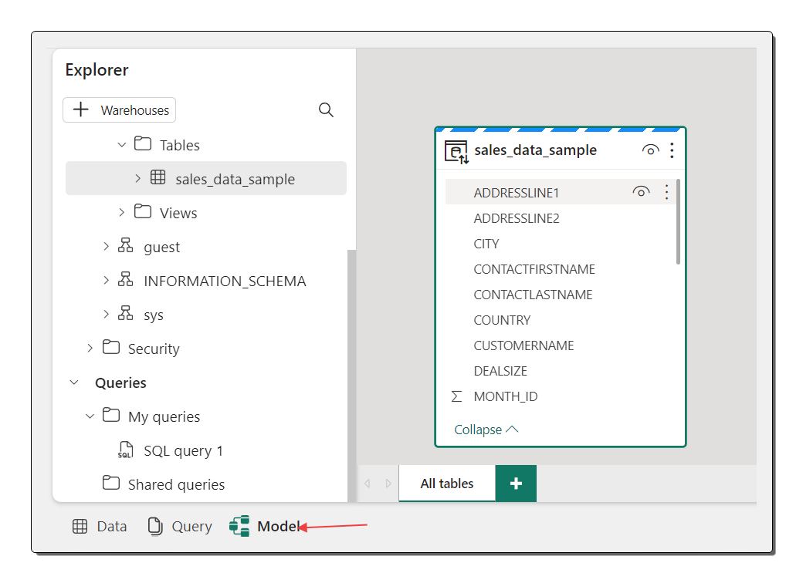

2. Na faixa do menu, navegue até a guia “Relatórios” e clique em “Novo relatório”. Esta ação abre uma nova guia do navegador dedicada à criação do seu relatório.

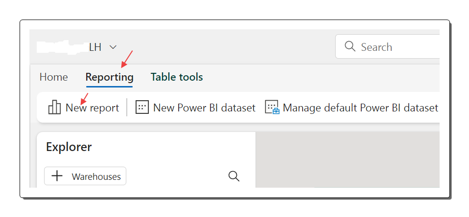

3. No painel Dados à direita, expanda a tabela “vendas”. Selecione os campos desejados para o seu relatório, como “PRODUCTLINE” e “VENDAS”.

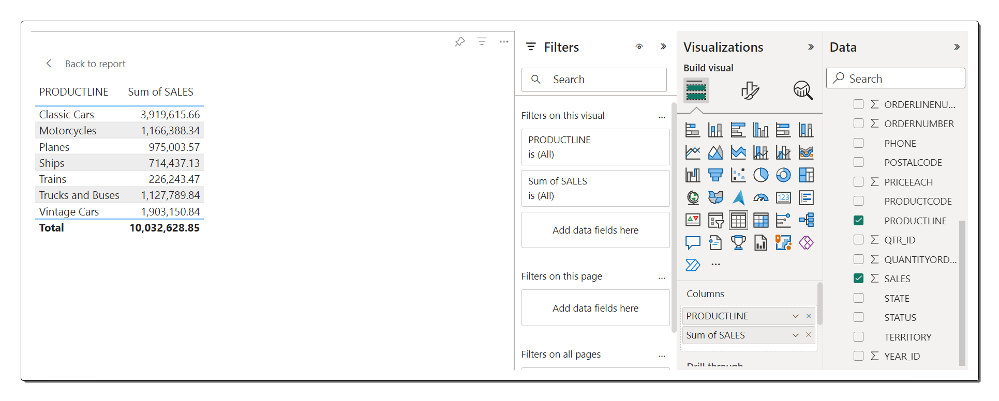

4. Uma visualização de tabela é adicionada automaticamente ao relatório, mostrando os dados selecionados.

5. Para otimizar o espaço de trabalho, oculte os painéis Dados e Filtros, criando mais espaço para o design do relatório. Certifique-se de que a visualização da tabela esteja selecionada e, no painel Visualizações, personalize a visualização convertendo-a em um gráfico de barras agrupado. Ajuste o tamanho e a aparência do gráfico conforme desejado.

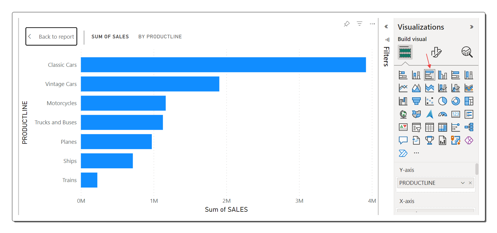

6. Para salvar o progresso realizado, acesse o menu Arquivo e selecione “Salvar”. Salve o relatório como "Relatório de vendas de produtos" no espaço de trabalho que você criou anteriormente.

7. Feche a guia do navegador que contém o relatório para retornar ao endpoint SQL do seu lakehouse. Na barra de menu central à esquerda, selecione seu espaço de trabalho para confirmar se ele agora inclui os seguintes elementos:

  - Seu datalake

  - O endpoint SQL para seu datalake

  - Um conjunto de dados padrão representando as tabelas em seu datalake

  - O relatório "Relatório de vendas de produtos"

Seguindo essas etapas, você pode aproveitar os conjuntos de dados padrão no Lakehouse do Microsoft Fabric para criar relatórios visualmente atraentes e esclarecedores usando o Power BI. Isso permite que você obtenha inteligência de negócios valiosa e tome decisões baseadas em dados com facilidade.

### Limpar recursos

Depois de criar com sucesso uma lakehouse e importar dados para ela, é essencial garantir um gerenciamento eficiente de recursos. Esta seção irá guiá-lo através do processo de limpeza de seus recursos. Vamos mergulhar:

1. Se você concluiu a exploração do datalake e não precisa mais do espaço de trabalho criado para este exercício, é hora de removê-lo.

2. No lado esquerdo da interface, localize e selecione o ícone que representa sua área de trabalho. Esta ação exibe todos os itens contidos na área de trabalho.

3. Na barra de ferramentas, acesse o menu de reticências (...) e clique em “Configurações do espaço de trabalho”.

4. Na seção “Outros” das configurações, encontre e selecione a opção “Remover este espaço de trabalho”.

Seguindo essas etapas, você pode organizar seus recursos de maneira eficaz, eliminando o espaço de trabalho associado ao exercício. Isso garante a utilização eficiente de recursos em seu ambiente Microsoft Fabric Lakehouse. Depois de criar com sucesso uma lakehouse e importar dados para ela, é essencial garantir um gerenciamento eficiente de recursos. Esta seção irá guiá-lo através do processo de limpeza de seus recursos. Vamos mergulhar:

1. Se você concluiu a exploração do datalake e não precisa mais do espaço de trabalho criado para este exercício, é hora de removê-lo.

2. No lado esquerdo da interface, localize e selecione o ícone que representa sua área de trabalho. Esta ação exibe todos os itens contidos na área de trabalho.

3. Na barra de ferramentas, acesse o menu de reticências (...) e clique em “Configurações do espaço de trabalho”.

4. Na seção “Outros” das configurações, encontre e selecione a opção “Remover este espaço de trabalho”.

Seguindo essas etapas, você pode organizar seus recursos de maneira eficaz, eliminando o espaço de trabalho associado ao exercício. Isso garante a utilização eficiente de recursos em seu ambiente Microsoft Fabric Lakehouse.

Ufa, artigo grande para leitura mas espero que seja de grande ajuda !!!

Um abraço !
