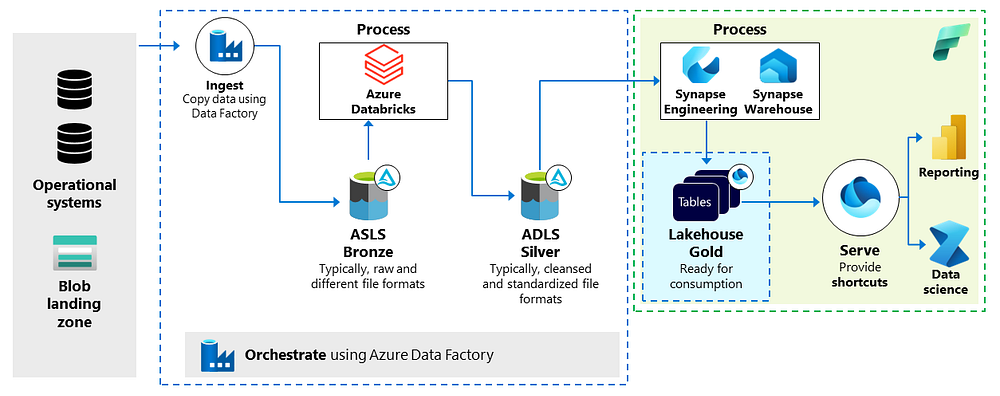

Chegamos ao final da série "Integrando Azure Databricks e Microsoft Fabric". Ao longo dessa jornada, exploramos como essas duas poderosas ferramentas podem ser combinadas para otimizar processos de análise de dados, armazenamento e visualização. Se você ainda não leu os artigos anteriores, começe por [aqui](https://www.linkedin.com/pulse/integrando-azure-databricks-e-microsoft-fabric-um-encontro-lopes-fb1af/).

A próxima consideração de design enfoca a importância de utilizar o Microsoft Fabric e a funcionalidade V-Order. Esta funcionalidade é uma otimização no momento da gravação para o formato de arquivo parquet, permitindo leituras rápidas de dados nos motores de computação do Microsoft Fabric, como o Power BI.

Tanto o Databricks quanto a Microsoft escolheram adotar o Delta Lake, um formato de arquivo colunar de código aberto. No entanto, a Microsoft adicionou uma camada extra de compressão V-Order, proporcionando até 50% mais compressão. O V-Order é totalmente compatível com o formato parquet de código aberto; todos os motores parquet podem lê-lo como arquivos parquet comuns.

Vale notar que é possível aplicar a ordenação V em tabelas que não a possuem, utilizando a funcionalidade de manutenção do Fabric.

O V-Order traz benefícios notáveis para o Microsoft Fabric, especialmente para componentes como o Power BI e os endpoints SQL. Por exemplo, permite que o Power BI se conecte diretamente a dados em tempo real usando o modo Direct Lake, mantendo um alto desempenho nas consultas de dados. Como não há necessidade de processo de importação, as alterações na fonte de dados são refletidas instantaneamente no Power BI, eliminando a espera por uma atualização.

É fundamental destacar que o uso de tabelas otimizadas com V-Order é, por enquanto, exclusivo do Microsoft Fabric. O Databricks ainda não implementou essa funcionalidade. Portanto, até que isso ocorra, será necessário utilizar um serviço dentro do Microsoft Fabric para aproveitar as tabelas otimizadas com V-Order.

Vale ressaltar que, caso a otimização V-Order não seja essencial, a etapa de processamento com Databricks entre os estágios Silver e Gold ainda pode ser relevante. Embora isso possa parecer redundante, é uma opção viável para continuar o processamento de dados com Databricks.

Outro motivo significativo pelo qual as organizações escolhem esse design é a consistência transacional entre várias tabelas. Manter essa consistência, especialmente no estágio Gold, é crucial. Atualmente, o Spark só suporta transações em tabelas individuais. Assim, se houver inconsistências de dados entre tabelas, elas precisam ser resolvidas por meio de medidas compensatórias. Por exemplo, você pode confirmar inserções em várias tabelas ou em nenhuma delas se ocorrer um erro. Se estiver alterando detalhes de um pedido de compra que afetam três tabelas, é possível agrupar essas alterações em uma única transação. Isso significa que, ao consultar essas tabelas, elas terão todas as mudanças ou nenhuma delas. Essa preocupação com a integridade destaca a importância de um ambiente capaz de gerenciar transações complexas em várias tabelas. O Microsoft Fabric Warehouse é a única plataforma que suporta isso sobre o Delta Lake. Para saber mais, clique aqui.

Na arquitetura atualizada, ilustrada na imagem acima, o Synapse Engineering agora atua como o motor de processamento do estágio Silver para o Gold. Essa abordagem garante que todas as tabelas sejam otimizadas com V-Order. Além disso, o Synapse Warehouse foi adicionado para casos de uso que exigem capacidades transacionais. No entanto, essas mudanças arquitetônicas exigem que os engenheiros de dados naveguem por diferentes serviços de processamento de dados. Portanto, é essencial fornecer orientações claras para todas as equipes. Por exemplo, você pode estabelecer diretrizes para os estágios Bronze e Silver, utilizando os recursos nativos do Databricks, como rastreamento de ingestão com AutoLoader e validações com Delta Live Tables para garantir a qualidade dos dados. E, para o estágio Gold, focar na construção de lógica de integração específica para o consumo exclusivamente com o Microsoft Fabric.

### Conclusão

A integração do Azure Databricks com o Microsoft Fabric oferece uma ampla gama de benefícios e possibilidades para as organizações. A combinação da flexibilidade e escalabilidade do Azure Databricks com a simplicidade e os recursos intuitivos do Microsoft Fabric pode aprimorar consideravelmente o uso e a gestão de dados em todas as camadas. Existem diversas opções de design arquitetônico, desde a melhoria de uma arquitetura centrada no Databricks com uma camada do Microsoft Fabric, até a incorporação de uma camada gold do OneLake na arquitetura para melhorar o desempenho e a segurança.

Além disso, a introdução da otimização V-Order no Microsoft Fabric e o uso de componentes adicionais podem simplificar e aumentar significativamente a eficiência do processamento de dados. No entanto, essas combinações ou integrações exigem uma consideração cuidadosa, pois podem envolver a navegação entre serviços e o equilíbrio entre flexibilidade, segurança de dados e isolamento.

Finalizamos nossa serie de artigos explorando a integração entre Databricks e Microsoft Fabric ! Obrigada pela leitura !
