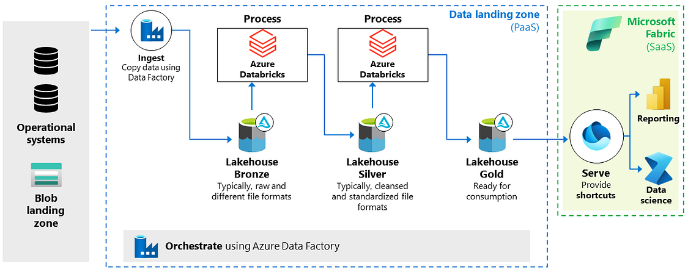

*Isenção de responsabilidade: este artigo reflete minhas experiências e pontos de vista pessoais, não uma posição oficial da* [Microsoft Fabric](https://www.linkedin.com/showcase/microsoftfabric/) *ou* [Databricks](https://www.linkedin.com/company/databricks/)*.*

Bem-vindos à segunda parte de nossa série sobre a integração de duas das mais poderosas ferramentas de dados da Microsoft: [Microsoft Fabric](https://www.linkedin.com/showcase/microsoftfabric/) *e* [Databricks](https://www.linkedin.com/company/databricks/)*.* Na [**Parte I**](https://www.linkedin.com/pulse/integrando-azure-databricks-e-microsoft-fabric-um-encontro-lopes-fb1af/), exploramos as fundações dessa integração, abordando os conceitos básicos. Agora, nesta **Parte II**, vamos nos aprofundar ainda mais.

Se você ainda não leu a primeira parte, recomendo fortemente que o faça antes de prosseguir, pois muitos dos conceitos abordados aqui partem do que foi discutido anteriormente. Prepare-se para elevar suas habilidades e conhecimentos a um novo patamar e aproveitar ao máximo o poder combinado do Azure Databricks e do [Microsoft Fabric](https://www.linkedin.com/showcase/microsoftfabric/).

Uma maneira eficaz de melhorar uma arquitetura baseada no Azure Databricks é adicionar uma camada de relatórios e análises. A arquitetura tradicional do Azure Databricks Medallion Lakehouse utiliza serviços como Azure Data Lake Storage (ADLS) Gen2, Azure Data Factory e o próprio Azure Databricks para gerenciamento completo da ingestão, processamento, validação e enriquecimento de dados. Normalmente, o PowerBI é utilizado para relatórios e entrega de insights analíticos.

Expandir essa arquitetura para incluir o [Microsoft Fabric](https://www.linkedin.com/showcase/microsoftfabric/) pode aprimorar significativamente as capacidades de autoatendimento e melhorar a experiência do usuário corporativo. Pense no Microsoft Fabric como uma evolução do PowerBI, oferecendo um novo conjunto de funcionalidades que tornam a análise de dados mais envolvente e eficiente.

\_Arquitetura de referência\_

### Novos Recursos do Microsoft Fabric

A Microsoft introduziu recentemente o recurso "shortcut" no Microsoft Fabric. Esse recurso age como um mecanismo leve de virtualização de dados, permitindo a leitura de dados de diversas fontes sem necessidade de duplicação. Por exemplo, ao usar o PowerBI, você pode acessar os dados diretamente, sem precisar copiá-los ou importá-los para o PowerBI.

Para arquiteturas baseadas no Databricks, podemos usar o recurso de atalho do ADLS Gen2, já que o Databricks grava todos os seus dados no ADLS. No entanto, há algumas considerações importantes:

1. **Fabric Lakehouse:** Atalhos requerem um Fabric Lakehouse. Certifique-se de criar um, caso ainda não tenha.

2. **Formato Delta Lake:** Atalhos só funcionam com tabelas no formato Delta Lake.

3. **Tabelas Externas:** Use atalhos em tabelas externas sempre que possível, em vez de tabelas gerenciadas pelo Databricks.

4. **Limitação de Pasta:** Cada atalho só pode referenciar uma única pasta Delta. Portanto, para acessar dados de várias pastas, crie atalhos individuais para cada uma.

5. **Acesso Somente Leitura:** Utilize uma abordagem de somente leitura para acessar arquivos Delta no ADLS, evitando manipulação direta de arquivos nesses diretórios.

6. **Criação Manual de Atalhos:** Atalhos podem ser criados manualmente através da interface do Fabric ou programaticamente usando a API REST.

### Integração Avançada com Unity Catalog

Para facilitar ainda mais a integração entre Databricks e Microsoft Fabric, a Microsoft anunciou desenvolvimentos emocionantes na Conferência Microsoft Build 2024. Em breve, será possível integrar o Catálogo Unity do Azure Databricks ao Fabric. Com o portal Fabric, você poderá criar e configurar um novo item do Catálogo Unity, e todas as tabelas gerenciadas poderão ser atualizadas para atalhos. Essa integração simplificará drasticamente a unificação dos dados do Azure Databricks no Fabric, facilitando operações contínuas em todas as cargas de trabalho do Fabric.

Sendo Assim, a arquitetura expandida que combina Databricks com o Microsoft Fabric é uma escolha popular entre os clientes satisfeitos com o Databricks. Essas organizações já investiram significativamente no estabelecimento de um Lakehouse com Databricks e planejam continuar a utilizá-lo. O Microsoft Fabric reconhece a força e versatilidade da abordagem Lakehouse com formato Delta, permitindo a adição de uma camada otimizada para consumo de dados. Isso possibilita que as organizações aumentem sua configuração existente centrada em Databricks com uma camada adicional especificamente projetada para facilitar o consumo de dados.

Por hoje é só ! Em breve teremos a parte III onde abordaremos uma arquitetura habilitada para Databricks, podemos incorporar uma camada de ouro OneLake. Até lá !!
