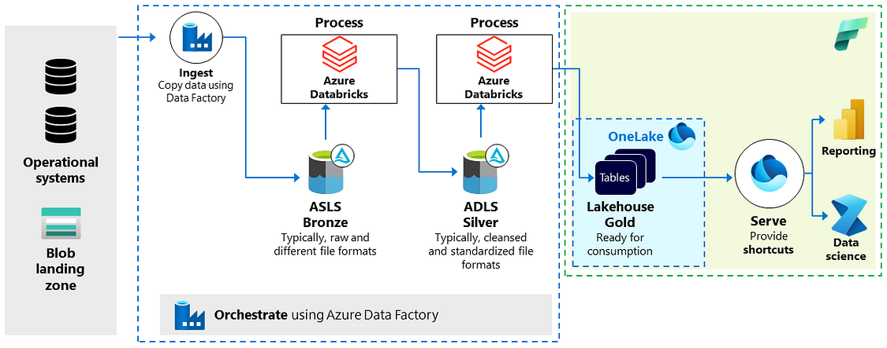

*Isenção de responsabilidade: este artigo reflete minhas experiências e pontos de vista pessoais, não uma posição oficial da* [Microsoft Fabric](https://www.linkedin.com/showcase/microsoftfabric/) *ou* [Databricks](https://www.linkedin.com/company/databricks/)*.*

Chegamos à terceira parte de nossa série sobre a integração de duas das mais poderosas ferramentas de dados da Microsoft: [Microsoft Fabric](https://www.linkedin.com/showcase/microsoftfabric/) e[Databricks](https://www.linkedin.com/company/databricks/)*.* Na [**Parte I**](https://www.linkedin.com/pulse/integrando-azure-databricks-e-microsoft-fabric-um-encontro-lopes-fb1af/), exploramos as fundações dessa integração, abordando os conceitos básicos.

Se você ainda não leu a primeira e segunda parte, recomendo fortemente que o faça antes de prosseguir, pois muitos dos conceitos abordados aqui partem do que foi discutido anteriormente. Prepare-se para elevar suas habilidades e conhecimentos a um novo patamar e aproveitar ao máximo o poder combinado do Azure Databricks e do [Microsoft Fabric](https://www.linkedin.com/showcase/microsoftfabric/). Deixo os links para leitura aqui: [Parte I](https://www.linkedin.com/pulse/integrando-azure-databricks-e-microsoft-fabric-um-encontro-lopes-fb1af/) e [Parte II](https://www.linkedin.com/pulse/integrando-azure-databricks-e-microsoft-fabric-um-encontro-lopes-f2rsf/?trackingId=jEuYhu8ZQUenuxEEtAyNuA%3D%3D)

A segunda arquitetura mostrada abaixo modifica o padrão de design referenciado no artigo anterior dessa serie ao incorporar uma camada gold no OneLake na arquitetura. Isso é viável devido ao driver Azure Blob Filesystem (ABFS) do Azure Databricks, que suporta tanto o ADLS quanto o OneLake.

Dentro dessa arquitetura, o fluxo de trabalho e as etapas de processamento de dados — ingestão, processamento, validação e enriquecimento — permanecem essencialmente os mesmos, todos gerenciados pelo Azure Databricks. A principal mudança é que os dados para consumo agora estão mais integrados ao Microsoft Fabric, pois o Databricks grava os dados em uma camada Gold armazenada no OneLake. Pode surgir a dúvida se isso é uma prática recomendada e quais são os benefícios.

É crucial mencionar que essa forma de integração não é oficialmente suportada pelo Databricks, o que traz algumas implicações para o gerenciamento de dados, que serão abordadas a seguir.

O Databricks diferencia dois tipos de tabelas: tabelas gerenciadas e tabelas externas. As tabelas gerenciadas são criadas por padrão e administradas pelo Unity Catalog, que gerencia seu ciclo de vida e layout de arquivos. Não é recomendado manipular diretamente os arquivos dessas tabelas usando ferramentas externas. Já as tabelas externas armazenam dados fora do local de armazenamento gerenciado especificado para o metastore, catálogo ou esquema.

Conforme a documentação, todas as tabelas criadas escrevendo diretamente para o OneLake devem ser classificadas como tabelas externas, uma vez que os dados são gerenciados fora do escopo do metastore. Dessa forma, a administração dessas tabelas deve ser feita em outro lugar, como dentro do Fabric. A motivação para essa abordagem pode incluir:

Primeiramente, armazenar dados no OneLake pode melhorar o desempenho dentro do Microsoft Fabric. As tabelas do OneLake são otimizadas para desempenho, especialmente em consultas que envolvem joins e agregações. Em contrapartida, consultas que leem dados do ADLS Gen2 via atalhos podem ter desempenho mais lento.

Em segundo lugar, gerenciar dados no OneLake facilita a aplicação de medidas de segurança dentro do Microsoft Fabric. Por exemplo, as tabelas do OneLake podem ser protegidas usando controle de acesso baseado em função (RBAC), simplificando o gerenciamento de acesso aos dados. Se fosse utilizado o ADLS Gen2, seria necessário lidar com as permissões da conta de armazenamento do ADLS Gen2, uma tarefa mais complexa.

Terceiro, as tabelas do OneLake podem ser regulamentadas por políticas, facilitando o uso conforme as normas. Isso é vantajoso ao compartilhar (externamente) tabelas com domínios localizados em outros lugares.

Além de apenas ler dados, pode ser interessante considerar a geração de novos dados dentro do Microsoft Fabric. Um recurso futuro pode atrair atenção: em breve, usuários do Fabric poderão acessar itens de dados, como lakehouses, via Unity Catalog no Azure Databricks. Embora os dados permaneçam no OneLake, será possível acessar e visualizar sua linhagem e outros metadados diretamente no Azure Databricks. Essa melhoria facilitará a leitura de dados do Fabric para o Databricks. Por exemplo, se houver planos de usar a IA do Mosaic AI do Azure Databricks, será possível fazê-lo lendo dados do Microsoft Fabric. A tecnologia provável para isso é a Lakehouse Federation.

Em conclusão, a estratégia de integrar e processar todos os dados dentro do Databricks, enquanto a camada de consumo é gerenciada no Fabric, proporciona às organizações a conveniência de aproveitar os melhores recursos de cada aplicação. Essa abordagem assegura desempenho e segurança ideais na manipulação de dados.

Te espero no próximo e último artigo da série !!

Assine a newsletter para acompanhar essa jornada.. Até mais !
