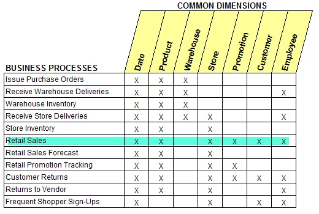
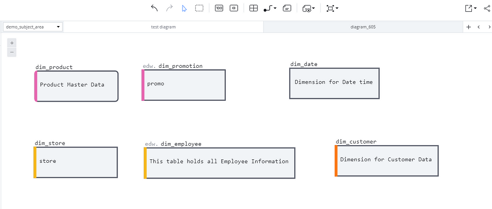
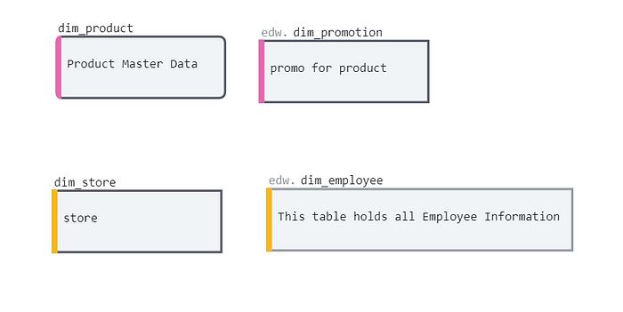
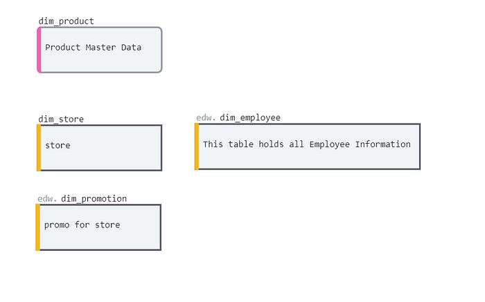
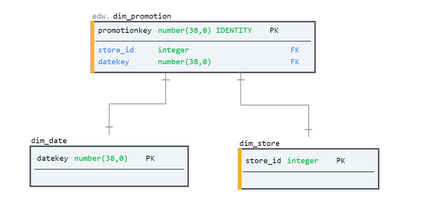
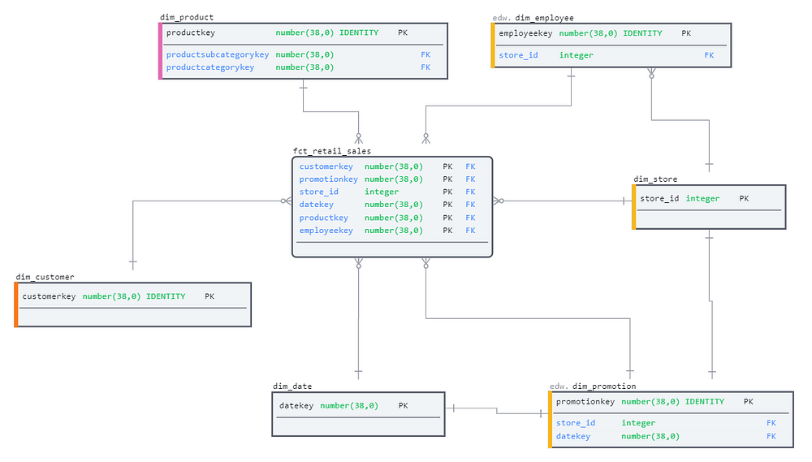
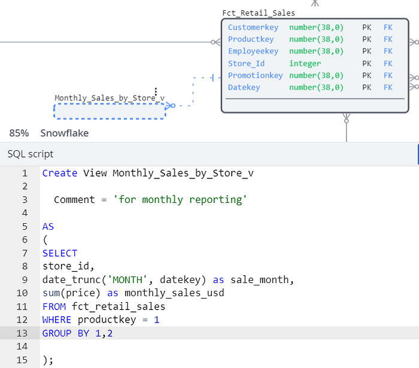
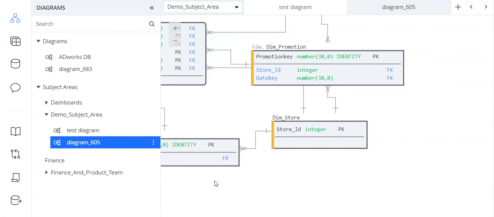

Com o avanço do armazenamento de dados em nuvem, trabalhar com dados ficou muito mais acessível, tanto em termos de tempo quanto de custo. Ferramentas como [Databricks](https://www.linkedin.com/company/databricks/) e [Microsoft Fabric](https://www.linkedin.com/company/microsoftfabric/) ajudaram a derrubar essas barreiras, oferecendo recursos inovadores, como clonagem sem consumo de espaço adicional e armazéns escaláveis, que permitem a criação rápida de protótipos.

Essas reduções nos custos de armazenamento e processamento tornaram os ajustes de design menos impactantes e mais fáceis de lidar do que no passado. Por isso, muitos engenheiros de dados acabam pulando a fase de modelagem dimensional e seguem direto para as transformações, ajustando o modelo conforme necessário.

No entanto, essa abordagem funciona melhor apenas no início de um projeto. À medida que os dados são carregados e dependências são criadas em torno das tabelas principais, alterar o modelo de dados pode se tornar algo tão caro e complexo que inviabiliza mudanças.

Essa situação pode ser comparada ao filme *The Lost World*: assim como no filme, onde explorar o "mundo perdido" traz à tona o valor de algo esquecido, a modelagem dimensional representa uma prática que pode parecer obsoleta, mas é essencial para o sucesso a longo prazo. Redescobrir e aplicar seus fundamentos pode ser o diferencial entre um projeto sustentável e um cheio de obstáculos.

Mesmo com os custos de armazenamento e computação em queda constante, o princípio de que 20% de esforço no design inicial economizam 80% de retrabalho no futuro ainda se mantém firme. Investir na modelagem desde o começo é uma estratégia que compensa.

Em resumo, por mais que a tecnologia evolua, os fundamentos da modelagem dimensional continuam sendo indispensáveis. Assim como o "mundo perdido", esses princípios estão prontos para serem redescobertos e valorizados. 😊

## Pré-requisitos

Antes de começar o trabalho em si, é importante definir algumas diretrizes logo no início para garantir que o projeto siga o caminho certo.

Boas práticas como criar convenções claras para nomes de tabelas e colunas e definir quem será responsável pelas entregas são estratégias bem conhecidas para reduzir a complexidade e manter o projeto fluindo sem problemas. No entanto, outras considerações menos óbvias muitas vezes acabam sendo negligenciadas.

A modelagem de dados, por sua natureza, se baseia em padrões – na maioria das vezes, não é necessário “reinventar a roda”. Por isso, tanto para facilitar a comunicação quanto para economizar tempo, é essencial estar familiarizado com os termos e padrões amplamente utilizados.

Isso inclui desde os fundamentos (como fatos, dimensões e medidas), até conceitos mais avançados (como SCDs tipo II, upserts e dimensões degeneradas), além de quaisquer convenções específicas que a equipe adotar ao longo do projeto.

Para garantir que os conceitos principais estejam sempre frescos na memória, vale a pena ter por perto uma cópia do clássico Data Warehouse Toolkit de Ralph Kimball. Se preferir, você também pode consultar o site dele, que oferece um resumo prático dos principais termos e conceitos.

### Uma fonte de verdade

A modelagem dimensional, como veremos mais adiante, é um processo colaborativo e iterativo. Isso significa que pessoas de diferentes áreas da organização precisam trabalhar juntas para criar uma solução que não apenas atenda aos requisitos de negócios, mas também seja eficiente e sustentável a longo prazo.

Com tantas pessoas envolvidas no design, mudanças e ajustes ao longo do caminho são inevitáveis. Por isso, é fundamental usar uma ferramenta que facilite essa colaboração durante todo o ciclo de vida do projeto — permitindo trabalho em tempo real, compartilhamento dinâmico, rastreamento de alterações e evitando documentos desatualizados ou silos de conhecimento.

Neste artigo, vou usar o SqlDBM, uma ferramenta de modelagem online, para ilustrar o processo. O SqlDBM é flexível o suficiente para começar com um design inicial, estilo “quadro branco”. Diferentemente de ferramentas de diagramação tradicionais (como Lucidchart ou Vizio), o SqlDBM também gera código DDL bem formatado, específico para o banco de dados escolhido, conforme o modelo evolui, poupando retrabalho.

Com o SqlDBM, o mapa realmente se torna o território. 😊

## O processo

Neste artigo, vamos explorar o processo de vendas de uma empresa de varejo, percorrendo as principais etapas da modelagem dimensional.

### 1. Escolha o processo de negócios

A primeira etapa é escolher um único processo de negócios para modelar. Pode parecer simples, mas essa decisão merece atenção. Tentar criar todo o data warehouse de uma só vez é um erro comum – o ideal é construir um processo de negócios por vez.

A escolha deve ser guiada pelas prioridades da empresa, considerando relevância e urgência em relação a outros processos. A equipe de BI pode ajudar com estimativas técnicas, mas as necessidades do negócio devem ser o fator decisivo.

Nesse ponto, a equipe de BI deve se reunir com especialistas do negócio e realizar um levantamento inicial dos dados. Isso ajuda a criar uma proposta técnica de alto nível, útil para definir orçamento e cronograma.

### 2. Defina o grão

Depois de selecionar o processo de negócios, é hora de definir o grão – ou seja, o nível mínimo de detalhe no qual os dados serão analisados. Novamente, essa é uma decisão orientada pelos objetivos do negócio.

Por exemplo, em um varejista online, podemos rastrear detalhes extremamente específicos, como a identificação do dispositivo e o sistema operacional de cada pedido. Esses dados podem ser úteis para marketing, mas talvez não agreguem valor ao monitoramento geral de vendas.

Se a empresa decidir que as vendas devem ser analisadas "diariamente por tipo de produto", esse será o grão mínimo. Ele define o que cada linha da tabela de fatos representa e deve ser tratado como um compromisso com as partes interessadas, pois mudanças posteriores podem exigir retrabalho significativo.

Mesmo definindo uma granularidade específica, sempre colete os dados de origem no nível mais detalhado possível, seguindo o padrão **ELT** (extrair, carregar, transformar). Assim, se amanhã a análise precisar de mais detalhes, como "por hora por ID de produto", você já terá os dados necessários.

### 3. Identifique as dimensões

Com o grão definido, o próximo passo é identificar as dimensões que darão suporte à análise. Algumas dimensões principais podem já ter sido identificadas durante a escolha do processo de negócios. Agora é hora de aprofundar essa análise.

Durante essa etapa, também podem surgir dimensões compartilhadas entre diferentes processos de negócios, criando a base para a **matriz dimensional** da empresa.

Mesmo que o foco inicial seja apenas um processo (como vendas no varejo), a matriz dimensional é uma ferramenta valiosa para mapear processos correlacionados e destacar dimensões em comum. Isso ajuda a manter o design consistente e escalável para futuras expansões.



\_Amostra de matriz dimensional\_

Uma dimensão geralmente é representada por um substantivo, como *loja*, *funcionário* ou *veículo*. Esses substantivos vêm acompanhados de atributos, como *nome*, *descrição* ou *endereço*, que ajudam a enriquecer e contextualizar os relatórios.

Depois de identificar as dimensões existentes, podemos começar a esboçar um quadro branco básico. Esse rascunho servirá como ponto de partida para adicionar mais detalhes nas próximas etapas do processo.



\_Identificando dimensões no SqlDBM por meio de modelagem lógica\_

### 4. Identifique os relacionamentos de dimensão

Depois de identificar as dimensões, o próximo passo é entender como elas se conectam e interagem entre si.

Por exemplo:

- As promoções são aplicadas ao nível da loja, do produto ou ambos?
- Um funcionário está vinculado a uma loja específica ou pode trabalhar em várias?

Essas perguntas guiam o design técnico, mas as respostas dependem diretamente do conhecimento dos especialistas do negócio. Por isso, é fundamental manter esses especialistas envolvidos durante todo o processo de modelagem, garantindo que dúvidas funcionais sejam esclarecidas assim que surgirem.

Então, as promoções são aplicadas ao nível do produto? 🤔



\_promoção no nível do produto\_

Então, as promoções são aplicadas ao nível do produto? Ou abrangem toda a loja? 🤔



\_promoção em nível de loja\_

A modelagem lógica oferece uma maneira simplificada de visualizar o design, permitindo prototipagem rápida antes de avançar para o design físico. Essa abordagem torna o processo mais acessível, permitindo que membros não técnicos da equipe participem ativamente das discussões.

Neste exemplo, vamos optar pela última alternativa: aplicar as promoções ao nível da loja. 🎯



### 5. Identifique os fatos

A etapa seguinte combina as dimensões já identificadas (*o quê, quando*) com medidas quantitativas (*quanto, quantos*), resultando nos fatos do modelo.

Por exemplo:

- O cliente A comprou X unidades do produto B ao preço de Y dólares, atendido pelo funcionário D, na loja E, usando a promoção F, na data G.

Essa combinação de dimensões e medidas quantitativas forma a tabela de fatos para o processo de vendas no varejo. Ela será o coração da análise, conectando os detalhes do negócio às métricas que realmente importam.



\_a tabela de fatos do processo de negócios de vendas no varejo com dimensões associadas\_

Com esta tabela de fatos, conseguimos responder a qualquer pergunta comercial relacionada às vendas no varejo, utilizando uma combinação de filtros e agregações.

Além disso, podemos expandir o diagrama para incluir detalhes técnicos importantes, como chaves primárias e estrangeiras, garantindo que o modelo seja funcional e eficiente.

Por exemplo, se a empresa quiser saber as **vendas mensais por loja do produto B**, basta aplicar os filtros e somar os valores relevantes na tabela de fatos. Fácil, não é? 😊

```
SELECT store_id, date_trunc(' MONTH ', datekey) como sale_month, sum(price) como Monthly_sales_usd FROM fct_retail_sales WHERE productkey = 'B' GROUP BY store_id, datekey        
```

Isso também pode ser realizado diretamente dentro do próprio projeto, aproveitando as funcionalidades da tabela de fatos para filtrar e agregar os dados conforme necessário.



Definir um nível de detalhe muito granular para a tabela de fatos permite flexibilidade: podemos sempre agregar para níveis mais simples, como resumos mensais ou semanais. Porém, o oposto não é possível. Por exemplo, se a tabela de fatos fosse criada no nível mensal, não seria viável obter detalhes diários. Essa escolha inicial é crucial para garantir a flexibilidade do modelo.

### 6. Implantação

Com os fatos, medidas, grãos e relacionamentos definidos e acordados, finalmente é hora de ir ao banco de dados e criar os objetos físicos.

Nesta etapa, é fundamental garantir que todos os detalhes técnicos e funcionais documentados durante o exercício de modelagem sejam seguidos, como:

- Comprimentos de colunas;
- Tipos de dados;
- Propriedades das tabelas.

Esse cuidado garante que o modelo atenda às expectativas e funcione perfeitamente na prática. 🎯



Se você estiver usando o **SqlDBM** para acompanhar, pode gerar o DDL necessário diretamente a partir do diagrama (lembra da ideia de "o mapa se torna o território"?).

Caso opte por usar o **Excel**, também é possível criar fórmulas para gerar o SQL com base nos detalhes inseridos.

Independentemente da ferramenta escolhida, o mais importante é garantir que o design esteja sempre alinhado e sincronizado com os detalhes técnicos. Isso evita inconsistências e garante um modelo funcional e eficiente.

## Conclusão

Após percorrer as etapas do processo de modelagem dimensional, fica claro que se trata de um esforço iterativo e colaborativo, onde mudanças nos requisitos e decisões de design são praticamente inevitáveis.

Para que o projeto continue fluindo de forma tranquila, é essencial utilizar ferramentas e métodos que possam lidar bem com essas alterações, mantendo todos os envolvidos alinhados e sincronizados.

Uma vez definidos os instrumentos e processos, a modelagem se torna um exercício repetível e baseado em padrões. Por isso, escolha suas ferramentas com sabedoria, modele e continue iterando.

Obrigado por acompanhar este artigo até o final! Espero que ele tenha sido útil para esclarecer o processo de modelagem dimensional e como aplicá-lo de forma prática. Se você gostou do conteúdo, convido você a explorar outros artigos e materiais que compartilho sobre o universo de dados e análises. Fique à vontade para deixar seus comentários, dúvidas ou sugestões – sua participação é sempre muito bem-vinda! 😊
