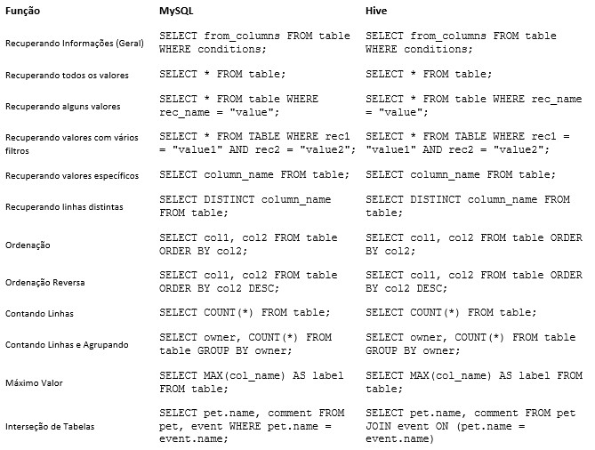
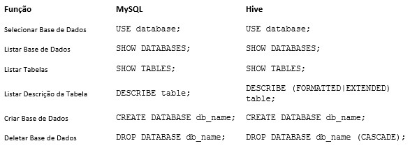

Cada vez mais famoso e utilizado, o **Apache Hive** é um sistema de data warehouse para **Hadoop**. O **Hive** permite o resumo de dados, consultas e análise de dados. Consultas de **hive** são escritas em **HiveQL**, que é uma linguagem de consulta semelhante ao SQL. O **Hive** permite que você projete estrutura em grandes volumes de dados sem estrutura.

Depois de definir a estrutura, você pode usar o **HiveQL** para consultar os dados sem conhecimento de Java ou do **MapReduce**.

Nesse artigo iremos abortar os principais comandos para utilizar o Hive. Confira:

### Principais Consultas

### Consultas de Objetos e Estruturas

Para mais informações e a documentação completa acesse, <https://cwiki.apache.org/confluence/display/Hive/LanguageManual>

Espero que essa publicação tenha contribuído para seu aprendizado, até a próxima !
