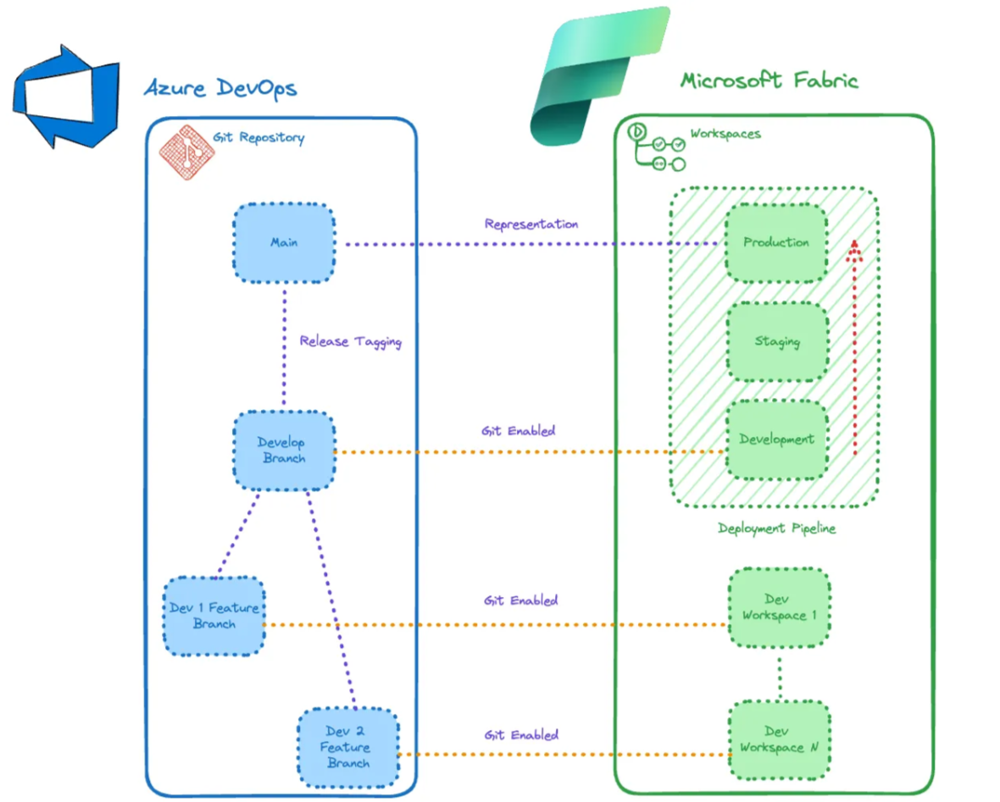

O gerenciamento eficaz de pipelines de dados é fundamental para garantir processos contínuos de desenvolvimento, teste e implantação. A integração do Git com os espaços de trabalho do Microsoft Fabric oferece uma abordagem estruturada e eficiente para gerenciar esses pipelines, promovendo a colaboração e o controle de versões de forma mais organizada e segura.

Neste artigo, vamos explorar em detalhes as melhores práticas para a utilização de espaços de trabalho do Microsoft Fabric habilitados para Git. Abordaremos aspectos essenciais como configuração inicial, organização do código, estratégias de branching e merge, além de automação e monitoramento.

A integração entre o Git e o Microsoft Fabric permite que equipes de desenvolvimento trabalhem de maneira colaborativa, mantendo um histórico detalhado de alterações e facilitando o rastreamento e a reversão de mudanças quando necessário. Também discutiremos como configurar pipelines de CI/CD (Integração Contínua e Entrega Contínua) utilizando Azure DevOps para garantir que o código seja testado e implantado de maneira consistente e confiável.

O diagrama abaixo descreve a integração entre o Azure DevOps e o Microsoft Fabric, ilustrando o fluxo dos ambientes de desenvolvimento até os ambientes de produção. Esta representação visual ajuda a compreender como as alterações no código são gerenciadas e promovidas através dos diferentes estágios, desde o desenvolvimento inicial até a implantação final em produção.

\_Exemplo de configuração do Git + Workspace Fabric\_

**Azure DevOps (Git)**

• Branch Principal: O branch principal para versões estáveis.

• Ramo de Desenvolvimento: O ramo principal para desenvolvimento contínuo.

• Ramificações de recursos: para desenvolvimento de recursos específicos.

**Microsoft Fabric (workspaces)**

- Pipeline de implantação: gerencia promoção para diferentes ambientes (desenvolvimento, preparação, produção)
- Espaços de trabalho de desenvolvimento: ambientes de desenvolvedores individuais.

### Como gerenciar Projetos Complexos no Microsoft Fabric

Gerenciar projetos grandes ou complexos no Microsoft Fabric pode ser desafiador, mas aplicar as melhores práticas pode facilitar esse processo. Aqui estão alguns dos principais aprendizados que podem ajudar na manutenção eficiente desses projetos.

### Estratégias de Ramificação

Os desenvolvedores do Microsoft Fabric, que trabalham com pipelines, notebooks, relatórios, data warehouses, lakehouses e muito mais, precisam dominar o Git. Entendo que a curva de aprendizado pode ser íngreme, especialmente para engenheiros de dados que começaram como analistas ou DBAs, onde o Git não era uma competência essencial. No entanto, à medida que você trabalha em projetos grandes e complexos no Microsoft Fabric, o Git se torna essencial para a colaboração eficiente.

**Ramificações de Recursos**: Cada desenvolvedor deve criar uma ramificação a partir da ramificação de desenvolvimento para trabalhar em seu próprio recurso ou correção de bug. Para aqueles que usam o Fabric nativamente, podem anexar essa ramificação ao seu próprio espaço de trabalho pessoal, como "Espaço de Trabalho do Projeto A do MJ". Vale notar que, atualmente, não é possível habilitar o Git em "Meu espaço de trabalho", portanto, é necessário provisionar um novo espaço de trabalho para essa finalidade. Isso também se aplica a desenvolvedores que trabalham com relatórios do Power BI usando o desktop do Power BI, tornando essa abordagem independente do espaço de trabalho do Fabric.

**Ramificação de Desenvolvimento**: Utilize essa ramificação para integrar novos recursos e realizar testes antes de mesclar na ramificação principal. Implementar políticas de ramificação é crucial para evitar que os desenvolvedores façam push acidentalmente ou realizem modificações sem passar por um processo de pull request. Esse processo garante que o trabalho de cada desenvolvedor seja revisado antes de ser implantado.

**Ramificação Principal**: Esta deve ser a fonte da verdade para o código pronto para produção. Somente código estável e testado deve ser mesclado aqui. Marcar lançamentos (tags) é uma boa prática para separar diferentes versões, facilitando a reversão de alterações, se necessário.

Vale destacar que a ramificação principal não é habilitada para Git no espaço de trabalho do Fabric; apenas a ramificação de desenvolvimento está associada a um espaço de trabalho. Detalharemos isso na próxima seção.

### Integração com Git no Microsoft Fabric

Os espaços de trabalho do Microsoft Fabric, incluindo os do Power BI, suportam integrações com Git. Atualmente, essa integração está disponível apenas com o Azure DevOps, mas a expectativa é que o suporte ao GitHub seja adicionado em breve.

Para configurar a integração, basta acessar as configurações do espaço de trabalho e navegar até a aba "Integração Git". A partir daí, conecte o espaço de trabalho ao Azure DevOps. Esta integração facilita a gestão do código e a colaboração entre os desenvolvedores, tornando o processo de desenvolvimento mais robusto e eficiente.

### Conclusão

Implementar essas melhores práticas ajudará a otimizar o uso de espaços de trabalho do Microsoft Fabric habilitados para Git. Isso não apenas melhora a eficiência do gerenciamento de pipelines de dados, mas também fortalece a colaboração e o controle de versões dentro das equipes de desenvolvimento.
