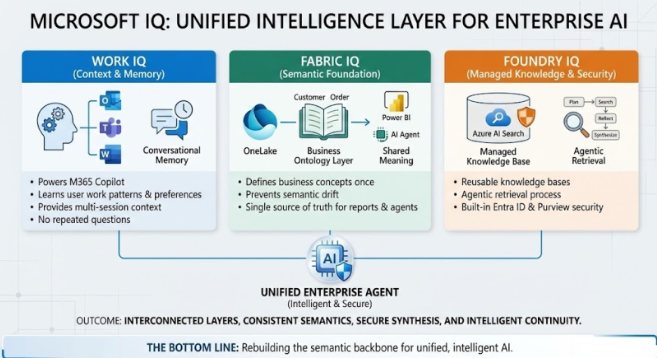
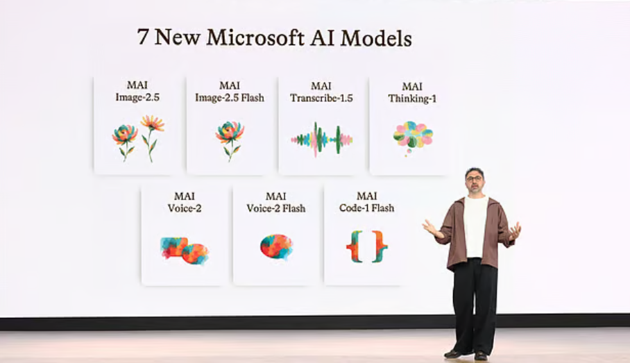
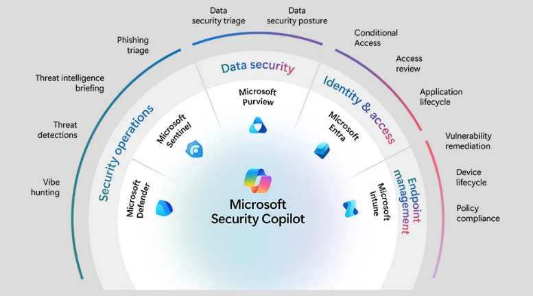

Em 1977, quando as luzes do cinema se apagaram e aquela abertura icônica começou a rolar pela tela, ninguém sabia exatamente o que estava prestes a acontecer. Star Wars não era apenas um filme; era uma ruptura, uma redefinição do que era possível. O [Microsoft](https://www.linkedin.com/company/microsoft/) Microsoft Build 2026 teve esse mesmo sabor. Com o tema "Be Yourself at Work", a Microsoft não apresentou apenas um conjunto de novos produtos. Ela apresentou uma nova ordem galáctica para o desenvolvimento de software e para a inteligência artificial nas empresas.

Durante décadas, a relação entre as organizações e a tecnologia foi de dependência. Dependência de plataformas, de modelos de terceiros, de consultorias que detinham o conhecimento. **O Build 2026 marca a virada: a Microsoft está apostando que o diferencial competitivo do futuro não é mais o acesso à inteligência artificial, mas a propriedade dela.** Não basta ter acesso à Força; é preciso que a Força seja sua, moldada pela sua história, pelos seus dados e pelas suas regras.

Neste artigo, vamos percorrer os três grandes pilares do Build 2026 com a profundidade que cada um merece: a nova camada de contexto **Microsoft IQ**, a família de modelos próprios **MAI** e a **estrutura de governança** que garante que tudo isso funcione com segurança em produção. Prepare seu sabre de luz.

### Episódio I: A Ameaça Fantasma do Contexto Genérico

Antes de entender o que a Microsoft anunciou, é preciso entender o problema que ela está resolvendo. Durante os últimos dois anos, a corrida pela IA nas empresas produziu um padrão previsível: times de tecnologia implantam modelos de linguagem poderosos, conectam algumas fontes de dados e esperam resultados transformadores. O que geralmente acontece é bem diferente.

Os agentes respondem de forma genérica porque não entendem o contexto real da organização. Eles sabem o que é um e-mail, mas não sabem que aquele e-mail específico está relacionado a um projeto crítico que está atrasado. Eles sabem o que é uma reunião, mas não entendem que aquela reunião envolve um cliente que está prestes a cancelar o contrato. A inteligência existe, mas o contexto está faltando.

É exatamente essa lacuna que o **Microsoft IQ** foi projetado para preencher. Disponível a partir de hoje no **GitHub Copilot, Microsoft Foundry e Copilot Studio**, o ***Microsoft IQ é descrito como uma nova camada de contexto que aterra os agentes tanto no conhecimento do mundo quanto no conhecimento específico da sua empresa .*** Não é um produto isolado; é uma infraestrutura de inteligência composta por quatro camadas especializadas que trabalham em conjunto.

\_https://jannikreinhard.com/2025/11/26/microsoft-iq-the-intelligence-layer-that-finally-makes-ai-agents-useful/\_

### Work IQ: A Inteligência do Fluxo de Trabalho

O Work IQ é a camada mais próxima do dia a dia das pessoas. Ele captura como o trabalho realmente acontece no Microsoft 365, entendendo as conexões entre pessoas, e-mails, documentos, reuniões e como tudo isso se conecta . Não é apenas um índice de documentos; é uma representação viva de como a organização funciona.

Pense no Work IQ como o Mestre Yoda da sua organização. Ele não apenas conhece os fatos; ele entende os relacionamentos, as tensões, as prioridades não ditas. Quando um agente alimentado pelo Work IQ recebe uma pergunta sobre o status de um projeto, ele não apenas busca documentos com aquele nome. Ele entende quem são as pessoas-chave, quais foram as últimas decisões tomadas, onde estão os bloqueios e o que precisa acontecer a seguir.

As Work IQ APIs ficam disponíveis de forma geral em 16 de junho de 2026, permitindo que desenvolvedores acessem essa camada de inteligência de forma programática . Isso significa que qualquer agente, construído em qualquer framework, poderá ser enriquecido com o contexto real do fluxo de trabalho da organização.

### Fabric IQ: A Linguagem dos Dados de Negócio

Se o Work IQ cuida do contexto humano e relacional, o Fabric IQ cuida do contexto dos dados estruturados de negócio . Ele fornece uma fundação semântica compartilhada sobre os dados que vivem no Microsoft Fabric, garantindo que quando um agente fala sobre "receita", "margem" ou "churn", ele está usando as mesmas definições que o time de finanças, o time de vendas e o time de produto.

Esse problema de semântica inconsistente é mais sério do que parece. Em organizações grandes, é comum que diferentes áreas usem os mesmos termos com definições diferentes. O Fabric IQ age como o C-3PO da galáxia dos dados: fluente em mais de seis milhões de formas de comunicação, garantindo que todos os agentes falem a mesma língua quando se trata dos dados críticos do negócio.

### Foundry IQ e Web IQ: Conectando o Universo

O Foundry IQ é o elo que une as demais camadas, habilitando o planejamento de recuperação de informações tanto através do conhecimento corporativo quanto da web em tempo real . É a inteligência que decide, diante de uma pergunta complexa, quais fontes consultar, em que ordem e como combinar as respostas.

A novidade mais recente da família é o Web IQ, anunciado no próprio evento. É descrito como a forma mais rápida de aterrar agentes em informações do mundo real: uma stack de busca web AI-first, agnóstica a modelos e nativa para MCP (Model Context Protocol), capaz de retornar passagens relevantes com uma velocidade quase 2,5 vezes superior à melhor alternativa disponível no mercado . Para agentes que precisam de informações atualizadas sobre mercados, regulações ou eventos externos, o Web IQ é o hiperimpulsor que os leva para onde precisam ir em tempo recorde.

### Episódio II: O Império dos Modelos Próprios

Por muito tempo, as grandes empresas de tecnologia dependeram de modelos de terceiros para alimentar seus produtos de IA. A Microsoft não é exceção: o Copilot foi construído sobre os modelos da OpenAI, e essa parceria continua sendo importante. Mas o Build 2026 marcou um ponto de inflexão: **a Microsoft está construindo seus próprios modelos de IA, e eles são competitivos.**

A família **MAI (Microsoft AI)** foi apresentada com sete novos modelos in-house, cada um projetado para uma finalidade específica . Essa estratégia de especialização é análoga à formação de uma frota imperial: cada nave tem um papel definido, e juntas elas cobrem todo o espectro de necessidades.

\_Credits: X/@mustafasuleyman\_

### MAI-Thinking-1: O Destruidor Estelar do Raciocínio

O carro-chefe da família é o MAI-Thinking-1, o primeiro modelo de raciocínio da Microsoft. O que o torna especialmente relevante não é apenas o seu desempenho, mas a forma como foi construído: treinado do zero, sem distilação de outros modelos, em dados limpos e licenciados comercialmente . Para empresas preocupadas com questões de propriedade intelectual e compliance, isso é um diferencial significativo.

Com 35 bilhões de parâmetros ativos e uma janela de contexto de 256K tokens, o MAI-Thinking-1 foi projetado especificamente para lidar com instruções complexas de múltiplas etapas, raciocínio de longo contexto e geração de código . Os números de benchmark são impressionantes: em testes cegos, avaliadores independentes preferiram o MAI-Thinking-1 ao Sonnet 4.6, e ele igualou o Opus 4.6 em habilidades de codificação no SWE Bench Pro . Para um primeiro modelo de raciocínio, esses são resultados que colocam a Microsoft imediatamente entre os competidores sérios nessa categoria.

O modelo está disponível no Foundry em private preview a partir de hoje.

### MAI-Image-2.5: O Artesão Visual

O MAI-Image-2.5 representa a entrada da Microsoft no mercado de modelos de geração e edição de imagens, e ela entrou com força. É o primeiro modelo da Microsoft a suportar tanto cargas de trabalho de texto para imagem quanto de imagem para imagem . No Arena AI leaderboard, ele ocupa a terceira posição em texto para imagem e a segunda posição em imagem para imagem, superando concorrentes estabelecidos .

O que torna esse modelo particularmente interessante para o ecossistema Microsoft é sua integração nativa. Ele já está ativo no PowerPoint, sendo implantado no OneDrive e chegando ao Foundry com qualidade líder de mercado por dólar . Para times de marketing, design e comunicação que já vivem no ecossistema Microsoft 365, isso representa uma capacidade criativa significativa sem precisar sair do ambiente de trabalho.

### A Família Completa: Especialistas para Cada Missão

Além dos dois modelos principais, a família MAI inclui:

O MAI-Transcribe-1.5 combina precisão de ponta em 43 idiomas, com streaming chegando em breve . Para organizações globais com operações em múltiplos países, a capacidade de transcrever reuniões, calls e conteúdo de áudio com alta precisão em dezenas de idiomas é uma capacidade operacional crítica.

O MAI-Voice-2 e sua variante flash estão agora disponíveis em mais de 15 novos idiomas com novas opções de voz . Combinado com o MAI-Transcribe-1.5, isso cria uma infraestrutura completa de voz que pode alimentar desde assistentes de call center até interfaces de voz para aplicações industriais.

O MAI-Code-1 é um modelo de codificação eficiente para inferência, ajustado especificamente para o GitHub e agora disponível no Copilot e VS Code . A especialização em código, combinada com a eficiência de inferência, o torna ideal para cenários onde velocidade e custo são críticos, como sugestões em tempo real durante a digitação.

### Abertura e Escolha: Além do Catálogo Próprio

A Microsoft deixou claro que a estratégia não é criar um jardim murado. Os modelos MAI estarão disponíveis em plataformas de terceiros como Fireworks AI, Baseten e Open Router . Ao mesmo tempo, o Fireworks AI passa a estar geralmente disponível no Foundry, oferecendo uma experiência de plataforma única com governança corporativa e residência de dados no Azure, independentemente do modelo escolhido .

Essa abertura é estratégica. A Microsoft está apostando que, ao oferecer a melhor plataforma para rodar qualquer modelo, ela se torna indispensável mesmo para clientes que preferem modelos de outros fornecedores.

### Episódio III: O Retorno da Governança

Com grandes poderes vêm grandes responsabilidades, e a proliferação de agentes autônomos em ambientes corporativos levanta questões sérias de segurança, compliance e governança. Quem é responsável quando um agente toma uma decisão errada? Como garantir que agentes não acessem dados que não deveriam? Como auditar o que um agente fez?

A Microsoft apresentou uma resposta abrangente a essas questões, construindo o que pode ser descrito como a República Galáctica da governança de agentes.

\_https://www.microsoft.com/pt-br/microsoft-agent-365\_

### Agent 365: O Senado Galáctico dos Agentes

O Agent 365 for local agents é a peça central dessa estrutura. Ele estende o Entra, Defender e Purview em um único plano de controle para observar, governar e proteger agentes em todo o ambiente corporativo, independentemente de onde estejam hospedados ou em qual framework foram construídos .

Esse último ponto é crucial. O Agent 365 não é apenas para agentes Microsoft. Ele funciona como um plano de controle universal, capaz de monitorar e governar agentes construídos em LangChain, AutoGen, CrewAI ou qualquer outro framework. Para CISOs e times de segurança que estão vendo a proliferação de agentes de IA em suas organizações, essa capacidade de visibilidade centralizada é fundamental.

### Frontier Tuning: Treinando Seus Próprios Cavaleiros Jedi

Uma das novidades mais estratégicas do Build 2026 é o Frontier Tuning, disponível em private preview a partir de hoje. Ele aplica reinforcement learning dentro do perímetro de compliance da organização, permitindo que os agentes aprendam como o negócio realmente funciona .

Usando os dados, o conhecimento de domínio e os fluxos de trabalho próprios da organização, o Frontier Tuning cria um ciclo que se aprimora à medida que os agentes trabalham . É a diferença entre contratar um consultor externo que conhece as melhores práticas do mercado e treinar um colaborador interno que conhece as especificidades do seu negócio. Com o tempo, o agente treinado com Frontier Tuning não apenas segue regras genéricas; ele internaliza a forma como a sua organização pensa e opera.

### ASSERT e Agent Control Specification: A Constituição Galáctica

Para garantir que a governança seja consistente e auditável, a Microsoft anunciou dois projetos de código aberto que formam a base da segurança de agentes.

O ASSERT (Adaptive Spec-driven Scoring for Evaluation and Regression Testing) é um framework para avaliação de segurança baseada em políticas . Ele permite que organizações definam políticas de comportamento esperado para seus agentes e validem continuamente se esses agentes estão operando dentro dessas políticas. É como ter um sistema de auditoria automatizado que verifica constantemente se os agentes estão seguindo a Constituição Galáctica.

A Agent Control Specification padroniza onde e como aplicar controles no loop do agente . Ao criar um padrão aberto para isso, a Microsoft está tentando estabelecer uma linguagem comum para a governança de agentes que possa ser adotada por todo o ecossistema, independentemente do framework ou plataforma.

### Codename MDASH: A Frota de Defesa Proativa

Fechando a camada de segurança, o Codename MDASH representa uma abordagem radicalmente diferente para a segurança de software. Em vez de esperar que vulnerabilidades sejam descobertas e reportadas, o MDASH implanta mais de 100 agentes especializados para encontrar bugs exploráveis de forma proativa .

Esses agentes raciocinam sobre o fluxo de dados, a lógica de negócio e as cadeias de exploração, entregando correções sensíveis ao contexto diretamente no Defender Portal . É como ter uma frota de caças X-Wing constantemente patrulhando o perímetro, identificando ameaças antes que elas se tornem crises.

### O Que Isso Significa na Prática

O Microsoft Build 2026 não foi um evento de anúncios isolados. Foi a apresentação de uma visão coerente e integrada de como a Microsoft acredita que a IA vai evoluir nas empresas. Essa visão tem três características que a diferenciam do que vinha sendo feito até agora.

Primeiro, a ênfase na propriedade da inteligência. A mensagem central do evento foi clara: o diferencial competitivo não é mais ter acesso à IA mais poderosa. É ter uma IA que é genuinamente sua, alimentada pelos seus dados, treinada nos seus processos e operando dentro das suas regras. O Microsoft IQ, o Frontier Tuning e a família MAI são todos peças dessa estratégia.

Segundo, a aposta na abertura como vantagem competitiva. Ao tornar os modelos MAI disponíveis em plataformas de terceiros, ao construir o Agent 365 para governar agentes de qualquer framework e ao lançar projetos de código aberto como ASSERT e Agent Control Specification, a Microsoft está sinalizando que sua vantagem não está no lock-in, mas na qualidade da plataforma.

Terceiro, a seriedade com governança e segurança. Em um momento em que muitas empresas ainda estão descobrindo como usar agentes de IA de forma responsável, a Microsoft chegou ao Build 2026 com respostas concretas para as perguntas mais difíceis: como auditar, como controlar, como garantir compliance e como proteger dados sensíveis.

A galáxia da IA empresarial está mudando rapidamente. O Build 2026 deixou claro que a Microsoft não está apenas participando dessa mudança; ela está tentando defini-la. Que a Força esteja com você.

### Referências:

[1] Microsoft Build 2026: Be yourself at work - The Official Microsoft Blog: <https://blogs.microsoft.com/blog/2026/06/02/microsoft-build-2026-be-yourself-at-work/>

Agent 365: <https://www.microsoft.com/pt-br/microsoft-agent-365>
