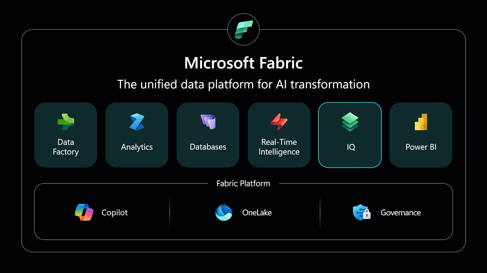
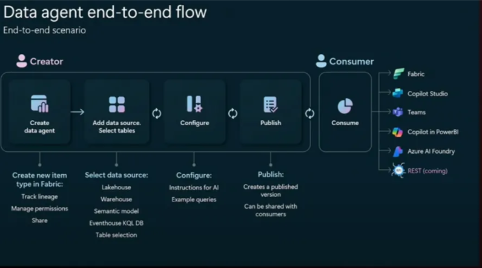

O Microsoft Ignite 2025 não foi um evento sobre promessas futuras; foi sobre entregas concretas que marcam a maturidade do
[Microsoft Fabric](https://www.linkedin.com/company/microsoft-fabric-world?trk=article-ssr-frontend-pulse_little-mention)
. A plataforma deixou de ser uma coleção de ferramentas promissoras para se tornar um sistema operacional coeso para dados e inteligência, onde cada nova peça se encaixa para resolver problemas crônicos que enfrentamos há anos no mundo dos dados.

A visão apresentada foi clara: acabar com a era de "colar" serviços com pipelines frágeis e dar lugar a uma abordagem onde o contexto de negócio flui de forma nativa entre todas as camadas. Para quem lida com a complexidade de dados corporativos, os anúncios representam soluções diretas para dores reais: a inconsistência de métricas, a dificuldade de integrar IA de forma governada e as barreiras entre sistemas transacionais e analíticos.

Para entender o impacto real dessas mudanças, é preciso ir além dos nomes e das apresentações. É necessário dissecar cada novidade, entender como ela funciona tecnicamente e, mais importante, como ela se encaixa no quebra-cabeça maior. É exatamente isso que faremos a seguir: um guia completo e direto ao ponto sobre o que realmente importa nas novidades do Fabric no Ignite 2025.

### 1. Fabric IQ: A Biblioteca Central de Definições do Negócio

Imagine que sua empresa é como uma grande cozinha profissional. Cada chef (departamento) tinha sua própria receita para o "molho especial da casa", e ninguém concordava com os ingredientes. O Fabric IQ é como criar um livro de receitas oficial e único, aprovado pelo chef executivo, que todos devem seguir. Agora, quando alguém pede o "molho especial", todos fazem exatamente a mesma coisa.

O Fabric IQ é a camada de inteligência semântica do Microsoft Fabric. Seu objetivo principal é acabar com a bagunça de ter múltiplas definições de métricas e entidades de negócio espalhadas por dezenas de modelos do Power BI, cubos do Analysis Services e outras fontes. Ele faz isso através de um novo item chamado Ontology, que é onde você define, de forma centralizada e governada, o que são as entidades do seu negócio (cliente, produto, venda), como elas se relacionam e quais são as regras e hierarquias.

\_Fabric IQ\_

O Fabric IQ é composto por cinco componentes que trabalham juntos:

- **Ontology:** Define as entidades de negócio, seus relacionamentos e hierarquias. É o modelo conceitual do negócio.
- **Semantic Model:** Adiciona as métricas, cálculos e lógica de BI (DAX) sobre a ontologia. É a camada de análise.
- **Graph:** Motor de grafo nativo que permite consultas complexas sobre as relações definidas na ontologia.
- **Data Agent:** Agentes de IA que usam a ontologia para entender perguntas em linguagem natural e responder com base nos dados.
- **Operations Agent:** Agentes autônomos que monitoram, aprendem e agem em tempo real com base no contexto de negócio.

Antes, se você tinha 10 relatórios diferentes, provavelmente tinha 10 definições diferentes de "receita líquida". Com o Fabric IQ, você define "receita líquida" uma única vez na Ontology, e essa definição é reutilizada em todos os relatórios, dashboards, agentes de IA e até aplicações operacionais. Isso resolve três problemas críticos:

1. **Consistência:** Todos os números batem, porque todos usam a mesma lógica.
2. **Governança:** Existe um único ponto de controle e auditoria para a lógica de negócio.
3. **Agilidade:** Novos projetos de dados ou IA já nascem com o "dicionário" do negócio pronto, acelerando o desenvolvimento.

Como arquitetura, isso muda tudo. Você não precisa mais replicar lógica de negócio em cada modelo. A Ontology se torna a fonte de verdade, e você constrói tudo em cima dela. Isso simplifica a arquitetura, reduz redundância e facilita a manutenção. É a consolidação da camada semântica que sempre sonhamos.

### 2. Fabric Data Agents: Assistentes Inteligentes que Entendem Seu Negócio

Pense nos Data Agents como assistentes pessoais especializados. Cada um é treinado em uma área específica da empresa (vendas, logística, finanças). Você faz uma pergunta em português simples, e o assistente não apenas busca nos arquivos organizados (dados estruturados), mas também vasculha e-mails, contratos e documentos (dados não estruturados) para te dar a resposta mais completa possível.

Os Fabric Data Agents são agentes de IA conversacionais que raciocinam sobre os dados no OneLake. Eles funcionam como "analistas virtuais" que você pode consultar em linguagem natural. A grande evolução anunciada no Ignite 2025 foi a expansão do poder desses agentes em duas frentes:

1. **Raciocínio sobre dados não estruturados:** Através da integração com o Azure AI Search, os Data Agents agora podem ser configurados para consultar índices de busca que contêm documentos (PDFs, Word, e-mails, etc.). Isso significa que, ao fazer uma pergunta, o agente pode combinar informações de tabelas estruturadas no lakehouse com insights de documentos não estruturados.
2. **Uso da Ontology como fonte de conhecimento:** Os Data Agents agora usam a Ontology do Fabric IQ como seu "manual de instruções". Isso significa que eles já sabem o que é um "cliente ativo", um "produto premium" ou uma "venda cancelada", porque essas definições estão centralizadas. Isso torna as respostas mais precisas e alinhadas com a linguagem do negócio.

Além disso, os Data Agents agora se integram diretamente com o Microsoft 365 Copilot, permitindo que os usuários os acessem de dentro do Teams, Word ou Excel, sem precisar sair do ambiente de trabalho.

Criar um sistema de perguntas e respostas sobre dados sempre foi complexo. Você precisa construir um sistema RAG (Retrieval-Augmented Generation), conectar fontes de dados, lidar com segurança, etc. Os Data Agents abstraem toda essa complexidade. Você cria um agente, aponta para as fontes de dados (estruturadas e não estruturadas), e ele já funciona, espeitando automaticamente as permissões de segurança (RLS e CLS).

Você pode criar uma camada de "analistas virtuais" reutilizáveis e governados. Cada Data Agent é um ativo que pode ser compartilhado entre equipes. A segurança é granular e nativa. E o melhor: como os agentes usam a Ontology, eles sempre falam a "língua" do negócio, reduzindo mal-entendidos e aumentando a confiança nas respostas.

### 3. Data Factory: Modernização da Engenharia de Dados

O Data Factory recebeu três atualizações importantes que modernizam a forma como construímos pipelines de dados no Fabric:

### 3.1. Integração Nativa com dbt

Imagine que você está construindo uma casa. Antes, você cortava cada tábua de madeira na hora, do zero. Agora, você compra peças pré-fabricadas e certificadas (modelos dbt) que se encaixam perfeitamente. A construção fica mais rápida, mais padronizada e com menos erros.

O dbt (Data Build Tool) se tornou um padrão de mercado para transformação de dados como código. Ele permite que engenheiros de dados escrevam transformações SQL de forma modular, testável e versionada. A novidade é que o Fabric agora suporta a execução de projetos dbt nativamente como uma atividade de pipeline no Data Factory. Isso significa que você pode orquestrar seus jobs dbt diretamente no Fabric, sem precisar de ferramentas externas.

Além disso, a Microsoft anunciou uma parceria com a dbt Labs para trazer o dbt Fusion ao Fabric em 2026, que promete performance de próxima geração.

Se sua equipe já usa dbt, você pode migrar esses projetos para o Fabric sem reescrever código. Se você ainda não usa, agora tem uma razão a mais para adotar, pois é uma prática moderna de engenharia de dados. A integração nativa significa menos ferramentas para gerenciar e melhor integração com o ecossistema Fabric.

Você pode adotar práticas de CI/CD (integração e entrega contínuas) para seus pipelines de dados. As transformações se tornam código versionado, testável e reutilizável. Isso eleva a maturidade da engenharia de dados e facilita a colaboração entre equipes.

### 3.2. Mirroring for SAP

Pense no SAP como uma fábrica vizinha que guarda informações valiosas. Antes, para acessar esses dados, você precisava enviar um caminhão, carregar tudo, trazer para seu armazém e descarregar (ETL tradicional). Agora, com o Mirroring, é como ter uma câmera ao vivo apontada para o estoque da fábrica vizinha. Você vê tudo em tempo real no seu monitor (OneLake), sem mover nada.

O Mirroring for SAP permite replicar dados de sistemas SAP (como SAP Datasphere) para o OneLake em tempo real, com uma abordagem de zero-ETL. Isso significa que os dados do SAP são espelhados automaticamente no formato Delta Lake dentro do Fabric, ficando disponíveis para análise sem a necessidade de construir pipelines complexos de extração, transformação e carga.

Existem duas ofertas:

1. **Mirroring for SAP with SAP Datasphere (GA):** Já disponível hoje.
2. **SAP Business Data Cloud Connect for Microsoft Fabric:** Previsto para 2026, permitirá compartilhamento bidirecional de dados entre SAP e Fabric.

A integração com SAP sempre foi uma das mais complexas e custosas em ambientes corporativos. O Mirroring elimina a necessidade de construir e manter pipelines de ETL dedicados, reduzindo drasticamente o tempo de desenvolvimento e os custos operacionais. Os dados ficam disponíveis em tempo quase real para análise.

Você pode criar uma arquitetura de dados unificada que inclui dados SAP sem a complexidade tradicional. Isso abre portas para análises integradas entre dados transacionais do SAP e outros dados da empresa, tudo no mesmo lakehouse 3.

### 3.3. AI Function Transforms for Dataflow Gen2

Imagine uma linha de produção onde você precisa classificar produtos por cor, tamanho e qualidade. Antes, isso exigia inspeção manual. Agora, você instalou sensores inteligentes na esteira que fazem isso automaticamente, sem parar a produção.

O Dataflow Gen2 agora permite aplicar transformações baseadas em IA diretamente no fluxo de dados, através de uma interface low-code. As funções disponíveis incluem:

- **Análise de sentimento:** Classificar textos como positivos, negativos ou neutros.
- **Extração de entidades:** Identificar nomes de pessoas, empresas, locais, etc. em textos.
- **Detecção de idioma:** Identificar automaticamente o idioma de um texto.

Essas transformações são aplicadas em escala, sem a necessidade de escrever código Python ou chamar APIs externas manualmente.

Enriquecer dados com IA sempre exigiu a intervenção de um cientista de dados. Agora, um engenheiro de dados ou analista pode fazer isso diretamente no fluxo de transformação, democratizando o uso de IA no pipeline de dados.

Você pode criar pipelines de dados mais inteligentes, que não apenas movem e transformam dados, mas também os enriquecem com insights de IA. Isso é especialmente útil para análise de feedback de clientes, classificação de documentos e outras tarefas que envolvem texto.

### 4. SQL Database in Fabric (GA): O Banco Operacional Integrado

Imagine que você está construindo uma casa. Antes, você precisava contratar um arquiteto para desenhar a fundação, um engenheiro para calcular a estrutura, e um mestre de obras para executar. Agora, você recebe a casa pronta para morar, com toda a infraestrutura já instalada, testada e aprovada. Você só precisa se preocupar com a decoração (sua aplicação).

O SQL Database in Fabric é um banco de dados relacional (OLTP) totalmente gerenciado, construído sobre o motor do Azure SQL Database, mas oferecido como uma experiência SaaS nativa dentro do Fabric. Atingir a Disponibilidade Geral (GA) significa que ele está pronto para cargas de trabalho de produção, com SLA definido e suporte completo.

As características técnicas principais são:

- **Provisionamento em segundos:** Criar um banco de dados leva segundos, não horas.
- **Escalabilidade automática:** Computação e armazenamento escalam automaticamente conforme a demanda.
- **Replicação para OneLake:** Os dados transacionais são replicados automaticamente para o OneLake no formato Delta Lake, ficando disponíveis para análise em tempo quase real através do SQL Analytics Endpoint.
- **Suporte a vetores:** O banco suporta nativamente a criação e consulta de embeddings vetoriais, essenciais para aplicações de IA generativa que usam busca semântica e RAG.
- **Segurança:** Inclui SQL Auditing (preview) e Customer Managed Keys (CMK) no nível workspace (preview) para compliance avançado.

Tradicionalmente, você precisava de um banco de dados operacional (Azure SQL DB) para sua aplicação e um data warehouse (Synapse, Fabric Warehouse) para análise, com um pipeline de ETL no meio. O SQL Database in Fabric elimina essa separação. Você escreve no banco operacional, e os dados já estão prontos para análise no OneLake, sem ETL.

Isso é um divisor de águas para arquiteturas "translytical" (transacional + analítico). Você pode projetar soluções mais simples, onde a aplicação e a análise compartilham a mesma fonte de dados, reduzindo latência, custos e complexidade. É ideal para aplicações de IA que precisam de dados transacionais frescos e contexto analítico ao mesmo tempo.

### 5. User Data Functions: Lógica Reutilizável e Governada

Pense nas User Data Functions como ferramentas especializadas na sua caixa de ferramentas. Em vez de improvisar uma solução diferente cada vez que precisa apertar um parafuso (executar uma lógica), você tem uma chave de fenda profissional que funciona perfeitamente e pode ser usada em qualquer projeto.

As User Data Functions permitem criar funções Python totalmente gerenciadas que podem ser reutilizadas em diferentes itens do Fabric (Pipelines, Notebooks, Power BI, etc.). As novidades anunciadas no Ignite 2025 foram quatro integrações importantes:

- **Fabric Activator:** Permite invocar funções a partir de regras de eventos no Activator, processando eventos em tempo real.
- **Variable Library:** Integração com o item Variable Library para armazenar configurações, constantes e variáveis de ambiente que podem ser acessadas pelas funções.
- **Azure Key Vault:** Suporte para acessar secrets (chaves de API, senhas) armazenados no Azure Key Vault de forma segura.
- **Cosmos DB:** Suporte para ler e escrever dados em bancos Cosmos DB (Fabric e Azure) diretamente das funções.

Em vez de ter lógica de negócio espalhada e duplicada em dezenas de notebooks e pipelines, você centraliza essa lógica em funções reutilizáveis. Isso facilita a manutenção (você atualiza em um lugar só), melhora a governança (você sabe onde está cada lógica) e acelera o desenvolvimento (você reutiliza em vez de reescrever).

Você pode criar uma biblioteca de funções corporativas que são usadas em toda a organização. Isso promove a padronização, reduz redundância e facilita a colaboração entre equipes. As integrações com Key Vault e Variable Library garantem que a lógica seja segura e configurável.

### 6. Parceria com Databricks: Interoperabilidade Real com OneLake

Imagine que sua empresa (Fabric) e a empresa vizinha (Databricks) sempre tiveram que trocar documentos por correio, o que era lento e custoso. Agora, vocês construíram uma porta direta entre os dois escritórios. Você pode simplesmente atravessar e pegar o documento que precisa, sem burocracia.

A parceria entre Microsoft e Databricks foi aprofundada para permitir interoperabilidade nativa com o OneLake. Isso se materializa em três fases:

- **Mirroring do Databricks para OneLake (GA):** Já disponível. Dados do Unity Catalog do Databricks podem ser espelhados no Fabric.
- **Leitura nativa do OneLake no Databricks (Preview até fim de 2025):** O Databricks poderá ler dados do OneLake diretamente através do Unity Catalog, sem precisar copiá-los. Um notebook no Databricks poderá consultar um lakehouse do Fabric como se fosse uma tabela local.
- **Escrita nativa no OneLake pelo Databricks (2026):** O Databricks poderá escrever dados diretamente no OneLake, sem precisar de armazenamento adicional.

Muitas organizações usam tanto o Fabric quanto o Databricks. Antes, isso significava duplicar dados, criar pipelines de sincronização e lidar com custos de egresso de dados. Agora, ambos podem operar sobre a mesma cópia dos dados no OneLake, eliminando duplicidade e simplificando a arquitetura.

Você tem liberdade total para escolher a melhor ferramenta para cada trabalho. Pode usar o Spark do Databricks para uma transformação pesada e, no minuto seguinte, usar o Power BI no Fabric para visualizar esses dados, sem criar cópias. Isso reduz custos de armazenamento, simplifica a governança e acelera o desenvolvimento. É a realização da promessa de um data lakehouse verdadeiramente aberto.

### Conclusão

O Microsoft Ignite 2025 entregou novidades concretas que resolvem problemas reais. Para nós, arquitetos de dados e IA, essas atualizações representam uma oportunidade de simplificar nossas arquiteturas, reduzir redundância e construir soluções mais inteligentes e integradas. O Fabric está amadurecendo rapidamente, e a visão de uma plataforma de inteligência unificada está se tornando realidade.

### Referências

- [[1] From Data Platform to Intelligence Platform: Introducing Microsoft Fabric IQ](https://blog.fabric.microsoft.com/en-us/blog/from-data-platform-to-intelligence-platform-introducing-microsoft-fabric-iq?ft=All)
- [[2] What's New for Fabric Data Agents at Ignite 2025](https://blog.fabric.microsoft.com/en-us/blog/whats-new-for-fabric-data-agents-at-ignite-2025-unlocking-deeper-data-reasoning-and-seamless-ai-interoperability/)
- [[3] Advancing Data Integration: Innovation in Data Factory in MS Fabric at Ignite 2025](https://blog.fabric.microsoft.com/en-us/blog/advancing-data-integration-innovations-in-data-factory-in-ms-fabric-at-ignite-2025?ft=All)
- [[4] Announcing SQL database in Fabric (Generally Available)](https://blog.fabric.microsoft.com/en-us/blog/announcing-sql-database-in-fabric-is-now-generally-available-ga/)
- [[5] What's new in Fabric User Data Functions? Ignite 2025 edition](https://blog.fabric.microsoft.com/en-US/blog/whats-new-in-fabric-user-data-functions-ignite-2025-edition/)
- [[6] Microsoft and Databricks: Advancing Openness and Interoperability with OneLake](https://blog.fabric.microsoft.com/en-us/blog/microsoft-and-databricks-advancing-openness-and-interoperability-with-onelake?ft=All)
