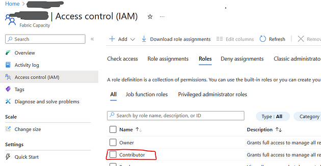
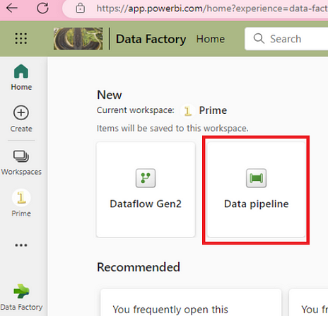
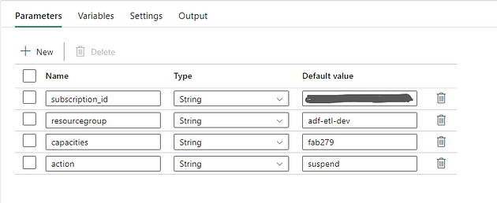
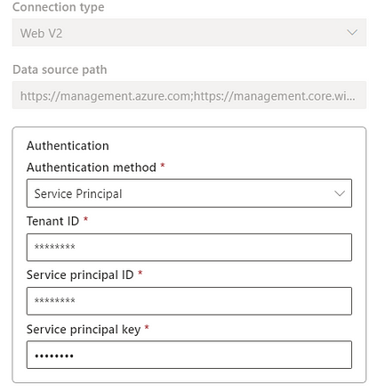
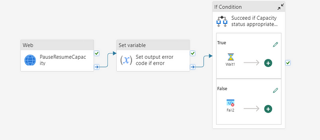
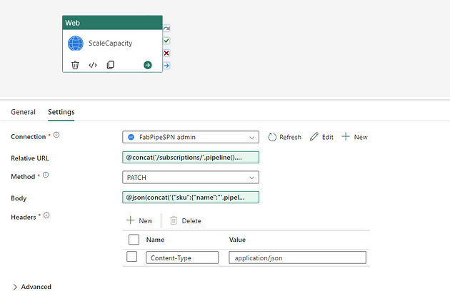

Existem várias maneiras de pausar, retomar ou dimensionar uma Capacidade
[Microsoft Fabric](https://www.linkedin.com/showcase/microsoftfabric/?trk=article-ssr-frontend-pulse_little-mention)
. Note que isso se aplica apenas aos F-SKUs no Azure, pois a Capacidade Premium (P-SKU) só pode ser dimensionada.

É possível fazer isso usando um pipeline do Fabric Data Factory, para que você possa orquestrar uma ou várias capacidades e cargas de trabalho.

Pressupõe-se que os conceitos de capacidades Fabric, workspaces e cargas de trabalho já são compreendidos, bem como um bom conhecimento prático do Azure. Você também precisará de uma Capacidade Fabric, idealmente uma que esteja sempre ativa.

### Abordagem geral:

1. Provisionar uma Capacidade Fabric no Azure
2. Criar um Principal de Serviço no Azure
3. Conceder permissões apropriadas (RBAC) ao Principal de Serviço
4. Criar um pipeline do Fabric Data Factory que execute uma atividade web para postar na API relevante (atualmente não formalmente suportada)

Isso permitirá que você crie um Pipeline que pode ser chamado de qualquer lugar no Fabric para pausar, retomar ou dimensionar uma Capacidade.

Para provisionar uma capacidade, escolha Microsoft Fabric na lista de serviços e especifique:

- Assinatura e Grupo de Recursos
- Nome e Região da Capacidade (note que isso pode ser em qualquer lugar globalmente, mas pode ser melhor começar em um lugar onde seu tenant do Power BI já esteja localizado (Verifique em Ajuda e Suporte no Power BI, procure por “Sobre o Power BI”)
- Tamanho (F2-F2048)
- Um Administrador de Capacidade Fabric

Principal de Serviço: Crie um SPN usando o método que preferir. Meu favorito é usando o Azure CLI.

Permissões: Certifique-se de que seu principal de serviço tenha direitos de colaborador na Capacidade Fabric.



**Criar um Pipeline de Dados**: Navegue até o Workspace no Microsoft Fabric onde você pretende criar o Pipeline. Crie um novo pipeline *ManageCapacityPauseResume*.



Adicione alguns parâmetros para tornar seu pipeline mais flexível, preenchendo-os adequadamente.



Adicione uma Atividade Web ao canvas. Você precisará especificar o principal de serviço que você criou anteriormente.



Para a URL Base, adicione https://management.azure.com, e para o URI do público do token, adicione https://management.azure.com;https://management.core.windows.net/.

Para a URL relativa na Atividade Web, adicione a seguinte expressão:

```
@concat(‘/subscriptions/’,pipeline().parameters.subscription_id,’/resourceGroups/’,pipeline().parameters.resourcegroup,’/providers/Microsoft.Fabric/capacities/’,pipeline().parameters.capacities,’/’,pipeline().parameters.action,’?api-version=2022–07–01-preview’)        
```

Note que ao colar a expressão acima, alguns usuários relataram problemas com as aspas simples.

Escolha o método POST e coloque {} no corpo.

Observe o parâmetro de ação, que pode ser “suspend” ou “resume” para pausar ou retomar conforme desejado.

Agora você pode salvar e executar o pipeline para testá-lo. Se sua capacidade estiver em execução, execute um "suspend". Observe como o portal do Azure mostra que a capacidade está pausada.

Note que, se a capacidade não estiver em execução e você tentar pausá-la, a atividade falhará. Para lidar com isso, você pode tratar esse erro específico e falhar o pipeline apenas se ele ocorrer, como na imagem abaixo.



Para dimensionar uma capacidade, use um pipeline semelhante ao descrito acima. Mude a expressão na Atividade Web para:

```
@concat(‘/subscriptions/’,pipeline().parameters.subscription_id,’/resourceGroups/’,pipeline().parameters.resourcegroup,’/providers/Microsoft.Fabric/capacities/’,pipeline().parameters.capacities,’?api-version=2022–07–01-preview’)        
```

Use o método PATCH.

Você também precisará adicionar um novo parâmetro para o valor do SKU.

Altere o Corpo para:

```
@json(concat(‘{“sku”:{“name”:”’,pipeline().parameters.sku,’”,”tier”:”Fabric”}}’))        
```


### Tópicos Adicionais

É possível passar variáveis e arrays entre pipelines, bem como agendá-los. Isso significa que, se você tiver workspaces de desenvolvimento que residem em uma capacidade ou capacidades específicas, você pode agendar o pipeline de pausa para ser executado diariamente em um horário definido para economizar custos, ou para dimensionar capacidades conforme necessário.

### Considerações Finais

Embora as APIs usadas aqui para as capacidades Fabric ainda não estejam formalmente documentadas no momento da escrita, o uso de pipelines Fabric forma uma alternativa útil de orquestração ao uso mais comum de Logic Apps para esse propósito. Isso significa que você pode usar uma solução SaaS do Fabric para gerenciamento de capacidades Fabric.
