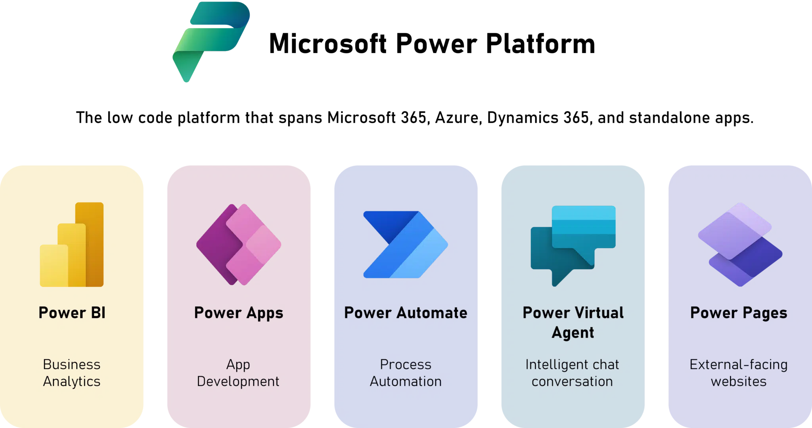
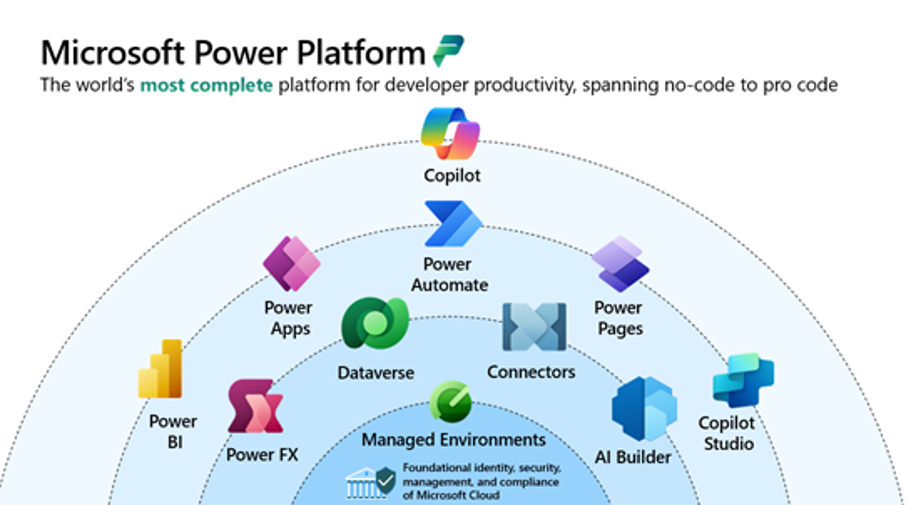

Lembram do Super Mario Bros? Aquela sensação de começar pequeno, descobrir aos poucos os segredos do jogo, e ir evoluindo até dominar completamente o universo? A transformação digital nas empresas segue uma lógica bem parecida.

Você começa com processos manuais e planilhas espalhadas, vai descobrindo ferramentas que facilitam sua vida, e aos poucos percebe que pode criar soluções que nem imaginava serem possíveis. A [Microsoft Power Platform](https://www.linkedin.com/company/microsoft-power-platform/) é exatamente isso: um conjunto de ferramentas que permite essa evolução gradual, mas consistente.

E assim como no Reino do Cogumelo, cada componente da plataforma tem sua personalidade única e função específica. Vamos conhecer esse time de personagens que vai transformar sua empresa.

### Os Componentes Principais: Conhecendo o Time

\_Componentes Power Platform\_

### Power Apps: O Mario

O Power Apps é como o próprio Mario. Versátil, adaptável e capaz de resolver qualquer desafio. Assim como o Mario pode ser encanador, médico, piloto de kart ou jogador de tênis, o Power Apps se adapta a qualquer necessidade de negócio.

Precisa de um app para controle de estoque? O Power Apps vira "Mario Almoxarife". Quer um sistema de aprovações? Vira "Mario Gerente". É essa versatilidade que torna o Power Apps o protagonista da plataforma. Ele literalmente constrói soluções para qualquer mundo (departamento) da sua empresa.

E assim como o Mario evolui com power-ups, suas aplicações no Power Apps podem crescer em complexidade conforme você vai dominando a ferramenta.

### Power Automate: O Luigi

O Power Automate é o Luigi da plataforma. Sempre presente, extremamente confiável, e fazendo o trabalho pesado nos bastidores. Enquanto o Mario (Power Apps) está na linha de frente resolvendo problemas, o Luigi (Power Automate) está automaticamente cuidando de todas as tarefas repetitivas.

Quando alguém preenche um formulário no Power Apps, o Power Automate automaticamente envia e-mails, atualiza planilhas, cria tickets e notifica as pessoas certas. É como ter o Luigi sempre ao seu lado, antecipando o que precisa ser feito e executando sem você nem precisar pedir.

E assim como o Luigi às vezes supera o Mario em certas situações, o Power Automate pode ser o verdadeiro herói quando se trata de eficiência operacional.

### Copilot Studio: O Yoshi

O Copilot Studio é como o Yoshi. Um companheiro inteligente que não apenas te ajuda, mas adiciona capacidades completamente novas à sua jornada. Assim como o Yoshi pode voar, comer inimigos e dar saltos duplos, o Copilot Studio adiciona inteligência artificial às suas soluções.

Ele entende linguagem natural, aprende com as interações e pode executar tarefas complexas de forma autônoma. É como ter um Yoshi que não apenas te carrega, mas também conversa, analisa situações e toma decisões inteligentes.

E assim como existem diferentes tipos de Yoshi (verde, azul, vermelho), você pode criar diferentes tipos de agentes no Copilot Studio, cada um especializado em uma área específica do negócio.

### Power Pages: A Princesa Peach

O Power Pages é como a Princesa Peach. Elegante, acessível e a face pública do Reino do Cogumelo corporativo. É através dele que clientes e parceiros externos interagem com sua empresa de forma organizada e segura.

Assim como a Princesa Peach governa o reino e recebe visitantes no castelo, o Power Pages cria portais e websites que recebem usuários externos, oferecendo uma experiência polida e profissional. É onde acontecem os encontros importantes entre sua empresa e o mundo exterior.

E assim como a Princesa Peach tem seus próprios poderes (especialmente nos jogos mais recentes), o Power Pages não é apenas uma "vitrine bonita". Tem funcionalidades robustas de segurança, personalização e integração.

### Power BI: O Toad

O Power BI é como o Toad. Pequeno em tamanho, mas gigante em sabedoria. É quem tem acesso a todas as informações do reino e pode te orientar sobre onde ir, o que fazer e quais são os melhores caminhos.

Assim como o Toad aparece em momentos cruciais para dar dicas importantes ("Your Princess is in another castle!"), o Power BI aparece com insights fundamentais sobre seus dados. Ele analisa tudo que está acontecendo na empresa e te dá as informações necessárias para tomar decisões inteligentes.

E assim como o Toad conhece todos os segredos e atalhos do Reino do Cogumelo, o Power BI revela padrões ocultos e oportunidades que você nem sabia que existiam nos seus dados.

### As Tecnologias de Suporte: Os Power-Ups Essenciais

\_Power Platform: Tecnologias de Suporte\_

### Data Connectors: Os Canos Warp

Os Data Connectors são como os famosos canos do Mario. Te transportam instantaneamente entre diferentes mundos (sistemas). Assim como você entra em um cano no Mundo 1-1 e sai no Mundo Warp Zone, os conectores permitem que seus dados fluam entre Salesforce, SAP, Excel e centenas de outros sistemas.

É o que permite quebrar as barreiras entre departamentos e criar uma experiência unificada, mesmo quando os dados estão espalhados em sistemas completamente diferentes.

### AI Builder: O Super Mushroom da Inteligência

O AI Builder é como o Super Mushroom. Transforma suas aplicações simples em versões "super" com capacidades de inteligência artificial. Assim como o Mario pequeno vira Super Mario, suas aplicações normais ganham superpoderes de IA.

Processamento de documentos, reconhecimento de imagens, análise de sentimento. Tudo isso sem você precisar ser um cientista de dados. É literalmente pegar o power-up e ganhar novas habilidades instantaneamente.

### Microsoft Dataverse: O Castelo Principal

O Microsoft Dataverse é como o Castelo da Princesa Peach. O centro seguro e organizado onde tudo importante fica guardado. É a base sólida e confiável que sustenta todo o reino.

Assim como o castelo tem quartos específicos para diferentes propósitos, o Dataverse organiza seus dados em estruturas lógicas, com segurança robusta e acesso controlado. É onde todos os personagens (componentes) se encontram e compartilham informações.

### Power Fx: A Linguagem do Reino

O Power Fx é como a linguagem universal do Reino do Cogumelo. Todos os personagens entendem e podem usar. Baseada nas fórmulas do Excel que todo mundo já conhece, é como se todos falassem a mesma língua, facilitando a comunicação entre diferentes mundos.

### Managed Environments: O Lakitu

Os Managed Environments são como o Lakitu. Aquela nuvem com olhos que observa tudo de cima e garante que as regras do jogo sejam seguidas. Oferece governança inteligente sem atrapalhar a diversão.

Assim como o Lakitu monitora as corridas no Mario Kart e intervém quando necessário, os Managed Environments monitoram o uso da plataforma e aplicam políticas de segurança automaticamente.

### O Boss Final: Governança sem Sufocar a Criatividade

Aqui chegamos ao Bowser da história: o desafio da governança. Quando todo mundo na empresa descobre os power-ups da Power Platform, pode virar um caos se não houver regras claras.

Mas diferente dos jogos, aqui o objetivo não é derrotar o Bowser, mas sim transformá-lo em um aliado. A governança bem feita é como ter o Bowser do seu lado. Poderoso, protetor, mas que deixa todo mundo se divertir dentro das regras.

**O Centro de Excelência é como ter um Conselho Real:** Define as regras do reino (políticas de uso). Treina novos aventureiros (capacitação). Monitora as atividades (observabilidade). Garante que todos os mundos se conectem harmoniosamente.

**Estratégias práticas de governança:** Crie ambientes separados para desenvolvimento, teste e produção. Configure políticas de DLP que impedem conexões perigosas entre dados sensíveis e conectores externos. Use as ferramentas de administração para acompanhar o que está sendo criado e como está sendo usado. Invista em treinamento contínuo para que as pessoas criem soluções melhores desde o início.

### O Futuro: Novos Mundos a Explorar

As tendências que estão chegando são como descobrir que existem novos mundos além dos 8 tradicionais. O desenvolvimento orientado por intenção é como ter um jogo que se adapta ao seu estilo. Você simplesmente descreve o que quer fazer e o sistema cria o nível perfeito para você.

O Plan Designer já faz isso. Você descreve um problema de negócio e uma equipe de agentes de IA colabora para criar a solução. Os agentes autônomos são como ter NPCs que realmente evoluem e aprendem. Em vez de repetir sempre as mesmas frases, eles entendem contexto, tomam decisões e crescem com a experiência.

Até 2025, estima-se que 70% das novas aplicações empresariais serão desenvolvidas usando tecnologias low-code ou no-code. Não é uma tendência, é uma realidade que já está batendo na porta.

### Como Começar Sua Aventura

A pergunta não é se sua empresa vai entrar nesse jogo, mas quando vai pegar o controle e começar a aventura.

Comece pequeno. Identifique um processo simples que pode ser melhorado e use isso como piloto. É como começar no Mundo 1-1 antes de partir para os desafios mais complexos.

Crie uma comunidade interna de pessoas interessadas em aprender e compartilhar conhecimento. É como formar uma guild de jogadores que se ajudam mutuamente.

Invista em governança desde o início. É mais fácil estabelecer boas práticas no começo do que tentar organizar a bagunça depois. Como dizem, é melhor prevenir do que remediar.

E principalmente, lembrem-se: todo expert já foi iniciante um dia. Até o Mario começou como um simples encanador.

### Game Over? Nunca!

A Power Platform representa uma mudança fundamental. Estamos saindo de um mundo onde apenas "desenvolvedores profissionais" podiam criar soluções para um mundo onde qualquer pessoa pode ser o Mario da própria história de transformação digital.

E assim como nos melhores jogos, a diversão está tanto em jogar quanto em descobrir novos segredos, criar novas estratégias e ajudar outros jogadores a completarem suas jornadas.

Ready Player One? Let's-a-go! 🍄🚀

---

### Referências

Microsoft. (2024). Microsoft Power Platform. Microsoft. <https://www.microsoft.com/en-us/power-platform>

Gartner. (2024, 16 de outubro). Magic Quadrant for Enterprise Low-Code Application Platforms. Gartner. <https://www.microsoft.com/en-us/power-platform>

Microsoft. (2025, 25 de setembro). Microsoft Power Platform: 2025 release wave 1 plan. Microsoft Learn. <https://learn.microsoft.com/en-us/power-platform/release-plan/2025wave1/>

UserGuiding. (s.d.). 120+ No-Code/Low-Code Statistics and Trends That You Must Know in 2025. UserGuiding. <https://userguiding.com/blog/no-code-low-code-statistics/>

Microsoft. (2025, 2 de abril). Usar componentes principais. Microsoft Learn. <https://learn.microsoft.com/pt-br/power-platform/guidance/coe/core-components>

Microsoft. (s.d.). Microsoft Power Platform documentation. Microsoft Learn. <https://learn.microsoft.com/en-us/power-platform/>
