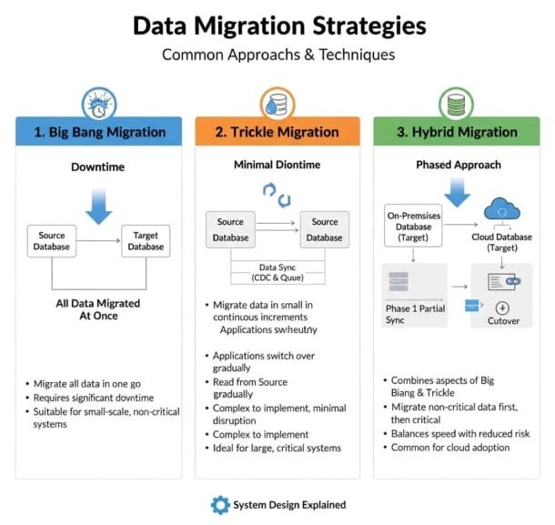

No universo da tecnologia, poucas tarefas são tão críticas e delicadas quanto a migração de dados. Seja para modernizar sistemas, adotar a nuvem ou consolidar plataformas, mover dados de um lugar para outro é uma jornada que exige planejamento, precisão e uma estratégia bem definida. A forma como essa mudança é conduzida pode determinar o sucesso de um projeto, impactando diretamente a continuidade dos negócios.

Imagine que você está se mudando de casa. Seus dados são todos os seus móveis, eletrodomésticos e pertences acumulados ao longo dos anos. O sistema antigo é a casa onde você mora atualmente, e o novo sistema é aquela casa moderna e espaçosa para onde você está se transferindo. A grande questão é: como fazer essa mudança? Você embala tudo de uma vez e enfrenta um fim de semana caótico para resolver rapidamente? Ou você vai levando as coisas aos poucos, mantendo a casa antiga funcional até que a nova esteja completamente pronta?

Neste artigo, vamos explorar as três principais abordagens para essa jornada de mudança: **Big Bang, Trickle e Híbrida.** Vamos usar a metáfora da mudança de casa para descomplicar cada conceito e ajudá-lo a escolher o caminho certo para o seu cenário.

### As Estratégias de Migração em Detalhes

Cada abordagem de migração possui características, vantagens e desvantagens distintas. A escolha ideal depende da complexidade do ambiente, da tolerância ao tempo de inatividade (downtime) e dos objetivos de negócio. Vamos entender como cada uma funciona no contexto da nossa mudança.

### Big Bang Migration: A Mudança de Fim de Semana

A abordagem Big Bang é como decidir fazer toda a mudança em um único fim de semana. Você contrata o caminhão, convoca os amigos, embala absolutamente tudo e move todos os seus pertences de uma só vez. Durante esse processo, sua casa antiga fica completamente inabitável. Os móveis foram desmontados, as caixas estão empilhadas, e você não consegue nem fazer um café. É um período de downtime significativo, mas quando termina, a mudança está concluída.

No contexto de dados, todos os registros são transferidos do sistema de origem para o de destino em uma única operação. O sistema antigo é desligado, e após a migração, apenas o novo sistema está operacional. A simplicidade é sua maior vantagem: não há necessidade de sincronização complexa ou de manter dois ambientes funcionando simultaneamente.

Essa estratégia é mais adequada para sistemas de pequena escala ou não críticos, onde uma janela de inatividade programada é aceitável. É como mudar de um apartamento pequeno onde você consegue organizar tudo em algumas horas. Mas para operações que não podem parar, essa abordagem se torna inviável. Afinal, você não pode deixar seu negócio inabitável por muito tempo.

### Prós e Contras do Big Bang

Vantagens:

- **Simplicidade no planejamento:** Com apenas um evento de migração, o processo de planejamento pode ser mais direto comparado às abordagens faseadas.
- **Custos reduzidos a longo prazo:** Como os sistemas antigo e novo não funcionam em paralelo por um período estendido, há economia em termos de manutenção e suporte.
- **Funcionalidade completa imediata:** Após a migração, o novo sistema está totalmente operacional, fornecendo todas as funcionalidades sem um período de capacidade limitada ou parcial.
- **Transição clara:** Fornece um ponto de transição claro e definitivo, o que pode ser mais fácil para algumas organizações gerenciarem e comunicarem internamente.

Desvantagens:

- **Alto risco:** Se algo der errado durante a migração, pode ter efeitos imediatos e generalizados em toda a organização.
- **Difícil de testar e solucionar problemas:** Testes completos são desafiadores quando tudo muda de uma vez, e a solução de problemas pós-migração pode ser mais complexa.
- **Potencialmente disruptivo:** A mudança repentina pode ser disruptiva para as operações de negócios e pode exigir downtime significativo durante a transição.
- **Desafios de adaptação do usuário:** Os usuários devem se adaptar ao novo sistema de uma só vez, o que pode levar à resistência ou a uma curva de aprendizado acentuada.
- **Flexibilidade limitada para ajustes:** Há pouco espaço para ajustar a estratégia no meio do processo. Problemas encontrados após a ativação podem ser caros e difíceis de corrigir.

### Trickle Migration: A Mudança Gradual

A Trickle Migration, ou migração por gotejamento, é como fazer uma mudança aos poucos, levando algumas caixas por dia no porta-malas do carro. Você começa transferindo os itens menos essenciais: livros, decoração, roupas fora de estação. Enquanto isso, continua morando normalmente na casa antiga. Aos poucos, a casa nova vai sendo montada, e você mantém os dois ambientes funcionais simultaneamente até que a transição esteja completa.

No mundo dos dados, essa abordagem move informações em pequenas porções, de forma contínua, enquanto os sistemas de origem e destino operam em paralelo. Tecnologias como Change Data Capture (CDC) funcionam como um serviço de mudança que monitora constantemente o que está sendo adicionado ou modificado na casa antiga e replica essas mudanças na casa nova em tempo real. Se você compra um sofá novo enquanto ainda está na casa antiga, ele já vai direto para a casa nova.

Essa estratégia é ideal para sistemas grandes e críticos, onde o downtime é inaceitável. É como mudar de uma casa enorme cheia de itens valiosos e frágeis. Você não pode simplesmente jogar tudo no caminhão e torcer para dar certo. Embora sua implementação seja mais complexa, ela minimiza os riscos e o impacto para o usuário final. A transição ocorre de forma tão suave que, muitas vezes, é imperceptível. É como se você acordasse um dia e percebesse que já está morando na casa nova sem ter sentido o processo.

### Prós e Contras do Trickle

Vantagens:

- **Risco reduzido:** Mudanças menores e incrementais reduzem o risco de uma falha maior.
- **Disrupção mínima:** A operação contínua de ambos os sistemas minimiza as interrupções nos processos de negócios.
- **Mais fácil de gerenciar e testar:** Mudanças menores são mais fáceis de gerenciar, testar e solucionar problemas.
- **Flexibilidade:** Permite ajustes e refinamentos ao longo do processo de migração.
- **Continuidade operacional:** Os usuários podem continuar trabalhando normalmente durante todo o processo.

Desvantagens:

- **Duração mais longa:** O processo pode levar mais tempo para ser concluído em comparação com o Big Bang.
- **Custos mais altos:** Executar dois sistemas em paralelo por um período prolongado pode incorrer em custos adicionais.
- **Complexidade na sincronização:** Manter os dados sincronizados entre dois sistemas pode ser complexo e consumir muitos recursos.
- **Necessidade de ferramentas especializadas:** Requer tecnologias como CDC e sistemas de fila para garantir a sincronização em tempo real.

### Hybrid Migration: A Mudança Estratégica em Fases

A abordagem Híbrida combina o melhor dos dois mundos, unindo a velocidade do Big Bang com a segurança da Trickle Migration. É como planejar sua mudança em etapas estratégicas. Primeiro, você faz uma mudança relâmpago dos itens não essenciais: aquelas caixas de livros antigos, utensílios de cozinha que você raramente usa, móveis do quarto de hóspedes. Tudo isso vai de uma vez, liberando espaço e reduzindo o volume.

Enquanto isso, os itens críticos são transferidos gradualmente, com todo o cuidado necessário. Sua cama, o computador de trabalho, os documentos importantes, os objetos de valor. Você mantém a casa antiga funcional para as atividades essenciais enquanto prepara a nova para recebê-las. Quando chega o momento final, a transição dos itens críticos é rápida e planejada, porque a maior parte da mudança já foi concluída.

No contexto de dados, a migração é dividida em fases. Geralmente, os dados não críticos ou históricos são movidos primeiro, talvez em um formato Big Bang, enquanto os dados transacionais e críticos são sincronizados continuamente. É uma estratégia muito comum para a adoção de nuvem. Você pode começar migrando ambientes de desenvolvimento e homologação (os itens menos críticos da casa), e depois partir para a produção com uma abordagem mais cuidadosa.

Esta abordagem oferece a flexibilidade necessária para lidar com ambientes complexos. Ela garante que as partes mais sensíveis do sistema sejam movidas com o máximo de cuidado, enquanto acelera o processo geral da migração.

### Prós e Contras da Abordagem Híbrida

Vantagens:

- **Equilíbrio entre velocidade e segurança:** Combina a rapidez do Big Bang para dados não críticos com a segurança do Trickle para dados críticos.
- **Downtime reduzido e planejado:** O tempo de inatividade é minimizado e pode ser agendado estrategicamente.
- **Flexibilidade adaptativa:** Permite ajustar a estratégia conforme o projeto avança e novos desafios surgem.
- **Risco gerenciável:** Distribui o risco ao longo de diferentes fases, evitando um único ponto de falha catastrófico.
- **Ideal para ambientes complexos:** Perfeita para migrações de grande escala, como adoção de nuvem ou consolidação de sistemas.

Desvantagens:

- **Complexidade moderada:** Requer planejamento mais sofisticado do que o Big Bang, embora menos complexo que o Trickle puro.
- **Necessidade de coordenação:** Exige coordenação cuidadosa entre as diferentes fases e equipes envolvidas.
- **Custos intermediários:** Os custos ficam entre o Big Bang e o Trickle, dependendo da duração da operação paralela.
- **Requer expertise técnica:** Demanda conhecimento tanto de migrações rápidas quanto de sincronização contínua.

\_Tipos de migração de dados\_

### Conclusão

Escolher a estratégia de migração de dados correta é fundamental para garantir uma transição segura, eficiente e alinhada aos objetivos do seu negócio. Assim como não existe uma única forma de se mudar de casa, não há uma única resposta para a migração de dados. O tamanho da sua casa (volume de dados), a fragilidade dos seus pertences (criticidade dos sistemas) e o tempo que você tem disponível (janela de downtime) são fatores que determinarão qual abordagem faz mais sentido. Ao compreender as nuances de cada estratégia, você estará mais preparado para planejar e executar sua jornada de dados com sucesso, garantindo que seus ativos mais valiosos cheguem ao novo lar em perfeita ordem.

### Referências

1.Brainhub. (2024). Big Bang vs Trickle Migration: Key Differences & Considerations. Disponível em: <https://brainhub.eu/library/big-bang-migration-vs-trickle-migration>

2.NetApp. (2021). Data Migration Strategy: Goals, Migration Types, and Phases. Disponível em: <https://bluexp.netapp.com/blog/clc-blg-data-migration-strategy-goals-migration-types-and-phases>

3.DataPao. (2023). Big Bang vs Trickle Data Migration Approach. Disponível em: <https://datapao.com/big-bang-vs-trickle-data-migration/>

4.Provalet. (2025). Top 7 Data Migration Strategies Every Business Must Know. Disponível em: <https://www.provalet.io/guides-posts/data-migration-strategies>

5.Varonis. (2023). Guia de migração de dados: sucesso estratégico e práticas recomendadas. Disponível em: <https://www.varonis.com/pt-br/blog/guia-de-migracao-de-dados-sucesso-estrategico-e-praticas-recomendadas>
