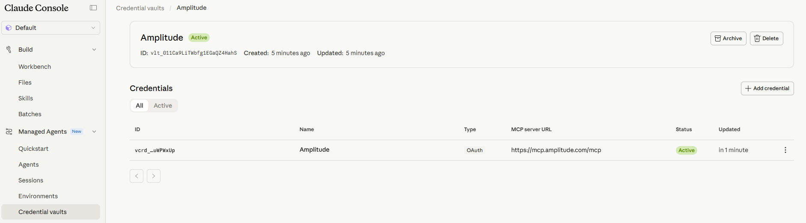
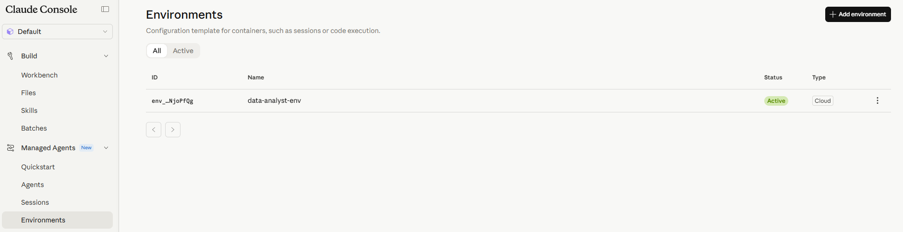
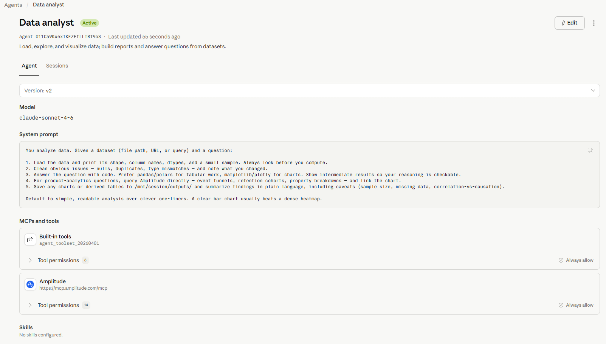
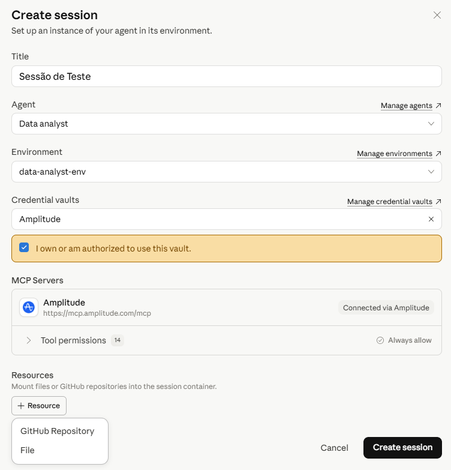
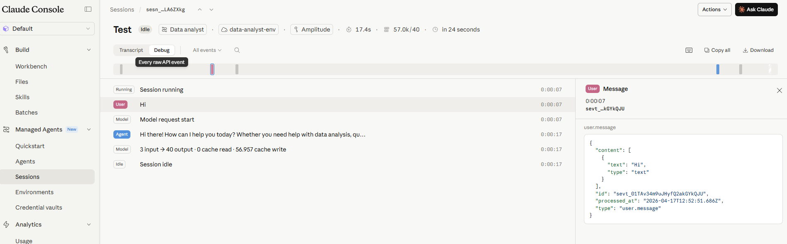

### O Cientista que Ninguém Vê

Quando os X-Men entram em combate, o mundo vê Wolverine, Tempestade, Ciclope. Ninguém vê Hank McCoy, o Fera, trabalhando nos sistemas por baixo. Mas é ele quem projetou o Cerebro. É ele quem mantém a Sala de Perigo funcionando. É ele quem garante que a infraestrutura da Mansão Xavier aguenta qualquer missão, por mais complexa que seja.

Hank não constrói para o momento. Ele constrói para evoluir.

Essa é a distinção que separa quem usa agentes de IA de quem projeta sistemas agenticos de verdade. E foi exatamente com essa filosofia que a Anthropic construiu o **Claude Managed Agents** da
[Anthropic](https://www.linkedin.com/company/anthropicresearch?trk=article-ssr-frontend-pulse_little-mention)
, lançado em abril de 2026.

Em termos simples: o Managed Agents é uma infraestrutura gerenciada pela Anthropic que permite criar agentes Claude autônomos sem construir toda a estrutura por baixo do zero. Antes dele, colocar um agente em produção exigia meses de engenharia: containers, gerenciamento de estado, autenticação, recuperação de erros, memória entre sessões. O Managed Agents elimina esse trabalho. Você define o comportamento. A Anthropic garante que ele funciona.

E tudo isso é configurável diretamente pelo Claude Console, sem escrever uma linha de código.

### Por Que a Ordem Importa

O erro mais comum de quem começa a construir agentes é pular direto para a complexidade. A jornada evolutiva certa tem três etapas, e cada uma precisa estar sólida antes da próxima: skills bem definidas, memória entre sessões e agente autônomo em produção.

Skills resolvem tarefas definidas e repetíveis. Memória transforma sessões isoladas em conhecimento acumulado. O agente autônomo é o resultado dos dois funcionando juntos. Tentar construir o terceiro sem os dois primeiros é como Hank tentar construir o Cerebro antes de entender como funciona a telepatia.

### Entendendo os Dois Objetos Centrais

Antes de construir qualquer coisa, é fundamental entender a distinção entre os dois objetos principais do Managed Agents.

O **Environment** é o laboratório. Ele define o container onde o agente executa, quais pacotes estão instalados, quais sistemas externos pode acessar e, crucialmente, onde os arquivos de skills ficam armazenados e persistem entre sessões. É a estante de manuais do laboratório do Fera: os manuais ficam lá, disponíveis para qualquer missão que usar aquele laboratório.

\_Exemplo da conexão MCP.\_

\_Exemplo da tela de Environments\_

O **Agent** é o cérebro. Ele define o modelo, o system prompt, as ferramentas disponíveis e as skills que vai carregar do Environment. É versionado: cada atualização gera uma nova versão com histórico completo para auditoria.

\_Exemplo de um Agente\_

A relação entre os dois é simples: o Environment persiste o conhecimento. O Agent aplica o conhecimento. Uma **Session** é quando os dois se encontram para executar uma missão específica.

\_Exemplo de Criação da Sessão\_

\_Exemplo de Execução de Sessão\_

### Fase 1: Construindo as Skills

O primeiro passo no Console é criar o Environment em [**console.anthropic.com**](http://console.anthropic.com) **→ Managed Agents → Environments**. Em seguida, crie o Agent em **Managed Agents → Agents** com o modelo, o system prompt e as skills que vai carregar do Environment.

**O cenário concreto:** um time de dados que gerencia 200 pipelines no Microsoft Fabric. Todo dia, falhas aparecem, logs precisam ser analisados e incidentes precisam ser documentados. Hoje isso consome horas do time de engenharia.

As primeiras skills para esse agente: revisar-pipeline, que analisa arquivos e retorna um relatório de status e riscos. gerar-incidente, que formata o relatório com severidade e próximos passos sempre no mesmo padrão. diagnosticar-erro, que interpreta logs e sugere a causa raiz.

Esses arquivos ficam persistidos no Environment. Se você ajustar uma skill, edita o arquivo e todas as sessões futuras já usam a versão atualizada.

Valide cada skill individualmente antes de avançar. Se Claude hesita ou retorna um formato diferente do esperado, a skill precisa ser refinada.

### Quando a Skill Já Não É Suficiente

Existem quatro sinais claros de que chegou a hora de evoluir para agente com memória:

O contexto necessário é maior do que uma conversa comporta, e o agente precisa de informações de sessões anteriores. A tarefa envolve múltiplos passos interdependentes que exigem decisões no meio do caminho. O volume justifica autonomia, com o time acionando a mesma skill dezenas de vezes por dia. O erro se repete porque ninguém lembrou: a skill não aprende, o agente com memória sim.

Hank não construiu o Cerebro porque a lista de presença era complicada. Ele construiu porque a escala da missão exigia algo que nenhum processo manual conseguia entregar.

### Fase 2: Adicionando Memória e Evoluindo para Múltiplos Agentes

No Console, ao editar o Agent, ative o toggle **Memory**. Atualize o system prompt instruindo Claude a consultar a memória ao iniciar cada sessão e registrar o que foi descoberto ao finalizar.

Com essa instrução, o agente para de começar do zero. Na quinta sessão, ele já identifica o timeout do pipeline vendas\_diarias antes de verificar o log porque reconhece o padrão. Na vigésima, ele inclui automaticamente a recorrência histórica no relatório de incidente.

Quando a complexidade cresce ainda mais, é hora de dividir responsabilidades. No cenário do Fabric com 200 pipelines, um único agente pode não ser suficiente. A evolução natural é criar agentes especializados: um para monitoramento, outro para diagnóstico, outro para geração de relatórios. Um agente orquestrador recebe o objetivo, delega para os especialistas e consolida os resultados. Cada especialista tem seu próprio conjunto de skills no Environment e sua própria memória acumulada.

Essa divisão não é complexidade por complexidade. É a diferença entre um cientista que faz tudo sozinho e um laboratório com especialistas que colaboram.

### Fase 3: Publicando para o Time com Governança

Com skills sólidas e memória funcionando, o agente está pronto para o time. E aqui está o ponto que muda a equação de adoção: **os usuários finais não precisam de licença Claude**. A organização paga pela API via tokens e runtime. Os usuários interagem pela interface que a organização escolher, sem conta na Anthropic, sem plano Pro.

No cenário do Fabric, a publicação mais natural é via **Microsoft Teams** usando MCP. Qualquer engenheiro menciona o agente no canal, a mensagem chega como evento, o agente processa com suas skills e memória e responde com o relatório formatado. O engenheiro recebe o diagnóstico em dois minutos em vez de gastar uma hora analisando logs.

Para outros contextos: via **Slack** com o mesmo padrão, via **interface interna** construída pelo time de TI, ou via **Claude Console** para usuários técnicos que precisam de visibilidade total.

E visibilidade é a palavra certa. No Console, a aba **Sessions** registra cada sessão com o histórico completo: cada ferramenta chamada, cada decisão tomada, cada arquivo gerado, com timestamp e custo por sessão. Para um líder de dados, isso responde a pergunta que sempre surge em ambiente enterprise: o que o agente fez, por quê e quando? A auditoria não é uma feature adicional. É parte da arquitetura.

### O Que Custa

O Managed Agents cobra em duas dimensões: tokens consumidos às taxas padrão da API, com Prompt Caching reduzindo em até 90% o custo das skills e system prompt reutilizados, e runtime de sessão a $0,08 por hora, cobrado apenas enquanto o agente está em status **running**.

No cenário do Fabric com 500 verificações por dia e sessões de 5 minutos: 500 × (5/60) × $0,08 = **$3,33/dia em runtime**.

O Batch API não se aplica ao Managed Agents. Para workloads sem necessidade de estado, a API padrão com Batch é mais econômica. Managed Agents é a escolha certa quando estado, memória e autonomia são necessários.

### Conclusão: Construir Para Evoluir

Hank McCoy ficou famoso não pelo sistema mais complexo, mas pelo mais durável. O Cerebro sobreviveu a décadas de missões porque cada componente foi validado antes de ser integrado ao próximo.

Comece pelas skills no Environment. Valide cada uma. Identifique quando o contexto, o volume ou a repetição de erros sinalizem que é hora de evoluir. Adicione memória. Divida em especialistas quando a missão exigir. Publique via Teams, Slack ou interface interna.

Os engenheiros do time vão interagir com um agente que aprende, lembra e melhora. Sem saber o que roda por baixo. Sem precisar de licença Claude.

A mansão aguenta qualquer missão porque a infraestrutura foi construída para isso. Um passo de cada vez.

### Referências

- *Anthropic. Claude Managed Agents Overview.* [*https://platform.claude.com/docs/en/managed-agents/overview*](https://platform.claude.com/docs/en/managed-agents/overview)
- *Anthropic. Claude Managed Agents — get to production 10x faster.* [*https://claude.com/blog/claude-managed-agents*](https://claude.com/blog/claude-managed-agents)
- *Anthropic. Cloud Environment Setup.* [*https://platform.claude.com/docs/en/managed-agents/environments*](https://platform.claude.com/docs/en/managed-agents/environments)
- *Verdent. Claude Managed Agents Pricing.* [*https://www.verdent.ai/guides/claude-managed-agents-pricing*](https://www.verdent.ai/guides/claude-managed-agents-pricing)
