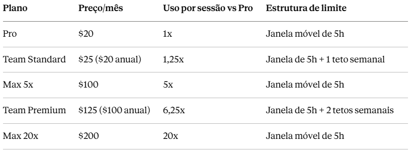
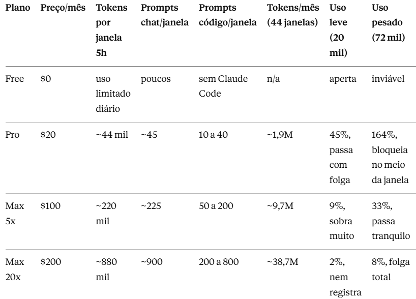
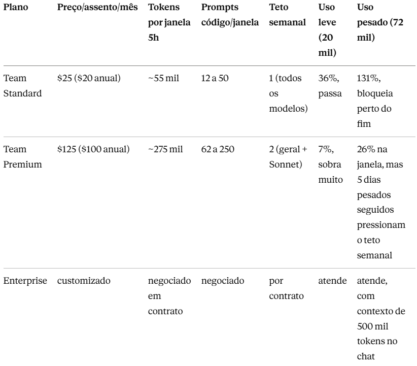

### A Sala de Armaduras

Debaixo da mansão em Malibu, Tony Stark mantém uma galeria que conta a história dele melhor que qualquer biografia. A Mark III, dourada e vermelha, feita para o dia a dia. A Mark XLIV, a Hulkbuster, projetada para um único cenário extremo. O detalhe que define o Tony nunca foi ter a armadura mais poderosa. É saber qual armadura cada missão pede. Ele não voa para uma gala dentro da Hulkbuster, e quando erra a escolha, a história cobra: armadura de menos vira sufoco no meio da batalha, armadura de mais vira custo parado no hangar.

Escolher o plano do Anthropic Claude é esse problema, com um agravante que o Tony não tinha: os manuais das armaduras não publicam a potência. A Anthropic não divulga quantos tokens cada plano entrega. E é por isso que todo comparativo que circula por aí repete os mesmos preços e os mesmos adjetivos, sem responder a única pergunta que importa: o seu dia de trabalho cabe dentro do limite?

Neste artigo eu faço a conta que ninguém faz. Uma simulação de tokens, janelas e prompts, cruzada com o uso real de dois perfis de pessoa, para você encontrar seu plano numa linha de tabela em vez de descobrir do jeito ruim, com a tela de "você atingiu seu limite" no meio de uma entrega.

### O Que a Anthropic Publica (e o Que Não Publica)

Os números oficiais são preços e multiplicadores. Todos os planos pagos expressam sua capacidade como múltiplos do plano Pro por sessão, e cada família de plano estrutura os limites de um jeito:

O que a Anthropic não publica é o valor absoluto por trás do 1x. A documentação oficial diz apenas que o consumo varia com o tamanho da conversa, o modelo e os recursos usados. Essa opacidade é decisão de produto, não descuido: dá à empresa flexibilidade para ajustar alocações sem quebrar compromissos publicados.

Mas dá para simular. Testes de usuários estimam que o Pro entrega cerca de 44 mil tokens por janela de cinco horas, e a documentação de suporte indica até 45 mensagens por janela no Pro, caindo para algo entre 10 e 40 prompts em uso real de Claude Code. Aplicando os multiplicadores oficiais sobre essa base, a sala de armaduras inteira fica mensurável.

### As Premissas da Simulação

Toda a simulação abaixo usa estas premissas, declaradas para você poder discordar delas e refazer a conta. Base: Pro com aproximadamente 44 mil tokens por janela de 5 horas, demais planos projetados pelos multiplicadores oficiais. Um prompt de chat consome cerca de mil tokens. Um prompt de código consome de mil a 4,4 mil, porque carrega contexto do repositório junto. O mês tem 44 janelas: duas por dia útil, 22 dias úteis.

E os dois perfis de pessoa, com a matemática aberta:

Uso leve, o analista que consulta: 15 prompts de chat vezes mil tokens, mais 2 tarefas de código vezes 2,5 mil. Total: cerca de 20 mil tokens por janela.

Uso pesado, o dev em projeto com Claude Code aberto o dia todo: 10 prompts de chat vezes mil, mais 25 prompts de código vezes 2,5 mil. Total: cerca de 72 mil tokens por janela.

Importante: são estimativas direcionais, não números garantidos. Servem para dimensionar ordem de grandeza, e é exatamente isso que uma decisão de compra precisa.

### A Simulação: Planos de Pessoa Física

A leitura é direta: encontre sua coluna de perfil e desça. O usuário leve vive bem no Pro, com menos da metade da janela consumida. O usuário pesado estoura o Pro em 164%, que é a tradução matemática daquela tela de bloqueio antes do almoço. No Max 5x, o mesmo dia pesado usa um terço da janela. A Hulkbuster do Max 20x só se justifica para quem roda mais pesado que o nosso perfil pesado: sessões longas de agentes, repositórios grandes, uso quase contínuo.

### A Simulação: Planos Empresariais

Aqui mora a nuance que quase todo comparativo ignora. Na tabela de pessoa física, o gargalo é a janela de cinco horas, que se renova sozinha. Na empresarial, os assentos Team somam tetos semanais por pessoa, que resetam em horário fixo. O Premium tem a maior janela da casa, 6,25 vezes o Pro, maior até que o Max 5x. Mas o usuário pesado que repete 72 mil tokens por dia, todos os dias, acumula contra o teto da semana. Rajadas intensas com pausas favorecem o Premium. Maratona contínua favorece o Max 20x, que não conhece semana.

Na linha do Enterprise, honestidade obrigatória: preço e capacidade são negociados caso a caso, então não existe número para publicar. O que é público são os diferenciais: janela de contexto de 500 mil tokens no chat, logs de auditoria, retenção de dados configurável e provisionamento SCIM. A coluna do Enterprise não se lê, se pergunta na mesa de negociação.

### O Achado Escondido na Conta

Divida o preço de cada plano pelos tokens mensais simulados e aparece o insight que a tabela de preços esconde. Pro, Team Standard, Max 5x e Team Premium custam praticamente a mesma coisa por token: na casa de 10 dólares por milhão. A precificação é linear, você paga proporcionalmente pelo que pode consumir. A exceção é o Max 20x: cerca de 5 dólares por milhão, metade do custo unitário de todos os outros.

Ou seja: o único desconto por volume da sala de armaduras está no topo dela. Para quem realmente consome, a Hulkbuster não é luxo, é o melhor preço unitário do catálogo. Para quem não consome, segue sendo a armadura mais cara do hangar.

### O Que o Preço Não Mostra: Governança

Se a decisão fosse só capacidade, a conversa acabava nas tabelas. Mas o plano Team existe por outra razão, e ela não aparece em nenhuma coluna de tokens: a camada de controle. SSO e captura de domínio, permissões por papel, controles de gasto por organização e por pessoa, busca corporativa, conectores para as ferramentas do trabalho, e o contrato de processamento de dados que passa na revisão de segurança do cliente. Quando alguém sai do time, o acesso é revogado centralmente.

O Team exige mínimo de dois membros, vai até 150 assentos e permite misturar tipos livremente: um Premium para quem carrega o piano, Standards para o resto. Todos os assentos, Standard incluído, têm acesso a Claude Code e ao Cowork. E o administrador pode habilitar créditos de uso pré-pagos, para o time continuar trabalhando depois do limite incluso, com teto de gasto definido. Semana de entrega não é semana típica, e é mais barato pagar excedente pontual do que dimensionar a frota pelo pico.

### Conclusão: A Missão Escolhe a Armadura

No fim de Homem de Ferro 3, Tony explode as armaduras que acumulou. O gesto diz o que a sala inteira sempre soube: os trajes nunca foram o poder. O poder era o critério.

Com planos de IA, o critério agora está nas suas mãos: conte os prompts de um dia normal seu, multiplique pelo custo de cada tipo, e encontre sua linha nas tabelas. Se o seu dia cabe em 44 mil tokens, o Pro é a Mark III que resolve. Se estoura em 164%, o upgrade não é vaidade, é matemática. E se a sua empresa precisa de telemetria sobre a frota, a conversa deixou de ser sobre tokens e virou governança.

A pergunta nunca foi qual é a armadura mais forte. É: qual é a sua missão, e o que ela consome por janela de cinco horas?

### Referências

- Anthropic. What is the Team plan? <https://support.claude.com/en/articles/9266767-what-is-the-team-plan>
- Anthropic. Using Claude Code with your Pro or Max plan. <https://support.claude.com/en/articles/11145838-using-claude-code-with-your-pro-or-max-plan>
- Anthropic. Planos e preços do Claude. <https://claude.com/pricing>
- Jamie Lord. Claude Team Premium vs Max plans. <https://lord.technology/2026/03/28/claude-team-premium-vs-max-plans-usage-limits-pricing-and-which-to-choose.html>
- Layer3Labs. Claude Pro vs Max vs Team. <https://www.layer3labs.io/guides/claude-pro-vs-max-for-teams>
- BrainGrid. Claude Code Pricing 2026. <https://www.braingrid.ai/blog/claude-code-pricing>
