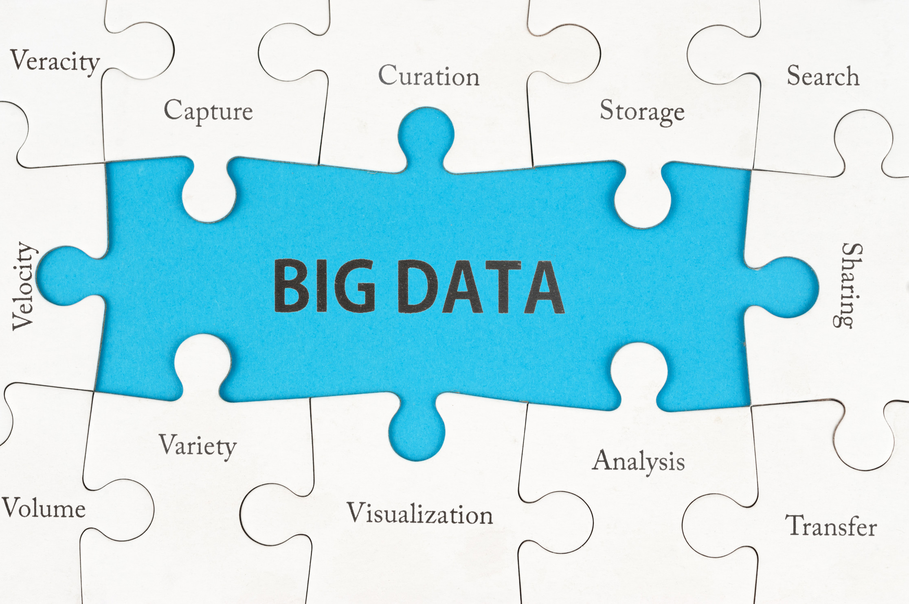
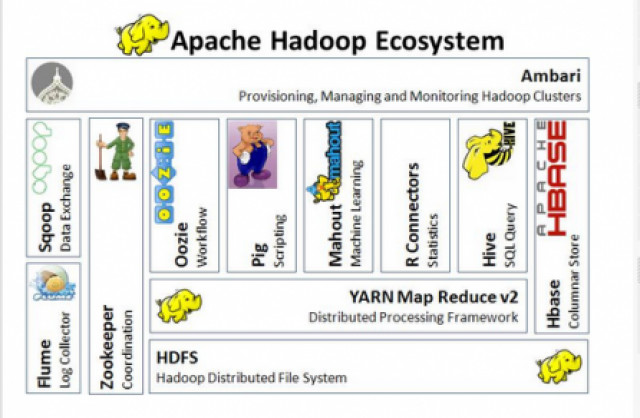
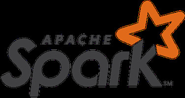

Imagine a seguinte situação, um diretor da empresa que você trabalha começa a fazer as seguintes perguntas:

***"Quantas vezes o nome da minha empresa é citada no Twitter ?" ou "Quais são as maiores dúvidas ou reclamações dos consumidores em nossa página no Facebook ?"***

Como você, analista de TI faria para organizar esses dados originados das redes sociais e gerar um relatório ou dashboard que faça sentido à diretoria ?

Justamente para responder essas questões as plataformas de Big Data são cada vez mais famosas e comentadas.

### **Mas, o que é Big Data ?**

Atualmente as siglas **Hadoop, Hive, Spark, NoSQL** e tantas outras estão na moda. Mas você realmente entende o que significa toda essa "sopa de letrinhas" ?

Eu também estou tentando entender o que significa todo esse ecossistema e nessa tentativa de organizar um pouco minhas ideias e estudos referente a esse assunto tão fascinante iniciarei uma série de artigos.

O que afinal é esse monte de siglas que todo mundo está comentando e correndo atrás como se fosse o último poço de petróleo descoberto no planeta?

Como quase sempre acontece, a criatividade surge diante de um problema a ser resolvido. O que fazer como essa imensidão de dados gerados a cada segundo por computadores e celulares ?

Fotos, Vídeos, Posts, como posso utilizar essas informações para entender mais o perfil do meu consumidor e ganhar mais dinheiro ? Como fazer para organizar, armazenar e cruzar essas diferentes formas de dados ?

Pensando nisso, mentes brilhantes começaram a desenvolver modelos de organização e armazenamento, os famosos **Mapas de Redução e Banco de Dados NoSQL**. O primeiro ecossistema a ganhar fama, que com certeza você já ouviu falar, foi o **Hadoop**.

Desenvolvido em **Java**, o objetivo desse framework em linhas gerais é mapear as informações como se fosse um dicionário, contar quais são os similares, e armazenar de forma reduzida o dado em um Banco de Dados próprio para este fim (**NoSQL**). Para armazenar cada tipo de dados temos BDs diferentes. Vou detalhar mais este assunto no próximo artigo.

Para simplificar, o **Hadoop** é o todo, o ecossistema. Ele tem um Mapa de Redução chamado **YARN** que armazena os dados nos bancos destinados para cada tipo de dado. **Cassandra, Hive, HBase** são eles.

Você deve estar se perguntando, **"Imagina a máquina potente que precisa para rodar esse volume enorme ?"** Então, para isso foi criado um sistema de arquivos, o **HDFS**, que fragmenta em ***nós e clusters***. Ou seja, a quantidade de processamento e hardware pode ir aumentando ou reduzindo conforme a necessidade.

O **Hadoop** já existe a mais de 10 anos e tem provado ser a melhor solução para o processamento de grandes conjuntos de dados. O **MapReduce**, é uma ótima solução para cálculos de único processamento, mas não muito eficiente para os casos de uso que requerem cálculos e algoritmos com várias execuções

Para resolver esse outro problema de complexidade dos dados, o **Spark** entra em cena.

Espero que essa publicação tenha contribuído para seu aprendizado e te ajude a juntar as peças do quebra-cabeça do momento.

Referências:

<http://spark.apache.org/>

<http://hadoop.apache.org/>
