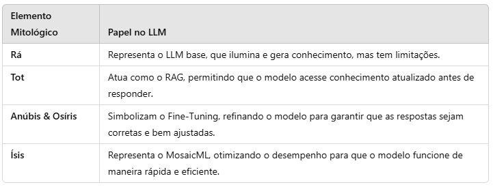

Se os antigos egípcios pudessem construir uma inteligência artificial, provavelmente invocariam seus deuses para tornar o sistema mais sábio, ágil e eficiente. Assim como **Rá iluminava o mundo**, **Tot registrava o conhecimento**, **Anúbis julgava a verdade** e **Ísis trazia agilidade e equilíbrio**, um **LLM (Large Language Model)** bem estruturado precisa combinar esses elementos para funcionar corretamente.

Na prática, construir um **LLM no** Databricks não é apenas treinar um modelo de linguagem; é criar uma solução completa capaz de **buscar informações em tempo real (RAG), se adaptar ao contexto (Fine-Tuning) e operar de forma eficiente (MosaicML)**.

Se você quer entender como essas tecnologias podem transformar seu negócio – e como o Databricks é a plataforma ideal para isso – continue a leitura.

---

### O LLM Tradicional – Rá sem o Livro de Tot

Na mitologia egípcia, **Rá** era o deus do Sol, responsável por atravessar o céu todos os dias em sua barca, iluminando o mundo e trazendo conhecimento. Mas mesmo sendo um deus poderoso, ele tinha uma limitação: **ele só sabia o que via durante sua jornada diária**. Se algo acontecesse no submundo ou em terras distantes, ele não teria como saber.

O mesmo acontece com um **LLM tradicional**. Ele é treinado com uma grande quantidade de dados, mas depois de pronto, **não pode aprender mais nada sozinho**. Se algo novo acontecer no mundo – como uma mudança em uma lei ou um novo produto lançado no mercado – ele pode dar uma resposta desatualizada ou até **inventar um dado falso (alucinação)**.

No contexto empresarial, isso significa um chatbot que responde perguntas incorretamente, um sistema de análise de contratos que não considera cláusulas recentes ou um assistente virtual que não sabe explicar a nova política da empresa.

Para resolver esse problema, precisamos de algo que permita ao LLM buscar informações atualizadas antes de responder. E esse "algo" tem nome: **RAG**.

---

### LLM com RAG – Tot e o Livro da Sabedoria

Na mitologia egípcia, **Tot** era o deus da sabedoria, da escrita e da contabilidade. Ele era responsável por registrar tudo o que acontecia e possuía **o Livro de Tot**, que continha **todo o conhecimento do universo**.

Se Rá pudesse consultar esse livro antes de responder perguntas, ele não dependeria apenas da própria memória, mas poderia acessar informações externas para fornecer respostas **precisas e atualizadas**.

Isso é exatamente o que **RAG (Retrieval-Augmented Generation)** faz.

Com RAG, o LLM pode acessar **bancos de dados, documentos internos, APIs e Data Lakes** para complementar sua resposta. Ele **não depende apenas do que aprendeu durante o treinamento**, mas pode buscar **dados novos em tempo real**.

💡 **Exemplo prático:** Imagine que um banco quer usar um chatbot para responder dúvidas de clientes sobre investimentos. Se a taxa de juros mudar hoje, um LLM tradicional pode continuar dando a resposta antiga. Mas com **RAG**, ele busca a informação correta antes de responder, garantindo que o cliente receba **dados atualizados e confiáveis**.

### Como Implementar RAG no Databricks?

O Databricks é ideal para essa abordagem porque:

- Permite armazenar documentos e tabelas estruturadas em um **Delta Lake**.
- Facilita a criação de **bancos de vetores** usando bibliotecas como **ChromaDB**.
- Oferece **APIs escaláveis** para recuperação de dados.

No Databricks, podemos configurar um pipeline RAG assim:

```
from langchain.document_loaders import CSVLoader
from langchain.vectorstores import Chroma
from langchain.embeddings import HuggingFaceEmbeddings

# Carregar documentos empresariais
loader = CSVLoader("dbfs:/mnt/datalake/documentos.csv")
documents = loader.load()

# Criar embeddings para busca eficiente
embeddings = HuggingFaceEmbeddings(model_name="sentence-transformers/all-MiniLM-L6-v2")
vectorstore = Chroma.from_documents(documents, embeddings)

# Criar um retriever para buscar informações relevantes
retriever = vectorstore.as_retriever()
        
```

Agora, o LLM pode consultar o "Livro de Tot" sempre que necessário, garantindo respostas **mais inteligentes e confiáveis**.

---

### Fine-Tuning – O Julgamento de Anúbis e Osíris

Os antigos egípcios acreditavam que, ao morrer, a alma passava pelo **Julgamento de Osíris**. **Anúbis**, o deus dos mortos, pesava o coração do falecido contra a pena da deusa **Maat**, símbolo da verdade e da justiça. Se o coração fosse leve, a alma poderia seguir para a vida eterna. Se fosse pesado, seria devorado por **Ammut**, a devoradora de almas.

O **Fine-Tuning** cumpre esse papel para um LLM. Ele **ajusta o modelo** para que suas respostas sejam avaliadas e refinadas até atingirem um nível aceitável de precisão.

No Databricks, isso pode ser feito com **clusters otimizados para deep learning**, acelerando o processo de ajuste do modelo para atender às necessidades específicas do negócio.

```
from transformers import AutoModelForCausalLM, TrainingArguments, Trainer

model_name = "mistralai/Mistral-7B"
model = AutoModelForCausalLM.from_pretrained(model_name)

training_args = TrainingArguments(
    output_dir="./results",
    per_device_train_batch_size=2,
    num_train_epochs=1
)

trainer = Trainer(
    model=model,
    args=training_args,
    train_dataset=meus_dados_treinamento
)

trainer.train()
        
```

Agora, o modelo passou pelo **julgamento de Anúbis e Osíris** e está pronto para fornecer **respostas confiáveis**.

---

### MosaicML – As Asas de Ísis para a Produtização

Apenas ter um modelo treinado **não basta**. Ele precisa ser **rápido e eficiente**. **MosaicML** é como as asas de **Ísis**, permitindo que o LLM funcione sem consumir quantidades absurdas de energia computacional.

Com **MosaicML no Databricks**, conseguimos:

- **Reduzir custos de inferência** com otimizações como quantização e pruning.
- **Acelerar o tempo de resposta** sem comprometer a qualidade.
- **Escalar o modelo para milhares de usuários sem travamentos**.

No Databricks, o modelo otimizado pode ser salvo e implantado com **MLflow**:

```
import mlflow

mlflow.set_experiment("/Users/seu_usuario/RAG_experiment")

with mlflow.start_run():
    mlflow.transformers.log_model(model, artifact_path="llm_produtizado")
        
```

Agora, temos um LLM que não só responde bem, mas também faz isso com **velocidade e eficiência**.

---

### Criando um Deus da Inteligência Artificial

Ao longo da mitologia egípcia, os deuses não atuavam sozinhos. Cada um tinha um papel essencial para garantir que o mundo funcionasse em equilíbrio. Para criar um **LLM verdadeiramente eficiente**, precisamos combinar essas forças divinas: a luz do conhecimento, o acesso à sabedoria infinita, a avaliação cuidadosa das respostas e a velocidade para operar de forma eficaz.

Assim como os sacerdotes egípcios combinavam diferentes divindades para resolver os desafios do mundo antigo, nós unimos **RAG, Fine-Tuning e MosaicML** para construir um modelo robusto, confiável e ágil. Abaixo, a analogia completa:



\_Comparação elementos mitológicos\_

### Conclusão

Criar um **LLM no Databricks** utilizando **RAG, Fine-Tuning e MosaicML** não é apenas um desafio técnico, mas uma forma de **elevar a inteligência artificial a um novo patamar de utilidade e eficiência**.

Imagine o impacto de um sistema que **não só responde perguntas, mas busca as informações corretas, aprende com a empresa e opera de forma otimizada**. Esse tipo de solução pode transformar empresas ao reduzir custos operacionais, melhorar a experiência do usuário e aumentar a confiabilidade das informações fornecidas.

Se no Egito Antigo o conhecimento era transmitido através de papiros e templos, hoje temos ferramentas como **Databricks e MosaicML** para processar bilhões de dados em segundos. O princípio, no entanto, continua o mesmo: **o conhecimento precisa ser preciso, confiável e eficiente**.

E assim, com a combinação dessas tecnologias, criamos um verdadeiro **deus da inteligência artificial**, capaz de trazer luz, sabedoria, justiça e velocidade para a era da IA.
