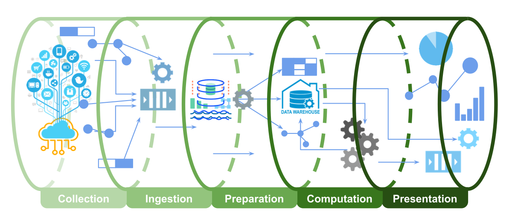

### Introdução - O que são pipeline de dados ?

Pipeline é um termo inglês que se pode traduzir por “tubagem” ou “canalização”. Esse conceito é utilizado na nossa língua para fazer referência a uma arquitetura da informática. Estas canalizações virtuais são criadas para segmentar os dados e, deste modo, incrementar o rendimento de um sistema digital.

Um pipeline de fluxo de dados é uma série de componentes, ou blocos de fluxo de dados, e cada uma série executa uma tarefa específica que contribui para um objetivo maior.

Sua composição de recursos reúne a operação de ponta a ponta que consiste em coletar os dados, transformá-los, treinar um modelo, fornecer insights, aplicar o modelo quando e onde a ação precisar ser realizada para atingir a meta de negócios.

Pipelines de dados escaláveis e eficientes são tão importantes para o sucesso da análise, ciência de dados e aprendizado de máquina quanto as estratégias de linhas de frente de um exército são para vencer uma guerra.

Aproximadamente 50% do esforço da concepção dessa orquestra concentra-se na preparação dos dados para análise e *Machine Learning*. O esforço restante de 25% é utilizado para fazer insights e inferências do modelo facilmente consumíveis em escala e 25% para treinamento.

Um pipeline de big data reúne tudo. É a ferrovia na qual correm vagões pesados e rápidos. O sucesso a longo prazo depende da construção e implantação correta dos serviços.

### Perspectivas - Visão por Área

Existem três partes interessadas envolvidas na construção de aplicativos de análise de dados ou aprendizado de máquina: cientistas de dados, engenheiros e gerentes de negócios.

Da perspectiva da ciência de dados, o objetivo é encontrar o modelo mais robusto e computacionalmente mais barato para um determinado problema usando os dados disponíveis.

Do ponto de vista da engenharia, o objetivo é construir coisas das quais os outros possam confiar; inovar criando coisas novas ou encontrando maneiras melhores de criar coisas existentes que funcionam 24x7 sem muita intervenção humana.

Já para atender a perspectiva dos negócios, o objetivo é agregar valor aos clientes; ciência e engenharia são meios para esse fim.

Aprofundando a ótica da perspectiva de engenharia podemos citar como características principais os seguintes pilares para obtenção de sucesso:

- **Acessibilidade**: dados facilmente acessíveis aos cientistas de dados para avaliação de hipóteses e experimentação de modelos, de preferência por meio de uma linguagem de consulta.
- **Escalabilidade**: a capacidade de escalar conforme aumenta a quantidade de dados ingeridos, mantendo o custo baixo.
- **Eficiência**: os resultados dos dados e do aprendizado de máquina estão prontos dentro da latência especificada para atender aos objetivos de negócios.
- **Monitoramento**: alertas automáticos sobre a integridade dos dados e do pipeline, necessários para uma resposta proativa aos riscos potenciais dos negócios.

### Etapas de Construção

Um pipeline de dados possui cinco estágios agrupados em três fases na sua construção:

- **Fase I** - Engenharia de dados: coleta, ingestão, preparação (~ 50% de esforço)
- **Fase II** - Analytics / Machine Learning: computação (~ 25% de esforço)
- **Fase III** - Entrega: apresentação (~ 25% de esforço)

**Coleta**: As fontes de dados (aplicativos móveis, sites, aplicativos Web, microserviços, dispositivos IoT etc.) são instrumentadas para coletar dados relevantes.

**Ingestão**: As fontes instrumentadas bombearam os dados em vários pontos de entrada (HTTP, MQTT, fila de mensagens etc.). Também pode haver trabalhos para importar dados de serviços como o Google Analytics. Os dados podem estar em duas formas: blobs e fluxos. Todos esses dados são coletados em um Data Lake.

**Preparação**: É a operação de extração, transformação, carregamento (ETL) para limpar, conformar, moldar, transformar e catalogar os blobs e fluxos de dados no data lake; preparando os dados para o ML e armazenando-os em um Data Warehouse.

**Computação**: é aqui que acontecem análises, ciência de dados e aprendizado de máquina. A computação pode ser uma combinação de processamento em lote e fluxo. Modelos e insights (dados estruturados e fluxos) são armazenados de volta no Data Warehouse.

**Apresentação**: as informações são fornecidas por meio de painéis, emails, SMSs, notificações push. As inferências do modelo ML são expostas como microserviços.

### Conclusão

Como você viu, o pipeline de dados é como uma “orquestra” que executa as tarefas definidas de forma sequencial ou paralela dentro de um determinado período de tempo.

Quanto mais alinhado o seu pipeline estiver com as expectativas dos cientistas de dados e gerentes de negócio, mais fácil será a obtenção de insights com resultados positivos à empresa.

Também é necessário que o desenvolvimento dos pipelines sejam pensados e concebidos de forma otimizada, preferencialmente utilizando um ambiente Big Data robusto.

**Agora pense, na sua empresa os processos de orquestração e cargas de dados estão robustos e rápidos o suficiente para atender a demanda do seu negócio ?**

Obrigada e até a próxima !
