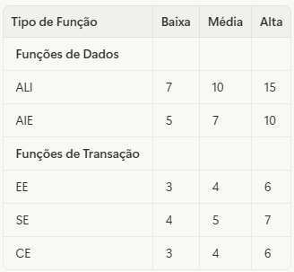
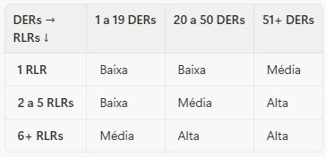
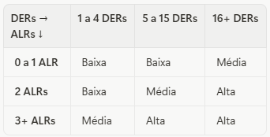
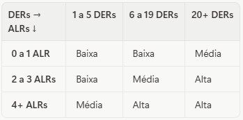

Você já tentou explicar para um cliente quanto vai custar um projeto de software e ouviu: "Mas por que demora tanto?" ou "Por que custa isso tudo?". A dificuldade está em traduzir funcionalidade em tamanho, e tamanho em esforço. Durante décadas, a indústria de software tentou resolver esse problema contando linhas de código, mas isso é como medir um apartamento pela quantidade de tijolos: tecnicamente possível, mas completamente inútil para quem precisa entender o que está comprando.

Imagine que você está procurando um apartamento. O corretor não te mostra quantos tijolos foram usados na construção ou quantos sacos de cimento entraram na obra. Ele te diz: 80 metros quadrados, 3 quartos, 2 banheiros, sala integrada com a cozinha. Você imediatamente entende o tamanho e a funcionalidade do espaço. Essa é exatamente a proposta dos Pontos de Função: uma medida universal que expressa o tamanho de um software pela perspectiva de quem vai usá-lo, independente da tecnologia de construção.

Este artigo desmistifica a Análise de Pontos de Função (APF), uma métrica internacional criada há quase 50 anos e que continua sendo uma das formas mais confiáveis de medir software . Vamos entender o que são pontos de função, como funcionam na prática, por que são independentes de tecnologia e como podem transformar a forma como você estima e gerencia projetos.

### O Problema da Medição de Software

Imagine tentar comparar dois apartamentos onde um foi construído com tijolos cerâmicos e outro com blocos de concreto. Se você medir pela quantidade de material, vai chegar a números completamente diferentes, mesmo que os apartamentos tenham exatamente o mesmo tamanho e funcionalidade. O mesmo acontece quando medimos software por linhas de código: um sistema em Python pode ter 1000 linhas, o mesmo sistema em Java pode ter 3000 linhas, mas ambos entregam a mesma funcionalidade ao usuário.

É por isso que a indústria de software precisava de uma medida universal, algo que focasse no "o quê" e não no "como". Sem um padrão, as estimativas se tornam subjetivas, a comparação de produtividade entre equipes é impossível e a negociação de contratos vira um exercício de adivinhação.

### O Que São Pontos de Função?

Pontos de Função são como os metros quadrados da construção civil. Não importa se a casa foi feita de madeira, tijolo ou concreto. Não importa se o acabamento é luxuoso ou simples. Os metros quadrados medem o espaço funcional disponível. Da mesma forma, Pontos de Função medem a funcionalidade disponível para o usuário, independente de ser desenvolvido em Java, Python, .NET ou qualquer outra tecnologia.

Criada por Allan Albrecht na IBM em 1977, a Análise de Pontos de Função é hoje um padrão ISO/IEC . Seu princípio fundamental é medir o software pela visão do usuário, quantificando os requisitos funcionais que o sistema entrega.

### Os Cinco Cômodos do Software: Componentes da Contagem

Quando um arquiteto mede um apartamento, ele não conta apenas os metros quadrados totais. Ele identifica os cômodos: quantos quartos, quantos banheiros, se tem varanda. Cada tipo de cômodo tem um valor. Da mesma forma, na contagem de Pontos de Função, identificamos os "cômodos funcionais" do software, que se dividem em dois tipos: Funções de Dados e Funções de Transação.

**Funções de Dados (Onde guardamos as coisas):**

- **Arquivos Lógicos Internos (ALI):** Pense neles como os armários embutidos dentro do seu apartamento. São grupos de dados mantidos pela própria aplicação (ex: tabela de clientes, tabela de produtos).
- **Arquivos de Interface Externa (AIE):** São como os armários compartilhados no corredor do prédio. São dados que sua aplicação lê, mas que são mantidos por outro sistema (ex: uma tabela de CEPs mantida por um sistema dos Correios).

**Funções de Transação (O que fazemos nos cômodos):**

- **Entradas Externas (EE):** É a porta de entrada do seu apartamento. É qualquer processo que permite ao usuário colocar informações para dentro do sistema, alterando o estado de um armário interno (ex: um formulário de cadastro de cliente).
- **Saídas Externas (SE):** É uma janela com uma vista elaborada. Apresenta ao usuário informações que foram processadas, calculadas ou derivadas (ex: um relatório de vendas do mês com totais e médias).
- **Consultas Externas (CE):** É como um espelho. Apenas reflete uma informação que já existe, sem nenhum processamento complexo. É uma busca simples que apresenta dados de um armário interno ou externo (ex: uma tela que busca e exibe os dados de um cliente específico).

### A Complexidade: Apartamento Simples ou Cobertura Duplex?

Dois apartamentos podem ter 80 metros quadrados, mas um pode ser um estúdio simples (baixa complexidade) e outro um loft com mezanino e cozinha gourmet (alta complexidade). No Pontos de Função, medimos essa complexidade analisando quantos "elementos" cada funcionalidade manipula e quantos "arquivos" ela acessa.

Cada um dos cinco componentes (ALI, AIE, EE, SE, CE) é classificado como de complexidade Baixa, Média ou Alta, e cada combinação tem um peso em pontos de função, conforme a tabela abaixo:

**Tabela 1: Contribuição em Pontos de Função por Complexidade**

\_Contribuição em Pontos de Função por Complexidade\_

**Mas como saber se é Baixa, Média ou Alta?** Aqui entram as regras de classificação:

**Para Funções de Dados (ALI e AIE):**

A complexidade depende de dois fatores:

- **DER (Dados Elementares Referenciados):** Cada campo único reconhecido pelo usuário. Por exemplo, em uma tabela de Clientes: Nome, CPF, Email, Telefone = 4 DERs.
- **RLR (Registros Lógicos Referenciados):** Subgrupos de dados dentro de um arquivo. Na maioria dos casos simples, é 1. Aumenta quando há subtipos ou relacionamentos opcionais.

**Tabela 2: Matriz de Complexidade para ALI e AIE**

\_Matriz de Complexidade para ALI e AIE\_

**Para Funções Transacionais (EE, SE, CE):**

A complexidade depende de:

- **DER (Dados Elementares Referenciados):** Campos que o usuário pode informar ou visualizar na transação.
- **ALR (Arquivos Lógicos Referenciados):** Quantos ALIs ou AIEs a transação lê ou atualiza.

**Tabela 3: Matriz de Complexidade para EE**

\_Matriz de Complexidade para EE\_

**Tabela 4: Matriz de Complexidade para SE e CE**

\_Matriz de Complexidade para SE e CE\_

### Exemplo Prático: Medindo um Sistema de Cadastro

Vamos medir a "planta baixa" de um sistema de cadastro de clientes. Ele tem um "armário" (tabela de clientes), uma "porta de entrada" (formulário de cadastro), uma "janela com vista elaborada" (relatório de clientes) e um "espelho" (consulta de cliente).

**1. Identificar Funções:**

- **Tabela de Clientes:** 1 ALI
- **Formulário de Cadastro:** 1 EE
- **Relatório de Clientes:** 1 SE
- **Consulta de Cliente por CPF:** 1 CE

**2. Determinar Complexidade:**

***ALI - Tabela de Clientes:***

- **Campos:** Nome, CPF, Email, Telefone, Endereço, Cidade, Estado = 7 DERs
- **Subgrupos:** 1 RLR (apenas a tabela principal)
- **Consultando Tabela 2:** 7 DERs + 1 RLR = Baixa (7 PF)

***EE - Formulário de Cadastro:***

- **Campos informados:** Nome, CPF, Email, Telefone, Endereço, Cidade, Estado = 7 DERs (mas como são menos de 15, contamos como está)
- **Arquivos acessados:** 1 ALR (grava na tabela de Clientes)
- **Consultando Tabela 3:** 7 DERs (entre 5-15) + 1 ALR = Baixa (3 PF)

***SE - Relatório de Clientes:***

- **Campos exibidos:** Nome, CPF, Email, Cidade + Total de Clientes = 5 DERs
- **Arquivos lidos:** 1 ALR (lê a tabela de Clientes)
- **Consultando Tabela 4:** 5 DERs (entre 1-5) + 1 ALR = Baixa (4 PF)

***CE - Consulta por CPF:***

- **Campos exibidos:** Nome, CPF, Email, Telefone, Endereço = 5 DERs
- **Arquivos lidos:** 1 ALR (lê a tabela de Clientes)
- **Consultando Tabela 4:** 5 DERs (entre 1-5) + 1 ALR = Baixa (3 PF)

**3. Somar Total:**

- **Tamanho Total = 7 + 3 + 4 + 3 = 17 Pontos de Função**

Pronto! O nosso "apartamento digital" tem um tamanho de 17 Pontos de Função. Agora você entende não apenas o resultado, mas **como chegamos nele**.

### Para Que Serve Saber o Tamanho?

Quando você sabe que um apartamento tem 80m², pode estimar quanto vai custar o piso, quanto tempo leva para pintar e quantos móveis cabem. Da mesma forma, sabendo que um sistema tem 200 pontos de função e que sua equipe entrega, em média, 5 PF por semana, você pode estimar que o projeto levará 40 semanas. A APF permite:

- **Estimar prazo e custo** com base em dados históricos.
- **Medir e comparar a produtividade** de equipes (PF/hora).
- **Criar contratos** baseados em preço por ponto de função.
- **Fazer benchmarking** entre projetos e fornecedores.

### Pontos de Função em Projetos de Analytics e Data Warehouse

E quando o "apartamento" não é um sistema tradicional, mas um Data Warehouse ou um projeto de analytics? A boa notícia é que os princípios continuam válidos, mas precisam de adaptações. O governo brasileiro publicou um guia específico para contagem de Pontos de Função em projetos de Data Warehouse, reconhecendo que o modelo multidimensional (tabelas Fato e Dimensão) tem características próprias.

Em um projeto de DW, cada **tabela Fato** e cada **tabela Dimensão** são contadas como ALIs. O processo de **ETL (Extração, Transformação e Carga)** é contado como uma Entrada Externa (EE), pois traz dados de fora e alimenta os armários internos. Já os **relatórios e dashboards** são contados como Saídas Externas (SE) quando envolvem cálculos e agregações, ou Consultas Externas (CE) quando apenas apresentam dados sem processamento complexo.

O desafio aqui é que o esforço de desenvolvimento do ETL costuma ser significativamente maior que o de criar relatórios, mas ambos podem ter contagens de PF similares. Por isso, muitos contratos de DW separam os lotes de ETL e OLAP, reconhecendo que a complexidade técnica é diferente, mesmo que o tamanho funcional seja parecido.

### E os Agentes de IA? Como Medir?

Agora vem a pergunta do momento: como aplicar Pontos de Função em projetos de agentes de IA? Não existe ainda um guia oficial, mas podemos aplicar os mesmos princípios fundamentais: medir pela visão do usuário, identificar onde os dados são armazenados e quais operações o usuário pode realizar.

**Funções de Dados em Agentes de IA:**

- **Base de conhecimento do agente:** Se o agente tem documentos indexados ou uma base de conhecimento própria, isso é um ALI (armário interno).
- **Vector database:** Os embeddings armazenados são um ALI. Cada coleção de embeddings pode ser considerada um arquivo lógico.
- **APIs externas consultadas:** Se o agente consulta APIs de terceiros (clima, cotações, etc.), essas são AIEs (armários externos).
- **Histórico de conversas:** Se o agente mantém memória de interações anteriores, isso é um ALI.

**Funções Transacionais em Agentes de IA:**

- **Prompt do usuário:** Cada tipo de interação que o usuário pode fazer é uma EE (porta de entrada).
- **Resposta com RAG (Retrieval-Augmented Generation):** É uma SE (janela com vista elaborada), pois envolve busca semântica, processamento e geração de resposta.
- **Consulta simples sem processamento:** Se o agente apenas recupera e exibe informação sem elaboração, é uma CE (espelho).
- **Function calling:** Quando o agente executa uma ação (reservar um horário, enviar um email), isso é uma EE, pois altera o estado de um sistema.
- **Ingestão de documentos:** O processo de chunking, geração de embeddings e armazenamento é uma EE (processo de carga, similar ao ETL).

**Exemplo: Agente de Atendimento ao Cliente**

- **1 ALI:** Base de conhecimento (FAQs, manuais)
- **1 ALI:** Vector database com embeddings
- **1 ALI:** Histórico de conversas
- **1 AIE:** Sistema de tickets (consultado mas não mantido pelo agente)
- **1 EE:** Usuário faz uma pergunta
- **1 SE:** Agente responde usando RAG (busca + processamento + geração)
- **1 EE:** Agente cria um ticket no sistema externo

Assumindo complexidade baixa para simplificar: 7 + 7 + 7 + 5 + 3 + 4 + 3 = **36 Pontos de Função.**

Importante: essa é uma aplicação interpretativa dos princípios de PF. Como a tecnologia de agentes de IA é recente, ainda não há um padrão consolidado. Mas o exercício de pensar em termos de funcionalidade visível ao usuário continua sendo valioso.

### Limitações Importantes

Metros quadrados não te dizem se o apartamento tem boa iluminação, se a vista é bonita ou se os acabamentos são de qualidade. Da mesma forma, Pontos de Função não medem se o código é bem escrito, se a arquitetura é elegante ou se o sistema é performático. É apenas uma medida de tamanho funcional. É uma ferramenta poderosa, mas não é a única.

### Conclusão

A indústria de software amadureceu quando percebeu que precisava de medidas universais, assim como a construção civil tem metros quadrados e quilômetros. Pontos de Função não são perfeitos, mas são uma linguagem comum que permite conversas honestas entre clientes e desenvolvedores. Quando você diz "este projeto tem 500 pontos de função", está dizendo algo concreto, comparável e independente de tecnologia.

A próxima vez que alguém te perguntar "quanto vai custar esse sistema?", você não precisa mais chutar no escuro. Você pode medir a planta baixa, contar os cômodos e dar uma resposta fundamentada. E isso, por si só, já é uma revolução.

### Referências

[Vazquez, C. E., & Simões, G. S. (2013). Análise de Pontos de Função: Medição, Estimativas e Gerenciamento de Projetos de Software. Editora Saraiva.](https://www.amazon.com.br/An%C3%A1lise-Eduardo-Vazquez-Guilherme-Siqueira/dp/8536504528)

[ISO/IEC 20926:2009. Software and systems engineering — Software measurement — IFPUG functional size measurement method 2009.](https://www.iso.org/standard/51717.html)

[Ministério do Planejamento, Orçamento e Gestão (2015). Guia de Contagem de Pontos de Função do SISP para Projetos Data Warehouse. Brasília: MP.](https://www.gov.br/governodigital/pt-br/estrategias-e-governanca-digital/sisp/documentos/arquivos/guia-de-contagem-de-pontos-de-funcao-do-sisp-para-projetos-dw.pdf)
