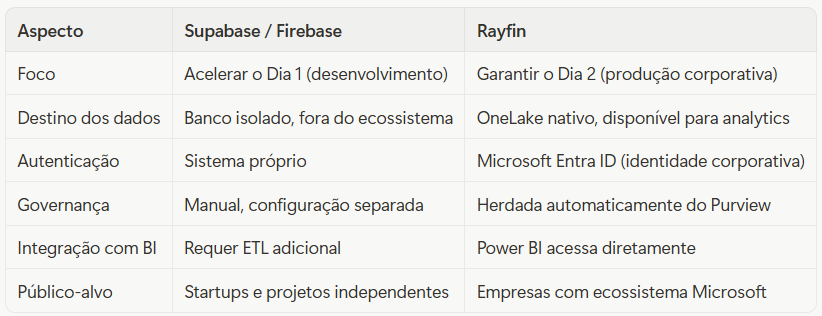

Imagine que você contratou o piloto mais talentoso da Fórmula 1. Ele é rápido, intuitivo e consegue tirar o máximo de qualquer carro. Mas quando chega na largada, o veículo que você entregou para ele é um protótipo sem freios ABS, sem telemetria e sem sistema de segurança. Ele pode até completar algumas voltas, mas não vai terminar a corrida.

Esse é exatamente o cenário que a maioria das empresas vive hoje com o vibe coding. As ferramentas de geração de código por IA, por exemplo, Replit, Cursor, GitHub Copilot são pilotos excepcionais. Em minutos, elas entregam aplicações funcionais, interfaces bonitas e lógica de negócio razoável. O problema começa quando essa aplicação precisa entrar em produção corporativa: onde ficam os dados? Quem pode acessar o quê? Como garantir que as informações sensíveis estejam protegidas? Como conectar isso ao ecossistema de analytics da empresa?

O Rayfin é a equipe de engenharia que estava faltando. Anunciado pela
[Microsoft](https://www.linkedin.com/company/microsoft?trk=article-ssr-frontend-pulse_little-mention)
no Build 2026, ele é um Backend-as-a-Service (BaaS) open-source construído especificamente para o
[Microsoft Fabric](https://www.linkedin.com/company/microsoft-fabric-world?trk=article-ssr-frontend-pulse_little-mention)
. Ele não apenas gera o backend da sua aplicação, ele garante que esse backend nasça já integrado com governança, segurança e dados corporativos.

### O Problema Real: O Gap entre Protótipo e Produção

Antes de entender o Rayfin, é preciso entender o problema que ele resolve, porque ele é mais sério do que parece.

Quando um time de negócio ou um desenvolvedor usa vibe coding para criar uma aplicação, o resultado típico é um frontend funcional conectado a um banco de dados improvisado — muitas vezes um Supabase ou Firebase configurado às pressas. Isso funciona para uma demo. Mas quando a empresa decide colocar esse sistema em produção, surgem perguntas difíceis:

Os dados dessa aplicação estão no OneLake ou em um silo separado? O time de analytics consegue acessar essas informações para construir relatórios no Power BI? As políticas de privacidade do Purview se aplicam a esses dados? Se um funcionário é demitido, o acesso dele é revogado automaticamente pelo Entra ID?

A resposta, na maioria dos casos, é "não" para todas essas perguntas. O resultado é que o protótipo fica parado, esperando meses de trabalho de engenharia para ser adaptado ao ambiente corporativo ou é simplesmente abandonado.

O Rayfin elimina esse gap. Ele faz com que a aplicação nasça enterprise-ready, sem exigir que o desenvolvedor (ou o agente de IA) entenda toda a complexidade da infraestrutura corporativa.

### O Que o Rayfin Faz na Prática

O Rayfin funciona com uma abordagem "code-first": você define a estrutura da sua aplicação usando decoradores TypeScript, e ele gera automaticamente tudo o que está por baixo.

Quando você executa o comando **npx rayfin up**, o Rayfin:

- Cria o banco de dados com o esquema correto
- Gera as APIs de CRUD automaticamente
- Configura a autenticação via Microsoft Entra ID
- Implanta a aplicação como um artefato nativo do Fabric
- Garante que os dados caiam diretamente no OneLake

Não é necessário configurar servidores, escrever scripts de migração de banco de dados ou integrar manualmente com o sistema de identidade da empresa. Tudo isso acontece a partir da definição do modelo de dados em TypeScript.

### Um Exemplo Real: Sistema de Ordens de Serviço para Técnicos de Campo

Para tornar isso concreto, vamos usar um caso de uso real: uma empresa de telecomunicações que precisa de um aplicativo para seus técnicos de campo gerenciarem ordens de serviço.

### O cenário sem o Rayfin:

O time de TI recebe a demanda, usa vibe coding para criar o frontend em React em dois dias. Mas aí começa o problema. Precisam configurar um banco de dados, escolher entre PostgreSQL e MySQL, escrever as migrações, configurar autenticação, criar as APIs, garantir que apenas técnicos autorizados vejam as ordens da sua região, e depois ainda criar um pipeline de ETL para levar esses dados ao Power BI para que o gerente acompanhe a produtividade da equipe. Isso leva semanas.

### O cenário com o Rayfin:

O desenvolvedor (ou o agente de IA) define as entidades do sistema em TypeScript:

```
import { entity, role, text, uuid, date, boolean, set, one } from '@microsoft/rayfin-core';
import { Customer } from './Customer.js';
import { Region } from './Region.js';
import { UserProfile } from './UserProfile.js';

export type JobStatus =
  | 'new'
  | 'scheduled'
  | 'in-progress'
  | 'blocked'
  | 'complete';

@entity()
@role('authenticated', '*')
export class Job {
  @uuid() id!: string;
  @text() title!: string;
  @text({ optional: true }) description?: string;

  @set('new', 'scheduled', 'in-progress', 'blocked', 'complete')
  status!: JobStatus;

  @date({ optional: true }) scheduledAt?: Date;
  @date() createdAt!: Date;
  @date() updatedAt!: Date;

  @boolean({ default: false }) isOnSite!: boolean;
  @boolean({ default: false }) needsHelp!: boolean;

  @one(() => Customer) customer!: Customer;
  @one(() => Region) region!: Region;
  @one(() => UserProfile, { optional: true }) technician?: UserProfile;
}        
```

Com esse código, o Rayfin entende que existe uma entidade **Job** com status tipado, relacionamentos com **Customer**, **Region** e **UserProfile**, e que apenas usuários autenticados podem acessá-la. Ele gera o banco de dados, as APIs e a configuração de segurança automaticamente.

Quando o técnico registra uma ordem de serviço no aplicativo, esse dado cai diretamente no OneLake. No mesmo instante, o gerente regional consegue ver no Power BI quantas ordens estão abertas, qual técnico está com mais carga de trabalho e quais regiões têm mais chamados bloqueados. Sem ETL, sem pipeline, sem espera.

### Por Que Isso É Diferente de Supabase, Firebase e Similares

Essa é uma comparação que vale a pena fazer com cuidado, porque o Rayfin não está competindo exatamente com essas ferramentas ele está resolvendo um problema diferente.



O Supabase é excelente para quem está construindo um produto do zero. O Rayfin é para quem está construindo dentro de uma organização que já tem dados, políticas e um ecossistema Microsoft estabelecido.

### A Equipe de Engenharia: Os Pacotes do SDK

O Rayfin é composto por um conjunto de pacotes que trabalham juntos, como os diferentes especialistas de uma equipe de F1:

- ***@microsoft/rayfin-core*** — o chassi. Define os decoradores TypeScript que descrevem o modelo de dados.
- ***@microsoft/rayfin-cli*** — o mecânico-chefe. Interpreta o modelo e orquestra o deploy no Fabric.
- ***@microsoft/rayfin-client*** — o copiloto. Gera o cliente TypeScript para o frontend consumir as APIs geradas.
- ***@microsoft/rayfin-testing*** — o simulador. Permite testar a lógica da aplicação localmente antes do deploy.

Cada pacote tem uma responsabilidade clara. O desenvolvedor (ou o agente de IA) só precisa interagir diretamente com o rayfin-core para definir o modelo. O resto acontece nos bastidores.

### O Impacto para Times de Dados

Para quem trabalha com dados, o Rayfin representa uma mudança de paradigma importante. Historicamente, existe uma divisão clara entre "sistemas operacionais" (onde os dados são gerados) e "sistemas analíticos" (onde os dados são analisados). Essa divisão gera latência, custo de ETL e, frequentemente, inconsistências entre o que o sistema mostra e o que o relatório apresenta.

Com o Rayfin, essa divisão começa a desaparecer para aplicações construídas no ecossistema Fabric. O dado nasce no OneLake, governado pelo Purview, acessível imediatamente para analytics. A aplicação e o data warehouse compartilham a mesma fonte de verdade.

Isso não resolve todos os problemas de integração de dados de uma empresa. Os sistemas legados ainda existem e ainda precisam de pipelines. Mas para novas aplicações construídas com vibe coding ou por agentes de IA, o Rayfin garante que elas entrem na corrida já com a engenharia certa.

### Conclusão

O vibe coding veio para ficar. A capacidade de gerar aplicações funcionais em minutos usando IA é uma transformação real na forma como software é construído. O desafio sempre foi garantir que esse software chegasse à produção corporativa sem comprometer segurança, governança e integração com dados.

O Rayfin é a resposta da Microsoft para esse desafio. Ele não torna o desenvolvimento mais lento ele torna o caminho até a produção mais curto, porque elimina as semanas de trabalho de infraestrutura que normalmente ficam entre o protótipo e o sistema em uso real.

**O piloto talentoso finalmente tem o carro que merece.**

### Referências:

- Repositório oficial: [github.com/microsoft/rayfin](http://github.com/microsoft/rayfin)
- Templates da comunidade: [github.com/microsoft/awesome-rayfin](http://github.com/microsoft/awesome-rayfin)
- Anúncio oficial no Build 2026: [community.fabric.microsoft.com](http://community.fabric.microsoft.com)
