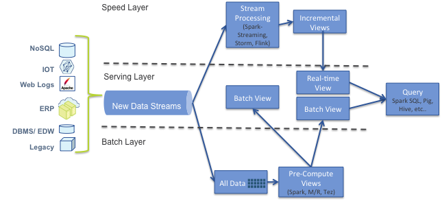
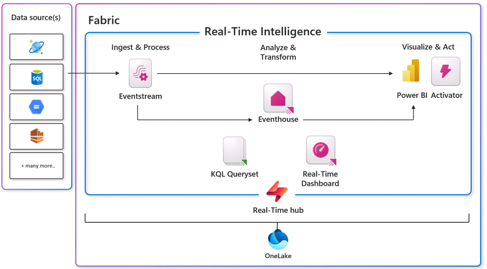
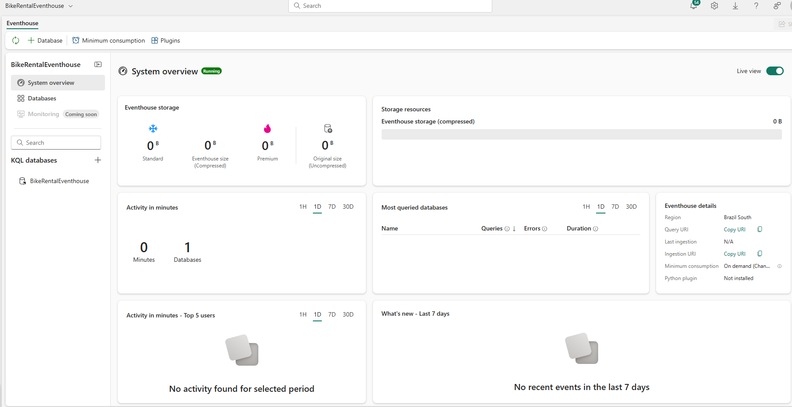
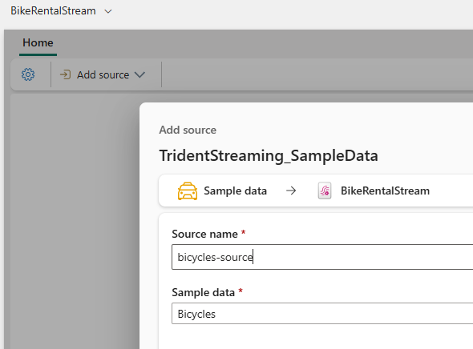
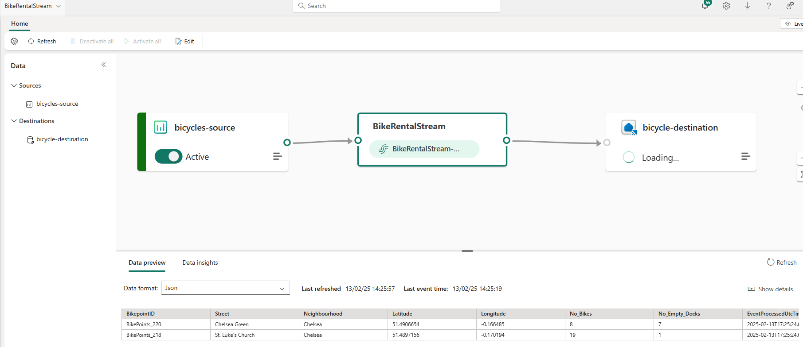
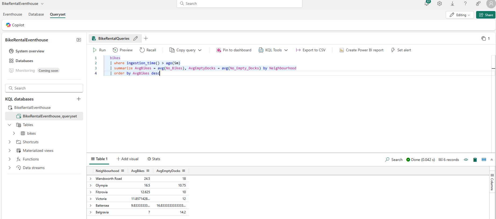
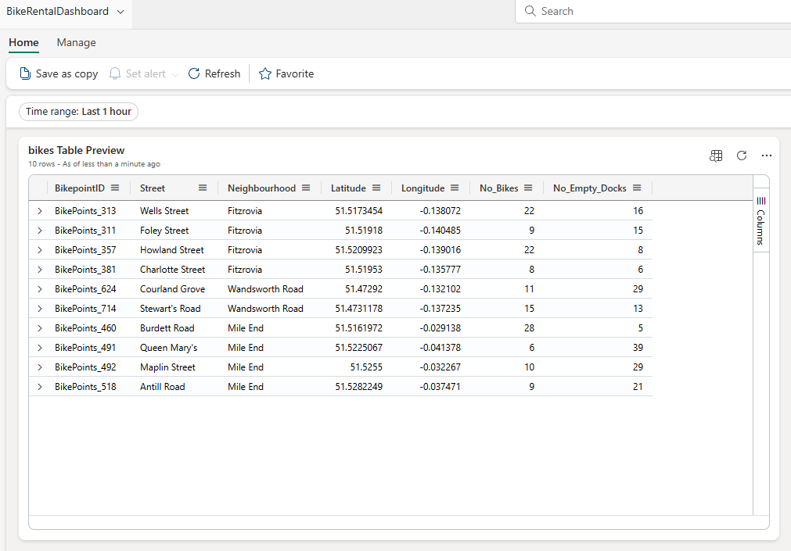
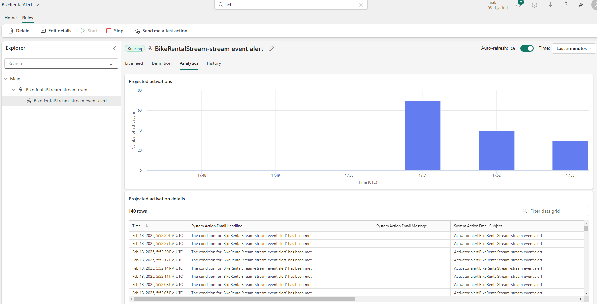

## Introdução: A Fábrica de Dados em Tempo Real

Imagine uma linha de produção moderna, onde os produtos são fabricados em tempo real, sem interrupções. Agora, substitua os produtos por dados, e você terá uma ideia do que é o streaming de dados. Bem-vindos à fábrica do futuro, onde os dados são processados 24/7, sem pausas para o cafezinho!

Para entender melhor o conceito, vamos fazer uma analogia simples: pense no streaming de dados como um rio de informações que flui constantemente. Diferente de um lago (que representa o processamento em lote), este rio está sempre em movimento, trazendo novidades a cada segundo. Nesse rio, cada gota representa um dado - pode ser um clique em um site, uma transação bancária, uma leitura de sensor ou uma postagem em rede social. O que torna esse rio especial é sua capacidade de transportar informações instantaneamente, permitindo que empresas e organizações tomem decisões em tempo real.

Mas como funciona na prática? Imagine que você é o dono de uma rede de lojas de varejo. Com o streaming de dados, você pode saber instantaneamente quando um produto está prestes a esgotar no estoque, quais são as preferências dos clientes em diferentes regiões, ou até mesmo identificar padrões de compra antes mesmo que eles se tornem evidentes. É como ter um superpoder de inteligência de negócios que funciona 24 horas por dia, 7 dias por semana, sem nunca precisar dormir ou fazer uma pausa para um café. Essa capacidade de processar e analisar dados em tempo real está transformando a maneira como empresas de todos os setores tomam decisões estratégicas.

## O que é Streaming?

Streaming de dados é como nossa linha de produção ininterrupta. Diferentemente do processamento em lote (batch), onde grandes volumes de dados são processados em intervalos programados, o streaming lida com fluxos contínuos de dados em tempo real.

A principal diferença está na latência:

- Batch: Minutos, horas ou dias
- Streaming: Milissegundos ou segundos

Esta imagem abaixo ilustra a arquitetura Lambda, um modelo de processamento de dados que combina processamento em lote (batch) e em tempo real (streaming) para lidar com grandes volumes de dados. A arquitetura é dividida em três camadas principais:

1. Speed Layer (Camada de Velocidade): Processa dados em tempo real usando tecnologias de streaming como Spark Streaming, Storm ou Flink. Produz visualizações incrementais dos dados.
2. Batch Layer (Camada de Lote): Armazena todos os dados brutos e processa-os periodicamente para criar visualizações pré-computadas.
3. Serving Layer (Camada de Serviço): Combina os resultados das camadas de velocidade e lote para fornecer respostas a consultas.

As fontes de dados à esquerda incluem várias origens como NoSQL, IoT, logs web, ERP e sistemas legados. Esses dados alimentam tanto a camada de velocidade quanto a de lote.O fluxo de dados passa por processamento em lote e em tempo real, criando visualizações que são combinadas na camada de serviço. Isso permite consultas eficientes usando tecnologias como Spark SQL, Pig, Hive, etc.



\_Arquitetura Lambda\_

### Por que Streaming é relevante?

O streaming é crucial para casos de uso que exigem insights imediatos:

- Detecção de fraudes em transações financeiras
- Monitoramento de equipamentos industriais em tempo real
- Personalização de experiências de usuário em aplicativos
- Análise de sentimentos nas redes sociais

Na nossa fábrica de dados, as esteiras transportadoras são os fluxos de informação, trazendo constantemente novos "produtos" (leia-se: dados) para serem processados. Esses dados podem vir de várias "fornecedoras", como sensores IoT (nossa filial de eletrônicos), transações financeiras (o departamento contábil) ou até mesmo das redes sociais (o escritório de fofocas corporativas).

---

## A Linha de Montagem Microsoft Fabric

### O que é Microsoft Fabric?

Microsoft Fabric é uma plataforma unificada de análise de dados que combina diversos serviços em um único ambiente. É como ter uma fábrica multifuncional que pode produzir qualquer tipo de insight que você precisa. Suas principais vantagens incluem:

- Plataforma unificada: Reduz custos de integração
- Escalabilidade: Suporta processamento de dados em larga escala
- Integração com IA: Incorpora ferramentas de machine learning
- Interface amigável: Acessível para diversos usuários

O Microsoft Fabric é como uma linha de montagem super avançada, projetada para lidar com essa produção incessante de dados. Vamos conhecer as estações de trabalho desta linha:



1. **EventHouse**: É o nosso armazém de matéria-prima. Aqui, os dados brutos chegam e são organizados para o processamento.

2. **KQL Queryset**: Pense nele como o engenheiro de qualidade da fábrica. Ele examina os dados, faz perguntas complexas e garante que tudo esteja em ordem.

3. **Real-time Dashboard**: É a sala de controle da fábrica. Aqui, os gerentes podem ver em tempo real como está a produção de insights.

4. **Eventstream**: Este é o sistema de esteiras da nossa fábrica. Ele move os dados de uma estação para outra, garantindo que tudo flua sem interrupções.

5. **Activator**: Imagine-o como o sistema de alarmes da fábrica. Quando algo importante acontece, ele dispara um alerta para que a equipe possa agir rapidamente.

### Como Microsoft Fabric lida com Streaming?

O Fabric utiliza a arquitetura Lambda para processar dados em streaming:

- Camada de velocidade: Event Stream Service
- Camada de lote: Pipelines, dataflows e notebooks
- Camada de serviço: Conecta-se a diferentes armazenamentos de dados

### Integração com Power BI e Real-Time Dashboards

Fabric se integra perfeitamente com Power BI, permitindo a criação de dashboards em tempo real para visualização instantânea de insights.

### Conectividade com outras ferramentas

Fabric oferece conectividade com Azure, Databricks, Kafka e outras ferramentas, facilitando a integração com ecossistemas existentes.

---

## Mãos à Obra: Montando Sua Linha de Produção de Insights

Vamos criar uma linha de produção completa para monitorar o aluguel de bicicletas em tempo real, aproveitando as últimas atualizações do Microsoft Fabric.

### Passo 1: Configurar o EventHouse

- No portal do Microsoft Fabric, clique em "Criar" e selecione "Eventhouse".
- Nomeie seu Eventhouse como "BikeRentalEventhouse".



\_Criação do Eventhouse\_

### Passo 2: Configurar o Eventstream

- No portal do Microsoft Fabric, crie um novo Eventstream chamado "BicycleRentalStream".
- Como fonte de dados, selecione o conjunto de amostra "Bicycles" da Microsoft.



\_Add source do EventStream\_

- Configure o Eventstream para processar dados em tempo real, simulando o fluxo contínuo de informações de aluguel de bicicletas.
- Defina transformações para extrair informações relevantes, como:Número de bicicletas alugadas por horaLocalização das bicicletas mais popularesDuração média dos aluguéis
- Configure o destino dos dados processados para o EventHouse criado anteriormente.
- Ajuste as configurações de processamento para simular um cenário de tempo real, com atualizações frequentes.
- Teste o fluxo de dados usando a funcionalidade de visualização para garantir que os dados da amostra "Bicycles" estejam sendo processados corretamente.
- Ative o EventStream para iniciar o processamento contínuo dos dados de aluguel de bicicletas.



\_EventSteam pronto de Bicycles\_

### Passo 3: Criar um KQL Queryset

- No Eventhouse, crie um novo KQL Queryset chamado "BikeRentalQueries".
- Escreva uma query para analisar dados em tempo real:

```
   bikes
   | where ingestion_time() > ago(5m)
   | summarize AvgBikes = avg(No_Bikes), AvgEmptyDocks = avg(No_Empty_Docks) by Neighbourhood
   | order by AvgBikes desc        
```


\_Execução da KQL query\_

### Passo 4: Criar um Real-time Dashboard

- Crie um novo Real-Time Dashboard chamado "BikeRentalDashboard".
- Adicione blocos utilizando a query do KQL Queryset.



\_Dashboard em tempo real\_

### Passo 5: Configurar o Activator

- Crie um novo Activator chamado "BikeRentalAlert".
- Configure alertas baseados no EventStream "BicycleRentalStream".



\_Exemplo de Alert para BikeRental\_

### Passo 6: Integração com Git e Pipelines de Implantação

- Aproveite a nova integração do GitHub para controle de versão.
- Configure pipelines de implantação para gerenciar o ciclo de vida de seus ativos de dados.

### Passo 7: Testar e Monitorar

- Use o novo recurso de monitoramento de workspace para acompanhar o desempenho de sua linha de produção de dados.
- Aproveite o Fabric Runtime 1.3, que inclui Apache Spark 3.5 e outras atualizações, para otimizar o processamento.

---

## Casos de Uso e Aplicações Reais

- Monitoramento de IoT: Análise em tempo real de dados de sensores industriais para manutenção preditiva.
- Análise de transações bancárias: Processamento instantâneo de transações para detecção de padrões suspeitos.
- Detecção de fraudes: Identificação imediata de atividades anômalas em sistemas de pagamento.
- Personalização de conteúdo: Ajuste em tempo real de recomendações baseadas no comportamento do usuário.

---

## Conclusão: O Chão de Fábrica do Futuro

Com estas atualizações, sua fábrica de dados está mais poderosa do que nunca. O Microsoft Fabric continua evoluindo, oferecendo ferramentas cada vez mais robustas para lidar com dados em tempo real.

### Resumo dos principais aprendizados

- Streaming no Fabric oferece processamento de dados em tempo real com latência mínima.
- A plataforma unifica diversas ferramentas de análise, simplificando o fluxo de trabalho.
- Event Streams permitem transformações sem código e roteamento flexível de dados.
- Integração perfeita com Power BI para visualizações em tempo real.

### Vantagens do Streaming no Microsoft Fabric

- Insights em tempo real para tomada de decisões rápidas
- Escalabilidade para lidar com grandes volumes de dados
- Flexibilidade para conectar diversas fontes e destinos de dados
- Redução de complexidade com uma plataforma unificada

### Próximos passos para quem quer começar

- Familiarize-se com os componentes do Fabric, especialmente Event Streams e OneLake.
- Identifique casos de uso em sua organização que se beneficiariam de análises em tempo real.
- Experimente criar um fluxo de eventos simples usando as ferramentas sem código do Fabric.
- Explore integrações com outras ferramentas que você já utiliza, como Azure ou Kafka.

Lembre-se: na fábrica dos dados em tempo real, a inovação nunca para. Continue aprendendo e experimentando as novas funcionalidades para manter sua produção de conhecimento na vanguarda da tecnologia!
