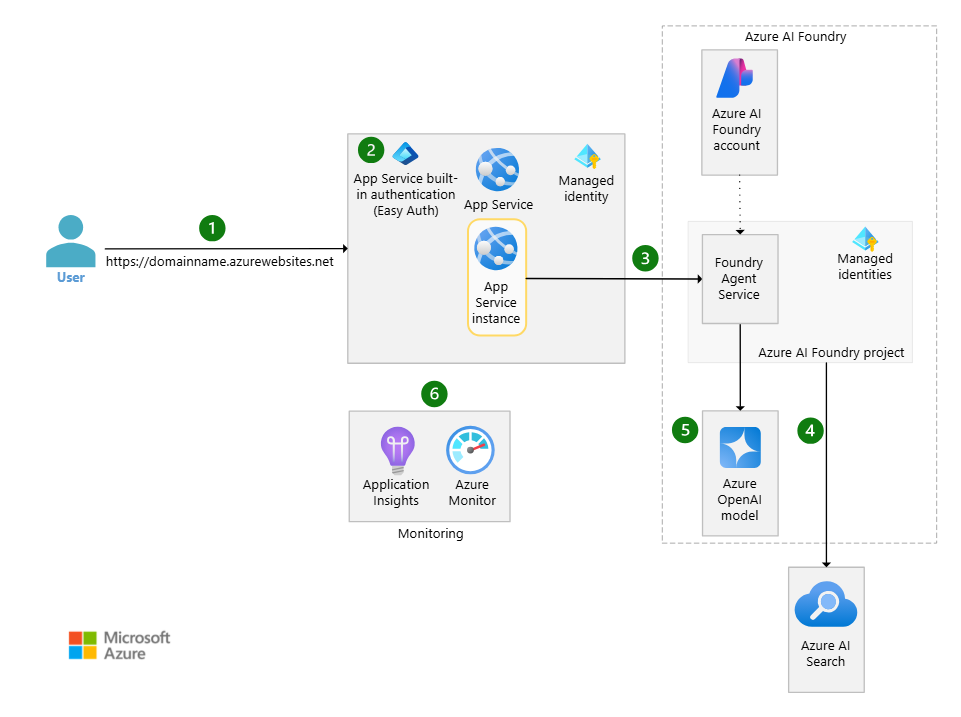

Lembra da torta de maçã da sua vovó? Aquela receita especial que levava horas para preparar, mas o resultado era sempre perfeito? O departamento de Recursos Humanos moderno enfrenta um dilema parecido: como manter a qualidade artesanal da seleção de talentos, mas sem gastar horas analisando cada currículo individualmente?

Assim como a vovó conhecia cada ingrediente e sabia exatamente quando a torta estava pronta, os recrutadores experientes desenvolvem um "sexto sentido" para identificar bons candidatos. Mas e se pudéssemos automatizar esse processo, mantendo a mesma qualidade e critério, mas com a eficiência de uma cozinha moderna?

O Azure AI Foundry oferece todas as ferramentas necessárias para criar essa "versão 2.0" da receita da vovó - um agente inteligente que mantém os mesmos ingredientes de qualidade (experiência, critérios rigorosos, atenção aos detalhes), mas usa tecnologia moderna para preparar a "torta perfeita" em uma fração do tempo.

### O Cenário: Por que Precisamos de um Recrutador Digital?

Imagine um departamento de RH que recebe 500 currículos por semana para diferentes posições. Cada currículo precisa ser lido, analisado e comparado com os requisitos da vaga. Um recrutador experiente leva, em média, 10 minutos para fazer uma análise inicial completa de um currículo. Isso significa mais de 80 horas semanais apenas para a triagem inicial - mais de duas semanas de trabalho de uma pessoa.

Além da questão do tempo, existe o desafio da consistência. Diferentes recrutadores podem interpretar os mesmos requisitos de forma ligeiramente diferente, especialmente quando estão cansados ou sob pressão. Um candidato avaliado na segunda-feira de manhã pode receber uma análise diferente do mesmo candidato avaliado na sexta-feira à tarde.

O Azure AI Foundry Agent Service resolve esses problemas criando um assistente digital que mantém critérios consistentes, trabalha 24 horas por dia e pode processar dezenas de currículos simultaneamente. É como ter um especialista em RH que nunca tem um dia ruim e sempre aplica exatamente os mesmos padrões de avaliação.

### Os Ingredientes Secretos da Receita

Assim como a torta de maçã da vovó tinha ingredientes específicos que faziam toda a diferença, nosso sistema de recrutamento digital também precisa dos componentes certos para funcionar perfeitamente. Cada "ingrediente" tem um papel específico na criação de um sistema inteligente e eficiente.

\_Arquitetura completa do Azure AI Foundry mostrando a integração entre todos os componentes do nosso sistema de recrutamento digital\_

O **Azure AI Foundry Agent Service** é como o forno da vovó. É o coração da operação onde a mágica acontece. É aqui que definimos as instruções do nosso agente, suas capacidades e como ele deve se comportar ao analisar currículos. Pense nele como o conhecimento acumulado da vovó, mas codificado de forma precisa e consistente.

O **Azure Blob Storage** funciona como a despensa bem organizada da vovó onde todos os ingredientes (currículos) ficam armazenados de forma segura e acessível. A vantagem é que essa "despensa digital" pode guardar milhões de documentos sem perder a organização.

O **Azure AI Search** é como o caderno de receitas secreto da vovó, mas turbinado. Ele não apenas organiza os currículos por palavras-chave, mas entende o "sabor" de cada perfil profissional. É capaz de encontrar candidatos com "experiência em liderança" mesmo quando o currículo menciona apenas "coordenação de equipes".

A **File Search Tool** é o utensílio mágico que conecta tudo como a colher de pau especial da vovó que ela usava para todos os pratos. Ela permite que o agente acesse, leia e analise os currículos, usando toda a inteligência do sistema para encontrar os "ingredientes" certos para cada vaga.

### Passo 1: Preparando o Arquivo de Currículos - Azure Blob Storage

O primeiro passo na construção do nosso recrutador digital é criar um local seguro e organizado para armazenar todos os currículos. O Azure Blob Storage será nossa "sala de arquivos digital", onde cada documento fica perfeitamente catalogado e acessível.

A configuração do **Azure Blob Storage** requer atenção especial à estrutura de pastas. Uma organização eficiente pode ser por departamento, por vaga ou por período. Por exemplo: */curriculos/2025/desenvolvedor-senior/* ou */curriculos/marketing/analista-digital/*. Essa organização facilita tanto o acesso do agente quanto a manutenção futura do sistema.

É importante configurar as permissões de acesso adequadamente desde o início. O storage deve permitir leitura para os serviços de IA que criaremos posteriormente, mas manter controles rigorosos sobre quem pode adicionar, modificar ou excluir currículos. Recomenda-se usar autenticação baseada em identidade gerenciada do Azure para maior segurança.

A estrutura de containers deve refletir a organização da empresa. Um container principal para currículos ativos, outro para arquivos históricos e possivelmente containers separados para diferentes unidades de negócio. Isso facilita a gestão de políticas de retenção e acesso.

### Passo 2: Construindo o Cérebro da Busca - Azure AI Search (RAG)

Com os currículos organizados no **Blob Storage**, precisamos criar o sistema que permitirá ao nosso agente "entender" e buscar informações nesses documentos. O Azure AI Search funciona como o sistema RAG (Retrieval-Augmented Generation) do nosso agente, transformando documentos em conhecimento pesquisável.

O **Azure AI Search** é muito mais que um mecanismo de busca tradicional. Ele processa os currículos, extrai texto, cria representações vetoriais do conteúdo e constrói índices otimizados para busca semântica. É como ter um bibliotecário superinteligente que não apenas sabe onde cada documento está, mas também entende o significado de cada palavra e conceito.

A configuração do modo de análise é crucial para o sucesso do sistema. Para currículos, recomendamos usar o modo "Padrão", que detecta automaticamente o tipo de arquivo e aplica o analisador mais apropriado. Isso garante que tanto PDFs quanto documentos Word sejam processados corretamente, extraindo não apenas texto, mas também metadados importantes.

O processo de indexação transforma cada currículo em uma estrutura pesquisável. O sistema automaticamente divide os documentos em chunks (pedaços) menores, cria embeddings vetoriais para busca semântica e constrói índices invertidos para busca por palavras-chave. É essa combinação que permite ao agente encontrar candidatos com "experiência em liderança" mesmo quando o currículo menciona apenas "gestão de equipes".

A conexão com o Blob Storage estabelece o pipeline de dados. Sempre que novos currículos são adicionados ao storage, o AI Search automaticamente os processa e atualiza o índice. É como ter um assistente que mantém a biblioteca sempre organizada e atualizada.

### Passo 3: Criando a Central de Comando - Azure AI Foundry Hub

Com nossa base de dados e sistema de busca prontos, chegou a hora de criar a "central de comando" onde nosso agente será desenvolvido e gerenciado. O Azure AI Foundry Hub funciona como a sede da nossa operação de IA.

O Hub do Azure AI Foundry centraliza recursos, configurações de segurança e conectividade. É aqui que definimos quais serviços do Azure nosso agente pode acessar e como ele deve se autenticar. Pense no Hub como o quartel-general de uma operação de inteligência, onde todas as ferramentas e recursos ficam organizados e seguros.

A configuração do Hub inclui a conexão com os serviços que criamos anteriormente. O Hub precisa ter acesso ao Blob Storage (para ler currículos) e ao AI Search (para realizar buscas inteligentes). Essas conexões são estabelecidas usando identidades gerenciadas, garantindo segurança sem a necessidade de gerenciar chaves manualmente.

Dentro do Hub, criamos um Projeto específico para nosso agente de RH. Projetos permitem organizar diferentes agentes e experimentos, mantendo configurações e dados separados. É como ter departamentos diferentes dentro da mesma empresa - cada um com suas responsabilidades específicas, mas todos compartilhando a infraestrutura comum do Hub.

As configurações de segurança do Hub determinam quem pode acessar o projeto, criar agentes e visualizar dados. É importante estabelecer políticas claras desde o início, definindo diferentes níveis de acesso para desenvolvedores, administradores e usuários finais do sistema.

### Passo 4: Dando Vida ao Recrutador - Criação do Agente

Com toda a infraestrutura preparada - Blob Storage organizando os currículos, AI Search funcionando como o cérebro RAG e o Hub centralizando tudo - chegou o momento de dar vida ao nosso recrutador digital. A criação do agente é onde definimos sua personalidade, suas habilidades e como ele deve se comportar ao analisar currículos.

As instruções do agente são fundamentais para seu sucesso. Elas devem ser claras, específicas e abrangentes. Um exemplo de instrução eficaz seria: ***"Você é um especialista em recrutamento com 15 anos de experiência. Sua função é analisar currículos e avaliar a compatibilidade dos candidatos com as vagas disponíveis. Sempre considere experiência relevante, formação acadêmica, habilidades técnicas e soft skills. Seja objetivo mas justo em suas avaliações."***

A configuração da File Search Tool conecta o agente aos currículos armazenados. Esta ferramenta automaticamente processa os documentos, criando chunks (pedaços) de texto de aproximadamente 800 tokens com sobreposição de 400 tokens. Isso garante que informações importantes não sejam perdidas na divisão do conteúdo.

O processo de conexão ao Blob Storage estabelece o link entre o agente e os dados. O sistema automaticamente monitora novos arquivos adicionados ao storage e os inclui no índice de busca. É como ter um assistente que sempre mantém a base de currículos atualizada.

Os testes de conexão são essenciais antes de colocar o agente em produção. Comece com alguns currículos de teste e vagas conhecidas. Verifique se o agente consegue acessar os documentos, extrair informações relevantes e fornecer análises coerentes.

### Alimentando o Sistema: Upload e Organização dos Currículos

Um recrutador digital é tão bom quanto a qualidade e organização dos dados que ele pode acessar. A forma como organizamos e alimentamos a base de currículos determina diretamente a eficácia das análises.

A estrutura de pastas no Blob Storage deve refletir a realidade do negócio. Uma abordagem eficiente é criar hierarquias que facilitem tanto a busca quanto a manutenção. Por exemplo: */curriculos/ano/departamento/nivel/* permite filtros específicos e facilita a gestão de dados antigos.

Os formatos de arquivo suportados incluem PDF, Word (.doc e .docx), texto simples, RTF e muitos outros. O sistema automaticamente detecta o formato e aplica o processamento apropriado. PDFs com texto selecionável funcionam melhor que imagens escaneadas, embora o sistema também possa processar estes últimos com OCR.

O processo de indexação acontece automaticamente quando novos arquivos são adicionados ao Blob Storage. O Azure AI Search processa o conteúdo, extrai texto, cria embeddings vetoriais e atualiza o índice. Este processo pode levar alguns minutos para arquivos grandes ou muitos arquivos simultâneos.

A criação dos Vector Stores organiza os currículos em estruturas otimizadas para busca semântica. Cada Vector Store pode conter até 10.000 arquivos e pode ser associado tanto ao agente (para currículos permanentes) quanto a threads específicas (para análises temporárias de vagas específicas).

### Treinando o Especialista: Prompts e Instruções

A qualidade das análises do nosso recrutador digital depende diretamente da qualidade das instruções que fornecemos. É como treinar um novo funcionário - quanto mais claras e específicas forem as orientações, melhores serão os resultados.

Um prompt eficaz para análise de currículos deve incluir contexto, critérios específicos e formato de resposta esperado. Por exemplo: ***"Analise este currículo para a vaga de Desenvolvedor Senior Python. Avalie: 1) Experiência em Python (mínimo 5 anos), 2) Conhecimento em frameworks web (Django/Flask), 3) Experiência com bancos de dados, 4) Habilidades de liderança. Forneça uma pontuação de 1-10 para cada critério e um resumo executivo."***

Os critérios de avaliação devem ser personalizáveis para diferentes tipos de vaga. Vagas técnicas podem priorizar habilidades específicas e certificações, enquanto vagas de liderança podem focar mais em experiência de gestão e soft skills. O agente pode ser instruído a ajustar seus critérios baseado no tipo de posição.

Exemplos práticos de instruções incluem: "Se o candidato não mencionar explicitamente uma habilidade requerida, procure por experiências que possam indicar essa competência indiretamente. Por exemplo, 'coordenou projeto de migração de sistema' pode indicar habilidades de gestão de projetos mesmo sem mencionar certificações específicas."

A calibração do agente é um processo iterativo. Comece com instruções básicas, teste com currículos conhecidos e refine as orientações baseado nos resultados. É importante incluir exemplos de boas e más práticas para que o agente aprenda a distinguir entre diferentes níveis de qualificação.

### O Recrutador em Ação: Casos de Uso Práticos

Com nosso recrutador digital configurado, vamos ver como ele funciona na prática. A análise de match candidato x vaga é o caso mais comum - o agente recebe a descrição de uma vaga e identifica pontos de compatibilidade e possíveis gaps nos currículos.

O ranking de candidatos permite comparar múltiplos perfis simultaneamente, criando listas ordenadas baseadas nos critérios estabelecidos. A identificação de gaps de competências ajuda tanto na seleção quanto no desenvolvimento interno, enquanto a geração de relatórios automatiza a documentação do processo seletivo.

### Otimizações e Boas Práticas

Para manter o sistema eficiente, implemente políticas de expiração para Vector Stores temporários (7 dias é o padrão) e monitore custos através de limpeza periódica de dados antigos.

O monitoramento de performance deve incluir métricas como tempo de resposta e qualidade das análises. Para segurança, use criptografia, controles de acesso baseados em funções e mantenha conformidade com LGPD.

### Conclusão

Assim como a torta de maçã da vovó evoluiu da receita manuscrita para versões modernas que mantêm o mesmo sabor especial, a criação de um agente de seleção de currículos no Azure AI Foundry representa essa mesma evolução no recrutamento. Mantemos os ingredientes de qualidade - critérios rigorosos, atenção aos detalhes, experiência acumulada - mas usamos tecnologia moderna para preparar resultados consistentes e eficientes.

Este sistema não substitui o "toque especial" dos profissionais de RH, mas potencializa seu trabalho, permitindo que foquem no que realmente importa: conhecer pessoas, desenvolver talentos e construir equipes excepcionais. Afinal, a melhor torta sempre será aquela feita com carinho, mas com a ajuda das ferramentas certas.

Até a próxima !
